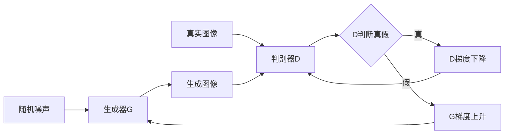

# PyTorch实现经典GAN模型

## 1. 背景介绍
### 1.1 生成对抗网络(GAN)的起源与发展
生成对抗网络(Generative Adversarial Network, GAN)自2014年由Ian Goodfellow等人提出以来，迅速成为了机器学习领域的研究热点。GAN通过引入生成器(Generator)和判别器(Discriminator)两个网络的对抗学习，实现了从随机噪声生成逼真图像的能力，在图像生成、风格迁移、超分辨率等领域取得了突破性进展。

### 1.2 GAN的应用场景
GAN强大的生成能力使其在许多领域得到广泛应用，主要包括：

- 图像生成：利用GAN可以生成逼真的人脸、动物、风景等图像。
- 图像翻译：实现图像风格迁移，如将照片转换为卡通风格、素描风格等。
- 超分辨率：将低分辨率图像转换为高分辨率图像。  
- 数据增强：通过GAN生成更多样本，扩充小样本数据集。
- 异常检测：利用GAN学习正常数据分布，检测异常数据点。

### 1.3 PyTorch实现GAN的优势
PyTorch是一个基于Torch的Python开源机器学习库，在动态计算图、自动求导、GPU加速等方面有着出色的表现。相比TensorFlow等其他深度学习框架，PyTorch更加灵活、易用，特别适合研究和快速原型开发。利用PyTorch实现GAN，我们可以快速构建和训练生成对抗网络，加速GAN模型的迭代优化过程。

## 2. 核心概念与联系
### 2.1 生成器(Generator) 
生成器是一个将随机噪声映射为目标域图像的神经网络。其输入通常是从高斯分布或均匀分布采样的随机噪声向量，输出是与真实数据分布尽可能接近的合成图像。生成器的目标是骗过判别器，使判别器无法区分生成图像与真实图像。

### 2.2 判别器(Discriminator)
判别器也是一个神经网络，其目的是区分输入的图像是来自真实数据分布还是生成器的合成图像。判别器的输出通常是一个0到1之间的概率值，表示输入图像来自真实数据分布的可能性。判别器的目标是最大化区分真实图像和生成图像的能力。

### 2.3 对抗学习(Adversarial Learning) 
GAN的核心思想是通过生成器和判别器的对抗学习，不断提升两个网络的性能，最终使生成器能够生成以假乱真的图像。在训练过程中，生成器努力生成逼真的图像欺骗判别器，而判别器则不断提升区分真假图像的能力。两个网络互为对手，在竞争中不断进步，最终达到动态平衡。

### 2.4 GAN的训练流程



GAN的训练流程如上图所示，主要步骤包括：

1. 从真实数据分布中采样一批真实图像，输入判别器D进行真假判断，计算D的损失并进行梯度下降优化。
2. 从随机噪声分布中采样一批噪声向量，输入生成器G生成一批合成图像。 
3. 将生成图像输入判别器D进行真假判断，计算G的损失并进行梯度上升优化。
4. 重复步骤1-3，直到生成器和判别器达到动态平衡，生成图像质量不再提升。

## 3. 核心算法原理具体操作步骤
### 3.1 GAN的目标函数
GAN的训练过程可以看作是生成器G和判别器D之间的二人极小极大博弈(minimax game)。其目标函数可以表示为:

$$\min_G \max_D V(D,G) = \mathbb{E}_{x \sim p_{data}(x)}[\log D(x)] + \mathbb{E}_{z \sim p_z(z)}[\log (1 - D(G(z)))]$$

其中，$x$表示真实图像，$z$表示随机噪声，$p_{data}$和$p_z$分别表示真实数据分布和随机噪声分布。$D(x)$表示判别器对真实图像的预测概率，$D(G(z))$表示判别器对生成图像的预测概率。

### 3.2 生成器和判别器的优化
根据GAN的目标函数，我们可以得到生成器和判别器的优化目标：

- 判别器D的优化目标是最大化$V(D,G)$，即：
$$\max_D V(D,G) = \mathbb{E}_{x \sim p_{data}(x)}[\log D(x)] + \mathbb{E}_{z \sim p_z(z)}[\log (1 - D(G(z)))]$$

- 生成器G的优化目标是最小化$V(D,G)$，即：
$$\min_G V(D,G) = \mathbb{E}_{z \sim p_z(z)}[\log (1 - D(G(z)))]$$

在实际训练中，我们通常采用交替优化的方式，即先固定生成器G，优化判别器D，再固定判别器D，优化生成器G，如此反复进行，直到达到平衡。

### 3.3 GAN的训练算法
基于以上分析，我们可以得到GAN的训练算法如下：

```
for number of training iterations do:
    for k steps do:
        sample minibatch of m noise samples {z(1), ..., z(m)} from noise prior p_g(z)  
        sample minibatch of m examples {x(1), ..., x(m)} from data distribution p_data(x)
        update the discriminator by ascending its stochastic gradient:
        ∇_θ_d 1/m Σ_{i=1}^m [log D(x^(i)) + log(1 - D(G(z^(i))))] 
    end for
    sample minibatch of m noise samples {z(1), ..., z(m)} from noise prior p_g(z)
    update the generator by descending its stochastic gradient:
    ∇_θ_g 1/m Σ_{i=1}^m log(1 - D(G(z^(i))))
end for
```

其中，$k$表示判别器D的更新次数，$m$表示小批量样本的大小，$θ_d$和$θ_g$分别表示判别器D和生成器G的参数。

## 4. 数学模型和公式详细讲解举例说明
### 4.1 生成器G的数学模型
生成器G通常采用解码器结构的神经网络，将随机噪声$z$映射为目标域图像$\hat{x} = G(z)$。以生成28x28的MNIST手写数字图像为例，生成器G的结构可以设计为：

```
G(z) = Tanh(BN(Linear(z))) -> Reshape -> BN(Conv2d) -> ReLU -> BN(Conv2d) -> Tanh
```

其中，$z$是一个100维的随机噪声向量，经过全连接层(Linear)、批归一化(Batch Normalization)、Tanh激活后，再经过Reshape操作将特征图转换为7x7x256的张量。接着通过两个转置卷积层(Conv2d)和批归一化层(BN)，将特征图上采样为14x14x128和28x28x1的图像，最后用Tanh激活得到生成图像$\hat{x}$。

生成器G的前向传播过程可以表示为：

$$\hat{x} = G(z) = G_n(...G_2(G_1(z)))$$

其中，$G_i$表示生成器的第$i$层网络，$n$为网络的层数。

### 4.2 判别器D的数学模型
判别器D通常采用编码器结构的神经网络，将输入图像$x$映射为一个0到1之间的概率值$D(x)$，表示$x$来自真实数据分布的概率。以判别28x28的MNIST手写数字图像为例，判别器D的结构可以设计为：

```
D(x) = Sigmoid(Linear(Flatten(LeakyReLU(Conv2d(LeakyReLU(Conv2d(x)))))))
```

其中，输入图像$x$经过两个卷积层(Conv2d)和LeakyReLU激活，提取出图像的高层特征。接着经过Flatten操作将特征图展平为向量，再通过全连接层(Linear)和Sigmoid激活，输出一个0到1之间的概率值$D(x)$。

判别器D的前向传播过程可以表示为：

$$D(x) = D_m(D_{m-1}(...D_1(x)))$$

其中，$D_i$表示判别器的第$i$层网络，$m$为网络的层数。

### 4.3 GAN的损失函数
根据GAN的目标函数，我们可以得到生成器G和判别器D的损失函数。

判别器D的损失函数为：

$$L_D = -\mathbb{E}_{x \sim p_{data}(x)}[\log D(x)] - \mathbb{E}_{z \sim p_z(z)}[\log (1 - D(G(z)))]$$

生成器G的损失函数为：

$$L_G = \mathbb{E}_{z \sim p_z(z)}[\log (1 - D(G(z)))]$$

在PyTorch中，我们可以直接调用`torch.nn.BCELoss`计算二分类交叉熵损失，实现判别器D和生成器G的损失函数。

```python
criterion = nn.BCELoss()

# 判别器损失
real_loss = criterion(D(real_imgs), ones_label) 
fake_loss = criterion(D(gen_imgs.detach()), zeros_label)
d_loss = real_loss + fake_loss

# 生成器损失  
g_loss = criterion(D(gen_imgs), ones_label)
```

其中，`real_imgs`为真实图像，`gen_imgs`为生成图像，`ones_label`和`zeros_label`分别为全1和全0的标签张量。

## 5. 项目实践：代码实例和详细解释说明
下面我们通过一个完整的PyTorch代码实例，演示如何实现一个基于MNIST手写数字数据集的GAN模型。

```python
import torch
import torch.nn as nn
import torchvision
import torchvision.transforms as transforms
import numpy as np
import matplotlib.pyplot as plt

# 设置超参数
nz = 100  # 噪声维度
ngf = 64  # 生成器特征图数
ndf = 64  # 判别器特征图数 
num_epochs = 100
batch_size = 128
lr = 0.0002
beta1 = 0.5  # Adam优化器参数

# 图像转换
transform = transforms.Compose([
    transforms.ToTensor(),
    transforms.Normalize((0.5,), (0.5,))
])

# 加载MNIST数据集
trainset = torchvision.datasets.MNIST(root='./data', train=True, download=True, transform=transform)
trainloader = torch.utils.data.DataLoader(trainset, batch_size=batch_size, shuffle=True)

# 定义生成器
class Generator(nn.Module):
    def __init__(self):
        super(Generator, self).__init__()
        self.main = nn.Sequential(
            nn.Linear(nz, 256),
            nn.ReLU(),
            nn.Linear(256, 512), 
            nn.ReLU(),
            nn.Linear(512, 1024),
            nn.ReLU(), 
            nn.Linear(1024, 784),
            nn.Tanh()
        )

    def forward(self, x):
        return self.main(x).view(-1, 1, 28, 28)

# 定义判别器 
class Discriminator(nn.Module):
    def __init__(self):
        super(Discriminator, self).__init__()
        self.main = nn.Sequential(
            nn.Linear(784, 512),
            nn.LeakyReLU(0.2),
            nn.Linear(512, 256),
            nn.LeakyReLU(0.2),
            nn.Linear(256, 1),
            nn.Sigmoid()
        )

    def forward(self, x):
        x = x.view(-1, 784)
        return self.main(x)
    
# 创建生成器和判别器
generator = Generator()
discriminator = Discriminator()

# 定义损失函数和优化器
criterion = nn.BCELoss()
g_optimizer = torch.optim.Adam(generator.parameters(), lr=lr, betas=(beta1, 0.999))  
d_optimizer = torch.optim.Adam(discriminator.parameters(), lr=lr, betas=(beta1, 0.999))

# 训练
for epoch in range(num_epochs):
    for i, (imgs, _) in enumerate(trainloader):
        # 固定生成器G，训练判别器D
        real_imgs = imgs
        z = torch.randn(batch_size, nz)
        fake_imgs = generator(z) 
        real_labels = torch.ones(batch_size, 1)
        fake_labels = torch.zeros(batch_size, 1)
        