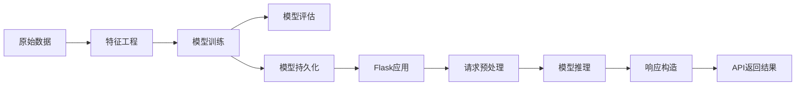

# Python机器学习实战：使用Flask构建机器学习API

## 1. 背景介绍

### 1.1 机器学习的发展现状

机器学习作为人工智能的核心领域之一，近年来得到了飞速的发展。从最初的感知机算法，到支持向量机、决策树、随机森林等经典算法，再到深度学习的兴起，机器学习技术不断突破和创新。如今，机器学习已广泛应用于计算机视觉、自然语言处理、语音识别、推荐系统等诸多领域，极大地改变了我们的生活和工作方式。

### 1.2 Python在机器学习中的地位

Python凭借其简洁优雅的语法、丰富的第三方库以及强大的社区支持，已成为机器学习领域的首选编程语言。从事机器学习的工程师和研究人员，大多数都在使用Python进行算法实现和模型训练。诸如NumPy、Pandas、Scikit-learn、TensorFlow、PyTorch等优秀的机器学习库，为开发者提供了便捷高效的工具。

### 1.3 机器学习API的意义

随着机器学习模型的不断成熟，如何将训练好的模型应用到实际的生产环境中，成为一个重要的课题。机器学习API就是解决这一问题的有效途径。通过将训练好的模型封装成标准的API接口，可以方便地与其他系统进行集成，实现机器学习能力的复用和共享。同时，API还可以屏蔽底层算法的复杂性，降低使用门槛，让更多的开发者受益。

### 1.4 Flask框架简介

Flask是一个轻量级的Python Web应用框架，以其简洁灵活的设计和优秀的可扩展性而备受青睐。使用Flask构建机器学习API，可以充分利用Python生态系统的优势，快速搭建高性能的服务。Flask内置了Jinja2模板引擎和Werkzeug WSGI工具箱，同时还有大量的第三方扩展，使得开发过程变得简单高效。

## 2. 核心概念与联系

### 2.1 机器学习基本概念

- 有监督学习：训练数据包含特征和标签，目标是学习特征到标签的映射关系，代表算法有线性回归、逻辑回归、决策树等。
- 无监督学习：训练数据只有特征没有标签，目标是发现数据内在的结构和关系，代表算法有聚类、降维等。  
- 特征工程：从原始数据中提取有效的特征表示，为模型训练提供良好的输入。
- 模型评估：使用测试集数据评估模型的性能，常用指标有准确率、召回率、F1值等。

### 2.2 Flask相关概念

- 路由：将URL映射到处理函数，Flask使用装饰器实现路由定义。
- 视图函数：接收请求并返回响应的处理函数，Flask中视图函数可以返回字符串、元组、Response对象等。
- 请求和响应：Flask封装了请求和响应对象，提供了便捷的方法来获取请求数据和构造响应内容。
- Jinja2模板：一个功能强大的模板引擎，支持变量、控制结构、过滤器等，可用于动态生成HTML页面。

### 2.3 机器学习API的关键要素

- 模型持久化：将训练好的模型保存到磁盘，常见的格式有pickle、joblib、PMML等。
- 数据预处理：对输入数据进行清洗、转换、特征提取等预处理操作，保证数据格式与模型训练时一致。
- 模型推理：加载持久化的模型，对输入数据进行预测或分类，返回结果。
- API设计：采用RESTful风格设计API接口，定义资源、URI、请求方法、请求/响应格式等。
- 异常处理：合理地处理各种可能出现的异常，并返回适当的错误信息。

### 2.4 核心概念之间的关系



上图展示了从原始数据到提供机器学习API服务的整个流程。首先对原始数据进行特征工程，然后用处理后的数据训练模型并评估模型性能。将训练好的模型持久化，并封装到Flask应用中。当客户端发送请求时，Flask应用对请求数据进行预处理，加载模型进行推理，最后构造响应返回给客户端。

## 3. 核心算法原理具体操作步骤

本节以一个简单的鸢尾花分类问题为例，介绍使用scikit-learn训练模型并将其封装为Flask API的具体步骤。

### 3.1 数据准备

鸢尾花数据集是一个经典的分类任务，包含150个样本，每个样本有4个特征（花萼长度、花萼宽度、花瓣长度、花瓣宽度）和1个类别标签（Setosa、Versicolour、Virginica）。

```python
from sklearn.datasets import load_iris

# 加载鸢尾花数据集
iris = load_iris()
X = iris.data  # 特征数据
y = iris.target  # 标签数据
```

### 3.2 数据划分

将数据集划分为训练集和测试集，一般采用7:3或8:2的比例。

```python
from sklearn.model_selection import train_test_split

# 划分训练集和测试集
X_train, X_test, y_train, y_test = train_test_split(X, y, test_size=0.2, random_state=42)
```

### 3.3 模型训练

选择合适的分类算法进行训练，这里使用逻辑回归。

```python
from sklearn.linear_model import LogisticRegression

# 创建逻辑回归分类器
clf = LogisticRegression()

# 训练模型
clf.fit(X_train, y_train)
```

### 3.4 模型评估

在测试集上评估模型的性能。

```python
from sklearn.metrics import accuracy_score

# 在测试集上预测
y_pred = clf.predict(X_test)

# 计算准确率
accuracy = accuracy_score(y_test, y_pred)
print(f'Accuracy: {accuracy:.2f}')
```

### 3.5 模型持久化

将训练好的模型保存到磁盘文件中。

```python
import joblib

# 模型保存
joblib.dump(clf, 'iris_classifier.pkl')
```

### 3.6 创建Flask应用

编写一个Flask应用，定义API接口。

```python
from flask import Flask, request, jsonify

app = Flask(__name__)

# 加载模型
clf = joblib.load('iris_classifier.pkl')

@app.route('/predict', methods=['POST'])
def predict():
    # 获取请求数据
    data = request.get_json(force=True)
    # 提取特征
    features = [data['sepal_length'], data['sepal_width'], data['petal_length'], data['petal_width']]
    # 预测类别
    prediction = clf.predict([features])[0]
    # 构造响应
    response = {'prediction': iris.target_names[prediction]}
    return jsonify(response)

if __name__ == '__main__':
    app.run(debug=True)
```

### 3.7 测试API

使用curl命令或Postman等工具测试API。

```bash
curl -X POST -H "Content-Type: application/json" -d '{"sepal_length": 5.1, "sepal_width": 3.5, "petal_length": 1.4, "petal_width": 0.2}' http://localhost:5000/predict
```

返回结果：

```json
{
  "prediction": "setosa"
}
```

## 4. 数学模型和公式详细讲解举例说明

逻辑回归是一种常用的分类算法，它利用sigmoid函数将线性回归的输出映射到(0,1)区间，得到样本属于某个类别的概率。

### 4.1 sigmoid函数

sigmoid函数定义为：

$$\sigma(z) = \frac{1}{1 + e^{-z}}$$

其中，$z$是线性回归的输出：

$$z = w^Tx + b$$

$w$是特征的权重向量，$b$是偏置项。

sigmoid函数具有以下性质：
- 值域为(0,1)，可解释为概率
- 单调递增
- 关于点(0, 0.5)中心对称

### 4.2 二分类情况

对于二分类问题，样本属于正类的概率为：

$$p(y=1|x) = \sigma(w^Tx + b)$$

属于负类的概率为：

$$p(y=0|x) = 1 - \sigma(w^Tx + b)$$

最终的分类决策函数为：

$$
\hat{y} = \begin{cases} 
1, & \text{if } \sigma(w^Tx + b) > 0.5 \\
0, & \text{otherwise}
\end{cases}
$$

### 4.3 多分类情况

对于多分类问题，可以使用Softmax函数将输出归一化为概率分布。假设有$K$个类别，第$k$个类别的得分为$z_k$，则归一化后的概率为：

$$p(y=k|x) = \frac{e^{z_k}}{\sum_{i=1}^K e^{z_i}}$$

最终的分类结果为概率最大的类别：

$$\hat{y} = \arg\max_k p(y=k|x)$$

### 4.4 损失函数

逻辑回归使用对数似然函数作为损失函数。对于二分类问题，损失函数为：

$$J(w,b) = -\frac{1}{m}\sum_{i=1}^m [y^{(i)}\log(\hat{y}^{(i)}) + (1-y^{(i)})\log(1-\hat{y}^{(i)})]$$

其中，$m$是样本数量，$y^{(i)}$是第$i$个样本的真实标签，$\hat{y}^{(i)}$是模型预测的概率值。

对于多分类问题，损失函数推广为：

$$J(w,b) = -\frac{1}{m}\sum_{i=1}^m \sum_{k=1}^K y_k^{(i)}\log(\hat{y}_k^{(i)})$$

其中，$y_k^{(i)}$表示第$i$个样本是否属于第$k$类（取值为0或1），$\hat{y}_k^{(i)}$表示模型预测的第$i$个样本属于第$k$类的概率。

### 4.5 模型训练

逻辑回归的目标是找到最优的参数$w$和$b$，使得损失函数最小化。常用的优化算法有梯度下降法、牛顿法等。以梯度下降法为例，参数更新公式为：

$$w := w - \alpha \frac{\partial J}{\partial w}$$

$$b := b - \alpha \frac{\partial J}{\partial b}$$

其中，$\alpha$是学习率，控制每次更新的步长。

## 5. 项目实践：代码实例和详细解释说明

下面通过一个完整的代码实例，演示如何使用Flask构建机器学习API。

```python
from flask import Flask, request, jsonify
from sklearn.datasets import load_iris
from sklearn.model_selection import train_test_split
from sklearn.linear_model import LogisticRegression
import joblib

app = Flask(__name__)

# 加载鸢尾花数据集
iris = load_iris()
X = iris.data
y = iris.target

# 划分训练集和测试集
X_train, X_test, y_train, y_test = train_test_split(X, y, test_size=0.2, random_state=42)

# 创建逻辑回归分类器
clf = LogisticRegression()

# 训练模型
clf.fit(X_train, y_train)

# 保存模型
joblib.dump(clf, 'iris_classifier.pkl')

# 定义预测接口
@app.route('/predict', methods=['POST'])
def predict():
    # 获取请求数据
    data = request.get_json(force=True)
    # 提取特征
    features = [data['sepal_length'], data['sepal_width'], data['petal_length'], data['petal_width']]
    # 预测类别
    prediction = clf.predict([features])[0]
    # 构造响应
    response = {'prediction': iris.target_names[prediction]}
    return jsonify(response)

if __name__ == '__main__':
    app.run(debug=True)
```

代码解释：

1. 导入所需的库，包括Flask、scikit-learn和joblib。
2. 创建Flask应用实例。
3. 加载鸢尾花数据集，并划分训练集和测试集。
4. 创建逻辑回归分类器，并在训练集上进行训练。
5. 使用joblib将训练好的模型保存到磁盘文件中。
6. 定义预测接口，路由为'/predict'，只接受POST请求。
7. 在预测接口