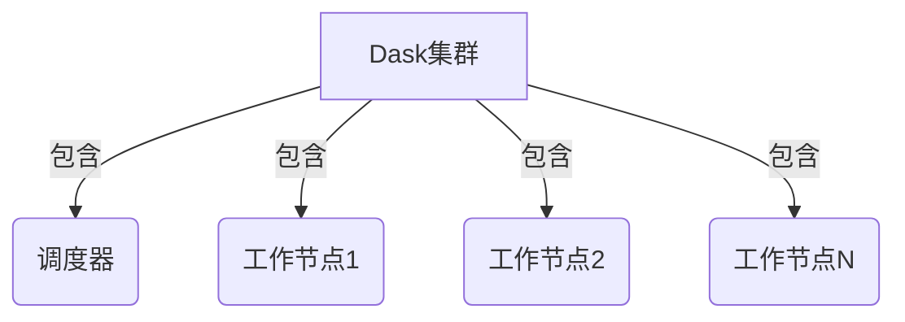
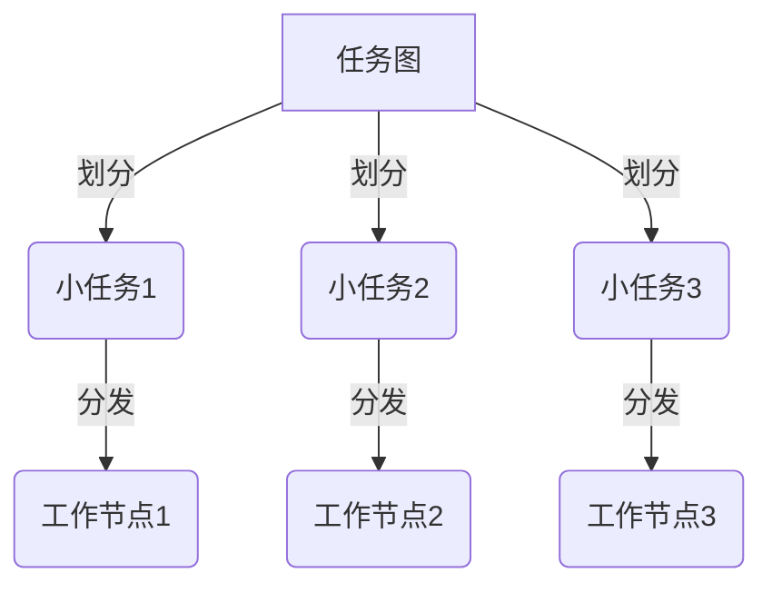
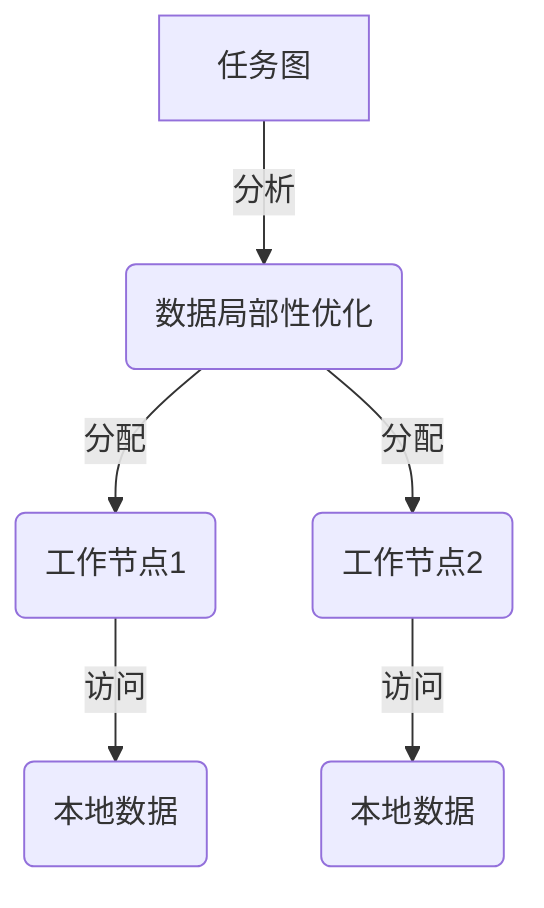
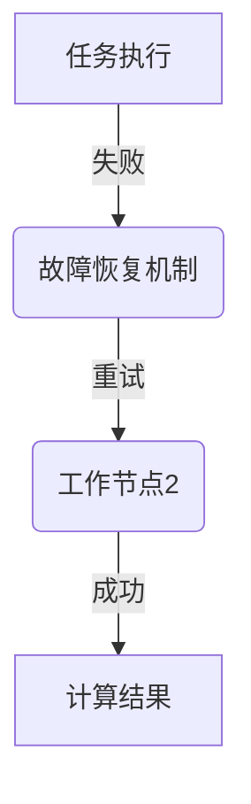

# Python机器学习实战：分布式机器学习框架Dask的入门与实战

## 1. 背景介绍

### 1.1 大数据时代的机器学习挑战

在当今大数据时代，海量的数据正以前所未有的速度被产生和积累。这些数据蕴含着巨大的价值,但同时也带来了新的挑战。传统的机器学习算法和工具很难有效地处理如此庞大的数据集,因为它们通常被设计为在单个计算机上运行,内存和计算能力有限。

### 1.2 分布式计算的必要性

为了解决这一挑战,分布式计算应运而生。通过将计算任务分散到多个计算节点上并行执行,分布式系统能够提供更大的内存、更强的计算能力,从而处理大规模数据集成为可能。在机器学习领域,分布式计算已经成为一种不可或缺的解决方案。

### 1.3 Dask:一款优秀的分布式机器学习框架

Dask是一个灵活、可扩展的分布式计算框架,专为分析大数据而设计。它提供了类似于NumPy、Pandas和Scikit-Learn等流行的Python数据科学库的API,但具有出色的并行计算能力。Dask能够自动将计算任务分散到多个节点上执行,从而加速数据处理和机器学习模型训练过程。

## 2. 核心概念与联系

### 2.1 Dask集群和调度器

Dask的核心组件是集群(Cluster)和调度器(Scheduler)。集群由多个工作节点(Worker)组成,每个工作节点都是一个Python进程,负责执行分配给它的计算任务。调度器负责将任务划分为多个小任务,并将这些小任务分发给不同的工作节点执行。



### 2.2 延迟计算和任务图

Dask采用延迟计算(Lazy Evaluation)的设计理念。当你定义一个计算操作时,Dask不会立即执行该操作,而是构建一个任务图(Task Graph)来表示这个操作。只有当你明确要求计算结果时,Dask才会根据任务图将计算任务分发给工作节点执行。


### 2.3 高效内存共享

Dask采用了智能的内存共享机制,可以避免不必要的数据复制和传输。当多个任务需要访问同一份数据时,Dask会自动将该数据保存在内存中,供不同的任务共享使用。这种设计大大提高了数据密集型应用的效率。

## 3. 核心算法原理具体操作步骤

### 3.1 任务图构建

Dask通过延迟计算来构建任务图。当你定义一个计算操作时,Dask会创建一个对应的任务,并将其添加到任务图中。任务之间的依赖关系也会被记录下来,形成一个有向无环图(DAG)。


### 3.2 任务划分和调度

当你要求计算结果时,Dask会遍历任务图,将每个任务划分为多个小任务(Task)。这些小任务会被分发给不同的工作节点执行。Dask的调度器会根据任务之间的依赖关系,合理地安排任务的执行顺序,以确保计算的正确性和效率。



### 3.3 数据局部性优化

为了提高计算效率,Dask会尽可能地将相关的任务分配给同一个工作节点执行,以减少数据传输的开销。这种优化被称为数据局部性优化(Data Locality Optimization)。Dask会分析任务图,将需要访问相同数据的任务分配给同一个工作节点,从而最大化数据的本地访问。



### 3.4 故障恢复和重试机制

在分布式环境中,工作节点可能会出现故障或网络中断等异常情况。为了确保计算的可靠性,Dask内置了一套强大的故障恢复和重试机制。当某个任务执行失败时,Dask会自动将该任务重新分配给其他工作节点执行,直到成功为止。



## 4. 数学模型和公式详细讲解举例说明

在机器学习领域,数学模型和公式扮演着至关重要的角色。Dask提供了强大的支持,可以方便地在分布式环境中执行各种数学计算。

### 4.1 矩阵运算

矩阵运算是机器学习中的基础操作之一。Dask提供了与NumPy兼容的矩阵运算API,可以高效地在分布式环境中执行矩阵乘法、矩阵分解等操作。

例如,我们可以使用Dask来计算两个大型矩阵的乘积:

$$
C = A \times B
$$

其中 $A$ 是一个 $m \times n$ 矩阵, $B$ 是一个 $n \times p$ 矩阵, $C$ 是一个 $m \times p$ 矩阵。

```python
import dask.array as da

# 创建大型矩阵
m, n, p = 10000, 15000, 20000
A = da.random.random((m, n), chunks=(1000, n))
B = da.random.random((n, p), chunks=(n, 1000))

# 计算矩阵乘积
C = A.dot(B)

# 执行计算并获取结果
result = C.compute()
```

在上面的示例中,我们首先使用 `dask.array` 模块创建了两个大型矩阵 `A` 和 `B`。`chunks` 参数指定了矩阵被划分为多个块的方式。然后,我们使用 `dot` 方法计算矩阵乘积,得到一个新的 `Dask Array` 对象 `C`。最后,调用 `compute` 方法触发实际的计算,并获取最终结果。

### 4.2 线性回归

线性回归是一种常见的监督学习算法,用于预测连续型目标变量。在机器学习中,线性回归模型可以表示为:

$$
y = X \beta + \epsilon
$$

其中 $y$ 是目标变量, $X$ 是特征矩阵, $\beta$ 是模型参数,  $\epsilon$ 是噪声项。

我们可以使用Dask和Scikit-Learn来训练一个分布式线性回归模型:

```python
import dask.array as da
import dask.dataframe as dd
from sklearn.linear_model import LinearRegression

# 加载大型数据集
X = da.random.random((10000000, 20), chunks=(1000000, 20))
y = da.random.random(10000000, chunks=1000000)

# 将Dask Array转换为Dask DataFrame
X_df = dd.from_array(X)
y_df = dd.from_array(y)

# 训练线性回归模型
model = LinearRegression()
model.fit(X_df, y_df)

# 进行预测
y_pred = model.predict(X_df)
```

在这个示例中,我们首先创建了一个包含 1000 万个样本和 20 个特征的大型数据集,并将其存储为 `Dask Array`。然后,我们使用 `dask.dataframe` 模块将 `Dask Array` 转换为 `Dask DataFrame`,因为 Scikit-Learn 模型需要处理 DataFrame 格式的数据。接下来,我们实例化一个 `LinearRegression` 对象,并使用 `fit` 方法在分布式环境中训练模型。最后,我们可以使用训练好的模型对新的数据进行预测。

## 5. 项目实践:代码实例和详细解释说明

为了更好地理解Dask的使用,我们将通过一个实际项目来演示如何使用Dask进行分布式机器学习。在这个项目中,我们将使用Dask和Scikit-Learn来训练一个逻辑回归模型,预测客户是否会购买某个产品。

### 5.1 数据准备

首先,我们需要准备一个大型的客户数据集。为了模拟真实场景,我们将使用Dask来生成一个包含 1 亿条记录的数据集,每条记录包含 20 个特征。

```python
import dask.array as da

# 生成特征矩阵
n_samples = 100000000
n_features = 20
X = da.random.random((n_samples, n_features), chunks=(10000000, n_features))

# 生成目标变量
y = da.random.randint(0, 2, size=n_samples, chunks=10000000)
```

在上面的代码中,我们使用 `dask.array.random.random` 函数生成了一个包含 1 亿条记录和 20 个特征的特征矩阵 `X`。`chunks` 参数指定了矩阵被划分为多个块的方式。同样,我们使用 `dask.array.random.randint` 函数生成了一个包含 1 亿条记录的目标变量 `y`,表示每个客户是否购买产品(0 或 1)。

### 5.2 数据预处理

在训练机器学习模型之前,我们通常需要对数据进行一些预处理,例如特征缩放、one-hot编码等。Dask提供了与Pandas和Scikit-Learn兼容的数据预处理工具,可以方便地在分布式环境中执行这些操作。

```python
import dask.dataframe as dd
from sklearn.preprocessing import StandardScaler, OneHotEncoder

# 将Dask Array转换为Dask DataFrame
X_df = dd.from_array(X)
y_df = dd.from_array(y)

# 特征缩放
scaler = StandardScaler()
X_scaled = scaler.fit_transform(X_df)

# One-Hot编码
encoder = OneHotEncoder()
X_encoded = encoder.fit_transform(X_scaled)
```

在上面的代码中,我们首先使用 `dask.dataframe.from_array` 函数将 `Dask Array` 转换为 `Dask DataFrame`。然后,我们使用 Scikit-Learn 的 `StandardScaler` 对特征矩阵进行标准化,并使用 `OneHotEncoder` 对分类特征进行 One-Hot 编码。这些操作都是在分布式环境中执行的,Dask会自动将计算任务分发给多个工作节点。

### 5.3 模型训练

现在,我们可以使用预处理后的数据来训练一个逻辑回归模型。Dask与Scikit-Learn的集成使得在分布式环境中训练机器学习模型变得非常简单。

```python
from sklearn.linear_model import LogisticRegression

# 训练逻辑回归模型
model = LogisticRegression()
model.fit(X_encoded, y_df)
```

在上面的代码中,我们实例化一个 `LogisticRegression` 对象,并使用 `fit` 方法在分布式环境中训练模型。Dask会自动将计算任务划分为多个小任务,并分发给不同的工作节点执行。

### 5.4 模型评估和预测

训练完成后,我们可以评估模型的性能,并使用训练好的模型对新的数据进行预测。

```python
from sklearn.metrics import accuracy_score

# 评估模型性能
y_pred = model.predict(X_encoded)
accuracy = accuracy_score(y_df, y_pred)
print(f"Accuracy: {accuracy}")

# 对新数据进行预测
new_data = ... # 加载新的数据
new_data_encoded = encoder.transform(scaler.transform(new_data))
predictions = model.predict(new_data_encoded)
```

在上面的代码中,我们首先使用 `predict` 方法对训练数据进