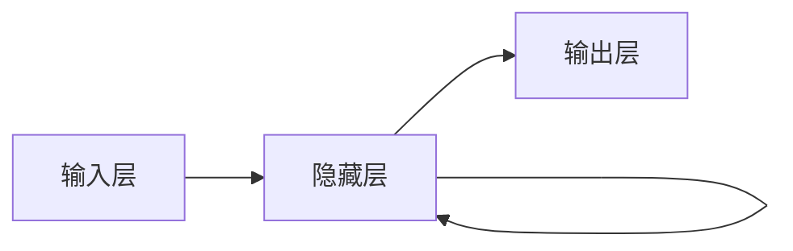
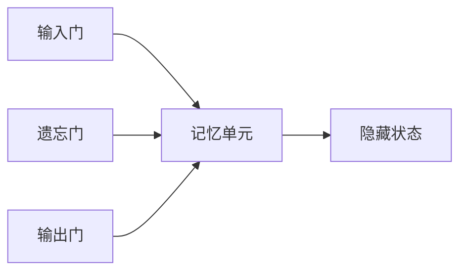

# Python机器学习实战：循环神经网络(RNN)与自然语言处理(NLP)

## 1.背景介绍

### 1.1 自然语言处理的重要性

在当今的数字时代,自然语言处理(NLP)已成为一项关键技术,广泛应用于各个领域。随着人工智能的快速发展,NLP的重要性与日俱增。它使计算机能够理解、解释和生成人类语言,从而实现人机交互和语言数据处理。

### 1.2 NLP的挑战

然而,自然语言存在着复杂性、多义性和语境依赖性等特点,使NLP成为一个极具挑战的领域。传统的基于规则的方法往往效果有限。近年来,随着深度学习技术的兴起,循环神经网络(RNN)在NLP领域取得了突破性进展。

### 1.3 RNN在NLP中的作用

RNN擅长处理序列数据,能够很好地捕捉语言的上下文信息和长期依赖关系,从而更好地理解和生成自然语言。它已成为NLP领域的核心技术之一,广泛应用于机器翻译、文本生成、情感分析、问答系统等多个领域。

## 2.核心概念与联系

### 2.1 循环神经网络(RNN)

循环神经网络(RNN)是一种特殊的深度神经网络,专门设计用于处理序列数据,如文本、语音和时间序列数据。与传统的前馈神经网络不同,RNN在隐藏层之间引入了循环连接,使得网络能够捕捉序列数据中的长期依赖关系。



### 2.2 长短期记忆网络(LSTM)

由于传统RNN存在梯度消失和梯度爆炸的问题,难以捕捉长期依赖关系。长短期记忆网络(LSTM)通过引入门控机制和记忆单元,有效解决了这一问题,成为RNN的一种重要变体。LSTM能够更好地捕捉长期依赖关系,在许多NLP任务中表现出色。



### 2.3 自然语言处理(NLP)

自然语言处理(NLP)是一门研究计算机理解和生成人类语言的学科。它涉及多个子领域,如机器翻译、文本生成、情感分析、问答系统等。NLP将语言学、计算机科学和人工智能相结合,旨在使计算机能够像人类一样理解和处理自然语言。

## 3.核心算法原理具体操作步骤

### 3.1 RNN的前向传播

RNN的前向传播过程包括以下步骤:

1. 初始化隐藏状态 $h_0$
2. 对于每个时间步 $t$:
   - 计算当前输入 $x_t$ 和前一隐藏状态 $h_{t-1}$ 的组合输入: $a_t = W_{hh}h_{t-1} + W_{xh}x_t + b_h$
   - 计算当前隐藏状态: $h_t = \tanh(a_t)$
   - 计算当前输出: $o_t = W_{ho}h_t + b_o$
3. 返回所有输出 $o = (o_1, o_2, \dots, o_T)$

其中, $W$ 表示权重矩阵, $b$ 表示偏置向量。

### 3.2 LSTM的前向传播

LSTM的前向传播过程包括以下步骤:

1. 初始化记忆单元 $c_0$ 和隐藏状态 $h_0$
2. 对于每个时间步 $t$:
   - 计算遗忘门: $f_t = \sigma(W_f[h_{t-1}, x_t] + b_f)$
   - 计算输入门: $i_t = \sigma(W_i[h_{t-1}, x_t] + b_i)$
   - 计算候选记忆单元: $\tilde{c}_t = \tanh(W_c[h_{t-1}, x_t] + b_c)$
   - 更新记忆单元: $c_t = f_t \odot c_{t-1} + i_t \odot \tilde{c}_t$
   - 计算输出门: $o_t = \sigma(W_o[h_{t-1}, x_t] + b_o)$
   - 计算隐藏状态: $h_t = o_t \odot \tanh(c_t)$
3. 返回所有隐藏状态 $h = (h_1, h_2, \dots, h_T)$

其中, $\sigma$ 表示sigmoid激活函数, $\odot$ 表示元素wise乘积。

## 4.数学模型和公式详细讲解举例说明

### 4.1 RNN的损失函数

在序列标注任务中,常用的损失函数是交叉熵损失函数:

$$J(\theta) = -\frac{1}{N} \sum_{n=1}^N \sum_{t=1}^{T_n} \sum_{k=1}^K y_{n,t,k} \log \hat{y}_{n,t,k}$$

其中, $N$ 是训练样本数量, $T_n$ 是第 $n$ 个序列的长度, $K$ 是输出维度, $y_{n,t,k}$ 是真实标签, $\hat{y}_{n,t,k}$ 是模型预测输出。

### 4.2 LSTM的门控机制

LSTM的核心是门控机制,包括遗忘门、输入门和输出门。它们控制着记忆单元的更新和输出,使LSTM能够有效捕捉长期依赖关系。

遗忘门决定了保留多少之前的记忆:

$$f_t = \sigma(W_f[h_{t-1}, x_t] + b_f)$$

输入门决定了更新多少新的记忆:

$$i_t = \sigma(W_i[h_{t-1}, x_t] + b_i)$$
$$\tilde{c}_t = \tanh(W_c[h_{t-1}, x_t] + b_c)$$
$$c_t = f_t \odot c_{t-1} + i_t \odot \tilde{c}_t$$

输出门决定了输出多少记忆:

$$o_t = \sigma(W_o[h_{t-1}, x_t] + b_o)$$
$$h_t = o_t \odot \tanh(c_t)$$

### 4.3 Word Embedding

在NLP任务中,通常需要将文本转换为数值向量表示,以便输入到神经网络中。Word Embedding是一种将单词映射到连续向量空间的技术,能够捕捉单词之间的语义和语法关系。常用的Word Embedding方法包括Word2Vec、GloVe等。

例如,对于单词 "apple",它的Word Embedding向量可能是:

$$\text{apple} = [0.2, -0.1, 0.5, \dots]$$

这个向量能够捕捉到 "apple" 与其他单词(如 "banana"、"fruit"等)之间的语义关系。

## 5.项目实践:代码实例和详细解释说明

以下是使用PyTorch实现基本RNN和LSTM进行情感分析的代码示例:

```python
import torch
import torch.nn as nn

# 定义RNN模型
class RNNModel(nn.Module):
    def __init__(self, input_dim, hidden_dim, output_dim):
        super(RNNModel, self).__init__()
        self.hidden_dim = hidden_dim
        self.rnn = nn.RNN(input_dim, hidden_dim, batch_first=True)
        self.fc = nn.Linear(hidden_dim, output_dim)

    def forward(self, x):
        out, _ = self.rnn(x)
        out = self.fc(out[:, -1, :])
        return out

# 定义LSTM模型
class LSTMModel(nn.Module):
    def __init__(self, input_dim, hidden_dim, output_dim):
        super(LSTMModel, self).__init__()
        self.hidden_dim = hidden_dim
        self.lstm = nn.LSTM(input_dim, hidden_dim, batch_first=True)
        self.fc = nn.Linear(hidden_dim, output_dim)

    def forward(self, x):
        out, _ = self.lstm(x)
        out = self.fc(out[:, -1, :])
        return out
```

在这个示例中,我们定义了两个模型类:RNNModel和LSTMModel。它们都接受一个输入序列 `x`,并输出一个预测结果。

- RNNModel使用基本的RNN层,将输入序列 `x` 传递给RNN层,获得最后一个时间步的隐藏状态,然后通过全连接层进行预测。
- LSTMModel使用LSTM层,原理类似,但使用了LSTM的门控机制来捕捉长期依赖关系。

你可以使用这些模型进行情感分析等NLP任务。以下是一个示例训练循环:

```python
# 准备数据
train_data = ...
train_labels = ...

# 定义模型、损失函数和优化器
model = LSTMModel(input_dim, hidden_dim, output_dim)
criterion = nn.CrossEntropyLoss()
optimizer = torch.optim.Adam(model.parameters())

# 训练循环
for epoch in range(num_epochs):
    for data, labels in zip(train_data, train_labels):
        optimizer.zero_grad()
        outputs = model(data)
        loss = criterion(outputs, labels)
        loss.backward()
        optimizer.step()
```

在这个训练循环中,我们首先准备好训练数据和标签。然后定义模型、损失函数(交叉熵损失)和优化器(Adam优化器)。在每个epoch中,我们遍历训练数据,计算模型输出和损失值,进行反向传播和参数更新。

通过这种方式,你可以训练RNN或LSTM模型,并将其应用于各种NLP任务,如情感分析、文本分类、机器翻译等。

## 6.实际应用场景

循环神经网络在自然语言处理领域有着广泛的应用,包括但不限于以下场景:

### 6.1 机器翻译

机器翻译是NLP的一个核心应用领域。RNN和LSTM能够有效捕捉源语言和目标语言之间的依赖关系,从而提高翻译质量。谷歌、微软等公司都在使用基于RNN的神经机器翻译系统。

### 6.2 文本生成

RNN和LSTM擅长捕捉序列数据的模式,因此非常适合用于文本生成任务,如自动写作、对话系统、广告语生成等。许多创作型AI应用都基于RNN技术。

### 6.3 情感分析

情感分析旨在自动识别文本中的情感倾向,如正面、负面或中性。RNN能够很好地捕捉上下文信息,因此在情感分析任务中表现出色。它被广泛应用于社交媒体监测、客户服务等领域。

### 6.4 命名实体识别

命名实体识别(NER)是指从文本中识别出人名、地名、组织机构名等实体。RNN和LSTM能够利用上下文信息来提高NER的准确性,在信息抽取、知识图谱构建等领域有重要应用。

### 6.5 语音识别

虽然本文主要关注文本处理,但RNN和LSTM也被广泛应用于语音识别领域。它们能够有效地捕捉语音序列的时间依赖关系,从而提高识别准确率。

## 7.工具和资源推荐

在实现和应用RNN和LSTM模型时,有许多优秀的工具和资源可以使用:

### 7.1 深度学习框架

- **PyTorch**: 一个流行的Python深度学习框架,提供了强大的RNN和LSTM模块,并支持动态计算图。
- **TensorFlow**: 另一个著名的深度学习框架,也提供了RNN和LSTM模块,并支持静态计算图。
- **Keras**: 一个高级的神经网络API,可以在TensorFlow或Theano之上运行,提供了简洁的RNN和LSTM接口。

### 7.2 NLP工具包

- **NLTK**: 一个著名的Python NLP工具包,提供了各种预处理、标记化、词性标注等功能。
- **spaCy**: 一个高性能的NLP库,支持多种语言,提供了命名实体识别、依赖解析等功能。
- **Hugging Face Transformers**: 一个集成了多种预训练语言模型的库,可以轻松应用于各种NLP任务。

### 7.3 数据集和资源

- **IMDB电影评论数据集**: 一个常用的情感分析数据集,包含25,000条电影评论及其情感标签。
- **Penn Treebank数据集**: 一个常用的语言模型数据集,包含来自华尔街日报的文本语料。
- **WMT机器翻译数据集**: 一