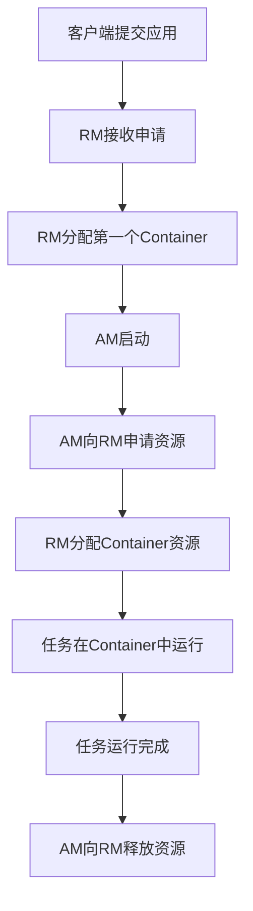

# Yarn原理与代码实例讲解

## 1.背景介绍

在大数据时代,Apache Hadoop作为一种分布式系统基础架构,已经成为企业存储和大数据处理的核心平台。Hadoop的两个核心组件是HDFS(Hadoop分布式文件系统)和MapReduce。MapReduce为海量数据的并行处理提供了可靠的模型。但是,MapReduce存在一些缺陷,例如对于小作业的处理效率低下、无法重用已计算的数据等。为了解决这些问题,Apache Hadoop社区提出了一种新的资源管理和作业调度技术Yarn(Yet Another Resource Negotiator)。

Yarn的设计目标是将资源管理和作业调度/监控从单一的JobTracker中分离出来,以加强系统的伸缩性和可用性。Yarn将整个集群的资源管理和作业调度功能分给了一个小型的资源管理器(Resource Manager),而应用程序只需要为每个作业提供一个应用程序管理器(Application Master),由后者负责向资源管理器申请资源并监控作业的执行。

## 2.核心概念与联系

Yarn的核心概念包括:

1. **资源管理器(Resource Manager,RM)**: 集群资源的主管理者,负责资源的分配和调度。
2. **节点管理器(Node Manager,NM)**: 运行在每个节点上,负责容器的启动、监控和停止。
3. **应用程序管理器(Application Master,AM)**: 为每个应用程序实例运行,负责向RM申请资源并监控应用执行。
4. **容器(Container)**: Yarn中表示资源的抽象,包含内存、CPU等多维资源。

Yarn的核心工作流程如下:



## 3.核心算法原理具体操作步骤  

### 3.1 资源管理器(Resource Manager)

资源管理器是Yarn的大脑和核心,负责整个集群资源的管理和调度。它主要由两个重要组件组成:

1. **Scheduler**: 调度器,负责根据调度策略为应用程序分配资源。
2. **ApplicationsManager**: 应用程序管理器,负责管理应用程序对象的生命周期。

资源管理器的主要工作流程如下:

1. 客户端向资源管理器提交应用程序。
2. Yarn检查集群的资源情况,如果有足够的资源,就为该应用程序分配第一个Container,用于运行ApplicationMaster。
3. ApplicationMaster启动后,会向资源管理器申请资源运行具体任务。
4. 资源管理器根据调度策略为ApplicationMaster分配Container资源。
5. ApplicationMaster在分配到的Container上运行具体任务。
6. 任务执行完毕后,ApplicationMaster向资源管理器释放资源。

### 3.2 调度器(Scheduler)

Yarn的调度器负责根据调度策略为应用程序分配资源。Yarn自带了三种调度器:

1. **FIFO Scheduler**: 先进先出调度器,按照应用程序的提交顺序分配资源。
2. **Capacity Scheduler**: 容量调度器,按照队列分配资源,支持多租户。
3. **Fair Scheduler**: 公平调度器,按照资源使用情况动态分配资源。

调度器的核心算法通常包括:

1. **资源需求计算**: 根据应用程序提交的资源需求计算实际需要分配的资源量。
2. **资源分配算法**: 根据特定的调度策略,从可用资源中选择合适的资源分配给应用程序。
3. **资源重用**: 对于短小作业,尽量重用已经分配的资源,提高资源利用率。

### 3.3 应用程序管理器(Application Master)

应用程序管理器是应用程序具体执行的管理者,它负责以下主要工作:

1. 向资源管理器申请资源运行具体任务。
2. 监控任务的执行进度。
3. 重启失败的任务。
4. 在任务完成后,向资源管理器释放资源。

应用程序管理器的工作流程如下:

1. 应用程序管理器启动后,向资源管理器申请运行任务所需的资源。
2. 资源管理器分配资源后,应用程序管理器在获得的Container中启动具体任务。
3. 应用程序管理器监控任务的运行状态,如果任务失败则重启。
4. 所有任务完成后,应用程序管理器向资源管理器释放分配的资源。

## 4.数学模型和公式详细讲解举例说明

在Yarn的资源管理和调度过程中,涉及到一些数学模型和公式,用于量化资源需求、评估资源分配公平性等。下面我们详细介绍其中的两个核心公式。

### 4.1 资源需求量化模型

Yarn中将资源抽象为多维度的容器(Container),每个容器包含内存、CPU等多种资源。为了量化应用程序的资源需求,Yarn采用了一种向量化的资源模型。

设一个容器的资源为向量$\vec{r} = (r_1, r_2, \ldots, r_n)$,其中$r_i$表示第i种资源的数量。应用程序的资源需求向量为$\vec{q} = (q_1, q_2, \ldots, q_n)$。则应用程序需要的容器数量为:

$$
N = max_{1 \leq i \leq n}\left\lceil\frac{q_i}{r_i}\right\rceil
$$

这个公式表示,应用程序所需的容器数量取决于其需求量最大的那种资源。例如,如果一个应用程序需要8GB内存和4个CPU核心,而集群中的容器资源为(4GB, 2核),那么该应用程序需要2个容器。

### 4.2 公平资源分配模型

Yarn的Fair Scheduler调度器采用一种资源分配公平性模型,用于评估不同应用程序之间资源分配的公平程度。该模型的核心思想是,如果一个应用程序获得的资源比例超过其权重比例一个固定值,则认为资源分配不公平。

设有N个应用程序,第i个应用程序的权重为$w_i$,获得资源量为$r_i$。则该应用程序的资源使用比例为$\frac{r_i}{\sum_{j=1}^N r_j}$。如果这个比例超过了$\frac{w_i}{\sum_{j=1}^N w_j} + \epsilon$,其中$\epsilon$是一个小常数,则认为资源分配不公平。

基于此,Fair Scheduler定义了一个资源分配公平性指标:

$$
F = \sum_{i=1}^N \left|\frac{r_i}{\sum_{j=1}^N r_j} - \frac{w_i}{\sum_{j=1}^N w_j}\right|
$$

该指标的值越小,表示资源分配越公平。Fair Scheduler的目标是使F值最小化。

## 5.项目实践:代码实例和详细解释说明

为了更好地理解Yarn的原理,我们通过一个实例项目来演示Yarn的基本用法。本例使用Hadoop 3.2.2版本,并在伪分布式模式下运行。

### 5.1 启动Yarn

首先,启动Hadoop和Yarn相关进程:

```bash
# 启动HDFS
$HADOOP_HOME/sbin/start-dfs.sh

# 启动Yarn
$HADOOP_HOME/sbin/start-yarn.sh
```

使用`jps`命令可查看相关进程,应该有NameNode、DataNode、ResourceManager和NodeManager在运行。

### 5.2 运行WordCount示例

Hadoop自带了一些示例程序,我们使用经典的WordCount作为测试。首先,将输入文件上传到HDFS:

```bash
$HADOOP_HOME/bin/hdfs dfs -mkdir /user/input
$HADOOP_HOME/bin/hdfs dfs -put $HADOOP_HOME/README.txt /user/input
```

然后,运行WordCount程序:

```bash
$HADOOP_HOME/bin/yarn jar $HADOOP_HOME/share/hadoop/mapreduce/hadoop-mapreduce-examples-3.2.2.jar wordcount /user/input /user/output
```

这个命令会在Yarn上提交WordCount应用程序,输入文件为`/user/input`目录下的文件,输出结果存储在`/user/output`目录下。

运行过程中,可以使用以下命令查看应用程序的运行状态和日志:

```bash
# 查看应用程序列表
$HADOOP_HOME/bin/yarn application -list

# 查看应用程序状态
$HADOOP_HOME/bin/yarn application -status <Application ID>

# 查看应用程序日志
$HADOOP_HOME/bin/yarn logs -applicationId <Application ID>
```

应用程序运行完成后,可以查看输出结果:

```bash
$HADOOP_HOME/bin/hdfs dfs -cat /user/output/part-r-00000
```

### 5.3 应用程序管理器示例

为了进一步了解Yarn的工作原理,我们编写一个简单的应用程序管理器示例。这个示例包含以下几个步骤:

1. 向Yarn集群提交应用程序
2. 获取分配的Container资源
3. 在Container中运行简单的任务
4. 任务完成后释放资源

```java
// 创建YarnConfiguration
YarnConfiguration conf = new YarnConfiguration();

// 创建YarnClient
YarnClient client = YarnClient.createYarnClient();
client.init(conf);
client.start();

// 创建应用程序提交上下文
YarnClientApplication app = client.createApplication();
GetNewApplicationResponse newAppResponse = app.getNewApplicationResponse();
ApplicationSubmissionContext appContext = app.getApplicationSubmissionContext();

// 设置应用程序详情
ApplicationId appId = newAppResponse.getApplicationId();
appContext.setApplicationName("MyApp");
appContext.setApplicationType("YARN");

// 设置应用程序管理器
MyAppMaster appMaster = new MyAppMaster();
appContext.setApplicationMaster(appMaster);

// 提交应用程序
client.submitApplication(appContext);
```

在`MyAppMaster`类中,我们实现应用程序管理器的核心逻辑:

```java
public class MyAppMaster extends ApplicationMaster {

    public MyAppMaster() {
        super(new MyAppMasterConfig());
    }

    @Override
    public void run() {
        try {
            // 向RM申请Container资源
            List<Container> containers = requestContainers();

            // 在Container中运行任务
            for (Container container : containers) {
                runTask(container);
            }
        } catch (Exception e) {
            e.printStackTrace();
        }
    }

    private List<Container> requestContainers() throws Exception {
        // 向RM申请资源...
    }

    private void runTask(Container container) {
        // 在Container中运行任务...
    }
}
```

通过这个示例,我们可以清晰地看到应用程序管理器的工作流程,以及如何与资源管理器交互申请和释放资源。

## 6.实际应用场景

Yarn作为Apache Hadoop的核心组件之一,在大数据处理领域有着广泛的应用。下面列举了一些典型的应用场景:

1. **大数据分析平台**:Yarn为Hadoop生态系统中的各种大数据分析工具(如Hive、Spark、Flink等)提供了资源管理和调度能力,使它们能够高效地运行在集群上。

2. **机器学习和AI平台**:Yarn可以为机器学习和AI工作负载提供弹性的资源分配和调度,满足这些计算密集型任务对计算资源的高需求。

3. **流处理系统**:像Apache Kafka、Apache Storm这样的流处理系统,可以利用Yarn进行资源隔离和动态扩缩容,提高系统的可靠性和灵活性。

4. **数据湖**:在构建数据湖时,Yarn可以作为底层资源管理层,为上层的数据处理、存储和访问等服务提供资源支持。

5. **混合工作负载**:Yarn支持在同一个集群上运行多种类型的工作负载,如批处理、交互式查询、机器学习等,并对资源进行合理分配和隔离。

6. **云环境**:Yarn可以在云环境中运行,利用云平台提供的弹性资源,实现大数据处理的按需扩展。

总的来说,Yarn为大数据生态系统提供了一个通用的、可扩展的资源管理和调度框架,使得各种大数据应用能够高效、可靠地运行在集群环境中。

## 7.工具和资源推荐

在学习和使用Yarn时,有一些有用的工具和资源值得推荐:

1. **Apache Hadoop官网**:https://hadoop.apache.org/
   