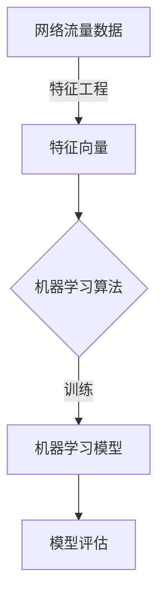

# Python机器学习实战：采用机器学习技术对网络流量进行分析

## 1.背景介绍

随着互联网的快速发展和网络规模的不断扩大,网络流量的监控和分析变得越来越重要。网络流量数据包含了大量有价值的信息,通过对其进行分析和挖掘,可以帮助我们了解网络的运行状况、检测潜在的安全威胁、优化网络资源的利用等。然而,传统的基于规则的流量分析方法已经无法满足当前网络流量的复杂性和多样性,因此需要引入更加智能和高效的机器学习技术。

机器学习是一种从数据中自动分析获得规律,并利用获得的规律对新数据进行预测和决策的技术。由于其强大的数据处理能力和模式识别能力,机器学习在网络流量分析领域有着广阔的应用前景。本文将介绍如何利用Python生态系统中的机器学习工具和库,对网络流量数据进行分析和建模,从而实现对网络流量的智能监控和管理。

### 1.1 网络流量分析的重要性

网络流量分析对于网络运维、安全防护、资源优化等方面都有着重要的作用:

- **网络运维**:通过分析网络流量数据,可以监控网络的运行状态,及时发现异常情况,从而提高网络的可靠性和稳定性。
- **安全防护**:网络流量数据可以反映出网络中的各种威胁,如病毒、蠕虫、垃圾邮件、非法入侵等,通过对流量的分析可以及时发现这些威胁,采取相应的防御措施。
- **资源优化**:分析网络流量数据可以了解网络资源的使用情况,从而优化网络资源的配置和调度,提高资源的利用效率。

### 1.2 机器学习在网络流量分析中的优势

相比于传统的基于规则的流量分析方法,采用机器学习技术进行网络流量分析具有以下优势:

- **自动化**:机器学习算法可以自动从海量的网络流量数据中发现隐藏的模式和规律,而无需人工编写复杂的规则。
- **高效性**:机器学习算法可以快速高效地处理大规模的网络流量数据,适应网络流量的高速变化。
- **准确性**:通过优化算法参数和特征选择,机器学习模型可以达到较高的预测精度。
- **可解释性**:一些机器学习模型具有可解释性,可以解释预测结果的原因,有助于深入理解网络流量的特征。

## 2.核心概念与联系

在应用机器学习技术对网络流量进行分析之前,我们需要了解一些核心概念和它们之间的联系。

### 2.1 网络流量数据

网络流量数据是指在网络中传输的数据包的集合,它包含了源IP地址、目的IP地址、源端口、目的端口、协议类型、数据包长度等多个字段。网络流量数据通常以网络流的形式存储,一个网络流是指在一段时间内,具有相同五元组(源IP、目的IP、源端口、目的端口、协议类型)的数据包的集合。

### 2.2 特征工程

特征工程是将原始网络流量数据转换为机器学习算法可以处理的特征向量的过程。合理的特征工程对于构建高质量的机器学习模型至关重要。常用的网络流量特征包括:

- 基本特征:如数据包长度、时间戳等。
- 统计特征:如平均数据包长度、数据包数量等。
- 时间特征:如数据包到达时间间隔等。
- 其他特征:如数据包头部标志位等。

### 2.3 机器学习算法

机器学习算法是从数据中学习模式和规律的核心技术。在网络流量分析中,常用的机器学习算法包括:

- **监督学习算法**:如逻辑回归、决策树、随机森林、支持向量机等,用于对网络流量进行分类和异常检测。
- **无监督学习算法**:如聚类算法(K-Means、DBSCAN等)、降维算法(PCA、t-SNE等),用于发现网络流量中的模式和异常。
- **深度学习算法**:如卷积神经网络、递归神经网络等,在特征提取和模式识别方面表现出色。

### 2.4 模型评估

为了选择最优的机器学习模型,需要对模型进行评估。常用的评估指标包括:

- **准确率**:正确预测的样本数占总样本数的比例。
- **精确率**:正确预测为正例的样本数占预测为正例的样本数的比例。
- **召回率**:正确预测为正例的样本数占实际正例样本数的比例。
- **F1分数**:精确率和召回率的加权平均值。

### 2.5 概念联系

上述概念之间存在紧密的联系,如下图所示:

网络流量数据首先经过特征工程转换为特征向量,然后输入到机器学习算法中进行训练,得到机器学习模型。最后,通过模型评估选择最优的模型,用于对新的网络流量数据进行预测和分析。

## 3.核心算法原理具体操作步骤

在网络流量分析中,常用的机器学习算法包括逻辑回归、决策树、随机森林、支持向量机等。这些算法虽然原理不同,但是它们的应用流程是相似的。以下是一个通用的机器学习算法应用流程:

1. **数据收集和预处理**
   - 收集网络流量数据,通常以网络流的形式存储。
   - 对数据进行清洗和格式化,处理缺失值和异常值。

2. **特征工程**
   - 从原始网络流量数据中提取相关特征,构建特征向量。
   - 可以考虑使用特征选择算法,去除冗余和无关的特征。

3. **数据集划分**
   - 将数据集划分为训练集和测试集,通常采用stratified k-fold cross-validation的方法。

4. **模型训练**
   - 选择合适的机器学习算法,如逻辑回归、决策树等。
   - 使用训练集对模型进行训练,可能需要调整算法的超参数。

5. **模型评估**
   - 使用测试集对训练好的模型进行评估,计算评估指标如准确率、精确率、召回率等。
   - 可视化评估结果,如绘制ROC曲线、混淆矩阵等。

6. **模型优化**
   - 根据评估结果,通过特征工程、参数调优、集成学习等方法优化模型性能。

7. **模型部署**
   - 将优化后的模型部署到实际的网络环境中,对新的网络流量数据进行预测和分析。

8. **模型更新**
   - 定期收集新的网络流量数据,重新训练模型,保持模型的有效性和准确性。

以上流程是一个循环的过程,需要不断迭代优化,以适应网络流量的动态变化。下面将以随机森林算法为例,详细介绍其在网络流量分析中的应用。

### 3.1 随机森林算法原理

随机森林(Random Forest)是一种基于决策树的集成学习算法,它通过构建多个决策树,并将它们的预测结果进行组合,从而提高预测精度和鲁棒性。

随机森林算法的核心思想是通过两个随机性来减少单个决策树的过拟合风险:

1. **数据随机性**:对于每一棵决策树,都是从原始数据集中随机有放回地抽取一部分样本作为训练集。
2. **特征随机性**:在构建每个决策树节点时,不是从所有特征中选择最优的特征,而是从随机选取的一部分特征中选择最优的特征。

通过引入这两种随机性,每棵决策树之间的差异性增加,从而降低了整个随机森林模型的方差,提高了预测精度和泛化能力。

在预测新样本时,随机森林会将新样本输入到每一棵决策树中,然后将每棵树的预测结果进行组合(如投票或取平均值),得到最终的预测结果。

随机森林算法的优点包括:

- 不易过拟合,具有很好的泛化能力。
- 可以处理高维数据,并自动进行特征选择。
- 可以评估特征的重要性。
- 训练速度快,可以并行化。
- 对于缺失值和异常值具有较强的鲁棒性。

### 3.2 随机森林在网络流量分析中的应用步骤

1. **数据收集和预处理**
   - 收集网络流量数据,通常以网络流的形式存储。
   - 对数据进行清洗和格式化,处理缺失值和异常值。

2. **特征工程**
   - 从原始网络流量数据中提取相关特征,构建特征向量。
   - 可以考虑使用特征选择算法,去除冗余和无关的特征。

3. **数据集划分**
   - 将数据集划分为训练集和测试集,通常采用stratified k-fold cross-validation的方法。

4. **模型训练**
   - 导入随机森林算法,如`from sklearn.ensemble import RandomForestClassifier`。
   - 实例化随机森林分类器对象,设置超参数如`n_estimators`(树的数量)、`max_depth`(树的最大深度)等。
   - 使用训练集对随机森林模型进行训练:`model.fit(X_train, y_train)`。

5. **模型评估**
   - 使用测试集对训练好的随机森林模型进行评估:`y_pred = model.predict(X_test)`。
   - 计算评估指标如准确率、精确率、召回率等:`from sklearn.metrics import accuracy_score, precision_score, recall_score`。
   - 可视化评估结果,如绘制ROC曲线、混淆矩阵等。

6. **模型优化**
   - 通过调整随机森林的超参数,如`n_estimators`、`max_depth`等,优化模型性能。
   - 可以尝试特征工程,如特征选择、特征构造等,提高特征质量。
   - 也可以考虑集成学习,将随机森林与其他算法(如逻辑回归、支持向量机等)进行组合。

7. **模型部署**
   - 将优化后的随机森林模型部署到实际的网络环境中,对新的网络流量数据进行预测和分析。

8. **模型更新**
   - 定期收集新的网络流量数据,重新训练随机森林模型,保持模型的有效性和准确性。

通过上述步骤,我们可以构建一个基于随机森林算法的网络流量分析模型,用于对网络流量进行分类、异常检测等任务。

## 4.数学模型和公式详细讲解举例说明

在机器学习算法中,通常需要使用一些数学模型和公式来描述算法的原理和过程。下面将详细介绍随机森林算法中涉及的一些重要数学模型和公式。

### 4.1 决策树

决策树是随机森林算法的基础,它是一种树形结构的监督学习算法。决策树的构建过程可以用信息增益或基尼系数等指标来衡量特征的重要性,并根据特征的重要性递归地划分数据集,直到满足停止条件为止。

**信息增益**

信息增益是决策树算法中常用的特征选择标准,它反映了使用某个特征进行数据集划分后,所获得的信息的增加量。

设数据集 $D$ 中的样本属于 $m$ 个类别,样本点 $x$ 属于第 $k$ 个类别的概率为 $p_k$,则数据集 $D$ 的信息熵为:

$$
\begin{aligned}
Ent(D) &= -\sum_{k=1}^{m}p_k\log_2 p_k \\
       &= -\frac{|C_1|}{|D|}\log_2\frac{|C_1|}{|D|} - \frac{|C_2|}{|D|}\log_2\frac{|C_2|}{|D|} - \cdots - \frac{|C_m|}{|D|}\log_2\frac{|