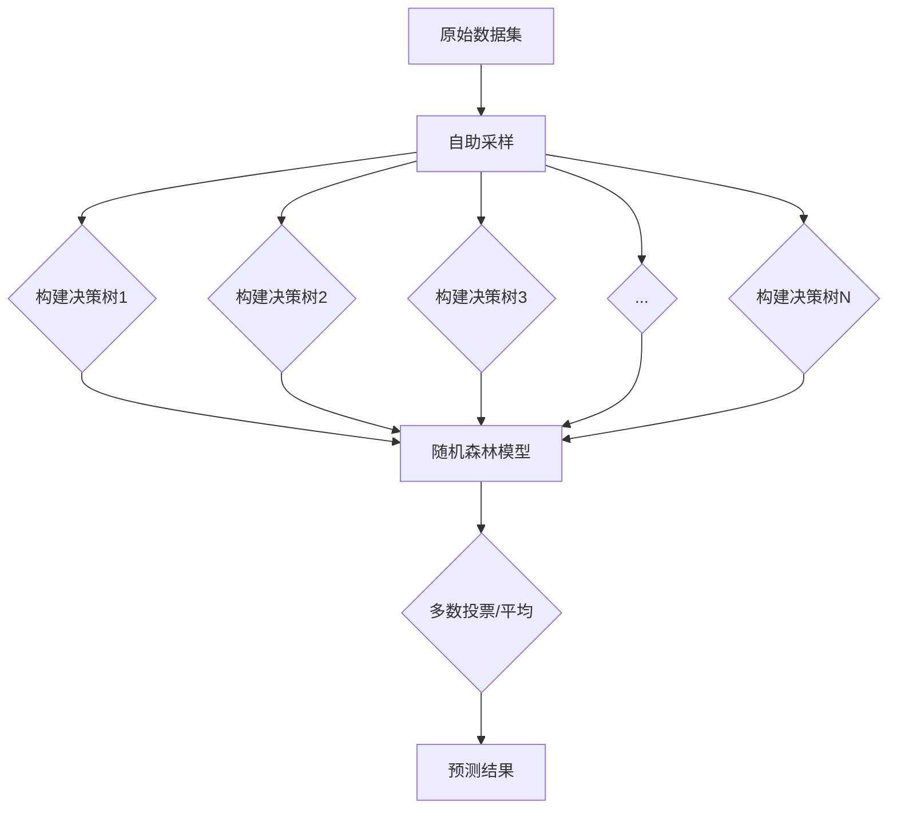

# Python机器学习实战：随机森林算法 - 集成学习的力量

## 1. 背景介绍
### 1.1 机器学习的发展历程
### 1.2 集成学习的兴起
### 1.3 随机森林算法的诞生

## 2. 核心概念与联系
### 2.1 决策树
#### 2.1.1 决策树的定义
#### 2.1.2 决策树的构建过程
#### 2.1.3 决策树的优缺点
### 2.2 集成学习
#### 2.2.1 集成学习的定义
#### 2.2.2 集成学习的分类
#### 2.2.3 Bagging与Boosting
### 2.3 随机森林
#### 2.3.1 随机森林的定义
#### 2.3.2 随机森林与决策树的关系
#### 2.3.3 随机森林的优势

## 3. 核心算法原理具体操作步骤
### 3.1 随机森林的构建过程
#### 3.1.1 数据集的随机采样
#### 3.1.2 特征的随机选择
#### 3.1.3 决策树的构建
#### 3.1.4 多个决策树的组合
### 3.2 随机森林的预测过程
#### 3.2.1 分类问题的预测
#### 3.2.2 回归问题的预测
### 3.3 随机森林的参数调优
#### 3.3.1 树的数量
#### 3.3.2 最大特征数
#### 3.3.3 最大深度
#### 3.3.4 最小分裂样本数

## 4. 数学模型和公式详细讲解举例说明 
### 4.1 Gini系数
#### 4.1.1 Gini系数的定义
#### 4.1.2 Gini系数的计算公式
#### 4.1.3 Gini系数的应用
### 4.2 信息熵
#### 4.2.1 信息熵的定义
#### 4.2.2 信息熵的计算公式 
#### 4.2.3 信息熵在决策树中的应用
### 4.3 基尼不纯度
#### 4.3.1 基尼不纯度的定义
#### 4.3.2 基尼不纯度的计算公式
#### 4.3.3 基尼不纯度在随机森林中的应用

## 5. 项目实践：代码实例和详细解释说明
### 5.1 使用scikit-learn构建随机森林
#### 5.1.1 导入必要的库
#### 5.1.2 加载数据集
#### 5.1.3 数据预处理
#### 5.1.4 模型训练与评估
### 5.2 随机森林的可视化
#### 5.2.1 单个决策树的可视化
#### 5.2.2 特征重要性的可视化
### 5.3 随机森林的参数调优实例
#### 5.3.1 网格搜索
#### 5.3.2 随机搜索
### 5.4 随机森林的并行化处理
#### 5.4.1 使用joblib进行并行化
#### 5.4.2 使用spark进行分布式处理

## 6. 实际应用场景
### 6.1 信用卡欺诈检测
### 6.2 客户流失预测
### 6.3 疾病诊断
### 6.4 股票价格预测

## 7. 工具和资源推荐
### 7.1 scikit-learn
### 7.2 XGBoost
### 7.3 LightGBM
### 7.4 H2O
### 7.5 Weka

## 8. 总结：未来发展趋势与挑战
### 8.1 随机森林的优势总结
### 8.2 随机森林的局限性
### 8.3 集成学习的发展趋势
### 8.4 机器学习的未来挑战

## 9. 附录：常见问题与解答
### 9.1 随机森林与梯度提升树的区别？
### 9.2 随机森林可以处理缺失值吗？
### 9.3 随机森林如何处理不平衡数据集？
### 9.4 随机森林容易过拟合吗？
### 9.5 随机森林的训练时间与树的数量的关系？

随机森林是一种强大的集成学习算法，它通过构建多个决策树并将它们的预测结果进行组合来提高预测的准确性和鲁棒性。随机森林的核心思想是"三个随机"：数据的随机采样、特征的随机选择和决策树的随机构建。

在构建随机森林的过程中，首先对原始数据集进行自助采样，即有放回地从原始数据集中随机抽取与原数据集样本数相同的样本，作为每棵决策树的训练集。这样可以保证每棵决策树都能够看到不同的训练样本，提高了模型的多样性。

接下来，对于每个决策树，在构建树的过程中，每次分裂节点时，不是使用所有的特征，而是从所有特征中随机选择一个子集，然后从这个子集中选择最优的特征进行分裂。这种随机特征选择的方法可以降低决策树之间的相关性，提高了模型的泛化能力。

每棵决策树都采用CART（分类与回归树）算法进行构建，通过递归地选择最优分裂特征和分裂点，直到满足停止条件（如达到最大深度、节点中样本数小于阈值等）。决策树构建完成后，将多棵决策树组合成为随机森林模型。

在进行预测时，对于分类问题，将每棵决策树的预测结果进行多数投票，得到最终的预测结果；对于回归问题，将每棵决策树的预测结果进行平均，得到最终的预测结果。

随机森林的优势在于：
1. 可以处理高维数据和大规模数据集。
2. 对异常值和噪声数据具有较强的鲁棒性。
3. 可以评估特征的重要性，用于特征选择。
4. 训练速度快，可以并行化处理。
5. 泛化能力强，不容易过拟合。

在实际应用中，随机森林被广泛用于各种领域，如金融风控、医疗诊断、推荐系统等。以信用卡欺诈检测为例，通过构建随机森林模型，可以学习历史交易数据中的模式，自动识别出潜在的欺诈交易，从而及时采取措施，减少金融损失。

随机森林的参数调优主要包括树的数量、最大特征数、最大深度和最小分裂样本数等。通过网格搜索或随机搜索等方法，可以找到最优的参数组合，提高模型的性能。此外，随机森林还可以通过并行化处理来提高训练和预测的效率，如使用joblib库或spark进行分布式计算。

随机森林虽然具有众多优点，但也存在一些局限性，如对于高度相关的特征，随机森林可能会过度重视这些特征，导致模型的性能下降。此外，随机森林的解释性相对较差，不如单棵决策树直观。

未来，随着数据规模的不断增大和问题复杂度的提高，集成学习将继续发挥其优势，成为机器学习领域的重要研究方向。而随机森林作为集成学习的代表算法之一，也将不断改进和扩展，与其他算法融合，应对更加复杂多变的现实问题。

总之，随机森林是一种强大的集成学习算法，它通过"三个随机"的思想，构建多样性的决策树，并将它们的预测结果进行组合，提高了预测的准确性和鲁棒性。在实际应用中，随机森林已经被证明是一种有效的机器学习工具，值得我们进一步探索和研究。

作者：禅与计算机程序设计艺术 / Zen and the Art of Computer Programming