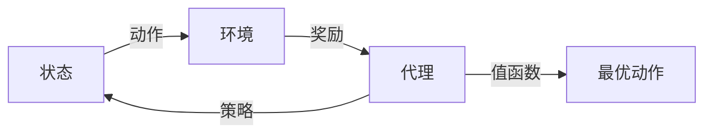

## 1.背景介绍

在人工智能的世界中，深度学习已经成为了一个非常重要的研究领域。而在深度学习的众多应用中，强化学习以其独特的学习方式和广泛的应用前景，吸引了大量的研究者的关注。本文将以Python为工具，深入探讨如何利用强化学习解决实际问题，以游戏为例，详细介绍强化学习的核心概念、算法原理、数学模型以及实践操作。

## 2.核心概念与联系

强化学习是一种机器学习方法，它允许机器或软件代理在与环境的交互中学习并优化其行为，以达到某种目标。它的核心概念包括状态、动作、奖励、策略和值函数。

- **状态（State）**：描述环境的一种情况或条件。在游戏中，状态可能是游戏的当前屏幕图像或游戏角色的位置等。

- **动作（Action）**：代理可以在某个状态下执行的操作。例如在游戏中，动作可能是向左移动、向右移动、跳跃等。

- **奖励（Reward）**：代理在执行某个动作后，环境给予的反馈。奖励可以是正的，也可以是负的，用来指示该动作的好坏。

- **策略（Policy）**：定义了在每个状态下应该采取哪个动作的规则。

- **值函数（Value Function）**：用于评估在某个状态下执行某个动作的长期收益。

这些概念之间的联系可以通过下图进行展示：



## 3.核心算法原理具体操作步骤

强化学习的核心算法包括值迭代、策略迭代、Q学习、Deep Q Network（DQN）等。以Q学习为例，其操作步骤如下：

1. 初始化Q值表格，对于每个状态-动作对，赋予一个初始值。

2. 根据当前状态选择动作。这里可以使用ε-greedy策略，即以1-ε的概率选择Q值最大的动作，以ε的概率随机选择动作。

3. 执行动作，观察环境的反馈和新的状态。

4. 根据环境的反馈和新的状态，更新Q值表格。

5. 重复步骤2-4，直到满足终止条件。

## 4.数学模型和公式详细讲解举例说明

Q学习的更新公式如下：

$$ Q(s, a) = Q(s, a) + α [r + γ \max_{a'}Q(s', a') - Q(s, a)] $$

其中，s和a分别表示当前状态和动作，s'表示新的状态，a'表示在新的状态下的动作，r表示奖励，α表示学习率，γ表示折扣因子，$\max_{a'}Q(s', a')$表示在新的状态下，选择不同动作能得到的最大Q值。

## 5.项目实践：代码实例和详细解释说明

下面以Python实现的Q学习玩Flappy Bird游戏为例，给出代码实例和详细解释：

```python
import numpy as np

class QLearningAgent:
    def __init__(self, alpha=0.5, gamma=0.9, epsilon=0.1):
        self.alpha = alpha
        self.gamma = gamma
        self.epsilon = epsilon
        self.Q = {}

    def choose_action(self, state):
        if np.random.rand() < self.epsilon:
            return np.random.choice(['up', 'down'])
        else:
            return 'up' if self.Q.get((state, 'up'), 0) > self.Q.get((state, 'down'), 0) else 'down'

    def learn(self, state, action, reward, next_state):
        q = self.Q.get((state, action), 0)
        max_q = max(self.Q.get((next_state, a), 0) for a in ['up', 'down'])
        self.Q[(state, action)] = q + self.alpha * (reward + self.gamma * max_q - q)
```

## 6.实际应用场景

强化学习除了在游戏中有广泛应用外，还被用在很多其他领域，如自动驾驶、机器人控制、资源管理、推荐系统等。

## 7.工具和资源推荐

推荐使用OpenAI Gym作为强化学习的环境，它提供了很多预定义的环境，如Atari游戏、棋盘游戏、机器人模拟等。而对于深度学习的实现，可以使用TensorFlow或PyTorch等框架。

## 8.总结：未来发展趋势与挑战

强化学习作为深度学习的重要分支，其未来发展趋势主要包括模型的复杂度提升、算法的优化、应用领域的拓展等。但同时，强化学习也面临着许多挑战，如样本效率低、泛化性能差、稳定性问题等。

## 9.附录：常见问题与解答

1. Q: 强化学习和监督学习有什么区别？

   A: 监督学习是从标签数据中学习，而强化学习则是通过与环境的交互来学习。

2. Q: 如何选择合适的奖励函数？

   A: 奖励函数的设计是强化学习中的一个重要问题，需要根据具体的任务和环境来设计。

作者：禅与计算机程序设计艺术 / Zen and the Art of Computer Programming