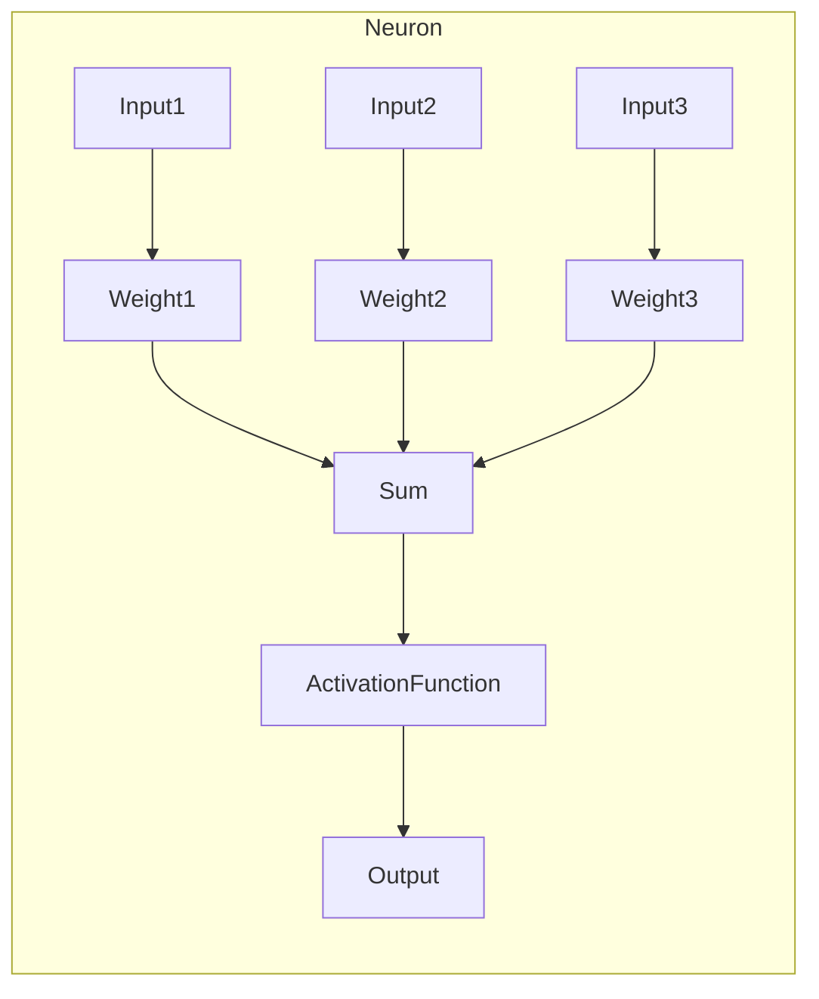
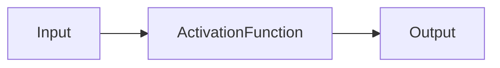
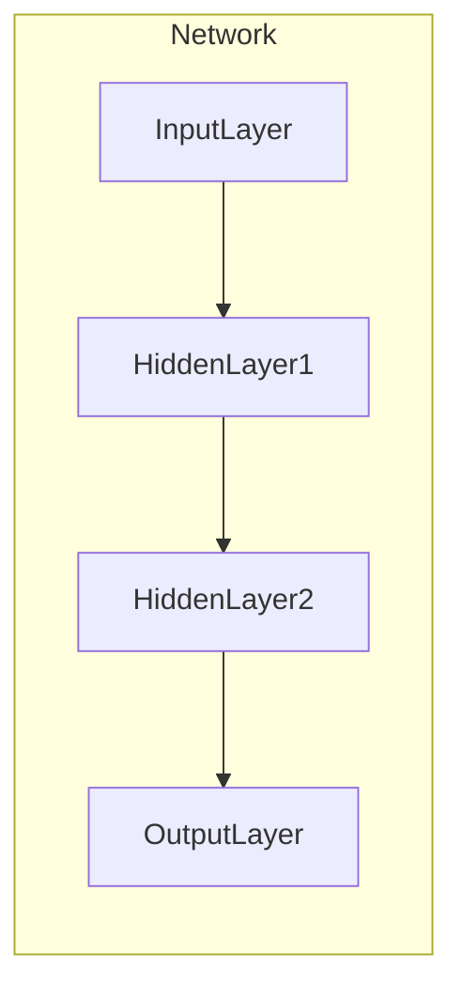
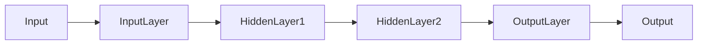
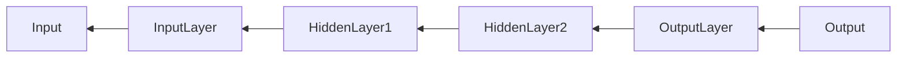

# Python深度学习实践：入门篇 - 你的第一个神经网络

## 1.背景介绍

### 1.1 深度学习的崛起

近年来，人工智能领域取得了长足的进步,而深度学习作为其核心驱动力,正在改变着我们的生活和工作方式。从语音识别到计算机视觉,从自然语言处理到推荐系统,深度学习技术的应用已经无处不在。这种革命性的变化,源于深度神经网络在处理复杂数据方面展现出的强大能力。

### 1.2 神经网络简介

神经网络是一种受生物神经系统启发而设计的机器学习模型。它由大量互连的节点(神经元)组成,这些节点通过权重连接传递信号。神经网络能够从数据中自动学习特征,并对新的输入数据进行预测或决策。这种自动学习的能力使得神经网络在解决许多传统算法难以应对的复杂问题时表现出色。

### 1.3 Python生态系统

Python凭借其简洁的语法、丰富的库生态和活跃的社区,已成为机器学习和深度学习领域的主导语言之一。诸如NumPy、Pandas、Matplotlib等库为数据处理和可视化提供了强有力的支持,而TensorFlow、PyTorch等框架则为深度学习模型的构建和训练提供了高效的工具。本文将引导您使用Python生态系统,从头开始构建您的第一个神经网络模型。

## 2.核心概念与联系

在深入探讨神经网络的细节之前,我们需要了解一些核心概念及其相互关系。

### 2.1 神经元(Neuron)

神经元是神经网络的基本计算单元,它接收一个或多个输入,对它们进行加权求和,然后通过激活函数产生输出。每个输入都有一个关联的权重,这些权重决定了输入对神经元输出的影响程度。



### 2.2 激活函数(Activation Function)

激活函数引入了非线性,使神经网络能够学习复杂的映射关系。常见的激活函数包括Sigmoid、Tanh、ReLU等。选择合适的激活函数对于神经网络的性能至关重要。



### 2.3 层(Layer)

神经网络由多个层组成,每层包含多个神经元。输入层接收原始数据,隐藏层对数据进行特征提取和转换,输出层产生最终的预测或决策。层与层之间通过权重连接传递信息。



### 2.4 前向传播(Forward Propagation)

前向传播是神经网络的核心计算过程。输入数据从输入层开始,经过每一层的加权求和和激活函数计算,最终到达输出层产生结果。这个过程模拟了信号在生物神经网络中的传播。



### 2.5 反向传播(Backpropagation)

反向传播是神经网络的核心学习算法。它通过计算输出与期望值之间的误差,并沿着网络反向传播这个误差,调整每一层的权重,使得网络输出逐渐接近期望值。这个过程模拟了生物神经网络中的学习过程。



### 2.6 优化器(Optimizer)

优化器是用于更新神经网络权重的算法,常见的优化器包括梯度下降(Gradient Descent)、动量优化(Momentum)、RMSProp、Adam等。选择合适的优化器对于神经网络的收敛速度和性能至关重要。

### 2.7 损失函数(Loss Function)

损失函数用于衡量神经网络输出与期望值之间的差异。常见的损失函数包括均方误差(Mean Squared Error)、交叉熵损失(Cross-Entropy Loss)等。损失函数的选择取决于任务类型(回归或分类)和数据分布。

通过理解这些核心概念及其相互关系,我们就能更好地掌握神经网络的工作原理,为后续的实践打下坚实的基础。

## 3.核心算法原理具体操作步骤

### 3.1 神经网络的前向传播

前向传播是神经网络的核心计算过程,它模拟了信号在生物神经网络中的传播。具体步骤如下:

1. **输入层**:将输入数据传递给第一个隐藏层。

2. **隐藏层**:
   - 对于每个神经元,计算其输入的加权和。
   - 将加权和传递给激活函数,得到该神经元的输出。
   - 将所有神经元的输出作为下一层的输入。

3. **输出层**:
   - 对于每个输出神经元,计算其输入的加权和。
   - 将加权和传递给激活函数(可选),得到该神经元的输出。

4. **输出**:输出层的输出即为神经网络的最终输出。

下面是一个简单的前向传播示例,其中包含一个输入层、一个隐藏层和一个输出层:

```python
import numpy as np

# 输入数据
X = np.array([[0.5, 0.1, 0.2]])

# 权重和偏置
W1 = np.array([[0.1, 0.3, 0.5], [0.2, 0.4, 0.6]])
b1 = np.array([0.1, 0.2])
W2 = np.array([[0.3, 0.7], [0.4, 0.8]])
b2 = np.array([0.1, 0.2])

# 激活函数(使用ReLU)
def relu(x):
    return np.maximum(0, x)

# 前向传播
hidden_layer_input = np.dot(X, W1.T) + b1
hidden_layer_output = relu(hidden_layer_input)
output_layer_input = np.dot(hidden_layer_output, W2.T) + b2
output = output_layer_input  # 无激活函数

print("输出:", output)
```

在这个示例中,我们定义了输入数据`X`、权重矩阵`W1`和`W2`、偏置向量`b1`和`b2`。然后,我们计算隐藏层的输入和输出,再计算输出层的输入和输出。最终,我们得到了神经网络的输出。

### 3.2 神经网络的反向传播

反向传播是神经网络的核心学习算法,它通过计算输出与期望值之间的误差,并沿着网络反向传播这个误差,调整每一层的权重,使得网络输出逐渐接近期望值。具体步骤如下:

1. **计算输出层误差**:
   - 计算输出层神经元的误差,即期望输出与实际输出之间的差异。
   - 对于每个输出神经元,计算其误差对加权输入的导数(使用链式法则)。

2. **反向传播误差**:
   - 计算隐藏层神经元的误差,即将输出层神经元的误差乘以相应的权重,再求和。
   - 对于每个隐藏层神经元,计算其误差对加权输入的导数(使用链式法则)。

3. **更新权重和偏置**:
   - 计算每个权重的梯度(误差对权重的导数)。
   - 计算每个偏置的梯度(误差对偏置的导数)。
   - 使用优化算法(如梯度下降)更新权重和偏置。

4. **重复步骤1-3**,直到网络收敛或达到最大迭代次数。

下面是一个简单的反向传播示例,其中包含一个输入层、一个隐藏层和一个输出层:

```python
import numpy as np

# 输入数据
X = np.array([[0.5, 0.1, 0.2]])
y_true = np.array([[0.7, 0.3]])  # 期望输出

# 权重和偏置
W1 = np.array([[0.1, 0.3, 0.5], [0.2, 0.4, 0.6]])
b1 = np.array([0.1, 0.2])
W2 = np.array([[0.3, 0.7], [0.4, 0.8]])
b2 = np.array([0.1, 0.2])

# 激活函数及其导数
def relu(x):
    return np.maximum(0, x)

def relu_prime(x):
    x[x <= 0] = 0
    x[x > 0] = 1
    return x

# 前向传播
hidden_layer_input = np.dot(X, W1.T) + b1
hidden_layer_output = relu(hidden_layer_input)
output_layer_input = np.dot(hidden_layer_output, W2.T) + b2
output = output_layer_input  # 无激活函数

# 反向传播
output_error = output - y_true  # 输出层误差
output_delta = output_error  # 无激活函数,误差等于输出层误差

hidden_error = np.dot(output_delta, W2)  # 隐藏层误差
hidden_delta = hidden_error * relu_prime(hidden_layer_input)  # 隐藏层delta

# 更新权重和偏置
W2 -= np.dot(hidden_layer_output.T, output_delta) * 0.1  # 学习率为0.1
b2 -= np.sum(output_delta, axis=0) * 0.1
W1 -= np.dot(X.T, hidden_delta) * 0.1
b1 -= np.sum(hidden_delta, axis=0) * 0.1

print("更新后的权重和偏置:")
print("W1:", W1)
print("b1:", b1)
print("W2:", W2)
print("b2:", b2)
```

在这个示例中,我们首先进行前向传播,计算输出层的输出。然后,我们计算输出层的误差,并沿着网络反向传播这个误差,计算隐藏层的误差。最后,我们使用梯度下降算法更新权重和偏置。

通过反复执行前向传播和反向传播,神经网络可以逐步调整其权重和偏置,使得输出逐渐接近期望值。这个过程模拟了生物神经网络中的学习过程。

## 4.数学模型和公式详细讲解举例说明

### 4.1 神经元数学模型

神经元是神经网络的基本计算单元,它接收一个或多个输入,对它们进行加权求和,然后通过激活函数产生输出。数学上,我们可以将神经元表示为:

$$
y = \phi\left(\sum_{i=1}^{n}w_ix_i + b\right)
$$

其中:

- $y$是神经元的输出
- $x_i$是第$i$个输入
- $w_i$是与第$i$个输入相关联的权重
- $b$是偏置项
- $\phi$是激活函数

让我们用一个具体的例子来说明:

假设我们有一个神经元,它有三个输入$x_1=0.5$、$x_2=0.1$和$x_3=0.2$,相应的权重为$w_1=0.1$、$w_2=0.3$和$w_3=0.5$,偏置项$b=0.1$,激活函数为ReLU。我们可以计算该神经元的输出如下:

$$
\begin{aligned}
y &= \phi\left(\sum_{i=1}^{3}w_ix_i + b\right) \\
&= \phi\left(0.1 \times 0.5 + 0.3 \times 0.1 + 0.5 \times 0.2 + 0.1\right) \\
&= \phi(0.05 + 0.03 + 0.1 + 0.1) \\
&= \phi(0.28) \\
&= \max(0, 0.28) \\
&= 0.28
\end{aligned}
$$

在这个例子中,我们首先计算加权输入的总和,然后将其传递给ReLU激活函数,得到神经元的输出为0.28。

### 4.2 激活函数

激活函数引入了非线性,使神经网络能够学习复杂的映射关系。常见的激活函数包括Sigmoid、Tanh、ReLU等。

#### 4.2.1 Sigmoid函数

Sigmoid函数将输入值映射到(0,1)范围内,常用于二分类问题