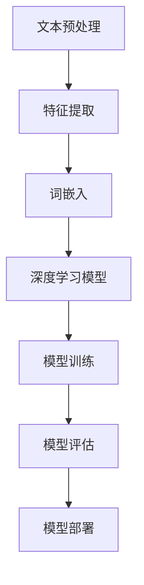

# Python深度学习实践：深度学习在文档自动归类中的应用

## 1.背景介绍

在当今信息时代,海量的文档数据正以前所未有的速度不断累积。有效地组织和管理这些文档对于企业和组织来说至关重要。传统的人工分类方法不仅耗时耗力,而且难以应对不断增长的文档量。因此,自动文档分类技术应运而生,它利用机器学习和自然语言处理技术自动将文档归类到预定义的类别中。

深度学习作为一种强大的机器学习技术,在文档自动分类任务中表现出色。与传统的机器学习算法相比,深度学习模型能够自动从原始数据中提取高级特征,从而捕捉更加复杂和抽象的模式。这使得深度学习在处理非结构化文本数据方面具有独特的优势。

## 2.核心概念与联系

### 2.1 文档自动分类

文档自动分类是一个将文档映射到预定义类别的过程。它通常包括以下几个步骤:

1. 文本预处理
2. 特征提取
3. 模型训练
4. 模型评估
5. 模型部署

### 2.2 深度学习

深度学习是一种基于人工神经网络的机器学习技术,它能够通过多层非线性变换自动从原始数据中学习特征表示。常见的深度学习模型包括卷积神经网络(CNN)、递归神经网络(RNN)和自注意力机制(Self-Attention)等。

### 2.3 自然语言处理(NLP)

自然语言处理是一门研究计算机处理和理解人类语言的学科。它为深度学习在文本数据上的应用提供了必要的基础,如词嵌入、语言模型和注意力机制等。

### 2.4 词嵌入(Word Embedding)

词嵌入是一种将词语映射到连续的向量空间的技术,使得语义相似的词语在向量空间中彼此靠近。它为深度学习模型处理文本数据奠定了基础。

## 3.核心算法原理具体操作步骤

深度学习在文档自动分类任务中的应用通常遵循以下步骤:



### 3.1 文本预处理

文本预处理是将原始文本数据转换为结构化格式的过程,通常包括以下步骤:

1. 标记化(Tokenization):将文本拆分为单词、标点符号等token。
2. 去除停用词(Stop Word Removal):移除无意义的常用词,如"the"、"a"等。
3. 词形还原(Lemmatization):将单词缩减为词根形式。
4. 编码(Encoding):将token转换为数字表示,以便输入到深度学习模型中。

### 3.2 特征提取

传统的文本分类方法通常使用基于统计的特征提取技术,如TF-IDF(Term Frequency-Inverse Document Frequency)。而在深度学习中,特征提取过程通常是自动完成的,模型会从原始数据中学习特征表示。

### 3.3 词嵌入

词嵌入是将单词映射到连续的向量空间,使得语义相似的单词在向量空间中彼此靠近。常见的词嵌入技术包括Word2Vec、GloVe和FastText等。通过将文本数据转换为词嵌入向量,深度学习模型能够更好地捕捉语义信息。

### 3.4 深度学习模型

在文档自动分类任务中,常用的深度学习模型包括:

1. **卷积神经网络(CNN)**: CNN擅长捕捉局部模式,在文本分类中表现良好。
2. **递归神经网络(RNN)**: RNN能够很好地处理序列数据,如自然语言文本。常见的RNN变体包括LSTM和GRU。
3. **自注意力机制(Self-Attention)**: 自注意力机制允许模型关注输入序列中的重要部分,在NLP任务中表现出色。著名的Transformer模型就是基于自注意力机制。

这些模型通常会结合词嵌入层、池化层和全连接层等组件,构建端到端的文本分类模型。

### 3.5 模型训练

在训练阶段,深度学习模型会在标记的训练数据上进行学习,目标是最小化模型在训练数据上的损失函数。常用的优化算法包括随机梯度下降(SGD)、Adam等。

### 3.6 模型评估

模型评估是衡量模型性能的重要环节。常用的评估指标包括准确率(Accuracy)、精确率(Precision)、召回率(Recall)和F1分数等。通常会在保留的测试数据集上评估模型的泛化能力。

### 3.7 模型部署

一旦模型被训练并通过评估,就可以将其部署到生产环境中,为实际的文档分类任务服务。

## 4.数学模型和公式详细讲解举例说明

在深度学习模型中,数学模型和公式扮演着重要的角色。以下是一些常见的数学概念和公式:

### 4.1 损失函数(Loss Function)

损失函数用于衡量模型预测与实际标签之间的差距。在文本分类任务中,常用的损失函数包括交叉熵损失(Cross-Entropy Loss)和focal loss等。

交叉熵损失的公式如下:

$$J(\theta) = -\frac{1}{N}\sum_{i=1}^{N}\sum_{c=1}^{C}y_{i,c}\log(p_{i,c})$$

其中:
- $N$是训练样本数量
- $C$是类别数量
- $y_{i,c}$是样本$i$的真实标签,如果属于类别$c$则为1,否则为0
- $p_{i,c}$是模型预测样本$i$属于类别$c$的概率

### 4.2 优化算法

优化算法用于最小化损失函数,常见的优化算法包括随机梯度下降(SGD)和Adam等。

SGD的更新规则如下:

$$\theta_{t+1} = \theta_t - \eta \nabla_\theta J(\theta_t)$$

其中:
- $\theta_t$是第$t$次迭代时的模型参数
- $\eta$是学习率
- $\nabla_\theta J(\theta_t)$是损失函数关于$\theta_t$的梯度

Adam算法则综合了动量(Momentum)和自适应学习率(Adaptive Learning Rate)的优点,公式如下:

$$\begin{aligned}
m_t &= \beta_1 m_{t-1} + (1 - \beta_1)g_t\\
v_t &= \beta_2 v_{t-1} + (1 - \beta_2)g_t^2\\
\hat{m}_t &= \frac{m_t}{1 - \beta_1^t}\\
\hat{v}_t &= \frac{v_t}{1 - \beta_2^t}\\
\theta_{t+1} &= \theta_t - \frac{\eta}{\sqrt{\hat{v}_t} + \epsilon}\hat{m}_t
\end{aligned}$$

其中:
- $m_t$和$v_t$分别是第一阶段和二阶段动量估计
- $\beta_1$和$\beta_2$是指数衰减率
- $\hat{m}_t$和$\hat{v}_t$是偏差修正后的动量估计
- $\epsilon$是一个很小的常数,用于避免除以零

### 4.3 注意力机制(Attention Mechanism)

注意力机制是深度学习中一种重要的技术,它允许模型关注输入序列中的重要部分,从而提高模型的性能。在文本分类任务中,自注意力机制(Self-Attention)被广泛应用。

自注意力机制的计算过程如下:

$$\text{Attention}(Q, K, V) = \text{softmax}(\frac{QK^T}{\sqrt{d_k}})V$$

其中:
- $Q$是查询向量(Query)
- $K$是键向量(Key)
- $V$是值向量(Value)
- $d_k$是缩放因子,用于防止内积过大导致梯度消失

通过计算查询向量与键向量之间的相似性分数,注意力机制可以动态地为输入序列中的每个元素分配不同的权重,从而捕捉重要的信息。

## 5.项目实践：代码实例和详细解释说明

为了更好地理解深度学习在文档自动分类中的应用,我们将使用Python和PyTorch框架构建一个文本分类模型。

### 5.1 数据准备

我们将使用经典的20新闻组数据集进行实验。该数据集包含约20,000篇新闻文章,分为20个不同的主题类别。

```python
import torch
from torchtext import data, datasets

# 设置数据路径
root = '.data'

# 定义文本字段和标签字段
text_field = data.Field(tokenize='spacy', 
                        tokenizer_language='en_core_web_sm',
                        include_lengths=True)
label_field = data.LabelField()

# 加载数据集
train_data, test_data = datasets.NewsGroup(root=root, text_field=text_field, 
                                           label_field=label_field, 
                                           train='train.txt', test='test.txt')

# 构建词汇表
text_field.build_vocab(train_data, max_size=25000, vectors="glove.6B.100d")
label_field.build_vocab(train_data)

# 创建迭代器
train_iter, test_iter = data.BucketIterator.splits(
    (train_data, test_data), batch_size=64, device=device)
```

在上述代码中,我们首先定义了文本字段和标签字段,用于处理文本数据和标签。然后,我们加载了20新闻组数据集,并构建了词汇表。最后,我们创建了用于训练和测试的迭代器。

### 5.2 模型构建

接下来,我们将构建一个基于CNN的文本分类模型。

```python
import torch.nn as nn
import torch.nn.functional as F

class TextCNN(nn.Module):
    def __init__(self, vocab_size, embedding_dim, n_filters, filter_sizes, 
                 output_dim, dropout, pad_idx):
        
        super().__init__()
        
        self.embedding = nn.Embedding(vocab_size, embedding_dim, padding_idx=pad_idx)
        
        self.convs = nn.ModuleList([
                      nn.Conv2d(in_channels=1, 
                                out_channels=n_filters, 
                                kernel_size=(fs, embedding_dim)) 
                      for fs in filter_sizes
                    ])
        
        self.fc = nn.Linear(len(filter_sizes) * n_filters, output_dim)
        
        self.dropout = nn.Dropout(dropout)
        
    def forward(self, text):
        
        # text = [batch size, sent len]
        
        embedded = self.embedding(text)
        
        # embedded = [batch size, sent len, emb dim]
        
        embedded = embedded.unsqueeze(1)
        
        # embedded = [batch size, 1, sent len, emb dim]
        
        conved = [F.relu(conv(embedded)).squeeze(3) for conv in self.convs]
            
        # conved_n = [batch size, n_filters, sent len - filter_sizes[n] + 1]
        
        pooled = [F.max_pool1d(conv, conv.shape[2]).squeeze(2) for conv in conved]
        
        # pooled_n = [batch size, n_filters]
        
        cat = self.dropout(torch.cat(pooled, dim=1))

        # cat = [batch size, n_filters * len(filter_sizes)]
            
        return self.fc(cat)
```

在这个模型中,我们首先使用预训练的GloVe词嵌入来初始化嵌入层。然后,我们使用多个不同大小的一维卷积核对输入进行卷积操作,捕捉不同范围的局部模式。接下来,我们对每个卷积核的输出应用最大池化操作,以获得最重要的特征。最后,我们将所有池化输出连接起来,通过一个全连接层和dropout层进行分类。

### 5.3 模型训练

完成模型构建后,我们可以开始训练过程。

```python
import torch.optim as optim

model = TextCNN(len(text_field.vocab), 100, 100, [3, 4, 5], len(label_field.vocab), 0.5, text_field.vocab.stoi[text_field.pad_token])
model = model.to(device)

optimizer = optim.Adam(model.parameters())
criterion = nn.CrossEntropyLoss()

model.train()

for epoch in range(10):
    epoch_loss = 0
    epoch_acc = 0
    
    for batch in train_iter:
        optimizer.zero_grad()
        
        text, text_lengths = batch.text
        predictions = model(text)
        loss = criterion(predictions, batch.label)
        
        acc = binary_accuracy(predictions, batch.label)
        