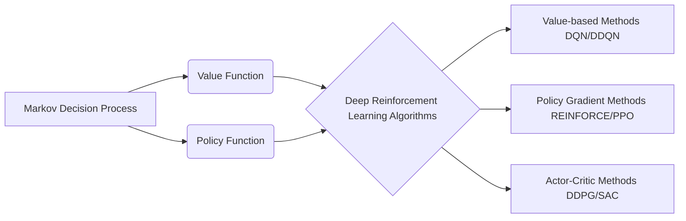

# Python深度学习实践：深度强化学习与机器人控制

## 1.背景介绍
### 1.1 深度学习与强化学习的兴起
近年来,深度学习和强化学习在人工智能领域取得了突破性进展。深度学习利用多层神经网络从大规模数据中学习特征表示,在计算机视觉、语音识别等领域达到了超人的性能。强化学习则让智能体通过与环境的交互学习最优策略,在游戏、机器人等领域展现出卓越的决策能力。

### 1.2 深度强化学习的优势
深度强化学习是深度学习与强化学习的结合,即利用深度神经网络作为强化学习的函数逼近器。它继承了两者的优点：深度学习强大的表示学习能力,和强化学习的端到端学习能力。这使得深度强化学习在复杂的观察空间和动作空间下,仍然能够有效地学习到最优策略。

### 1.3 深度强化学习在机器人控制中的应用前景
机器人控制是深度强化学习的重要应用领域之一。传统的机器人控制通常依赖人工设计的控制器,难以适应复杂动态的环境。而深度强化学习为机器人的感知、规划、控制提供了端到端的学习方案。机器人可以通过不断尝试与环境交互,从错误中学习,最终掌握复杂的控制策略。这有望大大提升机器人的自主性、鲁棒性和适应性。

## 2.核心概念与联系
### 2.1 马尔可夫决策过程(MDP)
MDP是强化学习的标准形式化表示,由状态集合S、动作集合A、转移概率P、奖励函数R、折扣因子γ组成。在每个时间步,智能体根据当前状态采取一个动作,环境根据动作给予即时奖励并转移到下一个状态。智能体的目标是最大化累积奖励的期望。

### 2.2 值函数与策略函数
- 状态值函数 $v_{\pi}(s)$ 表示从状态s开始,遵循策略π能获得的期望回报。 
- 动作值函数 $q_{\pi}(s,a)$ 表示在状态s下采取动作a,遵循策略π能获得的期望回报。
- 策略函数 $\pi(a|s)$ 表示在状态s下采取动作a的概率。最优策略 $\pi^*$ 能使得每个状态的值函数达到最大。

### 2.3 深度强化学习中的神经网络结构
深度强化学习使用深度神经网络来逼近值函数或策略函数。常见的网络结构有:
- 深度Q网络(DQN):输入状态,输出每个动作的Q值。
- 深度确定性策略梯度(DDPG):包含一个Q网络和一个确定性策略网络。
- 近端策略优化(PPO):包含一个策略网络和一个值网络。

### 2.4 深度强化学习算法分类
- 值函数方法:学习值函数,通过值函数得到隐式策略,如DQN、DDQN。
- 策略梯度方法:直接学习参数化的策略函数,沿着策略梯度方向更新,如REINFORCE、PPO。
- 演员-评论家方法:同时学习策略函数(演员)和值函数(评论家),如DDPG、SAC。



## 3.核心算法原理与具体步骤
本节重点介绍两种代表性的深度强化学习算法:DQN和DDPG,分别对应值函数方法和演员-评论家方法。

### 3.1 深度Q网络(DQN)
DQN使用深度神经网络来逼近最优动作值函数 $Q^*(s,a)$。它的核心思想是最小化TD误差,即当前Q值估计和TD目标之间的均方误差。

#### 3.1.1 算法流程
1. 初始化Q网络参数θ,目标Q网络参数 $\hat{\theta}=\theta$,经验回放池D。
2. 初始化初始状态 $s_1$。
3. for t=1 to T do
   1. 以 $\epsilon$ 的概率随机选择动作 $a_t$,否则 $a_t=\arg\max_a Q(s_t,a;\theta)$。
   2. 执行动作 $a_t$,观察奖励 $r_t$ 和下一状态 $s_{t+1}$。 
   3. 将转移样本 $(s_t,a_t,r_t,s_{t+1})$ 存入D。
   4. 从D中随机采样一个批量的转移样本。
   5. 计算TD目标 $y_i=r_i+\gamma \max_{a'} \hat{Q}(s_{i+1},a';\hat{\theta})$。
   6. 最小化TD误差 $L(\theta)=\frac{1}{N}\sum_i(y_i-Q(s_i,a_i;\theta))^2$,更新Q网络参数θ。
   7. 每隔C步,更新目标网络 $\hat{\theta}=\theta$。
4. end for

#### 3.1.2 DQN的改进
- Double DQN:解决Q值过估计问题,使用另一个Q网络来选择TD目标中的最大动作。
- Dueling DQN:将Q网络分解为状态值和优势函数两部分,更有效地学习状态值。
- Prioritized Experience Replay:按照TD误差对经验回放的样本进行优先级采样。

### 3.2 深度确定性策略梯度(DDPG)
DDPG结合了DQN和演员-评论家方法,可以处理连续动作空间。它同时学习一个确定性策略网络 $\mu(s;\theta^\mu)$ 和一个Q网络 $Q(s,a;\theta^Q)$。

#### 3.2.1 算法流程
1. 随机初始化策略网络 $\theta^\mu$ 和Q网络 $\theta^Q$,对应的目标网络参数 $\theta^{\mu'}=\theta^\mu,\theta^{Q'}=\theta^Q$。
2. 初始化经验回放池D。 
3. for episode=1 to M do 
   1. 初始化初始状态 $s_1$,高斯噪声N。
   2. for t=1 to T do
      1. 根据策略网络和噪声选择动作 $a_t=\mu(s_t;\theta^\mu)+N_t$。
      2. 执行动作 $a_t$,观察奖励 $r_t$ 和下一状态 $s_{t+1}$。
      3. 将转移样本 $(s_t,a_t,r_t,s_{t+1})$ 存入D。
      4. 从D中随机采样一个批量的转移样本。
      5. 计算TD目标 $y_i=r_i+\gamma Q'(s_{i+1},\mu'(s_{i+1};\theta^{\mu'});\theta^{Q'})$。
      6. 最小化Q网络的TD误差,更新Q网络参数 $\theta^Q$。
      7. 最大化Q网络关于动作的输出,更新策略网络参数 $\theta^\mu$。
      8. 软更新目标网络参数 $\theta^{Q'}$ 和 $\theta^{\mu'}$。
   3. end for
4. end for

#### 3.2.2 DDPG的改进
- TD3:通过延迟策略更新、双Q网络等技巧减少Q值过估计。
- SAC:在最大化策略熵的同时学习策略,提高探索效率和稳定性。

## 4.数学模型与公式详解
### 4.1 马尔可夫决策过程(MDP)
MDP定义为一个五元组 $\langle \mathcal{S},\mathcal{A},\mathcal{P},\mathcal{R},\gamma \rangle$:
- 状态空间 $\mathcal{S}$:所有可能的状态集合。
- 动作空间 $\mathcal{A}$:所有可能的动作集合。
- 转移概率 $\mathcal{P}(s'|s,a)$:在状态s下采取动作a后转移到状态s'的概率。
- 奖励函数 $\mathcal{R}(s,a)$:在状态s下采取动作a后获得的即时奖励。
- 折扣因子 $\gamma \in [0,1]$:未来奖励的折扣系数。

在MDP中,智能体与环境交互产生状态-动作-奖励序列:
$$\tau=s_1,a_1,r_1,s_2,a_2,r_2,...,s_T,a_T,r_T$$
智能体的目标是最大化累积奖励的期望:
$$\mathbb{E}_{\tau\sim\pi}[\sum_{t=1}^T \gamma^{t-1}r_t]$$

### 4.2 贝尔曼方程
值函数和动作值函数满足贝尔曼方程:
$$v_{\pi}(s)=\mathbb{E}_{a\sim\pi}[\mathcal{R}(s,a)+\gamma \mathbb{E}_{s'\sim \mathcal{P}}[v_{\pi}(s')]]$$
$$q_{\pi}(s,a)=\mathcal{R}(s,a)+\gamma \mathbb{E}_{s'\sim \mathcal{P}}[\mathbb{E}_{a'\sim\pi}[q_{\pi}(s',a')]]$$

最优值函数和最优动作值函数满足贝尔曼最优方程:
$$v^*(s)=\max_a [\mathcal{R}(s,a)+\gamma \mathbb{E}_{s'\sim \mathcal{P}}[v^*(s')]]$$
$$q^*(s,a)=\mathcal{R}(s,a)+\gamma \mathbb{E}_{s'\sim \mathcal{P}}[\max_{a'}q^*(s',a')]$$

### 4.3 时序差分(TD)学习
TD学习通过自举的方式更新值函数,常见的TD算法有:
- Sarsa:基于当前策略的动作值函数更新。
$$Q(s_t,a_t)\leftarrow Q(s_t,a_t)+\alpha(r_t+\gamma Q(s_{t+1},a_{t+1})-Q(s_t,a_t))$$
- Q-learning:基于贪婪策略的动作值函数更新。
$$Q(s_t,a_t)\leftarrow Q(s_t,a_t)+\alpha(r_t+\gamma \max_a Q(s_{t+1},a)-Q(s_t,a_t))$$

### 4.4 策略梯度定理
定义性能度量 $J(\theta)=\mathbb{E}_{\tau\sim p_{\theta}(\tau)}[R(\tau)]$,其中 $p_{\theta}(\tau)$ 是参数化策略 $\pi_{\theta}$ 生成轨迹 $\tau$ 的概率。策略梯度定理给出了性能度量对策略参数的梯度:
$$\nabla_{\theta}J(\theta)=\mathbb{E}_{\tau\sim p_{\theta}(\tau)}[\sum_{t=1}^T \nabla_{\theta}\log \pi_{\theta}(a_t|s_t)Q^{\pi_{\theta}}(s_t,a_t)]$$

常见的策略梯度算法有REINFORCE和Actor-Critic。

## 5.项目实践:机器人避障
本节我们通过一个机器人避障的项目,演示如何使用DDPG算法来训练机器人避开障碍物到达目标位置。

### 5.1 环境设置
- 状态空间:机器人和障碍物的位置、速度信息。
- 动作空间:机器人的速度指令(连续)。
- 奖励函数:与目标位置的距离(负值)、与障碍物的距离(正值)、到达目标位置的奖励(正值)、碰撞障碍物的惩罚(负值)。

### 5.2 DDPG网络结构
- 演员网络(策略网络):输入状态,输出动作。三个全连接层,激活函数为ReLU和tanh。
- 评论家网络(Q网络):输入状态和动作,输出Q值。三个全连接层,激活函数为ReLU。

### 5.3 训练过程
```python
import torch
import torch.nn as nn
import torch.optim as optim
import numpy as np

# 定义演员网络
class Actor(nn.Module):
    def __init__(self, state_dim, action_dim):
        super(Actor, self).__init__()
        self.fc1 = nn.Linear(state_dim, 256)
        self.fc2 = nn.Linear(256, 256)
        self.fc3 = nn.Linear(256, action_dim)
        
    def forward(self, state):
        x = torch.relu(self.fc1(state))
        x =