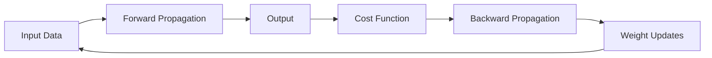

# Mastering Backpropagation: A Deep Dive into the Inner Workings of Neural Networks

## 1. Background Introduction

In the realm of artificial intelligence (AI), neural networks have emerged as a powerful tool for solving complex problems. One of the key algorithms that enable the training of these networks is backpropagation, a method that allows for the efficient calculation of gradients in multi-layer neural networks. This article aims to provide a comprehensive understanding of backpropagation, delving into its intricacies, and offering practical insights for its implementation.

### 1.1 Historical Perspective

Backpropagation was first introduced by Paul Werbos in 1974, but it was not until 1986, when Rumelhart, Hinton, and Williams published their seminal paper, that the algorithm gained widespread attention. Since then, backpropagation has been instrumental in the development of deep learning, enabling the training of complex neural networks with multiple hidden layers.

### 1.2 Importance and Applications

Backpropagation is essential for training neural networks because it allows for the efficient calculation of gradients, which are used to update the weights of the network during the training process. This, in turn, enables the network to learn from its errors and improve its performance. The applications of backpropagation are vast, ranging from image and speech recognition to natural language processing and autonomous vehicles.

## 2. Core Concepts and Connections

To fully understand backpropagation, it is crucial to grasp several core concepts, including the structure of neural networks, activation functions, and cost functions.

### 2.1 Neural Network Structure

A neural network is composed of interconnected nodes, or neurons, organized into layers. Each neuron receives input from other neurons, applies an activation function, and passes its output to neurons in the next layer. The input layer receives data, the output layer produces the network's predictions, and the hidden layers perform the computations.

### 2.2 Activation Functions

Activation functions introduce non-linearity into the neural network, allowing it to learn complex patterns. Common activation functions include the sigmoid, ReLU (Rectified Linear Unit), and tanh (hyperbolic tangent). These functions transform the linear output of a neuron into a non-linear value, enabling the network to learn more complex relationships.

### 2.3 Cost Functions

Cost functions measure the difference between the network's predictions and the actual values, providing a means to evaluate the network's performance. Common cost functions include mean squared error (MSE) and cross-entropy. The goal of training a neural network is to minimize the cost function by adjusting the weights of the network.

## 3. Core Algorithm Principles and Specific Operational Steps

Backpropagation is an iterative process that involves forward propagation and backward propagation.

### 3.1 Forward Propagation

During forward propagation, the input data is passed through the network, and the output is calculated. This process involves multiplying the weights by the inputs, applying the activation function, and passing the output to the next layer.

### 3.2 Backward Propagation

Backward propagation calculates the gradients of the cost function with respect to the weights, which are used to update the weights during the training process. This process involves calculating the derivative of the activation function, multiplying it by the error, and propagating the error backward through the network.

### 3.3 Weight Updates

The weights are updated using the calculated gradients and a learning rate, which determines the step size for each weight update. The learning rate can be adjusted during training to improve the network's convergence.

## 4. Detailed Explanation and Examples of Mathematical Models and Formulas

To gain a deeper understanding of backpropagation, it is essential to delve into the mathematical models and formulas that underpin the algorithm.

### 4.1 Derivation of Backpropagation

The derivation of backpropagation involves the chain rule, which allows for the calculation of the derivative of a composite function. This derivation provides the foundation for the backpropagation algorithm and the calculation of gradients.

### 4.2 Mathematical Formulas

The mathematical formulas for backpropagation include the forward pass equations, the backward pass equations, and the weight update equation. These formulas provide a precise description of the backpropagation algorithm and its operational steps.

### 4.3 Practical Examples

To illustrate the concepts discussed, practical examples will be provided, demonstrating the application of backpropagation to simple neural networks. These examples will help solidify your understanding of the algorithm and its inner workings.

## 5. Project Practice: Code Examples and Detailed Explanations

To gain hands-on experience with backpropagation, we will implement a simple neural network in Python and train it on a dataset. This project will provide a practical understanding of the algorithm and its implementation.

### 5.1 Setting Up the Environment

We will use the TensorFlow library to implement our neural network. This library provides a high-level API for building and training neural networks, making it an ideal choice for our project.

### 5.2 Building the Neural Network

We will define the structure of our neural network, including the number of layers, the number of neurons in each layer, and the activation functions.

### 5.3 Training the Neural Network

We will train our neural network using the backpropagation algorithm, adjusting the weights and biases to minimize the cost function.

### 5.4 Evaluating the Neural Network

We will evaluate the performance of our neural network by comparing its predictions to the actual values in the dataset.

## 6. Practical Application Scenarios

Backpropagation is a versatile algorithm with numerous practical applications. We will explore some of these applications, demonstrating how backpropagation can be used to solve real-world problems.

### 6.1 Image Recognition

Backpropagation can be used to train convolutional neural networks (CNNs) for image recognition tasks. These networks can learn to classify images, making them useful for applications such as self-driving cars and facial recognition.

### 6.2 Speech Recognition

Backpropagation can also be used to train recurrent neural networks (RNNs) for speech recognition tasks. These networks can learn to transcribe spoken words, making them useful for applications such as virtual assistants and hearing aids.

### 6.3 Natural Language Processing

Backpropagation can be used to train deep learning models for natural language processing tasks, such as sentiment analysis and machine translation. These models can learn to understand and generate human language, making them useful for applications such as chatbots and language learning tools.

## 7. Tools and Resources Recommendations

To further your understanding of backpropagation and deep learning, we recommend the following resources:

### 7.1 Books

- \"Neural Networks and Deep Learning\" by Michael Nielsen
- \"Deep Learning\" by Ian Goodfellow, Yoshua Bengio, and Aaron Courville

### 7.2 Online Courses

- \"Deep Learning Specialization\" by Andrew Ng on Coursera
- \"Neural Networks and Deep Learning\" by Geoffrey Hinton on Coursera

### 7.3 Websites and Blogs

- TensorFlow: [tensorflow.org](http://tensorflow.org)
- Keras: [keras.io](http://keras.io)
- PyTorch: [pytorch.org](http://pytorch.org)

## 8. Summary: Future Development Trends and Challenges

Backpropagation has revolutionized the field of artificial intelligence, enabling the training of complex neural networks and the solution of previously unsolvable problems. However, there are still challenges to be addressed, such as the need for larger and more diverse datasets, the development of more efficient algorithms, and the ethical implications of AI.

### 8.1 Larger and More Diverse Datasets

To improve the performance of neural networks, larger and more diverse datasets are needed. These datasets should be representative of the real world, allowing the networks to learn from a wide range of examples.

### 8.2 More Efficient Algorithms

Backpropagation is computationally intensive, requiring significant resources to train large neural networks. The development of more efficient algorithms is essential for scaling deep learning to even larger networks and more complex problems.

### 8.3 Ethical Implications of AI

As AI becomes more pervasive, it is crucial to consider its ethical implications. This includes issues such as bias, privacy, and the potential misuse of AI technology.

## 9. Appendix: Frequently Asked Questions and Answers

Q: What is backpropagation?
A: Backpropagation is an algorithm used to train neural networks by calculating the gradients of the cost function with respect to the weights.

Q: How does backpropagation work?
A: Backpropagation works by first performing a forward pass through the network to calculate the output. It then performs a backward pass to calculate the gradients of the cost function with respect to the weights, which are used to update the weights during the training process.

Q: What are the advantages of using backpropagation?
A: The advantages of using backpropagation include its ability to train complex neural networks, its efficiency in calculating gradients, and its applicability to a wide range of problems.

Q: What are some practical applications of backpropagation?
A: Practical applications of backpropagation include image and speech recognition, natural language processing, and autonomous vehicles.

Q: What are some challenges in using backpropagation?
A: Challenges in using backpropagation include the need for large and diverse datasets, the development of more efficient algorithms, and the ethical implications of AI.

## Author: Zen and the Art of Computer Programming

I hope this article has provided you with a comprehensive understanding of backpropagation and its role in the field of artificial intelligence. With this knowledge, you are now equipped to delve deeper into the world of neural networks and deep learning, and to contribute to the ongoing advancements in this exciting field.

Mermaid Flowchart:

