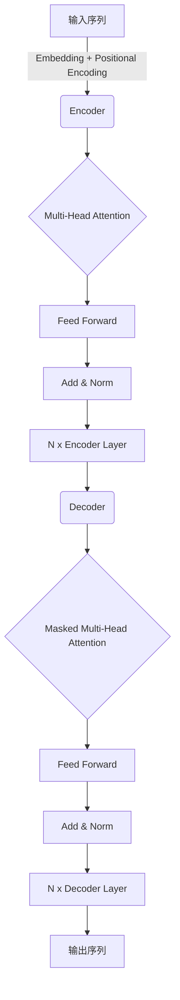
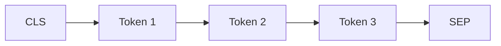

# Python深度学习实践：解析BERT如何改善文本理解

## 1.背景介绍

### 1.1 文本理解的重要性

在自然语言处理(NLP)领域中,文本理解是一个核心且具有挑战性的任务。它旨在让机器能够像人一样理解文本的语义含义和上下文信息。随着信息时代的到来,海量的非结构化文本数据不断涌现,有效地理解和处理这些文本数据对于许多应用程序至关重要,例如智能问答系统、信息检索、机器翻译等。

### 1.2 文本理解的挑战

然而,文本理解面临着诸多挑战:

- **语义歧义**: 同一个词或短语在不同上下文中可能有不同的含义。
- **长距离依赖**: 理解一个词或短语的意义需要结合整个句子甚至段落的上下文信息。
- **常识推理**: 理解文本内容往往需要依赖于人类的常识知识和推理能力。

传统的基于规则或统计模型的方法很难很好地解决这些挑战。

### 1.3 BERT的出现

2018年,谷歌的研究人员提出了BERT(Bidirectional Encoder Representations from Transformers)模型,这是一种基于Transformer的双向编码器表示,能够在预训练阶段有效地学习文本的上下文信息。BERT的出现标志着NLP领域迎来了一个新的里程碑,它展示了令人惊叹的文本理解能力,在多项自然语言处理任务上取得了最先进的性能。

## 2.核心概念与联系

### 2.1 Transformer架构

BERT是建立在Transformer架构之上的,Transformer是一种全新的基于注意力机制的序列到序列(Seq2Seq)模型。与传统的基于RNN或CNN的模型不同,Transformer完全依赖于注意力机制来捕获输入和输出之间的全局依赖关系,避免了长期依赖问题并提高了并行计算能力。



### 2.2 BERT的双向编码器

传统的语言模型通常是单向的,即只能从左到右或从右到左捕获上下文信息。而BERT则采用了双向编码器,可以同时获取左右上下文的信息,这大大增强了模型对文本语义的理解能力。



在BERT中,输入序列由三部分组成:

1. `[CLS]` 标记 - 用于分类任务,最终的分类结果是基于这个标记的表示。
2. Token序列 - 实际的输入文本序列。
3. `[SEP]` 标记 - 用于区分不同的句子。

### 2.3 预训练与微调

BERT采用了两阶段的训练策略:预训练(Pre-training)和微调(Fine-tuning)。

1. **预训练**: BERT在大规模无标注语料库上进行预训练,学习通用的语言表示。预训练包括两个任务:
    - **掩码语言模型(Masked Language Model, MLM)**: 随机掩码输入序列中的一些tokens,模型需要根据上下文预测被掩码的tokens。
    - **下一句预测(Next Sentence Prediction, NSP)**: 判断两个句子是否相邻,以捕获句子之间的关系。

2. **微调**: 在特定的下游任务上进行微调,对预训练的BERT模型进行进一步的专门化训练。由于BERT已经学习了通用的语言表示,微调阶段可以快速收敛并取得良好的性能。

通过预训练和微调的策略,BERT能够在大规模无标注数据上学习通用的语言表示,并在特定任务上进行快速微调,从而取得优异的性能。

## 3.核心算法原理具体操作步骤

### 3.1 输入表示

BERT的输入表示由三部分组成:Token Embeddings、Segment Embeddings和Position Embeddings。

1. **Token Embeddings**: 将输入文本中的每个token映射为一个高维向量表示。

2. **Segment Embeddings**: 用于区分输入序列中不同的句子,例如在问答任务中,将问题和上下文分别编码为不同的段。

3. **Position Embeddings**: 捕获token在序列中的位置信息,因为Transformer没有递归或卷积结构,需要显式地引入位置信息。

输入表示是将上述三个Embedding相加得到:

$$\text{Input Representation} = \text{Token Embeddings} + \text{Segment Embeddings} + \text{Position Embeddings}$$

### 3.2 Transformer Encoder

BERT使用了Transformer的Encoder部分,它由多个相同的层组成,每一层包含两个子层:Multi-Head Attention和Position-wise Feed-Forward Network。

1. **Multi-Head Attention**

   Multi-Head Attention是Transformer的核心,它允许模型同时关注输入序列中的不同位置,捕获长距离依赖关系。具体来说,它将查询(Query)、键(Key)和值(Value)映射到不同的子空间,并计算它们之间的点积,得到注意力分数。然后将注意力分数与值(Value)相乘,得到注意力输出。

   $$\begin{aligned}
   \text{MultiHead}(Q, K, V) &= \text{Concat}(\text{head}_1, \ldots, \text{head}_h)W^O\\
   \text{where\ head}_i &= \text{Attention}(QW_i^Q, KW_i^K, VW_i^V)
   \end{aligned}$$

   其中 $W_i^Q$、$W_i^K$、$W_i^V$ 和 $W^O$ 是可学习的线性投影参数。

2. **Position-wise Feed-Forward Network**

   这是一个简单的前馈神经网络,对每个位置的表示进行相同的操作,包含两个线性变换和一个ReLU激活函数:

   $$\text{FFN}(x) = \max(0, xW_1 + b_1)W_2 + b_2$$

为了加强模型的表现能力,BERT使用了一些技巧,如残差连接(Residual Connection)和层归一化(Layer Normalization)。

### 3.3 预训练任务

BERT的预训练包括两个任务:掩码语言模型(MLM)和下一句预测(NSP)。

1. **掩码语言模型(MLM)**

   MLM的目标是根据上下文预测被掩码的tokens。具体操作是,在输入序列中随机选择15%的tokens,将它们用特殊的`[MASK]`标记替换,然后让模型预测这些被掩码的tokens的正确值。这样可以让BERT在预训练阶段学习双向的语境表示。

2. **下一句预测(NSP)** 

   NSP的目标是判断两个句子是否相邻。在训练数据中,50%的时候输入两个相邻的句子,另外50%的时候第二个句子是随机选择的。BERT需要学习预测这两个句子是否属于同一个上下文。

通过这两个预训练任务,BERT可以在大规模无标注语料库上学习通用的语言表示,为下游的各种NLP任务奠定基础。

## 4.数学模型和公式详细讲解举例说明  

### 4.1 Self-Attention

Self-Attention是Transformer中的关键机制,它允许模型捕获输入序列中任意两个位置之间的依赖关系。给定一个查询(Query) $q$、一组键(Keys) $K=\{k_1, k_2, \ldots, k_n\}$ 和一组值(Values) $V=\{v_1, v_2, \ldots, v_n\}$,Self-Attention的计算过程如下:

1. 计算查询与每个键之间的相似度分数:

   $$\text{score}(q, k_i) = \frac{q \cdot k_i}{\sqrt{d_k}}$$

   其中 $d_k$ 是键的维度,用于缩放点积。

2. 对相似度分数应用Softmax函数,得到注意力权重:

   $$\alpha_i = \text{softmax}(\text{score}(q, k_i)) = \frac{\exp(\text{score}(q, k_i))}{\sum_{j=1}^n \exp(\text{score}(q, k_j))}$$

3. 将注意力权重与对应的值相乘,得到加权和作为Self-Attention的输出:

   $$\text{Attention}(q, K, V) = \sum_{i=1}^n \alpha_i v_i$$

Self-Attention可以被视为一种加权平均,其中权重由查询和键之间的相似度决定。这种机制允许模型动态地关注输入序列中的不同部分,捕获长距离依赖关系。

### 4.2 Multi-Head Attention

Multi-Head Attention是将多个Self-Attention的结果进行拼接,以提高模型的表现能力。具体来说,将查询(Query)、键(Key)和值(Value)分别投影到 $h$ 个子空间,对每个子空间计算Self-Attention,然后将所有子空间的结果拼接起来:

$$\begin{aligned}
\text{MultiHead}(Q, K, V) &= \text{Concat}(\text{head}_1, \ldots, \text{head}_h)W^O\\
\text{where\ head}_i &= \text{Attention}(QW_i^Q, KW_i^K, VW_i^V)
\end{aligned}$$

其中 $W_i^Q$、$W_i^K$、$W_i^V$ 和 $W^O$ 是可学习的线性投影参数。Multi-Head Attention允许模型从不同的子空间捕获不同的信息,提高了模型的表现能力。

### 4.3 位置编码(Positional Encoding)

由于Transformer没有递归或卷积结构,需要显式地引入位置信息。BERT采用了正弦和余弦函数对位置进行编码:

$$\begin{aligned}
\text{PE}_{(pos, 2i)} &= \sin\left(\frac{pos}{10000^{2i/d_\text{model}}}\right)\\
\text{PE}_{(pos, 2i+1)} &= \cos\left(\frac{pos}{10000^{2i/d_\text{model}}}\right)
\end{aligned}$$

其中 $pos$ 是token的位置, $i$ 是维度的索引, $d_\text{model}$ 是模型的维度。这种编码方式可以让模型学习到相对位置信息,对于不同的位置,其位置编码是不同的。

## 5.项目实践:代码实例和详细解释说明

在这一部分,我们将通过一个实际的代码示例,演示如何使用Python中的Transformers库对BERT进行微调,以解决文本分类任务。我们将使用一个常见的文本分类数据集:IMDB电影评论数据集。

### 5.1 导入所需的库

```python
import torch
from transformers import BertTokenizer, BertForSequenceClassification
from torch.utils.data import TensorDataset, DataLoader
```

- `torch`: PyTorch深度学习库
- `BertTokenizer`: BERT的分词器,用于将文本转换为BERT可以处理的输入表示
- `BertForSequenceClassification`: BERT的序列分类模型
- `TensorDataset`和`DataLoader`: PyTorch中用于构建数据集和数据加载器的工具

### 5.2 准备数据集

```python
# 加载IMDB数据集
from torchtext.datasets import IMDB

# 设置数据集的路径
data_path = '.data/imdb'

# 构建训练集和测试集
train_data, test_data = IMDB(root=data_path, split=('train', 'test'))

# 将文本和标签转换为张量
train_tensors = [torch.tensor(train_data[i].text, dtype=torch.long) for i in range(len(train_data))]
train_labels = torch.tensor([train_data[i].label for i in range(len(train_data))])

test_tensors = [torch.tensor(test_data[i].text, dtype=torch.long) for i in range(len(test_data))]
test_labels = torch.tensor([test_data[i].label for i in range(len(test_data))])
```

在这个示例中,我们使用了`torchtext`库中的IMDB数据集。数据集包含了25,000条电影评论及其对应的正面或负面情感标签。我们将文本和标签分别转换为张量,以便后续的处理。

### 5.3 准备BERT模型

```python
# 加载BERT分词器和模型
tokenizer = Bert