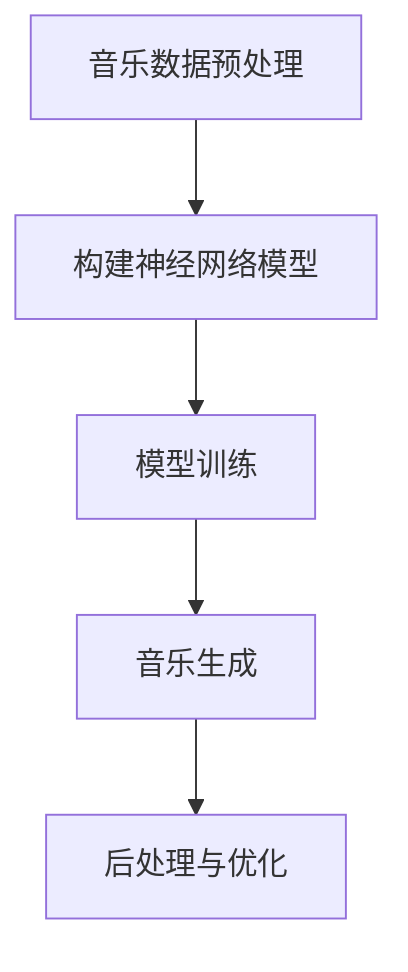

# Python深度学习实践：音乐生成的深度学习魔法

## 1.背景介绍

随着人工智能和深度学习技术的不断发展,音乐创作领域也受到了深远影响。传统的音乐创作过程需要作曲家具备深厚的音乐理论功底和创作天赋,而现在借助深度学习技术,我们可以训练神经网络模型自动生成新的音乐作品。这不仅为音乐创作提供了新的途径,也为缺乏专业音乐背景的人群打开了音乐创作的大门。

## 2.核心概念与联系

### 2.1 深度学习

深度学习是机器学习的一个新兴热点领域,它通过对数据的特征自动学习来执行预测任务。与传统的机器学习算法不同,深度学习可以自动从原始数据中提取特征,无需人工设计特征提取器。常见的深度学习模型包括卷积神经网络(CNN)、循环神经网络(RNN)、长短期记忆网络(LSTM)等。

### 2.2 音乐生成

音乐生成是指利用计算机算法自动创作新的音乐作品。早期的音乐生成主要依赖于规则系统和随机过程,而现代音乐生成则广泛采用了深度学习技术。深度学习模型可以从大量现有音乐数据中学习音乐的模式和规律,并基于所学习的知识生成新的音乐序列。

### 2.3 核心联系

深度学习与音乐生成的结合,为音乐创作带来了革命性的变化。通过训练深度神经网络模型,我们可以捕捉音乐数据中的复杂模式,并利用这些模式生成全新的音乐作品。这种方法不仅可以帮助专业音乐家提高创作效率,也为普通人提供了一种全新的音乐创作体验。

## 3.核心算法原理具体操作步骤

音乐生成的深度学习算法通常包括以下几个关键步骤:



### 3.1 音乐数据预处理

首先需要将音乐作品转换为机器可读的数字表示形式。常见的表示方式包括:

1. **音符表示**: 将每个音符编码为一个独特的数值,例如 `60` 表示中音 `C`。
2. **钢琴卷帘表示**: 将每个时间步长的音符状态编码为一个二进制向量,其中 `1` 表示按下键,`0` 表示松开键。

此外,还需要对音乐数据进行标准化、分割等预处理操作,以满足神经网络模型的输入要求。

### 3.2 构建神经网络模型

根据音乐数据的特征和任务要求,选择合适的神经网络模型架构。常用的模型包括:

1. **循环神经网络(RNN)**: 适用于处理序列数据,可以捕捉音乐的时间依赖性。
2. **长短期记忆网络(LSTM)**: 改进版的RNN,能够更好地捕捉长期依赖关系。
3. **变分自编码器(VAE)**: 通过学习数据的潜在分布来生成新的音乐序列。
4. **生成对抗网络(GAN)**: 使用生成器和判别器相互对抗的方式生成逼真的音乐数据。

### 3.3 模型训练

使用预处理后的音乐数据训练神经网络模型,通常采用监督学习或无监督学习的方式。训练过程中,模型会不断调整内部参数,逐步捕捉音乐数据中的模式和规律。

### 3.4 音乐生成

训练完成后,模型可以根据给定的种子序列或随机噪声,生成新的音乐序列。常见的生成策略包括:

1. **贪婪搜索**: 在每个时间步长,选择概率最大的下一个音符。
2. **束搜索(Beam Search)**: 在每个时间步长,保留概率最大的 `k` 个候选序列,并在下一步进行扩展。
3. **随机采样**: 根据模型输出的概率分布随机采样下一个音符。

### 3.5 后处理与优化

生成的音乐序列可能存在一些不自然或违反音乐理论的地方,因此需要进行后处理和优化,以提高音乐质量。常见的优化方法包括:

1. **音乐理论约束**: 根据音乐理论规则(如和声、旋律等)对生成序列进行调整。
2. **人工干预**: 由人工进行审听和修改,以提高音乐的艺术性和表现力。
3. **强化学习**: 将音乐生成视为一个序列决策问题,使用强化学习算法优化生成策略。

## 4.数学模型和公式详细讲解举例说明

### 4.1 循环神经网络(RNN)

循环神经网络是处理序列数据的有效模型,它可以捕捉音乐序列中的时间依赖性。RNN的核心思想是在每个时间步长,将当前输入与上一时间步的隐藏状态结合,计算出新的隐藏状态,并输出当前时间步的预测值。

RNN的数学表示如下:

$$
h_t = f(W_{hx}x_t + W_{hh}h_{t-1} + b_h)
$$
$$
y_t = g(W_{yh}h_t + b_y)
$$

其中:

- $x_t$ 是时间步 $t$ 的输入
- $h_t$ 是时间步 $t$ 的隐藏状态
- $y_t$ 是时间步 $t$ 的输出
- $W_{hx}$、$W_{hh}$、$W_{yh}$ 是权重矩阵
- $b_h$、$b_y$ 是偏置向量
- $f$ 和 $g$ 是非线性激活函数,通常使用 tanh 或 ReLU

在音乐生成任务中,RNN可以将音乐序列作为输入,并预测下一个音符或和弦。然而,由于梯度消失/爆炸问题,RNN难以捕捉长期依赖关系,因此通常使用改进版的LSTM或GRU模型。

### 4.2 长短期记忆网络(LSTM)

LSTM是RNN的一种改进版本,它通过引入门控机制和记忆单元,可以更好地捕捉长期依赖关系。LSTM的数学表示如下:

$$
\begin{aligned}
f_t &= \sigma(W_f[h_{t-1}, x_t] + b_f) & & \text{(遗忘门)} \\
i_t &= \sigma(W_i[h_{t-1}, x_t] + b_i) & & \text{(输入门)} \\
\tilde{C}_t &= \tanh(W_C[h_{t-1}, x_t] + b_C) & & \text{(候选记忆单元)} \\
C_t &= f_t \odot C_{t-1} + i_t \odot \tilde{C}_t & & \text{(记忆单元)} \\
o_t &= \sigma(W_o[h_{t-1}, x_t] + b_o) & & \text{(输出门)} \\
h_t &= o_t \odot \tanh(C_t) & & \text{(隐藏状态)}
\end{aligned}
$$

其中:

- $f_t$、$i_t$、$o_t$ 分别是遗忘门、输入门和输出门
- $C_t$ 是记忆单元,用于存储长期信息
- $\tilde{C}_t$ 是候选记忆单元,用于更新记忆单元
- $\sigma$ 是 sigmoid 激活函数
- $\odot$ 表示元素wise乘积

LSTM通过门控机制和记忆单元,可以有选择地保留或遗忘信息,从而更好地捕捉长期依赖关系。在音乐生成任务中,LSTM可以学习音乐序列中的长期模式和结构,生成更加连贯和富有表现力的音乐作品。

### 4.3 生成对抗网络(GAN)

生成对抗网络(GAN)是一种无监督学习模型,它由生成器和判别器两个神经网络组成,通过对抗训练的方式生成逼真的数据样本。在音乐生成任务中,GAN可以学习音乐数据的分布,并生成新的音乐序列。

GAN的目标函数可以表示为:

$$
\min_G \max_D V(D, G) = \mathbb{E}_{x \sim p_{\text{data}}(x)}[\log D(x)] + \mathbb{E}_{z \sim p_z(z)}[\log(1 - D(G(z)))]
$$

其中:

- $G$ 是生成器网络,将随机噪声 $z$ 映射到数据空间,生成假样本 $G(z)$
- $D$ 是判别器网络,接收真实数据 $x$ 或生成数据 $G(z)$,并输出一个标量,表示数据是真实的概率
- $p_{\text{data}}(x)$ 是真实数据分布
- $p_z(z)$ 是随机噪声分布,通常为高斯分布或均匀分布

生成器 $G$ 的目标是生成足以欺骗判别器的假样本,而判别器 $D$ 的目标是正确区分真实数据和生成数据。通过这种对抗训练过程,生成器逐渐学习到真实数据的分布,从而能够生成更加逼真的音乐序列。

GAN在音乐生成领域的应用还处于初期阶段,但它展现出了巨大的潜力,可以生成具有丰富细节和多样性的音乐作品。

## 5.项目实践:代码实例和详细解释说明

在本节中,我们将通过一个实际的项目示例,演示如何使用Python和深度学习框架(如TensorFlow或PyTorch)实现音乐生成。我们将使用一个简单的LSTM模型,并在一个小型的钢琴音乐数据集上进行训练和生成。

### 5.1 数据准备

首先,我们需要准备音乐数据集。在这个示例中,我们将使用一个包含简单钢琴曲的MIDI文件集合。我们需要将MIDI文件解析为数字序列,每个时间步长表示一个钢琴卷帘状态(即哪些键被按下)。

```python
import pretty_midi

# 解析MIDI文件
midi_data = pretty_midi.PrettyMIDI('path/to/midi/file.mid')

# 提取钢琴卷帘表示
piano_roll = midi_data.instruments[0].get_piano_roll(fs=100)  # 采样率为100Hz

# 将钢琴卷帘转换为数字序列
sequence = piano_roll.astype(int).tolist()
```

我们还需要对数据进行分割,将其划分为训练集和测试集。

### 5.2 构建LSTM模型

接下来,我们将构建一个简单的LSTM模型,用于音乐序列的生成。

```python
import torch
import torch.nn as nn

class MusicGenerator(nn.Module):
    def __init__(self, input_size, hidden_size, output_size, num_layers):
        super(MusicGenerator, self).__init__()
        self.hidden_size = hidden_size
        self.num_layers = num_layers
        self.lstm = nn.LSTM(input_size, hidden_size, num_layers, batch_first=True)
        self.fc = nn.Linear(hidden_size, output_size)

    def forward(self, x, hidden, cell):
        out, (hidden, cell) = self.lstm(x, (hidden, cell))
        out = self.fc(out[:, -1, :])
        return out, hidden, cell

    def init_hidden(self, batch_size):
        hidden = torch.zeros(self.num_layers, batch_size, self.hidden_size)
        cell = torch.zeros(self.num_layers, batch_size, self.hidden_size)
        return hidden, cell
```

在这个模型中,我们使用了一个多层LSTM,后接一个全连接层。`forward`函数接收输入序列和上一时间步的隐藏状态和细胞状态,并输出当前时间步的预测结果以及更新后的隐藏状态和细胞状态。

### 5.3 模型训练

接下来,我们将训练LSTM模型,使其学习音乐序列的模式和规律。

```python
import torch.optim as optim
from torch.utils.data import DataLoader, TensorDataset

# 准备数据
X_train = torch.tensor(train_sequences)
y_train = torch.tensor(train_labels)
train_dataset = TensorDataset(X_train, y_train)
train_loader = DataLoader(train_dataset, batch_size=64, shuffle=True)

# 初始化模型
model = MusicGenerator(input_