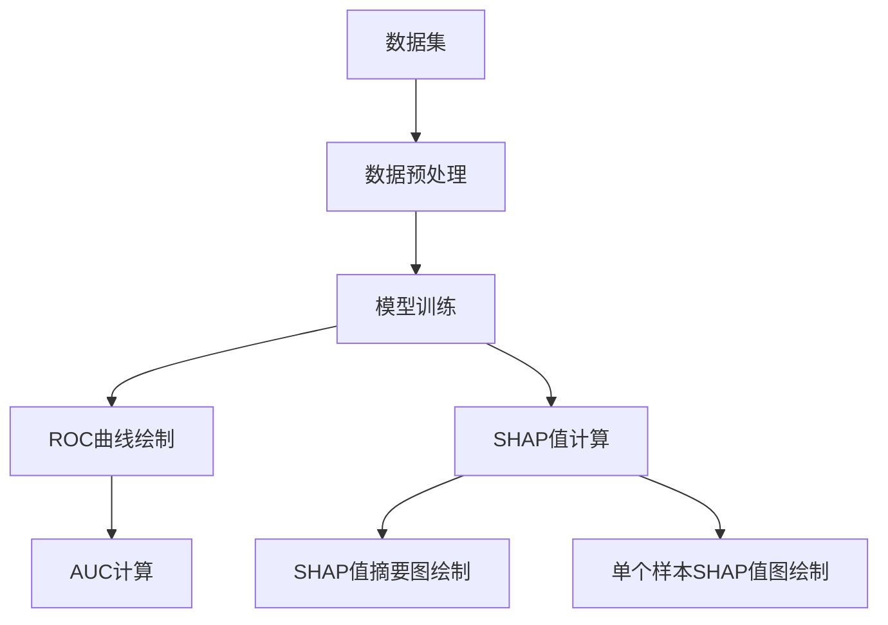

# ROC曲线与可解释性：理解模型决策

## 1.背景介绍

在机器学习和数据挖掘领域,模型的评估和解释性是两个至关重要的方面。ROC(Receiver Operating Characteristic)曲线作为一种评估二分类模型性能的可视化工具,广泛应用于多个领域。与此同时,可解释性(Explainability)也越来越受到重视,因为它有助于我们理解模型的内在决策逻辑,提高模型的透明度和可信度。本文将探讨ROC曲线与可解释性之间的联系,以及如何利用它们来更好地理解和优化机器学习模型。

## 2.核心概念与联系

### 2.1 ROC曲线

ROC曲线是一种常用的二分类模型评估工具,它通过绘制真阳性率(TPR)和假阳性率(FPR)的关系来描述模型的性能。TPR(True Positive Rate)也称为敏感性(Sensitivity),表示模型正确预测为正例的比例。FPR(False Positive Rate)则表示模型错误地将负例预测为正例的比例。

ROC曲线的横坐标为FPR,纵坐标为TPR。理想情况下,ROC曲线应该尽可能接近左上角,这意味着模型具有高的TPR和低的FPR。曲线下面积(AUC,Area Under the Curve)是衡量模型性能的一个重要指标,AUC越接近1,说明模型的性能越好。

### 2.2 可解释性

可解释性(Explainability)是指模型能够以人类可理解的方式解释其预测结果的能力。高度可解释的模型不仅能提供准确的预测,还能揭示预测背后的原因和决策过程。可解释性对于确保模型的透明度、公平性和可靠性至关重要,尤其在涉及高风险决策的领域(如医疗、金融等)。

### 2.3 ROC曲线与可解释性的联系

ROC曲线和可解释性虽然看似独立,但它们之间存在密切的联系。ROC曲线能够帮助我们选择合适的阈值,从而实现期望的真阳性率和假阳性率的平衡。而可解释性则能够揭示模型在做出预测时所依赖的特征和模式,进一步帮助我们理解模型的决策逻辑。

通过结合ROC曲线和可解释性技术,我们不仅能够评估模型的整体性能,还能够深入了解模型的内部工作机制。这种结合有助于我们调整模型参数、优化特征选择、处理数据偏差等,从而提高模型的准确性和可靠性。

## 3.核心算法原理具体操作步骤

### 3.1 ROC曲线的绘制步骤

绘制ROC曲线的具体步骤如下:

1. 对测试数据进行预测,获得每个样本的预测概率值。
2. 设置一系列不同的阈值,将预测概率值与这些阈值进行比较,得到一系列真阳性率(TPR)和假阳性率(FPR)的值对。
3. 以FPR为横坐标,TPR为纵坐标,绘制这些值对在坐标平面上的点,并用线段连接这些点,即得到ROC曲线。
4. 计算ROC曲线下的面积(AUC),作为评估模型性能的指标之一。

以下是使用Python中的scikit-learn库绘制ROC曲线的代码示例:

```python
from sklearn.metrics import roc_curve, auc
import matplotlib.pyplot as plt

# 假设y_true为真实标签,y_score为模型预测的概率值
fpr, tpr, thresholds = roc_curve(y_true, y_score)
roc_auc = auc(fpr, tpr)

plt.figure()
plt.plot(fpr, tpr, color='darkorange', label='ROC curve (area = %0.2f)' % roc_auc)
plt.plot([0, 1], [0, 1], color='navy', linestyle='--')
plt.xlim([0.0, 1.0])
plt.ylim([0.0, 1.05])
plt.xlabel('False Positive Rate')
plt.ylabel('True Positive Rate')
plt.title('Receiver Operating Characteristic')
plt.legend(loc="lower right")
plt.show()
```

### 3.2 可解释性算法原理

可解释性算法的目标是生成对模型预测的解释,以便人类能够理解模型的决策过程。常见的可解释性算法包括:

1. **LIME(Local Interpretable Model-Agnostic Explanations)**: 通过训练一个本地可解释的模型来近似原始模型在特定实例周围的行为,从而生成解释。

2. **SHAP(SHapley Additive exPlanations)**: 基于联合游戏理论中的夏普利值,计算每个特征对模型预测的贡献,并生成解释。

3. **Anchors**: 通过找到"足够稳定"的规则(称为锚点)来近似模型行为,从而生成解释。

4. **Counterfactual Explanations**: 通过找到与原始实例最相似但具有不同预测结果的"反事实"实例,来解释模型的决策差异。

这些算法的具体实现细节较为复杂,但它们都旨在以人类可理解的方式解释模型的预测,从而提高模型的透明度和可信度。

## 4.数学模型和公式详细讲解举例说明

### 4.1 ROC曲线的数学表示

ROC曲线可以用真阳性率(TPR)和假阳性率(FPR)的函数来表示,即:

$$
\text{TPR} = f(\text{FPR})
$$

其中,TPR和FPR的定义如下:

$$
\text{TPR} = \frac{\text{TP}}{\text{TP} + \text{FN}}
$$

$$
\text{FPR} = \frac{\text{FP}}{\text{FP} + \text{TN}}
$$

TP(True Positive)表示正确预测为正例的样本数,FN(False Negative)表示错误预测为负例的正例样本数,FP(False Positive)表示错误预测为正例的负例样本数,TN(True Negative)表示正确预测为负例的样本数。

ROC曲线下面积(AUC)可以用以下公式计算:

$$
\text{AUC} = \int_0^1 f(\text{FPR}) \, d(\text{FPR})
$$

AUC的取值范围为[0, 1],值越接近1,表示模型的性能越好。

### 4.2 SHAP值的计算

SHAP(SHapley Additive exPlanations)是一种常用的可解释性算法,它基于联合游戏理论中的夏普利值(Shapley value)来计算每个特征对模型预测的贡献。

对于一个具有$K$个特征的模型$f$,给定一个实例$x$,SHAP值$\phi_k(x)$表示第$k$个特征对模型预测的贡献,定义如下:

$$
\phi_k(x) = \sum_{S \subseteq \mathcal{K} \backslash \{k\}} \frac{|S|!(|K|-|S|-1)!}{|K|!} \left[ f_{x}(S \cup \{k\}) - f_{x}(S) \right]
$$

其中,$\mathcal{K}$表示所有特征的集合,$S$表示特征子集,$f_{x}(S)$表示在给定特征子集$S$下,模型对实例$x$的预测值。

SHAP值的计算过程可以理解为:对于每个特征$k$,计算它在所有可能的特征组合下对模型预测的平均边际贡献。这种计算方式保证了SHAP值的唯一性,并且满足了一些合理的性质,如局部准确性、一致性等。

通过计算每个特征的SHAP值,我们可以了解模型预测时所依赖的特征及其重要性,从而提高模型的可解释性。

## 5.项目实践:代码实例和详细解释说明

在这一部分,我们将通过一个实际的机器学习项目来演示如何结合ROC曲线和可解释性技术来理解模型的决策过程。我们将使用Python中的scikit-learn和SHAP库来实现相关功能。

### 5.1 数据集介绍

我们将使用著名的"信用卡欺诈检测"数据集(Credit Card Fraud Detection Dataset)。该数据集包含了大约28.4万笔信用卡交易记录,其中只有492笔交易被标记为欺诈交易。由于数据隐私的原因,该数据集中的大部分特征都已经被匿名化,只保留了时间和金额两个可解释的特征。

我们的目标是构建一个二分类模型,根据交易记录中的特征来预测该交易是否为欺诈交易。

### 5.2 数据预处理

```python
import pandas as pd
from sklearn.model_selection import train_test_split

# 加载数据集
data = pd.read_csv('creditcard.csv')

# 将"Time"和"Amount"特征标准化
data['NormalizedAmount'] = (data['Amount'] - data['Amount'].mean()) / data['Amount'].std()
data['Time'] = (data['Time'] - data['Time'].min()) / (data['Time'].max() - data['Time'].min())

# 将数据集分为训练集和测试集
X = data.drop(['Class', 'Amount', 'Time'], axis=1)
y = data['Class']
X_train, X_test, y_train, y_test = train_test_split(X, y, test_size=0.2, random_state=42)
```

在这个步骤中,我们首先加载数据集,然后对"Time"和"Amount"两个特征进行标准化处理。接下来,我们将数据集分为训练集和测试集,其中测试集占20%。

### 5.3 模型训练

```python
from sklearn.ensemble import RandomForestClassifier
from sklearn.metrics import roc_curve, auc

# 训练随机森林模型
model = RandomForestClassifier(random_state=42)
model.fit(X_train, y_train)

# 在测试集上进行预测
y_pred_proba = model.predict_proba(X_test)[:, 1]

# 计算ROC曲线和AUC
fpr, tpr, thresholds = roc_curve(y_test, y_pred_proba)
roc_auc = auc(fpr, tpr)

print(f'AUC: {roc_auc:.3f}')
```

在这个步骤中,我们使用随机森林算法训练了一个二分类模型。然后,我们在测试集上进行预测,获得每个样本被预测为欺诈交易的概率值。接下来,我们使用这些概率值计算ROC曲线和AUC值。

### 5.4 可解释性分析

```python
import shap
import matplotlib.pyplot as plt

# 计算SHAP值
explainer = shap.TreeExplainer(model)
shap_values = explainer.shap_values(X_test)

# 绘制SHAP值摘要图
shap.summary_plot(shap_values, X_test, plot_type="bar")
plt.show()

# 绘制单个样本的SHAP值
sample_idx = 42
shap.force_plot(explainer.expected_value, shap_values[sample_idx], X_test.iloc[sample_idx])
plt.show()
```

在这个步骤中,我们使用SHAP库来计算每个特征对模型预测的贡献。首先,我们创建一个`TreeExplainer`对象,用于解释基于树模型(如随机森林)的模型。然后,我们计算测试集上每个样本的SHAP值。

接下来,我们绘制了SHAP值的摘要图,展示了每个特征的平均SHAP值。这个图可以帮助我们快速识别出对模型预测贡献最大的特征。

最后,我们绘制了一个单个样本的SHAP值图,展示了每个特征对该样本预测的具体贡献。这个图可以帮助我们理解模型对于特定样本的决策逻辑。

### 5.5 Mermaid流程图

以下是使用Mermaid绘制的ROC曲线和可解释性分析流程图:



该流程图展示了从数据集到ROC曲线和可解释性分析的整个过程。首先,我们对原始数据集进行预处理,然后训练机器学习模型。接下来,我们使用模型在测试集上进行预测,并绘制ROC曲线和计算AUC值。同时,我们还计算了SHAP值,并绘制了SHAP值摘要图和单个样本的SHAP值图,以帮助理解模型的决策逻辑。

## 6