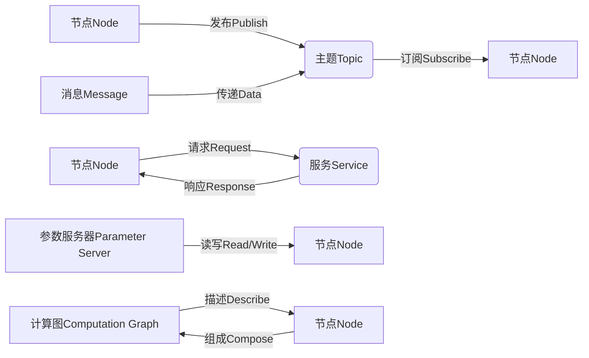

# Robot Operating System (ROS) 原理与代码实战案例讲解

## 1.背景介绍

机器人操作系统(Robot Operating System, ROS)是一个用于机器人软件开发的开源元操作系统框架。它提供了一套标准的操作系统服务,包括硬件抽象、底层设备控制、常用功能实现、消息传递以及程序管理等。ROS的核心思想是将机器人看作一个由许多可并行、模块化、松散耦合的节点(Node)组成的分布式系统,各节点通过统一的消息传递机制进行通信,从而实现各种复杂的机器人功能。

ROS具有跨语言、跨平台、分布式、工具集成、社区支持等特点,可以大幅提高机器人应用软件的开发效率。目前,ROS已经成为机器人领域事实上的标准,被广泛应用于教育、科研和商业领域。

### 发展历史

ROS最初由斯坦福大学人工智能实验室于2007年开发,旨在为个人机器人应用提供类似于通用计算机操作系统的功能。2008年,Willow Garage公司接手ROS的开发并推广,使其成为机器人软件开发的流行平台。2013年,开源机器人操作系统基金会(OSRF)成立,负责ROS的持续开发和维护。截至目前,ROS已发展至Noetic版本,支持多种机器人硬件平台和软件开发语言。

## 2.核心概念与联系 

ROS的核心概念包括节点(Node)、主题(Topic)、服务(Service)、参数服务器(Parameter Server)、消息(Message)、计算图(Computation Graph)等。下面将详细介绍这些概念及其相互关系。

### 节点(Node)

节点是ROS中最小的执行单元,可以是传感器数据处理、运动控制、决策规划等功能模块。每个节点都是独立运行的进程,通过订阅或发布消息与其他节点通信。节点之间是松散耦合的,可以灵活组合以实现复杂功能。

### 主题(Topic)

主题是ROS中的异步消息传递机制。节点可以发布消息到指定主题,其他节点可以订阅该主题以接收消息。主题使用发布/订阅模式,实现了节点间的数据交换。

### 服务(Service)

服务是ROS中的同步通信机制,允许一个节点发送请求并等待另一节点的响应。服务常用于执行特定的一次性任务,如获取传感器数据、设置参数等。

### 参数服务器(Parameter Server)

参数服务器用于存储和获取全局参数,如机器人配置、算法参数等。节点可以从参数服务器读取所需参数,也可以向其写入新参数。参数服务器提供了集中式的参数管理机制。

### 消息(Message)

消息是ROS中的数据结构,用于在节点之间传递数据。消息可以包含各种类型的字段,如标量、数组、嵌套结构体等。ROS提供了一种消息描述语言,用于定义消息的数据结构。

### 计算图(Computation Graph)

计算图描述了ROS系统中各节点之间的通信拓扑结构。它由节点、主题、服务等元素构成,反映了数据流动和处理的过程。计算图可视化工具可以帮助开发者理解和调试复杂的ROS系统。

这些核心概念相互关联,共同构建了ROS的分布式、模块化和可扩展的软件架构。开发者可以利用这些概念,灵活组合各种功能模块,快速开发出复杂的机器人应用系统。



## 3.核心算法原理具体操作步骤

ROS的核心算法原理主要包括节点管理、消息通信、服务通信、参数管理等几个方面。下面将详细介绍这些算法的具体操作步骤。

### 节点管理

1. **启动主节点(ROS Master)**: 在ROS系统中,主节点充当了中心协调者的角色,负责跟踪当前运行的节点、主题、服务等信息。启动主节点的命令为:

   ```bash
   roscore
   ```

2. **启动节点进程**: 每个节点都是一个独立的进程,可以使用不同的编程语言编写,如C++、Python等。启动节点的命令格式为:

   ```bash
   rosrun 包名 节点名
   ```

3. **节点注册**: 当节点启动时,它会自动向主节点注册自身信息,包括节点名称、发布的主题、提供的服务等。这样其他节点就可以发现并与之通信。

4. **节点关闭**: 当节点完成任务或需要终止时,它会向主节点发送注销请求,并正常退出进程。

### 消息通信

1. **定义消息类型**: 首先需要使用ROS的消息描述语言定义消息的数据结构,例如传感器数据、运动命令等。消息类型通常存储在特定的包中。

2. **创建发布者(Publisher)**: 节点可以创建一个或多个发布者,用于向指定主题发送消息。发布者需要指定主题名称和消息类型。

3. **创建订阅者(Subscriber)**: 节点也可以创建一个或多个订阅者,用于从指定主题接收消息。订阅者需要指定主题名称、消息类型和回调函数。

4. **发布消息**: 发布者可以按照一定的频率或触发条件,将消息发布到对应的主题。

5. **接收消息**: 当有新消息到达时,订阅者的回调函数会被调用,可以在其中处理接收到的消息数据。

### 服务通信

1. **定义服务类型**: 首先需要使用ROS的服务描述语言定义服务的请求和响应数据结构。服务类型通常存储在特定的包中。

2. **创建服务器(Server)**: 节点可以创建一个或多个服务服务器,用于处理其他节点发来的服务请求。服务器需要指定服务名称、服务类型和回调函数。

3. **创建客户端(Client)**: 节点也可以创建一个或多个服务客户端,用于向指定服务发送请求并等待响应。客户端需要指定服务名称和服务类型。

4. **发送请求**: 客户端可以通过调用服务的请求函数,向服务器发送请求数据。

5. **处理请求**: 当服务器收到请求时,它的回调函数会被调用,可以在其中处理请求数据并生成响应数据。

6. **接收响应**: 客户端会阻塞等待服务器的响应,收到响应后可以继续执行后续操作。

### 参数管理

1. **启动参数服务器**: 参数服务器通常由主节点自动启动,无需额外操作。

2. **获取参数**: 节点可以使用特定的API从参数服务器获取所需的参数值,例如机器人配置、算法参数等。

3. **设置参数**: 节点也可以向参数服务器写入新的参数值,以供其他节点使用。

4. **监听参数变化**: 节点可以注册回调函数,在参数发生变化时得到通知。

5. **持久化参数**: 参数服务器支持将参数持久化到文件中,以便在下次启动时自动加载。

通过上述算法原理和操作步骤,ROS实现了节点之间的灵活通信、参数共享和集中管理,从而构建了一个分布式、模块化的机器人软件系统。

## 4.数学模型和公式详细讲解举例说明

在机器人系统中,数学模型和公式扮演着重要角色,用于描述机器人的运动、传感器数据处理、决策规划等各个方面。下面将介绍一些常见的数学模型和公式,并给出详细的讲解和举例说明。

### 坐标变换

机器人系统通常需要在不同坐标系之间进行坐标变换,例如从机器人基坐标系到末端执行器坐标系、从传感器坐标系到世界坐标系等。坐标变换可以使用齐次变换矩阵表示,包括旋转和平移两部分:

$$
T = \begin{bmatrix}
R & t \\
0 & 1
\end{bmatrix}
$$

其中,$$R$$是旋转矩阵,$$t$$是平移向量。给定两个坐标系中的点$$p_1$$和$$p_2$$,它们之间的变换关系为:

$$
p_2 = Rp_1 + t
$$

例如,如果已知机器人关节角度,可以通过前向运动学计算出末端执行器在基坐标系下的位置和姿态。

### 运动学

机器人运动学描述了机器人各个关节和连杆之间的几何关系,包括前向运动学和逆运动学两个方面。

**前向运动学**用于计算已知关节角度时,末端执行器在基坐标系下的位置和姿态。常用的解析方法是利用Denavit-Hartenberg(DH)参数建立连杆坐标系,然后通过矩阵乘法计算变换矩阵。

**逆运动学**则是已知期望的末端执行器位置和姿态,求解能够达到该状态的关节角度。由于存在多解、奇异性等问题,通常采用数值优化或解析几何方法求解。

### 运动规划

运动规划是指为机器人生成平滑、无碰撞的运动轨迹,以到达期望的目标位置和姿态。常见的运动规划算法包括采样based算法(如RRT、PRM)、插值算法(如多项式插值、贝塞尔曲线)、优化based算法(如CHOMP、STOMP)等。

例如,对于采样based算法RRT,其核心思想是在配置空间中随机生成采样点,并incrementally地构建一棵树,直到树上的节点接近目标点。RRT算法的伪代码如下:

```python
def RRT(start, goal, obstacles):
    tree = Tree(start)
    while not reached(tree, goal):
        sample = random_sample()
        nearest = nearest_node(tree, sample)
        new_node = extend(nearest, sample)
        if new_node is not None and not collides(new_node, obstacles):
            tree.add_node(new_node)
    return get_path(tree, goal)
```

通过合理的运动规划算法,机器人可以生成安全、高效的运动轨迹,避免碰撞和奇异点,实现期望的运动目标。

### 滤波和状态估计

机器人系统中的传感器数据通常存在噪声和不确定性,需要使用滤波和状态估计算法进行处理,以获得更准确的状态估计值。常见的算法包括卡尔曼滤波、粒子滤波等。

**卡尔曼滤波**是一种递归的最优线性估计算法,可以有效地融合测量数据和系统模型,估计出系统的状态。其核心思想是预测和更新两个步骤交替进行,持续修正状态估计值。卡尔曼滤波的基本公式如下:

$$
\begin{aligned}
\hat{x}_{k|k-1} &= A\hat{x}_{k-1|k-1} + Bu_k \\
P_{k|k-1} &= AP_{k-1|k-1}A^T + Q \\
K_k &= P_{k|k-1}H^T(HP_{k|k-1}H^T + R)^{-1} \\
\hat{x}_{k|k} &= \hat{x}_{k|k-1} + K_k(z_k - H\hat{x}_{k|k-1}) \\
P_{k|k} &= (I - K_kH)P_{k|k-1}
\end{aligned}
$$

其中,$$\hat{x}$$是状态估计值,$$P$$是协方差矩阵,$$K$$是卡尔曼增益,$$A$$、$$B$$、$$H$$分别是系统模型、控制输入和测量模型的矩阵,$$Q$$和$$R$$是过程噪声和测量噪声的协方差矩阵。

通过滤波和状态估计算法,可以有效地融合多源异构传感器数据,获得机器人的准确位置、速度、姿态等状态信息,为后续的决策和控制提供可靠的输入。

##