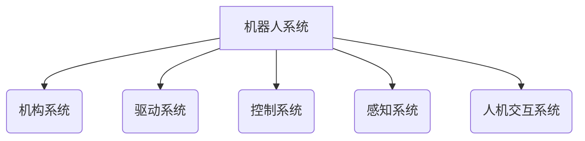

# Robotics 原理与代码实战案例讲解

## 1.背景介绍

机器人技术是一个跨学科的领域,融合了计算机科学、机械工程、电子工程、控制理论等多个学科。随着人工智能、传感器技术、机器视觉等相关技术的快速发展,机器人技术也取得了长足的进步。机器人已经广泛应用于工业制造、服务业、医疗卫生、国防军事等多个领域。

机器人技术的发展主要经历了以下几个阶段:

1. 第一代机器人(1960s-1970s):主要用于工业自动化生产线,执行重复性的操作任务,如焊接、装配等。这一时期机器人主要采用数字程序控制。

2. 第二代机器人(1980s-1990s):具有一定的感知能力,能够根据环境变化做出相应的反应。传感器技术、计算机视觉等技术得到应用。

3. 第三代机器人(2000s-今天):具备更强的智能化水平,能够自主学习、决策和规划。人工智能、机器学习等技术被广泛应用于机器人系统。

当前,机器人技术正向智能化、自主化、协作化等方向发展,未来机器人将更多地与人类协作,在更广阔的领域发挥作用。

## 2.核心概念与联系

机器人系统通常由以下几个核心部分组成:

### 2.1 机构系统

机构系统是机器人的机械部分,包括机体结构、关节、执行器等,决定了机器人的运动形式和工作空间。常见的机构形式有串联机构、并联机构等。

### 2.2 驱动系统 

驱动系统为机器人的运动提供动力,主要包括电机、液压系统、气动系统等。驱动系统的选择需要考虑功率、响应速度、精度等因素。

### 2.3 控制系统

控制系统是机器人的"大脑",负责协调各个部件的工作,实现机器人的运动控制、轨迹规划、避障等功能。控制系统通常由运动控制器、工业计算机等组成。

### 2.4 感知系统

感知系统使机器人能够获取环境信息,包括视觉传感器、力/力矩传感器、位置传感器等。感知信息是机器人进行决策和规划的重要依据。

### 2.5 人机交互系统

人机交互系统使机器人能够与人类进行自然的交互,包括语音识别、手势识别、虚拟现实等技术。

这些核心部分相互协作,构成了一个完整的机器人系统。其中,控制系统扮演着枢纽作用,对机器人的行为进行综合管理。



## 3.核心算法原理具体操作步骤

机器人控制系统中的核心算法主要包括运动规划、轨迹规划、反向运动学、机器视觉等。

### 3.1 运动规划

运动规划的目标是在满足约束条件的情况下,为机器人找到一条从起点到终点的可行路径。常用的运动规划算法包括A*算法、RRT(Rapidly-exploring Random Tree)算法等。

以A*算法为例,其基本步骤如下:

1) 构建状态空间,确定起点和终点状态
2) 定义代价函数,包括实际代价和启发代价
3) 从起点开始搜索,按代价从小到大扩展节点
4) 当找到终点或无法继续扩展时,算法终止
5) 根据父节点信息回溯得到最优路径

### 3.2 轨迹规划

轨迹规划在运动规划的基础上,进一步考虑运动过程的平滑性、连续性等约束,生成满足机器人机构约束的平滑轨迹。

常用的轨迹规划方法有多项式插值法、三次样条插值法等。以三次样条插值法为例:

1) 给定起点、终点及其速度、加速度约束
2) 将轨迹分段,对每段使用三次多项式拟合
3) 确保各段轨迹及其一阶、二阶导数在节点处连续
4) 求解多项式系数,得到平滑轨迹

### 3.3 反向运动学

反向运动学的目标是求解机器人从当前位置和姿态到达期望位置和姿态所需的每个关节角度。这是控制机器人运动的基础。

常用的解析解法包括几何法、代数法等。当解析解不存在时,可采用数值解法,如牛顿-拉普森迭代法:

1) 给定期望位置姿态 $T_d$和当前位置姿态 $T(\theta)$  
2) 定义误差为 $\epsilon = T_d^{-1}T(\theta)$
3) 计算雅可比矩阵 $J(\theta)$
4) 更新关节角 $\theta \leftarrow \theta + \alpha J^{+}(\theta)\xi$  ($\alpha$为步长, $J^{+}$为伪逆)
5) 重复3)、4)直至收敛

### 3.4 机器视觉

机器视觉算法使机器人能够从图像或视频中获取目标物体的位置、姿态等信息,为运动规划和控制提供依据。

常见的机器视觉算法包括目标检测、语义分割、三维重建等:

- 目标检测: 如YOLO, SSD等算法,用于检测图像中的目标物体及其边界框
- 语义分割: 如FCN, Mask R-CNN等算法,对图像中的每个像素进行分类
- 三维重建: 如PFM, RGBD等算法,从单目或双目图像重建三维场景

此外,机器视觉系统还需要进行相机标定、手眼标定等,将图像坐标与机器人坐标系统进行准确的转换。

## 4.数学模型和公式详细讲解举例说明  

### 4.1 运动学模型

机器人的运动学模型描述了机器人的运动特性,包括正向运动学和反向运动学两个方面。

#### 4.1.1 正向运动学

正向运动学模型用于计算机器人的末端执行器在基坐标系下的位置和姿态,其数学表达式为:

$$
T_n^0 = \begin{bmatrix}
    R_n^0 & P_n^0\\
    0 & 1
\end{bmatrix} = \prod_{i=1}^{n}T_i^{i-1}(\theta_i)
$$

其中:
- $T_n^0$为机器人末端执行器在基坐标系下的齐次变换矩阵
- $R_n^0$和$P_n^0$分别表示末端执行器的旋转和平移
- $T_i^{i-1}(\theta_i)$为第i个关节的齐次变换矩阵,由D-H参数确定
- $\theta_i$为第i个关节的关节角

通过已知的每个关节角度,可以计算出末端执行器的位姿。

#### 4.1.2 反向运动学

反向运动学模型的目标是求解机器人从当前位置和姿态到达期望位置和姿态所需的每个关节角度。

对于开链机构,反向运动学问题可以通过代数或几何方法解析求解。对于存在多个解的冗余机构,可以采用数值迭代方法,如牛顿-拉普森迭代法:

$$
\theta_{k+1} = \theta_k + \alpha J^{+}(\theta_k)\xi_k
$$

其中:
- $\theta_k$为第k次迭代时的关节角向量
- $\alpha$为步长因子
- $J(\theta_k)$为雅可比矩阵
- $J^{+}(\theta_k)$为雅可比矩阵的伪逆
- $\xi_k$为位姿误差,由期望位姿与当前位姿的差构成

通过迭代,可以使位姿误差收敛到可接受的范围。

### 4.2 轨迹规划模型

轨迹规划的目标是生成平滑、连续的运动轨迹,满足机器人的运动约束。常用的轨迹规划方法包括多项式插值法和三次样条插值法。

#### 4.2.1 多项式插值法

对于一段轨迹,可以使用n次多项式进行插值:

$$
q(t) = a_0 + a_1t + a_2t^2 + \cdots + a_nt^n, \qquad t \in [0, T]
$$

其中$a_i(i=0,1,\cdots,n)$为多项式系数,可以通过边界条件(起点、终点及其导数值)求解得到。

例如,对于5次多项式插值,需要满足6个边界条件:

$$
\begin{cases}
q(0)=q_0, \quad \dot{q}(0)=\dot{q}_0, \quad \ddot{q}(0)=\ddot{q}_0\\
q(T)=q_T, \quad \dot{q}(T)=\dot{q}_T, \quad \ddot{q}(T)=\ddot{q}_T
\end{cases}
$$

求解多项式系数$a_i$后,即可获得平滑的轨迹曲线。

#### 4.2.2 三次样条插值法

三次样条插值法将整个轨迹分成多段,每段使用三次多项式插值,保证各段及其一阶、二阶导数在节点处连续。

对于第i段轨迹$q_i(t)$,其三次多项式形式为:

$$
q_i(t) = a_i + b_i(t-t_i) + c_i(t-t_i)^2 + d_i(t-t_i)^3, \qquad t \in [t_i, t_{i+1}]
$$

其中$a_i,b_i,c_i,d_i$为待求的多项式系数,可以通过节点处的位置、速度、加速度连续性条件求解得到。

通过插值,可以获得整个轨迹的平滑表达式。

## 5.项目实践:代码实例和详细解释说明

下面以一个六自由度机械臂的Python模拟项目为例,介绍机器人运动规划、轨迹规划、反向运动学等算法的具体实现。

### 5.1 机器人模型

首先定义机器人的D-H参数模型:

```python
import numpy as np

# DH参数表(alpha, a, d, theta)
DH_table = np.array([
    [np.pi/2, 0, 0.75, 0],
    [0, 0.35, 0, 0], 
    [0, 1.25, 0, 0],
    [-np.pi/2, -0.054, 1.5, 0],
    [np.pi/2, 0, 0, 0],
    [0, 0, 0.303, 0]
])

# 连杆长度
link_lengths = [0.75, 0.35, 1.25, 1.5, 0, 0.303]
```

基于D-H参数,实现正向运动学求解:

```python
import numpy as np

def forward_kinematics(theta):
    """
    正向运动学求解
    输入: 关节角度向量theta
    输出: 末端执行器的齐次变换矩阵T
    """
    T = np.eye(4)
    for i in range(len(theta)):
        Ti = get_transform_matrix(DH_table[i], theta[i])
        T = T @ Ti
    return T

def get_transform_matrix(dh_params, theta):
    """
    根据D-H参数计算单个关节的齐次变换矩阵
    """
    alpha, a, d, theta = dh_params
    Rz = np.array([[np.cos(theta), -np.sin(theta), 0, 0],
                   [np.sin(theta), np.cos(theta), 0, 0],
                   [0, 0, 1, 0],
                   [0, 0, 0, 1]])
    Tz = np.array([[1, 0, 0, 0],
                   [0, 1, 0, 0],
                   [0, 0, 1, d],
                   [0, 0, 0, 1]])
    Tx = np.array([[1, 0, 0, a],
                   [0, 1, 0, 0],
                   [0, 0, 1, 0],
                   [0, 0, 0, 1]])
    Rx = np.array([[1, 0, 0, 0],
                   [0, np.cos(alpha), -np.sin(alpha), 0],
                   [0, np.sin(alpha), np.cos(alpha), 0],
                   [0, 0, 0, 1]])
    
    T = Rz @ Tz @ Tx @ Rx
    return