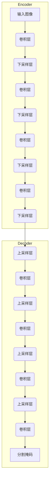

# SegNet：解码图像语义的强大引擎

## 1.背景介绍

在计算机视觉和图像处理领域,语义分割是一项极具挑战性的任务。它旨在将图像中的每个像素分配给一个预定义的类别,从而实现对图像内容的全面理解和解析。语义分割广泛应用于无人驾驶、医学成像、机器人导航等领域,对于提高人工智能系统的感知能力至关重要。

传统的图像分割方法,如基于阈值、边缘检测和区域生长等,往往只能获得粗糙的分割结果,难以精确捕捉图像中复杂的语义信息。随着深度学习技术的兴起,基于卷积神经网络(CNN)的语义分割模型展现出了令人振奋的性能,能够从大量标注数据中自动学习丰富的特征表示,从而实现高精度的像素级分类。

在这些先驗模型中,SegNet无疑是一个具有里程碑意义的创新。它采用了一种全新的编码器-解码器架构,不仅在准确性和效率方面表现出色,而且具有极高的内存效率,可以在资源受限的嵌入式系统上实时运行。本文将全面解析SegNet的核心原理、算法流程、数学模型,并探讨其在实际应用中的实践经验和未来发展趋势。

## 2.核心概念与联系

### 2.1 编码器-解码器架构

SegNet的核心架构遵循编码器-解码器范式,该范式广泛应用于各种计算机视觉任务,如图像分类、目标检测和语义分割等。编码器部分类似于传统的卷积神经网络,通过一系列卷积和下采样操作来提取图像的高级语义特征。而解码器部分则负责将这些特征逐层上采样和解码,最终将其映射回像素级别的分割掩码。



这种编码器-解码器结构能够有效地捕捉图像的空间和语义信息,并在不同尺度级别上进行特征融合,从而实现精确的像素级分割。

### 2.2 池化索引

SegNet的一个关键创新点在于引入了池化索引(Pooling Indices)的概念。在编码器阶段,除了执行标准的卷积和池化操作外,SegNet还会存储每个池化层的最大池化索引。这些索引记录了每个池化窗口中最大值的位置,为后续的解码过程提供了有价值的空间信息。

在解码器阶段,存储的池化索引被用于执行非线性的上采样操作。通过将编码器中的低分辨率特征映射回高分辨率的特征图,SegNet能够有效地保留图像的边界和细节信息,从而产生更加精确的分割结果。

### 2.3 端到端训练

与许多基于分段的分割模型不同,SegNet采用了端到端的训练策略。这意味着整个编码器-解码器网络可以在给定的训练数据上进行联合优化,而不需要分阶段地训练各个模块。通过端到端的训练,SegNet能够自动学习最优的特征表示和映射函数,从而提高整体性能。

此外,SegNet还引入了一种新颖的损失函数,将分类损失和形状regularization损失相结合。这种损失函数不仅关注像素级别的分类准确性,还鼓励模型输出具有清晰边界和平滑区域的分割掩码,从而进一步提升分割质量。

## 3.核心算法原理具体操作步骤

SegNet的核心算法流程可以概括为以下几个关键步骤:

1. **编码器阶段**:
   - 输入图像通过一系列卷积层和池化层,逐步提取高级语义特征。
   - 在每个池化层,记录最大池化索引,以便后续解码时使用。

2. **解码器阶段**:
   - 利用存储的池化索引执行非线性的上采样操作,将低分辨率特征映射回高分辨率特征图。
   - 通过一系列卷积层和上采样层,逐步恢复出与输入图像相同分辨率的特征图。
   - 最后一层卷积层输出每个像素的类别概率分布,即分割掩码。

3. **损失函数计算**:
   - 将模型输出的分割掩码与ground truth标注进行比较,计算像素级别的交叉熵损失。
   - 同时,还引入了形状regularization损失项,鼓励输出具有清晰边界和平滑区域。

4. **反向传播与优化**:
   - 通过反向传播,计算整个编码器-解码器网络的梯度。
   - 使用优化算法(如随机梯度下降)更新网络参数,最小化损失函数。

5. **迭代训练**:
   - 重复步骤1-4,在训练数据集上进行多轮迭代训练,直至模型收敛。

通过上述端到端的训练过程,SegNet能够自动学习出最优的特征表示和映射函数,从而实现高精度的语义分割。

## 4.数学模型和公式详细讲解举例说明

SegNet的数学模型主要包括三个核心部分:编码器、解码器和损失函数。下面将详细介绍每个部分的数学表示和公式推导。

### 4.1 编码器

编码器部分由多个卷积层和池化层组成,用于提取输入图像的高级语义特征。设输入图像为$I \in \mathbb{R}^{H \times W \times 3}$,其中$H$和$W$分别表示图像的高度和宽度,3表示RGB三个颜色通道。

对于第$l$层卷积层,其输出特征图$F^l$可以表示为:

$$F^l = \sigma(W^l * F^{l-1} + b^l)$$

其中,$W^l$和$b^l$分别表示该层的卷积核权重和偏置项,$*$表示卷积操作,$\sigma$为激活函数(如ReLU)。

在每个卷积层之后,会跟随一个池化层,用于降低特征图的分辨率,同时增强特征的鲁棒性。SegNet采用了最大池化操作,并引入了池化索引的概念。设第$l$层池化层的输出为$P^l$,对应的池化索引为$I^l$,则有:

$$P^l, I^l = \text{max\_pool}(F^l)$$

其中,$I^l$记录了每个池化窗口中最大值的位置索引,为后续解码阶段提供了重要的空间信息。

### 4.2 解码器

解码器部分的目标是将编码器输出的低分辨率特征图逐层上采样,最终恢复到与输入图像相同的分辨率。这个过程利用了存储的池化索引,通过非线性的上采样操作来保留图像的边界和细节信息。

设第$l$层解码器的输入为$U^l$,对应的池化索引为$I^{L-l}$(其中$L$表示编码器的层数),则上采样操作可以表示为:

$$U^{l+1} = \text{upsample}(U^l, I^{L-l})$$

上采样操作之后,通常会接一个卷积层进行特征融合和处理,其数学表达式与编码器中的卷积层相同。

在解码器的最后一层,输出特征图$U^{L+1}$的每个像素位置对应一个类别概率分布,即分割掩码$S$:

$$S = \text{softmax}(U^{L+1})$$

其中,$\text{softmax}$函数将每个像素的特征向量映射到一个概率分布,用于表示该像素属于不同类别的概率。

### 4.3 损失函数

SegNet的损失函数由两部分组成:像素级别的分类损失和形状regularization损失。

对于分类损失,SegNet采用了标准的交叉熵损失函数,用于衡量模型输出的分割掩码$S$与ground truth标注$Y$之间的差异:

$$\mathcal{L}_\text{cls} = -\frac{1}{HW} \sum_{i=1}^{H} \sum_{j=1}^{W} \sum_{k=1}^{K} Y_{ijk} \log S_{ijk}$$

其中,$K$表示类别数量,$Y_{ijk}$和$S_{ijk}$分别代表ground truth标注和模型输出在位置$(i,j)$处属于第$k$类的概率。

形状regularization损失旨在鼓励模型输出具有清晰边界和平滑区域的分割掩码,可以提高分割质量。它基于一种称为总变分(Total Variation)的正则化技术,定义如下:

$$\mathcal{L}_\text{reg} = \frac{1}{HW} \sum_{i=1}^{H} \sum_{j=1}^{W} \sqrt{(\nabla_x S_{ij})^2 + (\nabla_y S_{ij})^2 + \epsilon}$$

其中,$\nabla_x$和$\nabla_y$分别表示水平和垂直方向的梯度算子,$\epsilon$是一个小常数,用于避免分母为零的情况。

最终,SegNet的总损失函数为分类损失和形状regularization损失的加权和:

$$\mathcal{L} = \mathcal{L}_\text{cls} + \lambda \mathcal{L}_\text{reg}$$

其中,$\lambda$是一个超参数,用于控制两个损失项的相对重要性。

通过最小化上述损失函数,SegNet可以学习到既能准确分类像素,又能产生清晰分割掩码的最优参数。

## 5.项目实践:代码实例和详细解释说明

为了更好地理解SegNet的实现细节,下面将提供一个基于PyTorch框架的代码示例,并对关键部分进行详细解释。

```python
import torch
import torch.nn as nn
import torch.nn.functional as F

class SegNetEncoder(nn.Module):
    def __init__(self, in_channels, out_channels):
        super(SegNetEncoder, self).__init__()
        self.conv1 = nn.Conv2d(in_channels, out_channels, kernel_size=3, padding=1)
        self.bn1 = nn.BatchNorm2d(out_channels)
        self.conv2 = nn.Conv2d(out_channels, out_channels, kernel_size=3, padding=1)
        self.bn2 = nn.BatchNorm2d(out_channels)

    def forward(self, x):
        x = F.relu(self.bn1(self.conv1(x)))
        x = F.relu(self.bn2(self.conv2(x)))
        return x

class SegNetDecoder(nn.Module):
    def __init__(self, in_channels, out_channels):
        super(SegNetDecoder, self).__init__()
        self.conv1 = nn.Conv2d(in_channels, out_channels, kernel_size=3, padding=1)
        self.bn1 = nn.BatchNorm2d(out_channels)
        self.conv2 = nn.Conv2d(out_channels, out_channels, kernel_size=3, padding=1)
        self.bn2 = nn.BatchNorm2d(out_channels)

    def forward(self, x, indices):
        x = F.max_unpool2d(x, indices, kernel_size=2, stride=2)
        x = F.relu(self.bn1(self.conv1(x)))
        x = F.relu(self.bn2(self.conv2(x)))
        return x

class SegNet(nn.Module):
    def __init__(self, num_classes):
        super(SegNet, self).__init__()
        self.encoder1 = SegNetEncoder(3, 64)
        self.encoder2 = SegNetEncoder(64, 128)
        self.encoder3 = SegNetEncoder(128, 256)
        self.encoder4 = SegNetEncoder(256, 512)

        self.decoder1 = SegNetDecoder(512, 256)
        self.decoder2 = SegNetDecoder(256, 128)
        self.decoder3 = SegNetDecoder(128, 64)
        self.decoder4 =