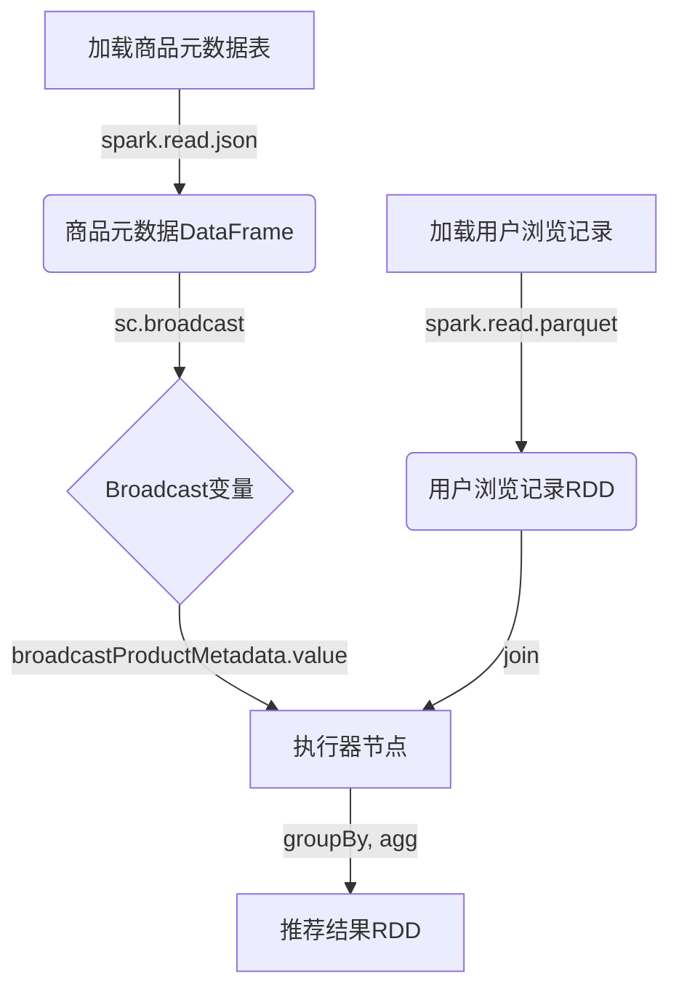

# Spark Broadcast原理与代码实例讲解

## 1.背景介绍

在大数据处理领域,Spark作为一种快速、通用的计算引擎,已经成为事实上的标准。然而,在处理大规模数据集时,经常会遇到一些性能瓶颈。其中之一就是数据共享的问题。

在传统的Spark作业中,如果需要在多个任务之间共享相同的数据集,每个任务都需要从集群的存储系统(如HDFS)中读取数据。这种做法不仅效率低下,而且会导致大量的网络传输和I/O开销。为了解决这个问题,Spark引入了Broadcast机制。

Broadcast机制允许程序员将一个只读的变量(对象)从驱动器程序广播到所有的执行器节点上,这样每个执行器就可以在本地访问这个变量,而无需从远程读取。这种方式可以显著减少数据传输的开销,从而提高整体的执行效率。

## 2.核心概念与联系

### 2.1 Broadcast变量

Broadcast变量是一种特殊的Spark共享变量,它可以在驱动器程序和所有执行器之间高效地传播不可变的数据集。Broadcast变量的核心思想是在驱动器程序中定义一个只读变量,然后将其广播到所有的执行器节点上。这样,每个执行器就可以在本地访问这个变量,而无需从远程读取。

### 2.2 RDD和Broadcast

在Spark中,RDD(Resilient Distributed Dataset)是一种分布式内存数据集,它是Spark编程的核心抽象。RDD可以通过Broadcast机制来共享数据。例如,如果我们有一个大型的RDD,但需要在每个分区上应用一个相同的小型查找表,我们可以将这个查找表广播到所有的执行器节点上,从而避免在每个分区上重复加载查找表。

### 2.3 Broadcast和Task

在Spark中,Task是执行器节点上的一个工作单元。每个Task都可以访问它所在执行器节点上的Broadcast变量。这种方式可以显著减少数据传输的开销,从而提高整体的执行效率。

## 3.核心算法原理具体操作步骤

Spark Broadcast的核心算法原理可以分为以下几个步骤:

1. **创建Broadcast变量**

   在驱动器程序中,使用`SparkContext.broadcast(value)`方法创建一个Broadcast变量。这个方法会将`value`序列化,并将其分发到所有的执行器节点上。

2. **广播变量**

   Spark将序列化后的`value`分发到每个执行器节点上,并在每个执行器节点上反序列化成一个只读的副本。

3. **访问Broadcast变量**

   在执行器节点上的Task可以通过`value.value()`方法访问Broadcast变量的值。由于Broadcast变量是只读的,所以每个Task都可以安全地访问它,而无需担心数据竞争或同步问题。

4. **释放Broadcast变量**

   当Broadcast变量不再需要时,可以通过调用`unpersist()`方法来释放它占用的内存空间。

下面是一个使用Broadcast变量的简单示例:

```scala
import org.apache.spark.broadcast.Broadcast

val data = List(1, 2, 3, 4, 5)
val lookupTable = Map(1 -> "a", 2 -> "b", 3 -> "c", 4 -> "d", 5 -> "e")

// 创建Broadcast变量
val broadcastLookupTable: Broadcast[Map[Int, String]] = sc.broadcast(lookupTable)

val rdd = sc.parallelize(data)
val result = rdd.map(x => (x, broadcastLookupTable.value.getOrElse(x, "Unknown")))

result.foreach(println)
```

在这个示例中,我们首先创建了一个`lookupTable`,然后使用`sc.broadcast(lookupTable)`将它广播到所有的执行器节点上。接下来,我们创建了一个RDD `rdd`,并使用`broadcastLookupTable.value`来访问Broadcast变量的值。最后,我们对RDD执行`map`操作,将每个元素与对应的字符串值关联起来。

## 4.数学模型和公式详细讲解举例说明

在讨论Spark Broadcast的数学模型和公式之前,我们先介绍一些相关的概念和符号:

- $n$: 集群中执行器节点的数量
- $m$: 需要广播的数据集的大小(字节)
- $s$: 每个执行器节点上Broadcast变量的大小(字节)
- $t_1$: 将数据集从驱动器程序传输到执行器节点的时间
- $t_2$: 在执行器节点上反序列化和存储Broadcast变量的时间

在传统的Spark作业中,如果需要在每个执行器节点上复制数据集,总的数据传输量为$n \times m$,传输时间为$n \times t_1$。

而使用Broadcast机制,数据传输量为$m + n \times s$,传输时间为$t_1 + n \times t_2$。

通常情况下,由于$s \ll m$,使用Broadcast机制可以显著减少数据传输量和传输时间。

我们可以使用下面的公式来估计使用Broadcast机制后的性能提升:

$$
speedup = \frac{n \times m}{m + n \times s}
$$

其中,`speedup`表示性能提升的比例。当$n$或$m$增大时,`speedup`也会增大,这说明Broadcast机制在处理大规模数据集时更加有效。

例如,假设我们有一个100MB的数据集需要广播到10个执行器节点上,每个执行器节点上Broadcast变量的大小为1MB。根据上面的公式,我们可以计算出:

$$
speedup = \frac{10 \times 100MB}{100MB + 10 \times 1MB} \approx 9.1
$$

这意味着使用Broadcast机制可以将执行时间缩短约9.1倍。

## 5.项目实践:代码实例和详细解释说明

为了更好地理解Spark Broadcast的使用方式,我们将通过一个实际项目来演示。在这个项目中,我们将使用Broadcast变量来优化一个基于Spark的机器学习算法。

### 5.1 项目背景

假设我们有一个大型的数据集,包含了大量的用户浏览记录。我们需要基于这些数据训练一个推荐系统模型,为每个用户推荐感兴趣的商品。为了提高推荐的准确性,我们需要将用户的浏览记录与一个商品元数据表(包含商品的类别、价格等信息)进行关联。

### 5.2 传统实现

在传统的实现方式中,我们需要将商品元数据表加载到每个执行器节点上,然后在每个分区上进行关联操作。这种做法存在以下几个问题:

1. 数据重复加载:每个执行器节点都需要从HDFS或其他存储系统中加载商品元数据表,导致大量的I/O开销。
2. 内存占用过多:如果商品元数据表较大,每个执行器节点都需要在内存中存储一份副本,这可能会导致内存不足的问题。
3. 网络传输开销:如果商品元数据表存储在远程存储系统中,每个执行器节点都需要通过网络从远程读取数据,这会增加网络传输的开销。

### 5.3 使用Broadcast优化

为了解决上述问题,我们可以使用Broadcast机制来优化这个过程。具体步骤如下:

1. 在驱动器程序中加载商品元数据表,并将其广播到所有的执行器节点上。

```scala
val productMetadata = spark.read.json("product_metadata.json")
val broadcastProductMetadata = spark.sparkContext.broadcast(productMetadata.collect())
```

2. 在每个执行器节点上,使用`broadcastProductMetadata.value`来访问Broadcast变量的值,而无需从远程读取数据。

```scala
val userViewEvents = spark.read.parquet("user_view_events.parquet")

val recommendedProducts = userViewEvents
  .join(broadcastProductMetadata.value.toDF("product_id", "metadata"))
  .groupBy("user_id")
  .agg(collect_list("metadata") as "recommended_products")
```

在这个例子中,我们首先使用`spark.read.json`从JSON文件中加载商品元数据表,然后使用`sc.broadcast`将其广播到所有的执行器节点上。接下来,我们加载用户浏览记录数据集`userViewEvents`,并使用`join`操作将其与Broadcast变量关联。最后,我们按照用户ID对结果进行分组,并为每个用户生成一个推荐商品列表。

使用Broadcast机制后,我们可以避免在每个执行器节点上重复加载商品元数据表,从而减少I/O开销和内存占用。同时,由于Broadcast变量是在执行器节点的内存中缓存的,我们也可以避免通过网络从远程读取数据,从而减少网络传输的开销。

### 5.4 Mermaid流程图

下面是使用Broadcast变量优化推荐系统的流程图:



在这个流程图中,我们首先加载商品元数据表和用户浏览记录数据集。然后,我们使用`sc.broadcast`将商品元数据表广播到所有的执行器节点上,形成一个Broadcast变量。接下来,在每个执行器节点上,我们使用`broadcastProductMetadata.value`访问Broadcast变量的值,并将其与用户浏览记录数据集进行关联。最后,我们对结果进行分组和聚合,生成推荐结果RDD。

## 6.实际应用场景

Spark Broadcast机制在实际应用中有着广泛的应用场景,特别是在需要共享大量只读数据的场景下。下面是一些常见的应用场景:

1. **机器学习和数据挖掘**

   在机器学习和数据挖掘领域,经常需要将大量的训练数据与一些只读的辅助数据(如词典、模型参数等)进行关联。使用Broadcast变量可以避免在每个执行器节点上重复加载这些辅助数据,从而提高计算效率。

2. **实时数据处理**

   在实时数据处理系统中,经常需要将流式数据与一些只读的参考数据(如规则库、黑名单等)进行匹配或过滤。使用Broadcast变量可以将这些参考数据广播到所有的执行器节点上,从而加快数据处理速度。

3. **ETL(Extract, Transform, Load)过程**

   在ETL过程中,经常需要将来自不同数据源的数据进行关联或转换。如果存在一些只读的参考数据(如代码表、映射表等),可以使用Broadcast变量将其广播到所有的执行器节点上,从而提高ETL过程的效率。

4. **图计算**

   在图计算领域,经常需要将图数据与一些只读的辅助数据(如节点属性、边权重等)进行关联。使用Broadcast变量可以避免在每个执行器节点上重复加载这些辅助数据,从而提高图计算的性能。

5. **交互式数据分析**

   在交互式数据分析场景下,用户经常需要与大型数据集进行交互式查询和分析。如果存在一些只读的辅助数据(如字典、规则库等),可以使用Broadcast变量将其广播到所有的执行器节点上,从而加快查询和分析的速度。

总的来说,Spark Broadcast机制可以在任何需要共享大量只读数据的场景下发挥作用,它可以显著减少数据传输的开销,从而提高整体的执行效率。

## 7.工具和资源推荐

在使用Spark Broadcast机制时,有一些工具和资源可以为您提供帮助:

1. **Spark官方文档**

   Spark官方文档提供了关于Broadcast变量的详细说明和示例代码,是学习和使用Broadcast机制的重要资源。您可以在以下链接中找到相关内容:

   - [Broadcast Programming Guide](https://spark.apache.org/docs/latest/rdd-programming-guide.html#broadcast-variables)
   - [Broadcast Scala API](https://spark.apache.org/docs/latest/api/scala/org/apache/spark/broadcast/Broadcast.html)
   - [Broadcast Java API](https://spark.apache.org/docs/latest/api/java/org/apache/spark/broadcast/Broadcast.html)

2. **Spark性能调优指南**

   Spark性能调优