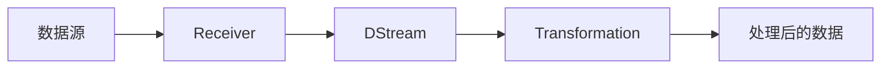

## 1.背景介绍

在大数据处理领域，Apache Spark已经成为了一种重要的计算框架。而Spark Streaming作为Spark的一个重要组件，主要用于处理实时数据流，它可以对实时数据进行类似于Spark Core的转换操作和动作操作。本文将深入探讨Spark Streaming的基本原理，并通过代码实例进行详细讲解。

## 2.核心概念与联系

Spark Streaming的核心概念包括DStream，Receiver和Transformation等。

- **DStream**：DStream是Spark Streaming中的基本数据抽象，它表示一个连续的数据流。
- **Receiver**：Receiver是Spark Streaming用来接收实时数据的模块。Spark Streaming提供了多种预定义的Receiver，如KafkaReceiver，FlumeReceiver等。
- **Transformation**：Transformation是对DStream进行操作的方法，它和Spark Core中的Transformation类似，包括map，filter，reduce等操作。

这三个概念之间的关系可以通过以下Mermaid流程图进行展示：



## 3.核心算法原理具体操作步骤

Spark Streaming的核心算法原理可以分为以下几个步骤：

1. **数据接收**：Spark Streaming通过Receiver从数据源接收数据。Receiver运行在Spark的Executor上，接收到的数据会被存储在Spark的内存中。
2. **数据处理**：接收到的数据会被划分成一系列连续的批次，每个批次的数据会被创建为一个RDD。然后，Spark Streaming会对这些RDD进行类似于Spark Core的转换操作和动作操作。
3. **结果输出**：处理后的数据可以被输出到外部系统，如HDFS，数据库等。

## 4.数学模型和公式详细讲解举例说明

在Spark Streaming中，有一个重要的概念叫做窗口操作。窗口操作允许我们在一个滑动窗口上对数据进行操作，而这个滑动窗口可以跨越多个批次。

假设我们的批次间隔为$T$，窗口长度为$W$，滑动间隔为$S$，则窗口操作可以用以下的公式进行表示：

$$
W = nT, S = mT
$$

其中，$n$和$m$都是整数，表示窗口长度和滑动间隔是批次间隔的整数倍。

例如，如果我们的批次间隔为1秒，窗口长度为10秒，滑动间隔为5秒，那么我们可以每5秒对过去10秒的数据进行一次操作。

## 5.项目实践：代码实例和详细解释说明

接下来，我们通过一个简单的WordCount例子来说明如何使用Spark Streaming。

首先，我们需要创建一个StreamingContext，它是所有Spark Streaming功能的入口点。

```scala
val conf = new SparkConf().setAppName("WordCount").setMaster("local[*]")
val ssc = new StreamingContext(conf, Seconds(1))
```

然后，我们使用SocketTextStream创建一个DStream，它会从指定的hostname和port接收数据。

```scala
val lines = ssc.socketTextStream("localhost", 9999)
```

接着，我们对DStream进行操作，实现WordCount功能。

```scala
val words = lines.flatMap(_.split(" "))
val pairs = words.map(word => (word, 1))
val wordCounts = pairs.reduceByKey(_ + _)
```

最后，我们输出结果，并启动StreamingContext。

```scala
wordCounts.print()
ssc.start()
ssc.awaitTermination()
```

## 6.实际应用场景

Spark Streaming广泛应用于各种实时数据处理的场景，例如：

- **实时日志处理**：通过Spark Streaming，我们可以实时分析日志数据，例如计算某个时间段内的PV，UV等。
- **实时异常检测**：通过Spark Streaming，我们可以实时检测系统的运行状态，一旦发现异常，可以立即进行处理。
- **实时推荐**：通过Spark Streaming，我们可以实时分析用户的行为数据，然后进行实时推荐。

## 7.工具和资源推荐

- **Apache Spark**：Apache Spark是一个快速，通用和开源的大数据计算框架，它有一个高效的DAG调度器，以及一个高效的查询优化器。
- **Apache Kafka**：Apache Kafka是一个分布式流处理平台，它可以与Spark Streaming进行集成，提供实时数据流。

## 8.总结：未来发展趋势与挑战

随着大数据技术的发展，实时数据处理的需求越来越大。Spark Streaming作为一个强大的实时数据处理框架，已经在很多场景下得到了应用。然而，Spark Streaming也面临着一些挑战，例如如何处理大规模的数据，如何保证数据的准确性和完整性等。这些都是Spark Streaming未来发展需要解决的问题。

## 9.附录：常见问题与解答

1. **Q: Spark Streaming能处理多大的数据？**
   A: Spark Streaming的处理能力主要取决于你的Spark集群的规模。理论上，只要你的集群足够大，Spark Streaming就能处理任何规模的数据。

2. **Q: Spark Streaming如何保证数据的准确性和完整性？**
   A: Spark Streaming提供了一种叫做“至少一次处理”的保证，也就是说，每个数据至少会被处理一次，但可能会被处理多次。此外，如果你的应用需要更强的保证，你可以使用Spark Streaming的checkpoint功能。

作者：禅与计算机程序设计艺术 / Zen and the Art of Computer Programming
