# Spark Structured Streaming原理与代码实例讲解

## 1.背景介绍

### 1.1 大数据流处理的需求

在当今快节奏的数字世界中,数据正以前所未有的速度被生成。从社交媒体、物联网设备到金融交易,海量的数据源不断产生实时数据流。有效处理这些连续不断的数据流对于及时获取洞见和做出实时决策至关重要。传统的批处理系统无法满足这种实时处理需求,因为它们需要先积累一定量的数据,然后再进行处理。

### 1.2 流处理的挑战

实时流处理系统需要处理持续到来的无界数据流,并及时产生结果输出。这带来了诸多挑战:

1. **持续运行**:与有界的批处理作业不同,流处理作业需要持续运行,直到被显式停止。
2. **数据一致性**:必须确保数据处理的正确性和完整性,即使在发生故障时也不能丢失或重复处理数据。
3. **低延迟**:对于某些应用场景,如实时欺诈检测或网络监控,需要在毫秒级延迟内处理数据并生成结果。
4. **高吞吐量**:流处理系统需要能够以高吞吐量处理大量数据流,满足各种实时应用的需求。
5. **动态资源分配**:由于数据流的动态性质,系统需要能够根据工作负载动态调整资源分配。

### 1.3 Spark Structured Streaming的优势

Apache Spark是一个统一的大数据处理引擎,它提供了Structured Streaming模块,用于构建可扩展、容错的流处理应用程序。Structured Streaming基于Spark SQL引擎,支持使用相同的API和Spark生态系统进行流处理和批处理。它的主要优势包括:

1. **统一批流处理**:使用相同的API和引擎处理批处理和流处理作业,简化了开发和维护。
2. **容错和一致性保证**:通过写入检查点和使用Kafka等可重播的源,确保精确一次处理语义。
3. **与Spark生态系统集成**:可与Spark SQL、DataFrames、机器学习等模块无缝集成。
4. **易于使用**:提供了高级API,支持SQL、DataFrames和Dataset,降低了开发难度。
5. **性能优化**:利用Spark的内存计算和查询优化,提供低延迟和高吞吐量。

## 2.核心概念与联系

### 2.1 流数据抽象

Structured Streaming将流数据抽象为一个无界的、持续追加的表。表的模式在流执行期间是固定的,但表的数据行在持续追加。

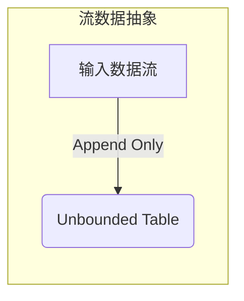

### 2.2 输入源

Structured Streaming支持从各种输入源读取数据流,包括:

- **文件源**:从目录中的文件流读取数据,如本地文件系统或分布式文件系统。
- **Kafka源**:从Kafka主题读取数据流。
- **Socket源**:从Socket连接读取数据流。

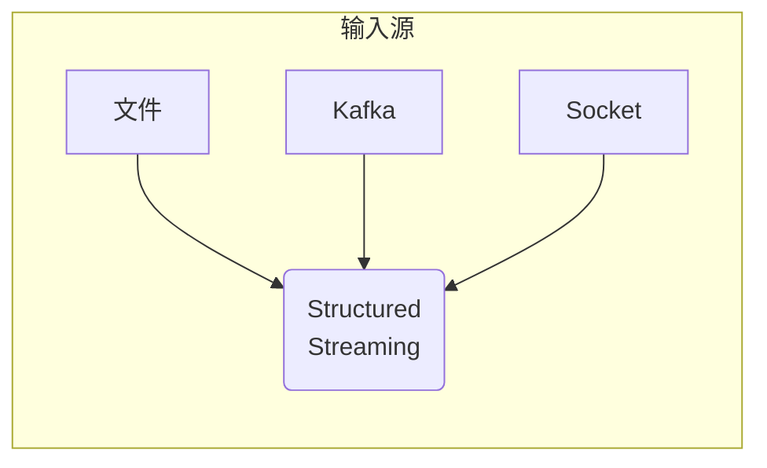

### 2.3 执行模式

Structured Streaming支持两种执行模式:

1. **Micro-Batch模式**:持续处理微小批次的数据,以模拟持续处理流。
2. **Continuous模式**:以增量方式持续处理单条记录,提供最低延迟。

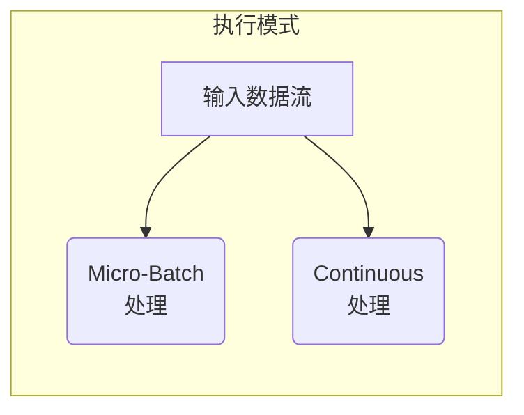

### 2.4 输出模式

Structured Streaming支持将结果输出到多种目标:

- **文件接收器**:将结果写入目录中的文件。
- **Kafka接收器**:将结果写入Kafka主题。
- **内存接收器**:将结果保存在内存表中,用于交互式查询。
- **自定义接收器**:通过实现自定义接收器,将结果写入其他系统。

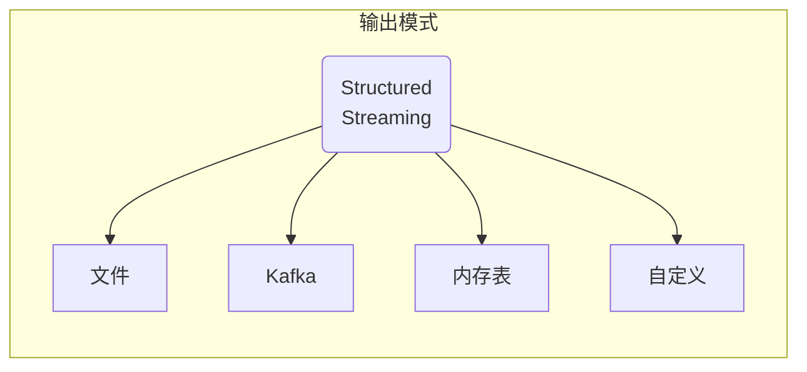

### 2.5 容错语义

Structured Streaming提供了以下容错语义保证:

1. **至少一次**:每条记录至少被处理一次,可能会有重复。
2. **精确一次**:通过使用可重放的输入源(如Kafka)和检查点,确保每条记录被精确处理一次。
3. **前缀完整性**:保证输出中的任何记录都是从输入数据的前缀生成的。

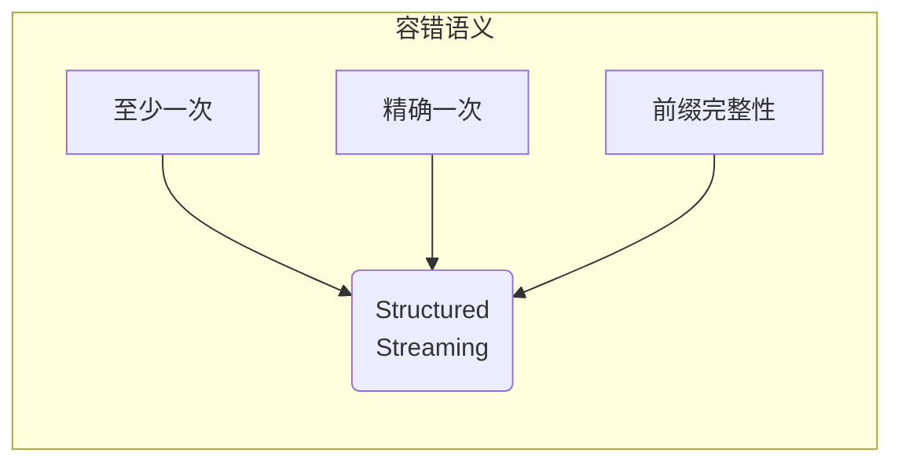

### 2.6 流式查询

Structured Streaming使用流式查询来处理流数据。流式查询类似于批处理查询,但会持续运行并不断更新结果。

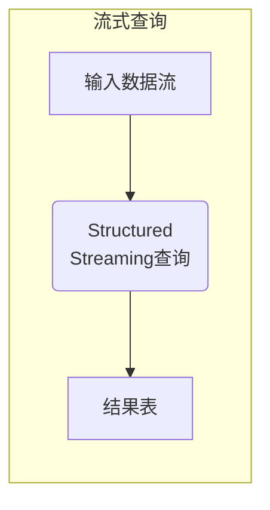

## 3.核心算法原理具体操作步骤

Structured Streaming的核心算法原理包括以下几个步骤:

### 3.1 数据接收

1. 从输入源(如Kafka、文件等)持续接收新的数据。
2. 将接收到的数据存储在内部的可靠数据源中,如Spark的BlockManager或外部存储系统。

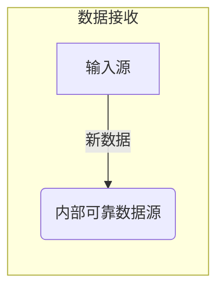

### 3.2 增量执行

1. 将新接收的数据划分为小批次或增量。
2. 对每个小批次或增量执行查询计划,生成增量结果。

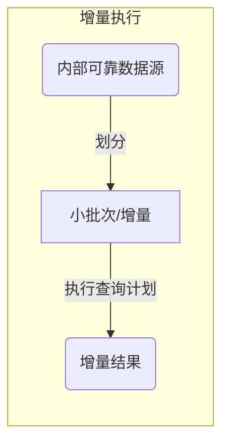

### 3.3 状态管理

1. 维护查询的状态,如窗口聚合或流式连接的状态。
2. 使用检查点和写入前日志(WAL)机制确保状态的容错性。

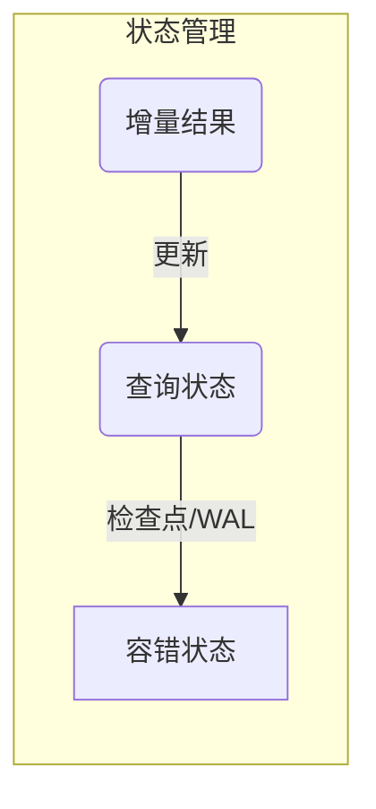

### 3.4 结果更新

1. 将增量结果与之前的结果合并,生成新的最终结果。
2. 将最终结果输出到目标系统,如文件、Kafka或内存表。

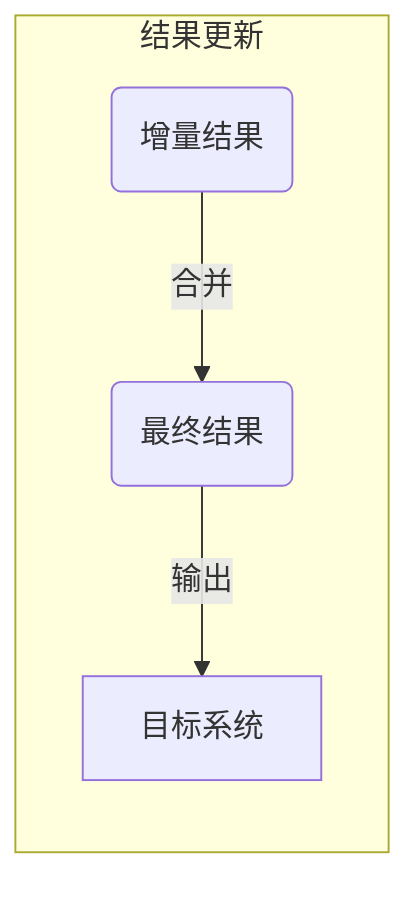

### 3.5 持续迭代

上述步骤持续迭代执行,直到流式查询被停止:

1. 接收新的数据。
2. 执行增量计算。
3. 更新查询状态。
4. 更新最终结果。

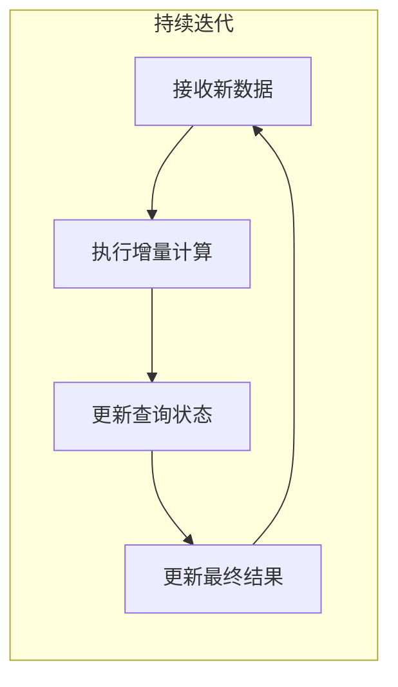

## 4.数学模型和公式详细讲解举例说明

在Structured Streaming中,一些常见的数学模型和公式包括:

### 4.1 窗口操作

窗口操作是流处理中的一个核心概念,用于对数据流进行分组和聚合。Structured Streaming支持多种窗口类型,如滚动窗口、滑动窗口和会话窗口。

**滚动窗口**

滚动窗口将数据流划分为固定大小的非重叠窗口。对于给定的窗口大小 $w$ 和时间戳 $t$,记录 $e$ 属于窗口编号 $\lfloor \frac{t}{w} \rfloor$。

$$
\text{WindowID}(e, w) = \left\lfloor \frac{\text{timestamp}(e)}{w} \right\rfloor
$$

例如,对于窗口大小为5分钟的滚动窗口,记录的时间戳为`2023-06-01 10:07:32`属于窗口编号`2023-06-01 10:05`。

**滑动窗口**

滑动窗口将数据流划分为固定大小的重叠窗口,并按固定的步长滑动。对于给定的窗口大小 $w$、步长 $s$ 和时间戳 $t$,记录 $e$ 属于窗口编号 $\lfloor \frac{t - t \bmod s}{s} \rfloor$。

$$
\text{WindowID}(e, w, s) = \left\lfloor \frac{\text{timestamp}(e) - \text{timestamp}(e) \bmod s}{s} \right\rfloor
$$

例如,对于窗口大小为1小时、步长为30分钟的滑动窗口,记录的时间戳为`2023-06-01 10:35:27`属于窗口编号`2023-06-01 10:30`。

### 4.2 状态管理

Structured Streaming使用有状态的流式算子(如聚合、连接等)来维护查询状态。状态存储在内存中,并使用检查点和写入前日志(WAL)机制进行容错。

**增量更新公式**

对于具有状态的流式算子,每个批次或增量都会根据新数据更新状态。假设当前状态为 $s$,新增量为 $\Delta$,更新后的状态 $s'$ 可以表示为:

$$
s' = f(s, \Delta)
$$

其中,函数 $f$ 取决于具体的算子。例如,对于流式聚合,函数 $f$ 可以是:

$$
s' = s + \Delta
$$

### 4.3 延迟估计

在流处理系统中,估计延迟是一个重要的问题。Structured Streaming使用水印(watermark)机制来估计记录的延迟,并基于此进行状态清理和触发计算。

**水印公式**

假设记录的事件时间为 $e$,水印 $W$ 是一个延迟阈值,表示系统认为时间戳小于 $W$ 的记录已经全部到达。水印的更新公式为:

$$
W = \max\limits_{e \in S} (e) - \delta
$$

其中, $S$ 是所有已到达记录的事件时间集合, $\delta$ 是一个延迟阈值,用于容忍一定程度的延迟记录。

基于水印,Structured Streaming可以安全地清理早于水印的状态,并触发计算产生最终结果。

## 5.项目实践:代码实例和详细解释说明

### 5.1 Structured Streaming入门示例

以下是一个简单的Structured Streaming示例,从Socket源读取文本数据流,对单词进行计数,并将结果输出到控制台。

```scala
import org.apache.spark.sql.functions._
import org.apache.spark.sql.streaming.Trigger

val socketDF = spark.readStream
  .format("socket")
  .option("host", "localhost")
  .option("port", 9999)
  .load()

val wordCounts = socketDF
  .select(explode(split(col("value"), " ")).alias("word"))
  .groupBy("word")
  .count()

val query = wordCounts
  .writeStream
  .outputMode("complete")
  .format("console")
  .trigger(Trigger.ProcessingTime("10 seconds"))
  .start()

query.awaitTermination()
```

1. 使用`spark.readStream`创建一个流式DataFrame,从Socket源读取数据。
2. 使用`select`、`explode`和`split`函数将每行文本拆分为单词。
3. 使用`groupBy`和`count`对单词进行计数。
4. 使用`writeStream`创建一个流式查询,将结果输出到控制台。
5. 设置输出模式为`complete`,表示每次输出完整的更新后结果。
6. 设置触发间隔为10秒,表示每10秒处理一次新的数据增量。
7. 启动流式查询并等待终止。

### 5.2 使用Kafka源和接收器

以下示例展示了如何从Kafka主题读取数据流,并将结果写回Kafka。

```scala
import org.apache.spark.sql.functions._
import org.apache.spark.sql.streaming.Trigger

val kafkaDF = spark.readStream
  .format("kafka")
  .option("kafka.bootstrap.servers", "host1:port1,host