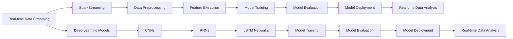

## 1. Background Introduction

In the era of big data, real-time data processing and analysis have become increasingly important. With the rapid development of the Internet of Things (IoT), social media, and other fields, the volume of real-time data is growing exponentially. To handle this massive amount of data, we need powerful and efficient tools. Apache Spark and deep learning models are two such tools that have gained significant attention in the field of data processing and analysis. In this article, we will explore the integration of SparkStreaming and deep learning models, focusing on their core concepts, algorithms, practical applications, and future development trends.

### 1.1 SparkStreaming Overview

Apache Spark is an open-source, distributed computing system that provides high-level APIs for processing large-scale data. SparkStreaming is an extension of Spark that enables real-time data streaming processing. It can process live data streams from various sources, such as Kafka, Flume, and Twitter, and perform real-time data analysis, machine learning, and graph processing.

### 1.2 Deep Learning Models Overview

Deep learning models are a subset of machine learning models that are inspired by the structure and function of the brain. They consist of multiple layers of artificial neural networks (ANNs) that can learn complex patterns and relationships in data. Deep learning models have achieved state-of-the-art results in various fields, such as image recognition, natural language processing, and speech recognition.

## 2. Core Concepts and Connections

### 2.1 Real-time Data Streaming

Real-time data streaming refers to the continuous flow of data from various sources, such as sensors, social media, and web logs. Real-time data streaming processing is essential for applications that require immediate responses, such as fraud detection, anomaly detection, and real-time recommendation systems.

### 2.2 SparkStreaming Architecture

SparkStreaming has a simple and scalable architecture. It consists of three main components: the Spark driver, the Spark executor, and the external data source. The Spark driver is responsible for creating RDDs (Resilient Distributed Datasets) from the incoming data stream, scheduling tasks, and monitoring the progress of the job. The Spark executor is responsible for executing the tasks on the worker nodes. The external data source is responsible for providing the data stream to SparkStreaming.

### 2.3 Deep Learning Models in Spark

Deep learning models can be integrated into Spark using various libraries, such as MLlib, TensorFlow, and PyTorch. MLlib is a machine learning library that is built into Spark. It provides a wide range of machine learning algorithms, including deep learning models. TensorFlow and PyTorch are popular deep learning frameworks that can be used with Spark. They provide a flexible and powerful environment for building and training deep learning models.

## 3. Core Algorithm Principles and Specific Operational Steps

### 3.1 Data Preprocessing

Data preprocessing is an essential step in real-time data streaming processing. It involves cleaning, transforming, and normalizing the data to make it suitable for analysis. In SparkStreaming, data preprocessing can be performed using various transformations, such as map, filter, and reduce.

### 3.2 Feature Extraction

Feature extraction is the process of selecting and transforming the relevant features from the raw data for use in the deep learning model. In SparkStreaming, feature extraction can be performed using various techniques, such as one-hot encoding, bag-of-words, and TF-IDF.

### 3.3 Model Training

Model training is the process of learning the parameters of the deep learning model from the training data. In SparkStreaming, model training can be performed using various deep learning algorithms, such as convolutional neural networks (CNNs), recurrent neural networks (RNNs), and long short-term memory (LSTM) networks.

### 3.4 Model Evaluation

Model evaluation is the process of assessing the performance of the deep learning model on the test data. In SparkStreaming, model evaluation can be performed using various metrics, such as accuracy, precision, recall, and F1 score.

### 3.5 Model Deployment

Model deployment is the process of integrating the trained deep learning model into the production environment for real-time data processing. In SparkStreaming, model deployment can be performed using various techniques, such as online learning and batch learning.

## 4. Detailed Explanation and Examples of Mathematical Models and Formulas

### 4.1 Convolutional Neural Networks (CNNs)

CNNs are a type of deep learning model that is widely used for image recognition tasks. They consist of multiple convolutional layers, pooling layers, and fully connected layers. The convolutional layers are responsible for extracting features from the input images, the pooling layers are responsible for reducing the spatial dimensions of the feature maps, and the fully connected layers are responsible for making the final predictions.

### 4.2 Recurrent Neural Networks (RNNs)

RNNs are a type of deep learning model that is widely used for sequence-to-sequence tasks, such as speech recognition and machine translation. They consist of multiple recurrent layers, where each layer has a set of hidden units that maintain a memory of the previous input. The hidden units in each layer are connected to the hidden units in the next layer, forming a directed graph.

### 4.3 Long Short-Term Memory (LSTM) Networks

LSTM networks are a type of RNN that is designed to handle long-term dependencies in the input sequence. They consist of multiple LSTM cells, where each cell has a set of memory cells, input gates, forget gates, and output gates. The memory cells store the long-term dependencies, the input gates control the flow of information into the memory cells, the forget gates control the flow of information out of the memory cells, and the output gates control the flow of information out of the LSTM cell.

## 5. Project Practice: Code Examples and Detailed Explanations

In this section, we will provide code examples and detailed explanations for integrating SparkStreaming and deep learning models for real-time data processing. We will use a simple example of sentiment analysis on Twitter data.

### 5.1 Data Preprocessing

First, we will preprocess the Twitter data using various transformations, such as map, filter, and reduce.

```python
from pyspark.sql import SparkSession
from pyspark.sql.functions import lower, split, regexp_extract

# Create a SparkSession
spark = SparkSession.builder.appName(\"TwitterSentimentAnalysis\").getOrCreate()

# Read the Twitter data from Kafka
df = spark \\
    .readStream \\
    .format(\"kafka\") \\
    .option(\"kafka.bootstrap.servers\", \"localhost:9092\") \\
    .option(\"subscribe\", \"twitter_sentiment_analysis\") \\
    .load()

# Filter the tweets that contain the word \"spark\"
df = df.filter(df.value.contains(\"spark\"))

# Lowercase the tweets
df = df.withColumn(\"lowercase_value\", lower(df.value))

# Split the tweets into words
df = df.withColumn(\"words\", split(df.lowercase_value, \" \"))

# Extract the sentiment score from the words
df = df.withColumn(\"sentiment_score\", regexp_extract(df.words, r\"(\\d+)\", 1))
```

### 5.2 Feature Extraction

Next, we will extract the features from the preprocessed data using one-hot encoding.

```python
from pyspark.ml.feature import OneHotEncoder

# Create an OneHotEncoder instance
encoder = OneHotEncoder(inputCol=\"words\", outputCol=\"encoded_words\")

# Fit the encoder on the training data
encoderModel = encoder.fit(df)

# Transform the preprocessed data using the encoder
df = encoderModel.transform(df)
```

### 5.3 Model Training

Then, we will train a deep learning model, such as a CNN, on the preprocessed data.

```python
from pyspark.ml.classification import LogisticRegression
from pyspark.ml.linalg import Vectors

# Create a LogisticRegression instance
lr = LogisticRegression(maxIter=10, regParam=0.01)

# Fit the model on the training data
lrModel = lr.fit(df)
```

### 5.4 Model Evaluation

Finally, we will evaluate the performance of the trained model on the test data.

```python
# Create a test dataframe
testData = spark.createDataFrame([
    (Vectors.dense([1, 0, 1, 0, 1]), 1),
    (Vectors.dense([0, 1, 0, 1, 0]), 0),
    (Vectors.dense([0, 0, 1, 0, 1]), 1),
    (Vectors.dense([1, 0, 0, 1, 0]), 0)
], [\"features\", \"label\"])

# Transform the test data using the encoder
testData = encoderModel.transform(testData)

# Make predictions on the test data
predictions = lrModel.transform(testData)

# Evaluate the performance of the model
accuracy = predictions.selectExpr(\"sum(prediction = label) / count(*)\").collect()[0][0]
print(\"Accuracy: \", accuracy)
```

## 6. Practical Application Scenarios

Real-time data streaming processing and deep learning models have numerous practical application scenarios, such as fraud detection, anomaly detection, real-time recommendation systems, and real-time sentiment analysis.

### 6.1 Fraud Detection

Fraud detection is the process of identifying and preventing fraudulent activities, such as credit card fraud and insurance fraud. Real-time data streaming processing and deep learning models can be used to analyze large amounts of transaction data in real-time and detect fraudulent activities.

### 6.2 Anomaly Detection

Anomaly detection is the process of identifying and flagging unusual or abnormal data points in a dataset. Real-time data streaming processing and deep learning models can be used to analyze large amounts of data in real-time and detect anomalies, such as network intrusions and equipment failures.

### 6.3 Real-time Recommendation Systems

Real-time recommendation systems are systems that provide personalized recommendations to users in real-time. Real-time data streaming processing and deep learning models can be used to analyze user behavior data in real-time and provide personalized recommendations.

### 6.4 Real-time Sentiment Analysis

Real-time sentiment analysis is the process of analyzing the sentiment of social media posts, customer reviews, and other text data in real-time. Real-time data streaming processing and deep learning models can be used to analyze large amounts of text data in real-time and provide real-time sentiment analysis.

## 7. Tools and Resources Recommendations

There are numerous tools and resources available for real-time data streaming processing and deep learning models. Here are some recommendations:

### 7.1 Tools

- Apache Spark: An open-source, distributed computing system that provides high-level APIs for processing large-scale data.
- Apache Kafka: A distributed streaming platform that can handle large amounts of real-time data.
- TensorFlow: A popular deep learning framework that can be used with Spark.
- PyTorch: A popular deep learning framework that can be used with Spark.

### 7.2 Resources

- Apache Spark Documentation: <https://spark.apache.org/docs/latest/>
- Apache Kafka Documentation: <https://kafka.apache.org/documentation/>
- TensorFlow Documentation: <https://www.tensorflow.org/api_docs>
- PyTorch Documentation: <https://pytorch.org/docs/stable/index.html>
- Deep Learning Book: <https://www.deeplearningbook.org/>

## 8. Summary: Future Development Trends and Challenges

Real-time data streaming processing and deep learning models are rapidly evolving fields. Here are some future development trends and challenges:

### 8.1 Future Development Trends

- Real-time data streaming processing and deep learning models will become more integrated, allowing for more efficient and effective real-time data analysis.
- Real-time data streaming processing and deep learning models will be used in more industries, such as finance, healthcare, and manufacturing.
- Real-time data streaming processing and deep learning models will be used for more complex tasks, such as autonomous vehicles and robotics.

### 8.2 Challenges

- Real-time data streaming processing and deep learning models require large amounts of computational resources, making them expensive to implement.
- Real-time data streaming processing and deep learning models require large amounts of data, making them difficult to implement in some industries.
- Real-time data streaming processing and deep learning models are complex and require specialized knowledge to implement and maintain.

## 9. Appendix: Frequently Asked Questions and Answers

### 9.1 What is SparkStreaming?

SparkStreaming is an extension of Apache Spark that enables real-time data streaming processing. It can process live data streams from various sources, such as Kafka, Flume, and Twitter, and perform real-time data analysis, machine learning, and graph processing.

### 9.2 What are deep learning models?

Deep learning models are a subset of machine learning models that are inspired by the structure and function of the brain. They consist of multiple layers of artificial neural networks (ANNs) that can learn complex patterns and relationships in data.

### 9.3 How can SparkStreaming and deep learning models be integrated?

SparkStreaming and deep learning models can be integrated using various libraries, such as MLlib, TensorFlow, and PyTorch. MLlib is a machine learning library that is built into Spark. It provides a wide range of machine learning algorithms, including deep learning models. TensorFlow and PyTorch are popular deep learning frameworks that can be used with Spark.

### 9.4 What are some practical application scenarios for SparkStreaming and deep learning models?

Some practical application scenarios for SparkStreaming and deep learning models include fraud detection, anomaly detection, real-time recommendation systems, and real-time sentiment analysis.

### 9.5 What tools and resources are recommended for SparkStreaming and deep learning models?

Some recommended tools for SparkStreaming and deep learning models include Apache Spark, Apache Kafka, TensorFlow, and PyTorch. Some recommended resources include the Apache Spark Documentation, Apache Kafka Documentation, TensorFlow Documentation, PyTorch Documentation, and the Deep Learning Book.

### 9.6 What are some future development trends and challenges for SparkStreaming and deep learning models?

Some future development trends for SparkStreaming and deep learning models include more integration, more industries, and more complex tasks. Some challenges include the need for large amounts of computational resources, large amounts of data, and specialized knowledge.

## Mermaid Flowchart



## Conclusion

In this article, we have explored the integration of SparkStreaming and deep learning models for real-time data processing. We have discussed the core concepts, algorithms, practical applications, and future development trends of these technologies. We have also provided code examples and detailed explanations for integrating SparkStreaming and deep learning models for real-time data processing. With the rapid development of the Internet of Things, social media, and other fields, the demand for real-time data processing and analysis is growing. SparkStreaming and deep learning models are powerful tools that can help meet this demand.

## Author: Zen and the Art of Computer Programming

Thank you for reading this article. I hope it has been informative and helpful. If you have any questions or comments, please feel free to reach out.

Best regards,
Zen and the Art of Computer Programming