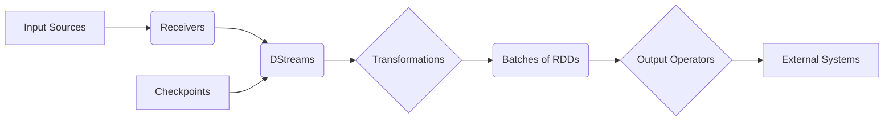

# SparkStreaming在实时流媒体处理中的应用

## 1. 背景介绍
### 1.1 流媒体处理的重要性
在当今大数据时代,海量的实时数据正在不断产生,如社交网络、物联网设备、金融交易等。对这些实时数据进行高效、准确的处理和分析,可以帮助企业快速洞察市场趋势、优化业务决策、提升用户体验。流媒体处理技术正是应对实时大数据挑战的关键。

### 1.2 SparkStreaming简介
SparkStreaming是Apache Spark生态系统中的一个重要组件,是建立在Spark核心之上的可扩展、高吞吐量、容错的实时流处理框架。它支持从Kafka、Flume、Kinesis等多种数据源获取流数据,并能以秒级延迟处理这些数据,最终将结果写入文件系统、数据库或仪表盘中,实现端到端的实时流处理。

### 1.3 SparkStreaming的优势
相比Storm、Flink等其他流处理框架,SparkStreaming具有以下优势:

1. 集成Spark生态:可以无缝集成Spark SQL、MLlib等组件,实现流批一体化处理。
2. 高吞吐低延迟:基于微批次架构,在保证吞吐量的同时做到秒级延迟。  
3. 容错性强:基于RDD的数据不变性和Lineage机制,能够从节点失效中自动恢复。
4. 易用性好:提供Scala、Java、Python等多语言API,使用简单。

## 2. 核心概念与联系
### 2.1 DStream
DStream(Discretized Stream)是SparkStreaming的核心抽象,代表一个持续不断的RDD序列。每个RDD包含一个时间间隔内的数据。DStream可以从Kafka、Flume等输入源创建,也可以通过对其他DStream应用高阶函数转换得到。

### 2.2 Receiver
Receiver是SparkStreaming从外部数据源接收数据并生成DStream的组件。系统提供了多种内置的Receiver,如KafkaReceiver、FlumeReceiver等,也允许用户自定义Receiver。Receiver运行在Executor上,并行接收数据。

### 2.3 算子
SparkStreaming提供了丰富的转换算子(Transformation)和输出算子(Output Operator),用于对DStream进行处理。常用的转换算子包括:

- map/flatMap:对DStream中的每个元素进行转换 
- filter:过滤出满足条件的元素
- reduceByKey:对Key相同的元素进行聚合
- join:两个DStream进行内连接
- window:滑动窗口计算

输出算子如print、saveAsTextFiles等,将结果数据输出到外部系统。

### 2.4 Checkpoint
Checkpoint是SparkStreaming容错机制的重要组成。它将DStream的元数据保存到可靠存储如HDFS,当有Worker节点失效时,系统可以从Checkpoint恢复出DStream并重新计算。Checkpoint间隔需要根据数据量和延迟要求权衡设置。

### 2.5 架构图
下图展示了SparkStreaming的整体架构和数据流向:



## 3. 核心算法原理与操作步骤
SparkStreaming的核心算法是将实时数据流切分成一系列小批次进行处理。具体步骤如下:

### 3.1 接收数据
Receiver以指定的时间间隔(如1秒)不断接收输入源的数据,并按照分区规则将数据分发到不同的Executor。每个分区的数据被封装成Block。  

### 3.2 生成DStream
Receiver将Block元数据提交给Driver,Driver根据元数据生成DStream及其RDD lineage。注意这一步并不会触发实际计算。

### 3.3 转换操作  
用户定义的转换算子被应用到DStream上,形成一个Transformation DAG。当有Action算子如print触发时,DAG提交给Spark DAGScheduler划分Stage。

### 3.4 生成RDD
对于每个Batch,根据DStream lineage生成一组RDD,每个RDD包含本Batch的数据,并被具体的Stage处理。

### 3.5 计算结果
RDD被划分到不同的Task,并行计算出结果。结果数据被输出算子处理,写入外部系统。

### 3.6 Checkpoint
Checkpoint线程定期将DStream元数据写入可靠存储,以供恢复时重建DStream。

## 4. 数学模型与公式
SparkStreaming中的一些核心算法可以用数学公式表达。

### 4.1 滑动窗口
滑动窗口算子让我们能够在最近一段时间的数据上执行聚合操作。窗口大小为$T$,滑动步长为$S$,则第$i$个窗口$W_i$包含的数据为:

$$
W_i = \bigcup_{j=i-T/S+1}^{i} B_j
$$

其中$B_j$为第$j$个Batch的数据。

例如,对于每秒生成一个RDD的DStream,要计算最近3秒的数据总和,可以用如下方式:

```scala
val windowedStream = inputStream.window(Seconds(3), Seconds(1))
val sumStream = windowedStream.reduce(_ + _)
```

### 4.2 State追踪
对于需要跨Batch维护状态的计算,如统计每个Key的历史数据总和,可以用updateStateByKey算子。其原理是为每个Key维护一个State,并定义一个更新函数$f$,第$i$个Batch的State $S_i$为:

$$
S_i(k) = f(S_{i-1}(k), B_i(k))
$$

其中$S_{i-1}$为上一个Batch的State,$B_i$为本Batch的数据。

例如,统计每个单词的历史出现次数:

```scala
def updateFunc(values: Seq[Int], state: Option[Int]): Option[Int] = {
  val currentCount = values.foldLeft(0)(_ + _)
  val previousCount = state.getOrElse(0)
  Some(currentCount + previousCount)
}

val wordCountStream = inputStream.flatMap(_.split(" "))
  .map(word => (word, 1))
  .updateStateByKey[Int](updateFunc)
```

## 5. 项目实践
下面以一个实际项目为例,演示如何用SparkStreaming进行实时流媒体处理。

### 5.1 项目背景
假设我们要开发一个实时视频推荐系统。系统从Kafka接收用户的视频播放行为日志,实时统计每个视频的播放量,并将播放量Top N的视频推荐给用户。

### 5.2 环境准备
- Spark 3.0
- Scala 2.12
- Kafka 2.6
- Redis 6.0

### 5.3 代码实现

```scala
import org.apache.kafka.clients.consumer.ConsumerRecord
import org.apache.kafka.common.serialization.StringDeserializer
import org.apache.spark.SparkConf
import org.apache.spark.streaming.{Seconds, StreamingContext}
import org.apache.spark.streaming.kafka010.{ConsumerStrategies, KafkaUtils, LocationStrategies}
import redis.clients.jedis.Jedis

object VideoRecommender {
  val kafkaTopic = "video-log"
  val kafkaParams = Map[String, Object](
    "bootstrap.servers" -> "localhost:9092",
    "key.deserializer" -> classOf[StringDeserializer],
    "value.deserializer" -> classOf[StringDeserializer],
    "group.id" -> "video-recommender",
    "auto.offset.reset" -> "latest",
    "enable.auto.commit" -> (false: java.lang.Boolean)
  )
  
  def main(args: Array[String]): Unit = {
    val conf = new SparkConf().setAppName("VideoRecommender").setMaster("local[2]")
    val ssc = new StreamingContext(conf, Seconds(1))
    
    // 创建DStream
    val messages = KafkaUtils.createDirectStream[String, String](
      ssc,
      LocationStrategies.PreferConsistent,
      ConsumerStrategies.Subscribe[String, String](Array(kafkaTopic), kafkaParams)
    )
    
    // 解析日志
    val videoPlays = messages.map(record => (record.value.split(",")(0), 1L))
    
    // 统计播放量
    val videoPlayCounts = videoPlays.reduceByKeyAndWindow(
      (a: Long, b: Long) => a + b, 
      (a: Long, b: Long) => a - b,
      Seconds(60), 
      Seconds(10)
    )
    
    // 取Top N
    val topVideos = videoPlayCounts.transform(rdd => {
      rdd.sortBy(-_._2).take(10)
    })
    
    // 存入Redis
    topVideos.foreachRDD(rdd => {
      val jedis = new Jedis("localhost")
      val topList = rdd.map(x => (x._2, x._1)).collect()
      jedis.zadd("video-recommend", topList :_*)
      jedis.close()
    })
    
    ssc.start()
    ssc.awaitTermination()
  }
}
```

代码说明:

1. 从Kafka创建DStream,每个Record的Value为"videoId,ts"格式。
2. 解析日志,提取videoId,并计数为1。
3. 使用`reduceByKeyAndWindow`统计60秒内每个视频的播放量。为了每10秒更新一次结果,窗口滑动步长设为10秒。
4. 使用`transform`算子对DStream中的每个RDD进行Top N排序。注意`transform`的函数参数是针对每个RDD进行的,而不是DStream。
5. 将Top N结果写入Redis的Sorted Set中,Score为播放量,Member为视频ID。应用程序可以从Redis读取这个排行榜,推荐给用户。

### 5.4 运行与测试
1. 启动Kafka和Redis
2. 运行Kafka Producer,向"video-log"主题发送测试数据,如:

```
video1,1622333948
video2,1622333949
video1,1622333950
```

3. 运行VideoRecommender程序
4. 查看Redis中的结果:

```
127.0.0.1:6379> ZREVRANGE video-recommend 0 9 WITHSCORES
video1 2
video2 1
```

可以看到播放量最高的视频为video1,其次是video2。随着数据的持续发送,排行榜会实时更新。

## 6. 实际应用场景
SparkStreaming在多个领域都有广泛应用,例如:

### 6.1 实时用户行为分析
电商网站、App等通过收集用户的点击、浏览、购买等行为日志,用SparkStreaming进行实时分析,如统计热门商品、优化推荐系统等,提升用户体验和销售转化。

### 6.2 实时欺诈检测
银行、支付、保险等公司通过对交易数据流进行实时规则或机器学习计算,及时发现和阻止欺诈交易,降低风险损失。

### 6.3 实时运维监控
互联网公司通过收集服务器、网络、应用的实时指标数据,用SparkStreaming进行聚合计算,实时检测异常,触发告警,保障系统稳定运行。

### 6.4 实时舆情分析
政府、企业等通过抓取社交媒体、新闻、论坛的文本数据,用SparkStreaming结合NLP算法进行热点话题发现、情感倾向分析,实时掌握舆论动向。

## 7. 工具和资源推荐
### 7.1 开发工具
- IntelliJ IDEA:功能强大的Scala/Spark IDE
- Databricks Notebook:在线的交互式开发和调试环境

### 7.2 集成组件
- Kafka:高吞吐量的分布式消息队列,常用于数据收集
- Flume:分布式日志收集框架,支持多种数据源和Sink
- Kinesis:AWS提供的完全托管的实时数据处理服务

### 7.3 学习资源
- Spark官网:https://spark.apache.org/docs/latest/streaming-programming-guide.html
- Spark Streaming源码:https://github.com/apache/spark/tree/master/streaming
- 《Spark Streaming:技术、应用与性能优化》,王家林等著
- 《Spark最佳实践》,王家林等著
- Coursera课程:Big Data Analysis with Scala and Spark,by EPFL

## 8. 总结与展望
本文介绍了SparkStreaming的背景、原理、使用方法和实际案例,展示了它在实时流媒体处理领域的优势和广泛应用。

未来,随着5G、IoT的发展,实时数据的规模和种类还将快速增长。SparkStreaming有望与Structured Streaming、Kafka Streams等新兴技术一起,在低延迟、高吞吐、强一致性等方面取得更大突破,为流处理领域带来更多创新。

同时,SparkStreaming与机器学习、图计算等技术的结合也将更加紧密,以支持更智能、更复杂的