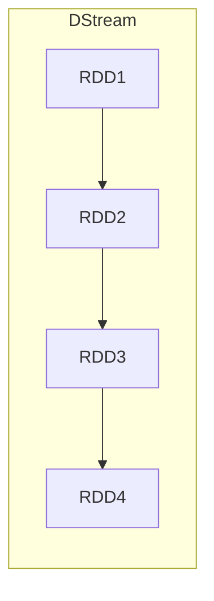
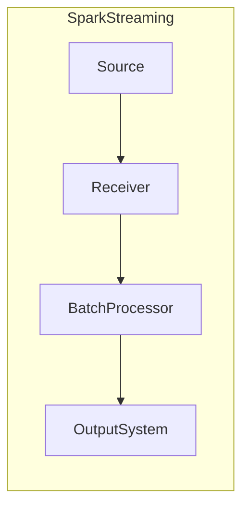

# SparkStreaming在电力能源行业的应用

## 1. 背景介绍

### 1.1 电力能源行业的重要性

电力能源是现代社会的命脉,为工业生产、民用生活提供了必不可少的动力。随着全球能源需求的不断增长,电力行业面临着如何高效利用现有资源、提高能源利用效率的巨大挑战。同时,电力系统涉及发电、输电、变电、配电、供电等多个环节,生产运营过程中产生了大量的实时数据,对数据的快速处理和分析具有迫切需求。

### 1.2 大数据在电力能源行业的应用

大数据技术的出现为电力能源行业带来了新的发展机遇。通过对海量异构数据的实时处理和分析,可以实现对电力系统的实时监控、故障预警、负荷预测、能耗优化等,从而提高电力系统的运行效率、降低运营成本、延长设备使用寿命、提升供电可靠性。

### 1.3 SparkStreaming简介

Apache Spark是一款开源的大数据处理引擎,具有通用性、高性能和易用性等优点。Spark Streaming作为Spark的流式计算模块,支持实时处理来自各种数据源的数据流,并与Spark Core无缝集成,可以高效地将实时数据与静态数据相结合进行分析。

## 2. 核心概念与联系

### 2.1 Spark Streaming架构

Spark Streaming的核心架构由以下几个组件组成:

- **Spark Context**: Spark程序的入口点
- **Receiver(s)**: 接收数据源并将数据存储到Spark内存中
- **Batch Processing Engine**: 对接收到的数据流进行批处理
- **Output Operations**: 将处理结果输出到外部系统


### 2.2 Discretized Stream (DStream)

DStream(Discretized Stream)是Spark Streaming中的核心抽象概念,代表一个连续的数据流。DStream是一个由许多RDD(Resilient Distributed Dataset)组成的序列,每个RDD都包含一段时间内的数据。



### 2.3 Transformations和Output Operations

Spark Streaming提供了丰富的Transformations操作,用于对DStream执行各种转换和计算,例如map、flatMap、filter、reduceByKey等。Output Operations则用于将处理结果输出到外部系统,如文件系统、数据库或消息队列。

## 3. 核心算法原理具体操作步骤

### 3.1 Spark Streaming运行原理

Spark Streaming通过将实时数据流划分为一系列的小批次(micro-batches)来实现流式计算。每个批次的数据被封装为一个RDD,然后由Spark引擎进行并行处理。处理结果会被持久化到外部存储系统中,或者被传递到下一个批次进行进一步处理。



1. **Source**: 数据源,如Kafka、Flume、Kinesis等。
2. **Receiver**: 接收数据源并存储到Spark内存中。
3. **BatchProcessor**: 对每个批次的数据执行Spark计算任务。
4. **OutputSystem**: 将处理结果输出到外部系统,如HDFS、HBase、Kafka等。

### 3.2 Spark Streaming处理流程

1. **数据接收**: Spark Streaming从数据源(如Kafka、Flume等)接收实时数据流。
2. **数据分块**: 将实时数据流划分为一系列的小批次(micro-batches)。
3. **RDD创建**: 每个批次的数据被封装为一个RDD。
4. **Transformations**: 对RDD执行各种转换操作,如map、flatMap、filter等。
5. **Action**: 对转换后的RDD执行Action操作,如reduceByKey、count等。
6. **Output**: 将处理结果输出到外部系统,如HDFS、HBase、Kafka等。

### 3.3 容错机制

Spark Streaming通过以下几种机制实现了容错和恢复:

- **Receiver Reliability**: 通过可靠的接收器(Receiver)确保数据不会丢失。
- **Write Ahead Logs**: 将接收到的数据写入Write Ahead Logs,以便在发生故障时进行恢复。
- **Checkpoint**: 定期将DStream的状态保存到检查点(Checkpoint),以便在发生故障时进行恢复。

## 4. 数学模型和公式详细讲解举例说明

在电力能源行业中,Spark Streaming常被用于负荷预测、能耗优化等场景。以负荷预测为例,我们可以使用时间序列分析和机器学习算法来建立预测模型。

### 4.1 时间序列分析

时间序列分析是一种通过研究过去的数据来预测未来值的统计方法。常用的时间序列模型包括自回归移动平均模型(ARIMA)、指数平滑模型等。

ARIMA模型的基本形式为:

$$
y_t = c + \phi_1 y_{t-1} + \phi_2 y_{t-2} + ... + \phi_p y_{t-p} + \theta_1 \epsilon_{t-1} + \theta_2 \epsilon_{t-2} + ... + \theta_q \epsilon_{t-q} + \epsilon_t
$$

其中:
- $y_t$ 是时间 $t$ 时的观测值
- $c$ 是常数项
- $\phi_1, \phi_2, ..., \phi_p$ 是自回归项的系数
- $\theta_1, \theta_2, ..., \theta_q$ 是移动平均项的系数
- $\epsilon_t$ 是时间 $t$ 时的残差项

### 4.2 机器学习算法

除了传统的时间序列模型,我们还可以使用机器学习算法来构建负荷预测模型。常用的算法包括线性回归、决策树、随机森林、支持向量机等。

以线性回归为例,我们试图找到一个线性函数 $f(x) = wx + b$ 来拟合观测数据,其中 $w$ 和 $b$ 是需要估计的参数。通过最小化残差平方和(RSS)来求解最优参数:

$$
RSS(w, b) = \sum_{i=1}^{n} (y_i - (wx_i + b))^2
$$

其中 $(x_i, y_i)$ 是第 $i$ 个观测数据点。

## 5. 项目实践: 代码实例和详细解释说明

下面是一个使用Spark Streaming进行电力负荷预测的示例代码,基于Python和PySpark:

```python
from pyspark.streaming import StreamingContext
from pyspark.sql import SparkSession
import pyspark.sql.functions as F

# 创建SparkSession
spark = SparkSession.builder.appName("PowerLoadPrediction").getOrCreate()

# 创建StreamingContext
ssc = StreamingContext(spark.sparkContext, 10)  # 批次间隔为10秒

# 从Kafka接收数据流
kafkaStream = KafkaUtils.createDirectStream(ssc, ["power-data"], {"metadata.broker.list": "broker1:9092,broker2:9092"})

# 对数据流进行预处理和特征工程
parsedData = kafkaStream.map(lambda x: parse_data(x))
featuredData = parsedData.map(lambda x: extract_features(x))

# 使用机器学习模型进行预测
model = load_model("power_model.pkl")
predictions = featuredData.map(lambda x: model.predict(x))

# 输出预测结果
predictions.foreachRDD(lambda rdd: rdd.toDF().write.format("parquet").mode("append").save("predictions"))

# 启动Streaming应用
ssc.start()
ssc.awaitTermination()
```

代码解释:

1. 创建SparkSession和StreamingContext对象。
2. 从Kafka接收实时电力数据流。
3. 对数据流进行预处理和特征工程,提取有用的特征。
4. 加载已训练好的机器学习模型,对特征数据进行预测。
5. 将预测结果输出到Parquet文件。
6. 启动Streaming应用。

在实际应用中,您可能需要根据具体场景对代码进行调整和优化,例如添加更多的数据源、使用更复杂的模型、优化性能等。

## 6. 实际应用场景

Spark Streaming在电力能源行业有广泛的应用场景,包括但不限于:

### 6.1 电力负荷预测

通过分析历史负荷数据、天气信息、节假日等因素,预测未来一段时间内的电力负荷,为电网调度和资源调配提供依据。

### 6.2 电力故障检测与预警

实时监控输电线路、变电站等设备的运行状态,及时发现异常情况并发出预警,避免发生大面积停电事故。

### 6.3 电力盗窃监测

分析用户用电模式,发现异常用电行为,及时发现和制止电力盗窃行为。

### 6.4 电力营销策略优化

根据用户用电行为和用电量,为用户推荐合理的电价方案,提高电力公司的营销效率。

### 6.5 可再生能源发电监控

实时监控风电场、光伏电站等可再生能源发电设施的运行状况,优化发电效率。

### 6.6 电力设备预测性维护

通过分析设备运行数据,预测设备故障发生的概率,提前进行维护,延长设备使用寿命。

## 7. 工具和资源推荐

在使用Spark Streaming进行电力能源数据处理时,以下工具和资源可能会有所帮助:

### 7.1 Apache Kafka

Kafka是一个分布式流式处理平台,常被用作Spark Streaming的数据源。它具有高吞吐量、可靠性强、容错性好等优点。

### 7.2 Apache Flume

Flume是一个分布式、可靠、高可用的日志收集系统,可以高效地将电力设备产生的日志数据传输到Spark Streaming或其他大数据系统中。

### 7.3 Apache Zeppelin

Zeppelin是一个基于Web的交互式数据分析工具,支持Spark、Scala、Python等多种语言,可以方便地进行数据探索和可视化。

### 7.4 MLlib和ML Pipeline

Spark MLlib是Spark提供的机器学习库,包含了多种常用的机器学习算法。ML Pipeline则提供了一种统一的方式来构建和管理机器学习工作流。

### 7.5 Spark Structured Streaming

Spark 2.3版本引入了Structured Streaming,相比Spark Streaming提供了更好的性能、更简洁的API和更强的容错能力。

### 7.6 相关书籍和在线资源

- 《Learning Spark Streaming》by Patrick Wendell
- 《Spark in Action, Second Edition》by Jean-Georges Perrin
- Apache Spark官方文档: https://spark.apache.org/docs/latest/streaming-programming-guide.html

## 8. 总结: 未来发展趋势与挑战

### 8.1 发展趋势

- 实时数据处理需求持续增长,Spark Streaming等流式计算框架将得到更广泛的应用。
- 边缘计算和5G技术的发展,将推动流式计算向边缘侧延伸。
- 机器学习和深度学习技术与流式计算的融合,将为实时决策和预测提供强大支持。

### 8.2 挑战

- 实时数据的高吞吐量和低延迟要求,对流式计算系统的性能和稳定性提出了更高的要求。
- 异构数据源的集成,需要解决数据格式、传输协议等问题。
- 流式计算系统的容错性和可靠性,需要更加健壮的容错机制。
- 隐私和安全性,需要加强对敏感数据的保护措施。

## 9. 附录: 常见问题与解答

### 9.1 Spark Streaming和Apache Storm的区别是什么?

Spark Streaming和Apache Storm都是流式计算框架,但有以下几点主要区别:

- **编程模型**: Spark Streaming基于微批处理模型,Storm基于纯流式模型。
- **容错机制**: Spark Streaming通过RDD和Checkpoint实现容错,Storm通过重放源数据实现容错。
- **延迟**: Storm的延迟通常更低,更适合低延迟的场景。
- **吞吐量**: Spark Streaming的吞吐量通常更高,更适合高吞吐的场景。
- **集成度**: Spark Streaming与Spark生态系统高度集成,Storm则相对独立。

### 9.2 如何选择合适的批次间隔?

选择合适的批次间隔需要权衡延迟和吞吐量。间隔越短,延迟越低,但吞吐量也会降低;间隔越长,吞吐量