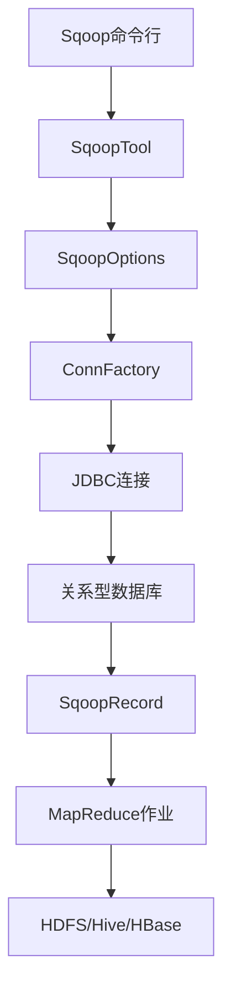
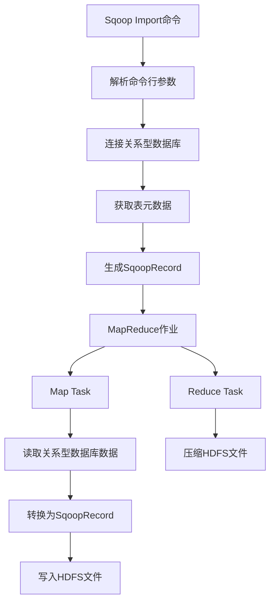
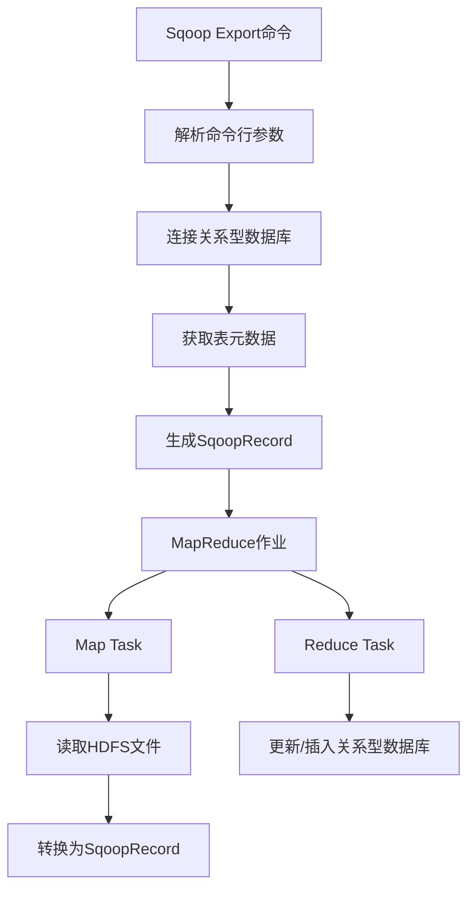

# Sqoop原理与代码实例讲解

## 1.背景介绍

在大数据时代,数据已经成为了企业的核心资产之一。企业中存在着大量的结构化数据和非结构化数据,这些数据存储在不同的系统中,如关系型数据库、NoSQL数据库、文件系统等。为了高效地处理和分析这些海量数据,Apache Hadoop生态圈应运而生。Apache Sqoop是Hadoop生态系统中的一个重要工具,它专门用于在Hadoop生态系统与传统的数据存储系统(如关系型数据库)之间高效传输批量数据。

## 2.核心概念与联系

### 2.1 Sqoop概述

Sqoop是一个用于在Hadoop和关系型数据库之间传输数据的工具。它使用了MapReduce将输入数据并行传输到Hadoop集群中,并且可以使用多种数据传输工具,包括文件流、数据库连接池和并行操作。

Sqoop支持从关系型数据库(如MySQL、Oracle、PostgreSQL等)中导入数据到Hadoop的HDFS、Hive、HBase等系统中,也支持从Hadoop系统导出数据到关系型数据库中。

### 2.2 Sqoop架构

Sqoop的架构由以下几个核心组件组成:

1. **SqoopTool**: Sqoop的主要工具类,提供了所有Sqoop操作的入口点。

2. **SqoopOptions**: 用于解析命令行参数并将其转换为Sqoop内部表示。

3. **SqoopRecord**: 表示关系型数据库中的一行记录。

4. **ConnFactory**: 用于创建与关系型数据库的连接。

5. **CodecMap**: 用于在Sqoop和关系型数据库之间映射数据类型。

6. **MapReduce**: Sqoop使用MapReduce作为并行处理框架。

### 2.3 Sqoop工作流程

Sqoop的工作流程大致如下:



1. 用户通过Sqoop命令行工具输入命令。
2. SqoopTool解析命令并创建SqoopOptions对象。
3. SqoopOptions对象使用ConnFactory创建与关系型数据库的连接。
4. 通过JDBC连接从关系型数据库中读取数据,并将其转换为SqoopRecord对象。
5. SqoopRecord对象作为MapReduce作业的输入,并行导入到Hadoop系统(如HDFS、Hive或HBase)中。

## 3.核心算法原理具体操作步骤

Sqoop的核心算法原理是基于MapReduce框架实现的,具体操作步骤如下:

### 3.1 导入数据(Import)

1. **初始化阶段**:
   - 解析命令行参数
   - 连接到关系型数据库并获取表的元数据信息
   - 根据表结构生成SqoopRecord对象

2. **Map阶段**:
   - 每个Map Task通过JDBC连接从关系型数据库中读取一部分数据
   - 将读取的数据转换为SqoopRecord对象
   - 将SqoopRecord对象写入HDFS文件

3. **Reduce阶段**(可选):
   - 如果启用了压缩,Reduce Task会对Map Task输出的文件进行压缩

### 3.2 导出数据(Export)

1. **初始化阶段**:
   - 解析命令行参数
   - 连接到关系型数据库并获取表的元数据信息
   - 根据表结构生成SqoopRecord对象

2. **Map阶段**:
   - 每个Map Task从HDFS文件中读取一部分数据
   - 将读取的数据转换为SqoopRecord对象

3. **Reduce阶段**(可选):
   - 如果启用了更新模式,Reduce Task会根据主键更新关系型数据库中的记录
   - 如果启用了插入模式,Reduce Task会直接插入数据到关系型数据库中

### 3.3 Sqoop Import命令执行流程



### 3.4 Sqoop Export命令执行流程



## 4.数学模型和公式详细讲解举例说明

在Sqoop的并行导入和导出过程中,需要根据数据量和集群资源情况合理分配Map Task和Reduce Task的数量,以达到最佳的性能表现。Sqoop使用了一些数学模型来估算合适的任务数量。

### 4.1 Map Task数量估算

Sqoop会根据关系型数据库表的大小和每个Map Task所能处理的最大数据量来估算Map Task的数量。具体公式如下:

$$
numMapTasks = \max\left(\left\lceil\frac{tableSize}{maxMapBytesPerMapper}\right\rceil, 4\right)
$$

其中:

- $numMapTasks$: 估算的Map Task数量
- $tableSize$: 关系型数据库表的大小(字节)
- $maxMapBytesPerMapper$: 每个Map Task所能处理的最大数据量(字节),默认为256MB

### 4.2 Reduce Task数量估算

Sqoop会根据Map Task的数量和集群中可用的Reduce Slot数量来估算Reduce Task的数量。具体公式如下:

$$
numReduceTasks = \min\left(numMapTasks, \frac{availableReduceSlots}{maxReducersPerNode}\right)
$$

其中:

- $numReduceTasks$: 估算的Reduce Task数量
- $numMapTasks$: 估算的Map Task数量
- $availableReduceSlots$: 集群中可用的Reduce Slot数量
- $maxReducersPerNode$: 每个节点上可以运行的最大Reduce Task数量

### 4.3 示例

假设我们要导入一个大小为10GB的关系型数据库表到Hadoop集群中,集群有10个节点,每个节点有4个Reduce Slot,且每个Map Task所能处理的最大数据量为256MB。那么,Sqoop会估算出以下任务数量:

1. 估算Map Task数量:

$$
numMapTasks = \max\left(\left\lceil\frac{10 \times 10^9}{256 \times 10^6}\right\rceil, 4\right) = \max(40, 4) = 40
$$

2. 估算Reduce Task数量:

$$
numReduceTasks = \min\left(40, \frac{10 \times 4}{2}\right) = \min(40, 20) = 20
$$

因此,Sqoop会启动40个Map Task和20个Reduce Task来并行导入这个10GB的关系型数据库表。

## 5.项目实践:代码实例和详细解释说明

### 5.1 Sqoop导入数据示例

假设我们要将MySQL中的`employee`表导入到Hadoop的HDFS中,可以使用以下命令:

```bash
sqoop import \
  --connect jdbc:mysql://localhost/mydb \
  --username myuser \
  --password mypassword \
  --table employee \
  --target-dir /user/hadoop/employee \
  --fields-terminated-by '\t'
```

- `--connect`: 指定JDBC连接字符串
- `--username`和`--password`: 指定数据库用户名和密码
- `--table`: 指定要导入的表名
- `--target-dir`: 指定HDFS中的目标目录
- `--fields-terminated-by`: 指定字段分隔符(这里使用制表符`\t`)

如果要并行导入数据,可以添加`--m`参数指定Map Task的数量:

```bash
sqoop import \
  --connect jdbc:mysql://localhost/mydb \
  --username myuser \
  --password mypassword \
  --table employee \
  --target-dir /user/hadoop/employee \
  --fields-terminated-by '\t' \
  --m 8
```

上面的命令会启动8个Map Task并行导入`employee`表的数据。

### 5.2 Sqoop导出数据示例

假设我们要将HDFS中的`/user/hadoop/employee`目录中的数据导出到MySQL的`new_employee`表中,可以使用以下命令:

```bash
sqoop export \
  --connect jdbc:mysql://localhost/mydb \
  --username myuser \
  --password mypassword \
  --table new_employee \
  --export-dir /user/hadoop/employee \
  --input-fields-terminated-by '\t'
```

- `--export-dir`: 指定HDFS中的数据源目录
- `--input-fields-terminated-by`: 指定输入数据的字段分隔符

如果要并行导出数据,可以添加`--m`和`--batch`参数:

```bash
sqoop export \
  --connect jdbc:mysql://localhost/mydb \
  --username myuser \
  --password mypassword \
  --table new_employee \
  --export-dir /user/hadoop/employee \
  --input-fields-terminated-by '\t' \
  --m 4 \
  --batch
```

上面的命令会启动4个Map Task并行导出数据,并启用批处理模式(`--batch`)以提高性能。

## 6.实际应用场景

Sqoop在实际应用中有很多场景,包括但不限于:

1. **数据迁移**: 将企业内部的关系型数据库中的历史数据迁移到Hadoop生态系统中,以便进行大数据分析。

2. **数据集成**: 将来自不同数据源(如关系型数据库、NoSQL数据库、文件系统等)的数据集成到Hadoop生态系统中,为后续的数据处理和分析做准备。

3. **ETL(提取、转换、加载)**: Sqoop可以作为ETL流程的一部分,从关系型数据库中提取数据,并加载到Hadoop生态系统中进行进一步的转换和处理。

4. **定期数据同步**: 利用Sqoop的导入和导出功能,可以实现在关系型数据库和Hadoop生态系统之间定期同步数据,保持数据的一致性。

5. **数据备份**: 将关系型数据库中的数据定期备份到Hadoop的HDFS中,作为数据容灾和备份的一种方式。

6. **实时数据处理**: 结合Sqoop和其他大数据工具(如Kafka、Spark Streaming等),可以实现从关系型数据库中实时获取数据,并进行实时处理和分析。

## 7.工具和资源推荐

除了Sqoop之外,Hadoop生态系统中还有其他一些工具和资源可以帮助我们更好地处理数据:

1. **Apache Hive**: 一个基于Hadoop的数据仓库工具,提供了类SQL的查询语言HiveQL,可以方便地查询和分析存储在HDFS中的数据。

2. **Apache Spark**: 一个快速、通用的大数据处理引擎,提供了Spark SQL、Spark Streaming等模块,可以用于批处理、流处理、机器学习等场景。

3. **Apache Kafka**: 一个分布式流处理平台,可以实现大规模的数据流实时传输和处理。

4. **Apache Flume**: 一个分布式、可靠、高可用的日志收集系统,可以将来自不同源的日志数据聚合到Hadoop生态系统中。

5. **Apache Oozie**: 一个用于管理Hadoop作业的工作流调度系统,可以方便地编排和监控Hadoop作业的执行。

6. **Apache Zookeeper**: 一个分布式协调服务,为分布式应用提供了高性能、高可用的分布式数据一致性解决方案。

7. **Cloudera Manager**: 一个用于管理和监控Hadoop集群的商业工具,提供了友好的Web界面和自动化部署功能。

8. **Hortonworks Data Platform (HDP)**: 一个开源的大数据平台,集成了Hadoop及相关生态系统组件,提供了企业级的支持和服务。

## 8.总结:未来发展趋势与挑战

Sqoop作为Hadoop生态系统中重要的数据集成工具,在未来仍将发挥重要作用。但同时,它也面临着一些挑战和发展趋势:

1. **实时数据集成**: 随着实时