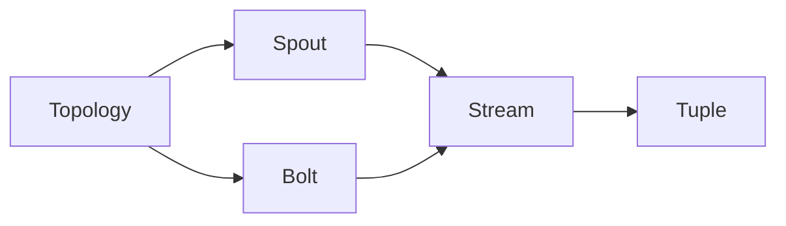

# StormBolt最佳实践：性能调优

## 1. 背景介绍

StormBolt是一个高性能、分布式的实时计算系统,广泛应用于实时数据处理、流式计算等场景。然而,随着数据量的增长和业务复杂度的提升,StormBolt集群的性能问题日益突出。性能调优成为StormBolt使用过程中的重要课题。

本文将深入探讨StormBolt性能调优的最佳实践,从多个角度对StormBolt集群进行优化,提升系统吞吐量和处理延迟。通过对核心概念、算法原理、数学模型的详细阐述,并结合具体的代码实例和应用场景,为读者提供全面、系统的性能调优指南。

### 1.1 StormBolt简介
#### 1.1.1 StormBolt的架构与工作原理
#### 1.1.2 StormBolt的主要特性
#### 1.1.3 StormBolt在实时计算领域的应用现状

### 1.2 性能瓶颈分析 
#### 1.2.1 资源利用率低下
#### 1.2.2 数据倾斜问题
#### 1.2.3 序列化和反序列化开销
#### 1.2.4 网络传输效率低

### 1.3 性能调优的目标与原则
#### 1.3.1 提升系统吞吐量
#### 1.3.2 降低处理延迟
#### 1.3.3 优化资源利用率
#### 1.3.4 保证数据的准确性和完整性

## 2. 核心概念与关联

要进行StormBolt性能调优,首先需要理解其中的核心概念,明确它们之间的关联关系。本章将重点介绍Topology、Spout、Bolt、Stream、Tuple等核心概念。

### 2.1 Topology
#### 2.1.1 Topology的定义与结构
#### 2.1.2 Topology的并行度
#### 2.1.3 Topology的调度模式

### 2.2 Spout
#### 2.2.1 Spout的功能与作用
#### 2.2.2 Spout的可靠性机制
#### 2.2.3 Spout的性能考量

### 2.3 Bolt
#### 2.3.1 Bolt的功能与作用  
#### 2.3.2 Bolt的执行语义
#### 2.3.3 Bolt的性能考量

### 2.4 Stream 
#### 2.4.1 Stream的定义与类型
#### 2.4.2 Stream Grouping策略
#### 2.4.3 Stream的可靠性传输

### 2.5 Tuple
#### 2.5.1 Tuple的定义与结构
#### 2.5.2 Tuple的生命周期
#### 2.5.3 Tuple的序列化优化

下图展示了StormBolt核心概念之间的关联关系:



## 3. 核心算法原理与操作步骤

StormBolt性能调优的关键在于对核心算法的优化。本章将重点介绍StormBolt中的核心算法原理,并给出具体的操作步骤。

### 3.1 数据分区算法
#### 3.1.1 一致性哈希分区
#### 3.1.2 随机分区
#### 3.1.3 自定义分区

### 3.2 任务调度算法
#### 3.2.1 默认调度器
#### 3.2.2 隔离调度器 
#### 3.2.3 资源感知调度器

### 3.3 容错恢复算法
#### 3.3.1 Acker机制
#### 3.3.2 事务性Topology
#### 3.3.3 状态恢复机制

### 3.4 反压算法
#### 3.4.1 反压机制原理
#### 3.4.2 反压策略
#### 3.4.3 反压阈值设置

### 3.5 算法优化步骤
#### 3.5.1 分析Topology瓶颈
#### 3.5.2 选择合适的算法
#### 3.5.3 调整算法参数
#### 3.5.4 测试验证性能

## 4. 数学模型与公式详解

为了更好地理解和优化StormBolt性能,需要建立相应的数学模型。本章将详细讲解StormBolt性能相关的数学模型和公式,并给出具体的举例说明。

### 4.1 Topology吞吐量模型
Topology吞吐量可以用下面的公式表示:

$$ T = \frac{\sum_{i=1}^{n} t_i}{n} $$

其中,$T$表示Topology的平均吞吐量,$t_i$表示第$i$个Tuple的处理时间,$n$表示Tuple的数量。

### 4.2 Bolt处理延迟模型
Bolt处理延迟可以用下面的公式表示:

$$ L = \frac{\sum_{i=1}^{n} (t_{i,e} - t_{i,s})}{n} $$

其中,$L$表示Bolt的平均处理延迟,$t_{i,s}$表示第$i$个Tuple的开始处理时间,$t_{i,e}$表示第$i$个Tuple的完成处理时间。

### 4.3 数据倾斜度模型
数据倾斜度可以用基尼系数来衡量:

$$ G = \frac{\sum_{i=1}^{n} (2i-n-1)x_i}{n\sum_{i=1}^{n} x_i} $$

其中,$G$表示基尼系数,$x_i$表示第$i$个分区的数据量,$n$表示分区总数。$G$的取值范围为$[0,1]$,越接近0表示数据分布越均匀。

### 4.4 反压阈值计算
反压阈值可以根据Bolt的处理能力和Topology的吞吐量需求来设置:

$$ B_t = \frac{T_r}{P_b} $$

其中,$B_t$表示Bolt的反压阈值,$T_r$表示Topology的目标吞吐量,$P_b$表示Bolt的处理能力。

## 5. 项目实践:代码实例与详解

本章将通过具体的代码实例,演示如何在StormBolt项目中进行性能调优。代码使用Java语言编写,并给出详细的注释说明。

### 5.1 优化Spout的数据读取

```java
public class OptimizedSpout extends BaseRichSpout {
    private SpoutOutputCollector collector;
    private FileReader reader;
    
    @Override
    public void open(Map conf, TopologyContext context, SpoutOutputCollector collector) {
        this.collector = collector;
        // 使用BufferedReader优化文件读取
        this.reader = new BufferedReader(new FileReader("data.txt"));
    }
    
    @Override
    public void nextTuple() {
        String line = reader.readLine();
        if (line != null) {
            // 使用Fields Grouping优化Tuple路由
            collector.emit(new Values(line), new Fields("line"));
        }
    }
    
    // ...
}
```

### 5.2 优化Bolt的执行逻辑

```java
public class OptimizedBolt extends BaseBasicBolt {
    private Map<String, Integer> countMap = new HashMap<>();
    
    @Override
    public void execute(Tuple input, BasicOutputCollector collector) {
        String word = input.getStringByField("word");
        // 使用Map优化单词计数
        countMap.put(word, countMap.getOrDefault(word, 0) + 1);
    }
    
    @Override
    public void declareOutputFields(OutputFieldsDeclarer declarer) {
        // 使用Direct Grouping优化Tuple路由
        declarer.declare(new Fields("word", "count"), new DirectGrouping());
    }
    
    // ...
}
```

### 5.3 优化Topology的并行度

```java
Config conf = new Config();
// 设置Worker数量
conf.setNumWorkers(4);

// 设置Spout和Bolt的并行度
conf.setSpout("spout", new OptimizedSpout(), 2);
conf.setBolt("split", new SplitSentenceBolt(), 4).shuffleGrouping("spout");
conf.setBolt("count", new OptimizedBolt(), 4).fieldsGrouping("split", new Fields("word"));

// 提交Topology
StormSubmitter.submitTopology("WordCountTopology", conf, builder.createTopology());
```

## 6. 实际应用场景

StormBolt性能调优在实际应用中有广泛的适用场景。本章将列举几个典型的应用案例,展示性能调优的重要性和效果。

### 6.1 实时日志处理
在互联网业务中,需要对海量的用户日志进行实时分析,统计PV、UV等指标。通过对日志处理Topology进行性能调优,可以大幅提升系统的处理能力和响应速度。

### 6.2 实时推荐系统
电商网站通常会根据用户的行为数据,实时生成个性化的商品推荐。StormBolt可以对用户行为事件流进行实时处理,通过性能调优,保证推荐结果的时效性和准确性。

### 6.3 金融风控系统
金融机构需要对交易数据进行实时监控,识别异常行为和潜在风险。StormBolt可以对交易事件流进行复杂的规则匹配和模式识别,通过性能调优,实现毫秒级的风险预警。

## 7. 工具与资源推荐

StormBolt性能调优是一个复杂的过程,需要借助各种工具和资源。本章推荐了几个常用的性能调优工具和学习资源。

### 7.1 性能监控工具
- Storm UI:Storm自带的Web管理界面,可以查看Topology的运行状态和性能指标。
- JProfiler:Java应用性能分析工具,可以对Topology进行内存、CPU等方面的性能剖析。

### 7.2 性能测试工具
- JMeter:常用的负载测试工具,可以模拟大规模的并发访问,测试Topology的性能表现。
- LoadRunner:企业级性能测试工具,支持多种协议和负载类型,可以全面评估Topology的性能。

### 7.3 学习资源
- 官方文档:StormBolt的官方文档提供了详尽的使用指南和性能调优建议。
- 技术博客:关注StormBolt社区的技术博客,学习其他用户的优化经验和最佳实践。
- 技术交流:积极参与StormBolt的技术交流群组,与其他用户分享优化心得。

## 8. 总结:未来发展与挑战

StormBolt作为主流的实时计算引擎,在性能调优方面还有很大的发展空间。未来StormBolt将在以下几个方向继续优化:

### 8.1 智能化调优
利用机器学习技术,自动分析Topology的运行状态,给出最优的调优参数和策略。

### 8.2 硬件加速 
通过与高性能硬件如FPGA、GPU等结合,进一步提升StormBolt的计算性能。

### 8.3 云原生支持
适配Kubernetes等云原生平台,实现StormBolt的弹性伸缩和动态调度。

同时,StormBolt性能调优也面临着不少挑战:

### 8.4 复杂的业务逻辑
实际应用中的业务逻辑往往非常复杂,导致Topology的结构难以优化。需要在性能和功能之间进行权衡。

### 8.5 多样的数据源
StormBolt需要处理来自多个数据源的异构数据,数据的变化和噪音会影响Topology的性能表现。

### 8.6 资源的动态变化
集群中的计算和网络资源是动态变化的,如何根据资源的实时状态来调整Topology,是一大挑战。

## 9. 附录:常见问题与解答

### Q1:如何确定Topology的最佳并行度?
A1:并行度需要根据集群资源、数据量、处理逻辑等因素综合考虑。可以先设置较小的并行度,然后逐步增加,直到性能不再提升。

### Q2:Topology如何实现exactly-once语义?
A2:可以在Spout和Bolt中引入事务机制,通过ack和fail方法来保证每个Tuple只被处理一次。同时需要在Bolt中使用幂等的更新操作。

### Q3:数据倾斜问题如何解决?
A3:数据倾斜通常是由于分区算法选择不当导致的。可以尝试使用更加均匀的分区算法如一致性哈希,必要时可以自定义分区器。

### Q4:GC暂停对Topology有何影响?
A4:GC暂停会导致Tuple处理出现延迟,引起系统抖动。可以通过调整JVM参数,选择合适的GC算法,减少GC暂停的影响。

### Q5:StormBolt如何与Kafka集成?
A5:StormBolt提供了内置的Kafka Spout和Bolt,可以方便地与Kafka集成。在Kafka Consumer端,可以启用自动提交