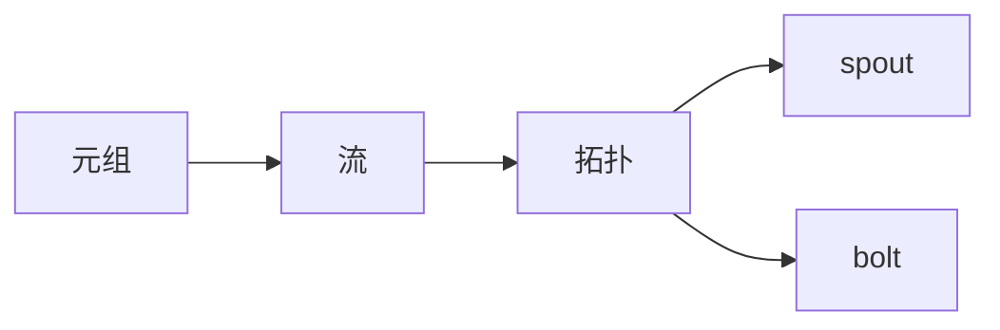

## 1.背景介绍
Storm是一个开源的分布式实时计算系统，它能够提供可靠的实时数据处理。Storm的主要优势在于它能够保证每一个元组都会被处理，并且它提供了一种简单的编程模型，使得开发者可以很容易地实现复杂的数据处理逻辑。Storm的应用场景非常广泛，包括实时分析、在线机器学习、连续计算、分布式RPC、ETL等。

## 2.核心概念与联系
Storm的核心概念包括元组、流、拓扑、spout和bolt。元组是Storm中的数据单元，流是元组的序列，拓扑是Storm的计算图，spout是拓扑的数据源，bolt是处理数据的组件。



## 3.核心算法原理具体操作步骤
Storm的核心算法原理包括元组的处理、流的分组、拓扑的构建和任务的调度。

元组的处理是Storm的基础，每个元组都会被spout或bolt处理，处理完的元组会被发送到下游的bolt。

流的分组决定了元组如何被发送到下游的bolt，Storm提供了多种分组策略，如shuffle grouping、fields grouping等。

拓扑的构建是定义Storm计算的过程，开发者需要定义spout和bolt，以及他们的连接方式。

任务的调度是Storm的运行机制，Storm会根据拓扑和集群资源来决定任务的分配和执行。

## 4.数学模型和公式详细讲解举例说明
Storm的模型可以用图论来描述，拓扑是一个有向无环图，其中节点是spout和bolt，边是流。流的分组可以用函数来描述，例如shuffle grouping可以用随机函数来描述，fields grouping可以用哈希函数来描述。

设$T$是元组的集合，$S$是spout的集合，$B$是bolt的集合，$F$是流的集合，$G$是分组的集合，$H$是拓扑，那么我们可以用以下公式来描述Storm的模型：

$$H = (S \cup B, F, G)$$

其中$S \cup B$是节点的集合，$F$是边的集合，$G$是分组的集合。

## 5.项目实践：代码实例和详细解释说明
下面是一个简单的Storm拓扑的代码实例，它包括一个spout和一个bolt，spout生成随机数字，bolt将数字加一。

```java
public class SimpleTopology {
    public static void main(String[] args) {
        // 定义拓扑
        TopologyBuilder builder = new TopologyBuilder();
        builder.setSpout("RandomSpout", new RandomSpout());
        builder.setBolt("AddOneBolt", new AddOneBolt()).shuffleGrouping("RandomSpout");

        // 提交拓扑
        Config config = new Config();
        LocalCluster cluster = new LocalCluster();
        cluster.submitTopology("SimpleTopology", config, builder.createTopology());

        // 等待10秒，然后关闭拓扑
        Utils.sleep(10000);
        cluster.killTopology("SimpleTopology");
        cluster.shutdown();
    }
}
```

## 6.实际应用场景
Storm广泛应用于实时数据处理的场景，例如实时分析、在线机器学习、连续计算、分布式RPC、ETL等。例如，Twitter使用Storm进行实时分析，Yahoo使用Storm进行在线广告优化，Alibaba使用Storm进行实时搜索引擎的更新。

## 7.工具和资源推荐
推荐使用以下工具和资源学习和使用Storm：
- Apache Storm官方网站：提供详细的文档和教程。
- Storm Starter项目：提供Storm的示例代码。
- Storm on YARN：使Storm可以运行在YARN上。
- Storm-kafka项目：使Storm可以接收Kafka的数据。

## 8.总结：未来发展趋势与挑战
Storm的发展趋势是向大数据和AI领域延伸，例如支持更多的数据源、更高的处理能力、更复杂的计算模型等。Storm的挑战是如何在保证实时性的同时，提高数据的准确性和可靠性。

## 9.附录：常见问题与解答
1. 问题：Storm和Hadoop有什么区别？
   答：Storm是实时计算系统，Hadoop是批处理系统，他们的主要区别在于处理数据的速度和方式。

2. 问题：如何调优Storm的性能？
   答：调优Storm的性能可以从以下几个方面来考虑：调整并行度，优化代码，选择合适的分组策略，合理配置资源。

3. 问题：Storm如何保证数据的可靠性？
   答：Storm通过元组的ack机制来保证数据的可靠性，每个元组都会被跟踪，如果元组在处理过程中丢失，Storm会重新发送该元组。

作者：禅与计算机程序设计艺术 / Zen and the Art of Computer Programming