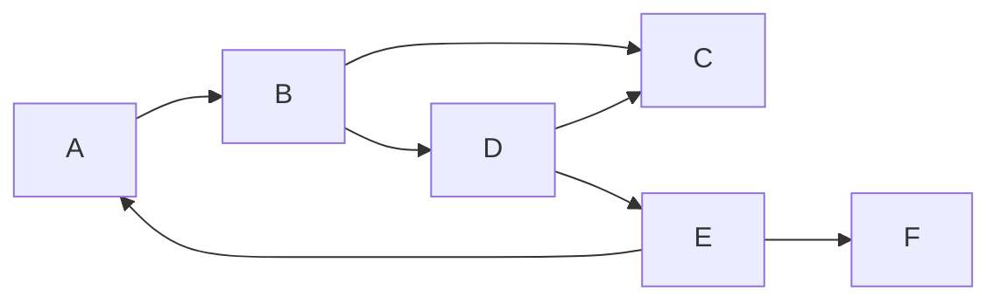
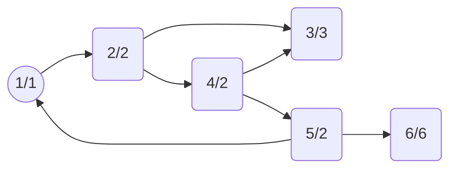
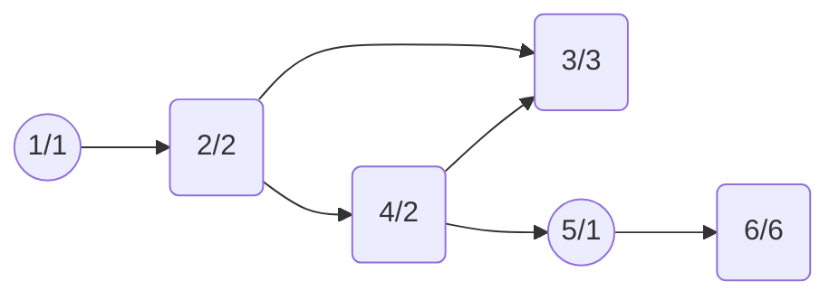
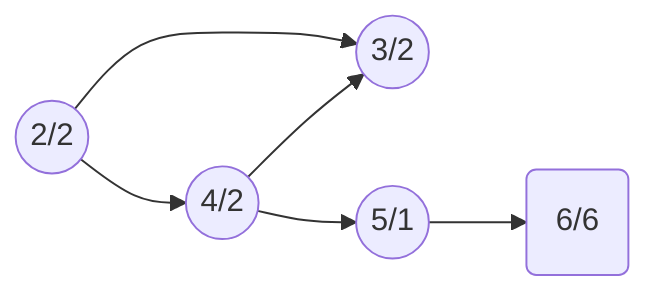
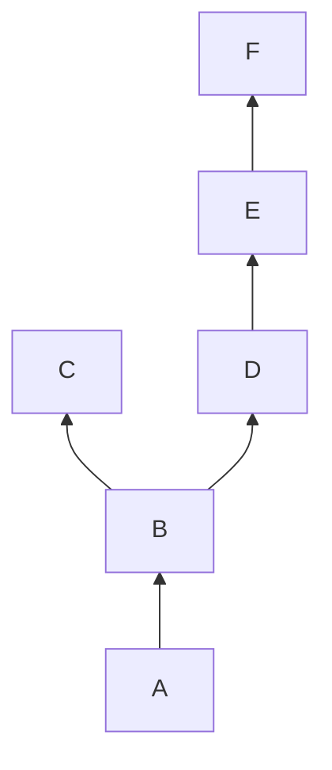

# Strongly Connected Components强连通分量算法原理与代码实例讲解

## 1.背景介绍

在图论中,强连通分量(Strongly Connected Components, SCC)是一个重要的概念。对于一个有向图G(V,E),如果从任意一个节点v出发,都存在一条路径可以到达其他所有节点,并且从其他节点出发也都存在一条路径可以回到v,那么这个有向图就是强连通的。而强连通分量指的是一个最大的强连通子图。

强连通分量在很多领域都有广泛的应用,比如:

- 编译器中的循环检测
- 网页排名算法(PageRank)
- 机器人路径规划
- 生命游戏等蔓延现象的模拟
- 社交网络中的社区发现
- 数据库中的垃圾回收

因此,能够高效地计算出一个有向图的所有强连通分量是非常有价值的。

## 2.核心概念与联系

### 2.1 有向图和强连通分量

有向图(Directed Graph)是一种包含有向边的图,边有确定的方向。强连通分量是有向图中的一个重要概念。

**定义:** 在一个有向图G中,如果两个节点u和v是可互相到达的,即从u出发可以到达v,从v出发也可以到达u,那么这两个节点就在同一个强连通分量中。一个强连通分量是一个最大的满足这个性质的子图。

简单来说,强连通分量就是有向图中一个最大的子图,其中任意两个节点之间都是互相可达的。

### 2.2 强连通分量与其他图论概念的关系

- **连通分量:** 无向图中的等价概念是连通分量,即两个节点之间存在一条无向路径。
- **缩点:** 在一个有向图中,如果把每个强连通分量缩点成一个节点,那么这个新图就是一个有向无环图(DAG)。
- **拓扑排序:** 在一个有向无环图(DAG)中,拓扑排序可以给出一个线性顺序,使得对于任意一条有向边(u,v),u在v之前。强连通分量之间的这种拓扑顺序对很多应用是很有用的。

## 3.核心算法原理具体操作步骤

计算一个有向图的强连通分量,最常用的算法是Kosaraju算法(1978年提出)和Tarjan算法(1972年提出)。这两种算法的时间复杂度都是线性的O(V+E)。

这里重点介绍Tarjan算法的原理和实现步骤。

### 3.1 Tarjan算法原理

Tarjan算法的核心思想是通过DFS(深度优先搜索)来发现强连通分量。算法从一个未被访问过的节点开始DFS遍历,并且给每个被遍历到的节点分配两个值:

1. **discovery time(发现时间):** 节点第一次被遍历到的序号。
2. **low value:** 从该节点开始,通过无向的树边和有向的反向边能到达的节点中,发现时间最小的那个节点的发现时间。

在DFS的过程中,如果某个节点的low value等于自己的发现时间,那么从根节点到该节点这个序列就构成了一个强连通分量。

算法的伪代码如下:

```python
algorithm tarjan(G):
    for each node v in G:
        if v is not visited:
            dfs(G, v)

dfs(G, v):
    set v as visited
    push v to stack 
    discovery_time[v] := counter  // assign discovery time
    low[v] := counter  // initialize low value
    counter += 1

    # Recurse for all neighbors
    for each neighbor w of v in G:  
        if w is not visited:
            parent[w] := v  // keep track of parent
            dfs(G, w)
            low[v] := min(low[v], low[w])  // update low value of v
        elif w is not ancestor of v:
            low[v] := min(low[v], discovery_time[w])

    # After recursion
    if low[v] == discovery_time[v]:  // if v is a root of an SCC
        start_scc := v
        while True:
            w := stack.pop()
            print w  # output nodes in this SCC
            if w == start_scc:
                break
```

上面的伪代码展示了Tarjan算法的核心思路。算法从一个未访问过的节点开始DFS遍历,并在遍历的同时维护每个节点的发现时间和low value。如果某个节点的low value等于自己的发现时间,那么就输出从栈顶到该节点之间的节点序列,它们就构成了一个强连通分量。

### 3.2 算法步骤示例

以下面这个有向图为例,演示一下Tarjan算法的具体步骤:



1) 从节点A开始DFS遍历:



- 节点A的发现时间是1,low value也是1
- 节点B的发现时间是2,low value是2
- 节点C的发现时间是3,low value是3
- 节点D的发现时间是4,但从D可以通过反向边回到B,所以low value是2
- 节点E的发现时间是5,但从E可以通过反向边回到A,所以low value是1
- 节点F的发现时间和low value都是6

2) 从E开始输出第一个强连通分量{E, A}:



3) 继续DFS,从B开始输出第二个强连通分量{B, D, C}:



4) 最后剩下F自己构成第三个强连通分量。

通过这个示例可以看出,Tarjan算法通过非常巧妙的方式在线性时间内计算出了所有的强连通分量。

## 4.数学模型和公式详细讲解举例说明

Tarjan算法中使用了一些数学概念和公式,下面详细讲解一下。

### 4.1 DFS树和树边

在Tarjan算法中,通过DFS遍历构造出一个有向树,称为DFS树。树中的边称为树边(tree edge)。

例如,在前面的示例图中,DFS树如下所示:



其中A->B, B->C, B->D, D->E, E->F都是树边。

### 4.2 发现时间(Discovery Time)

在DFS遍历过程中,每个节点都会被分配一个发现时间(Discovery Time),即第一次被遍历到的序号。在Tarjan算法中,发现时间用来确定节点被遍历的先后顺序。

例如,在前面的示例中,各个节点的发现时间如下:

- A: 1
- B: 2  
- C: 3
- D: 4
- E: 5
- F: 6

### 4.3 Low Value

对于每个节点v,low value定义为:从v开始,通过无向的树边和有向的反向边能到达的节点中,发现时间最小的那个节点的发现时间。

用数学语言描述,对于节点v,令F(v)表示从v出发能到达的节点的集合,包括通过树边和反向边,则:

$$\text{low}(v) = \min_{u \in F(v)} \{\text{discovery\_time}(u)\}$$

low value的计算方式如下:

- 初始时,low(v) = discovery_time(v)
- 对于v的每个邻居w:
    - 如果w是树边邻居,则low(v) = min(low(v), low(w))
    - 如果w是反向边邻居,则low(v) = min(low(v), discovery_time(w))

通过计算low value,我们可以发现强连通分量的根节点。如果节点v满足low(v) = discovery_time(v),那么v就是一个强连通分量的根,从栈顶一直到v就构成了这个强连通分量。

### 4.4 时间复杂度分析

Tarjan算法的时间复杂度为线性的O(V+E),其中V是节点数,E是边数。

- 初始化各种数据结构的时间复杂度为O(V)
- 每个节点最多被访问两次(一次树边,一次反向边),时间复杂度为O(V+E)
- 计算low value的时间复杂度为O(V+E)
- 输出强连通分量的时间复杂度为O(V+E)

因此,总的时间复杂度为O(V+E)。

对于一个连通图,E的数量级通常为O(V),因此Tarjan算法的时间复杂度可以简化为O(V)。这是一个非常高效的算法。

## 5.项目实践:代码实例和详细解释说明

下面给出Tarjan算法的Python代码实现,并详细解释每一步的作用。

```python
from collections import defaultdict

class Graph:
    def __init__(self, vertices):
        self.graph = defaultdict(list)
        self.vertices = vertices

    def add_edge(self, u, v):
        self.graph[u].append(v)

    def tarjan(self):
        self.stack = []
        self.low = {}
        self.disc = {}
        self.time = 0
        self.components = []

        for v in self.vertices:
            if v not in self.disc:
                self.dfs(v)

        return self.components

    def dfs(self, v):
        self.disc[v] = self.time
        self.low[v] = self.time
        self.time += 1
        self.stack.append(v)

        for w in self.graph[v]:
            if w not in self.disc:
                self.dfs(w)
                self.low[v] = min(self.low[v], self.low[w])
            elif w in self.stack:
                self.low[v] = min(self.low[v], self.disc[w])

        component = []
        if self.low[v] == self.disc[v]:
            while True:
                w = self.stack.pop()
                component.append(w)
                if w == v:
                    break
            self.components.append(component)

# 使用示例
vertices = [1, 2, 3, 4, 5, 6]
g = Graph(vertices)
g.add_edge(1, 2)
g.add_edge(2, 3)
g.add_edge(2, 4)
g.add_edge(4, 3)
g.add_edge(4, 5)
g.add_edge(5, 1)
g.add_edge(5, 6)

sccs = g.tarjan()
print("强连通分量:")
for scc in sccs:
    print(scc)
```

上面的代码实现了一个Graph类,其中包含了Tarjan算法的核心逻辑。下面详细解释一下代码的各个部分:

1. `__init__(self, vertices)`: 初始化图,使用defaultdict存储邻接表。
2. `add_edge(self, u, v)`: 添加一条有向边u->v。
3. `tarjan(self)`: 这是算法的主函数,它遍历所有未被访问过的节点,对每个节点调用dfs函数。
4. `dfs(self, v)`: 这是算法的核心部分,实现了Tarjan算法的递归逻辑。
    - 首先给节点v分配发现时间和初始化low value。
    - 将v压入栈中。
    - 对于v的每个邻居w:
        - 如果w未被访问过,则递归调用dfs(w),并更新v的low value。
        - 如果w在栈中(是v的祖先),则更新v的low value为min(low[v], disc[w])。
    - 如果low[v] == disc[v],说明v是一个强连通分量的根。从栈顶开始输出节点,直到遇到v为止,这些节点就构成了一个强连通分量。
5. 在主程序中,我们创建了一个示例图,并调用tarjan函数计算强连通分量。最后输出所有的强连通分量。

运行上面的代码,输出结果如下:

```
强连通分量:
[5, 1]
[2, 3, 4]
[6]
```

这个结果与我们之前的示例分析是一致的。

通过这个实现,你可以看到Tarjan算法的精髓所在:

- 使用DFS遍历发现强连通分量
- 利用栈的数据结构来存储当前的DFS路径
- 通过发现时间和low value来判断是否找到了一个强连通分量的根节点
-