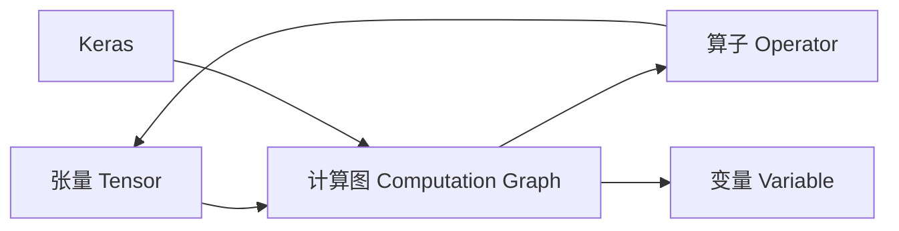

# TensorFlow：深度学习框架

## 1. 背景介绍

### 1.1 深度学习的兴起

深度学习是机器学习的一个分支,它模仿人脑的结构和功能,使用多层神经网络对数据进行建模。近年来,随着计算能力的提升和大数据的普及,深度学习取得了突破性的进展,在计算机视觉、自然语言处理、语音识别等领域取得了超越人类的表现。

### 1.2 深度学习框架的必要性

为了让更多的开发者和研究人员能够方便地构建和训练深度学习模型,各大科技公司和开源社区纷纷推出了自己的深度学习框架。这些框架提供了高层的、直观的API,屏蔽了底层复杂的数学计算,使得非专业人士也能快速上手深度学习。

### 1.3 TensorFlow的诞生

TensorFlow是由Google Brain团队开发的开源深度学习框架。它诞生于2015年11月,是基于Google之前的深度学习基础架构DistBelief进行改进和升级而来。TensorFlow提供了一个灵活的架构,可以在各种异构设备上部署计算,包括CPU、GPU、TPU等,同时支持图模式和Eager Execution两种执行模式。

## 2. 核心概念与联系

### 2.1 张量(Tensor)

张量是TensorFlow的基本数据单元。它可以简单理解为多维数组,但比Numpy的ndarray更加灵活和高效。张量有两个重要属性:数据类型和形状。TensorFlow支持14种数据类型,包括实数、整数、布尔、字符串等。张量的形状(shape)描述了每个维度的大小。

### 2.2 计算图(Computation Graph) 

TensorFlow使用数据流图(Data Flow Graph)来表示计算任务。在图中,节点表示数学操作,边表示在节点之间传递的多维数据数组(张量)。TensorFlow程序通常分为两个阶段:构建阶段和执行阶段。在构建阶段,定义计算图中所有的张量和操作;在执行阶段,通过Session来运行计算图。

### 2.3 算子(Operator)

算子是构建计算图的基本单元。TensorFlow提供了大量的内置算子,包括数学运算、张量操作、控制流、状态管理等。每个算子接受一个或多个张量作为输入,经过计算后产生一个或多个张量作为输出。自定义算子可以用C++或Python来实现。

### 2.4 变量(Variable)

变量用于存储和更新模型的参数,例如神经网络的权重和偏置。与普通张量不同,变量的值在计算图运行时是可变的。变量需要显式初始化,可以通过assign等算子来修改其值。TensorFlow提供了优化器(Optimizer),用于自动更新模型变量以最小化损失函数。

### 2.5 Keras

Keras是一个高层的神经网络API,由纯Python编写而成并基于TensorFlow、CNTK或Theano。它能够以最小的代价构建和训练深度学习模型。TensorFlow集成了Keras,提供了更加简单和直观的模型构建方式。使用Keras Sequential API可以快速搭建常见的卷积神经网络和循环神经网络。

核心概念之间的联系可以用下图来表示:



## 3. 核心算法原理具体操作步骤

### 3.1 前向传播

前向传播是指将输入数据通过神经网络模型,计算得到输出。对于一个L层的神经网络,前向传播可以表示为:

$$
\begin{aligned}
\mathbf{z}^{[1]} &= \mathbf{W}^{[1]}\mathbf{x} + \mathbf{b}^{[1]} \\
\mathbf{a}^{[1]} &= g^{[1]}(\mathbf{z}^{[1]}) \\
\mathbf{z}^{[2]} &= \mathbf{W}^{[2]}\mathbf{a}^{[1]} + \mathbf{b}^{[2]} \\ 
\mathbf{a}^{[2]} &= g^{[2]}(\mathbf{z}^{[2]}) \\
&\ldots \\
\mathbf{z}^{[L]} &= \mathbf{W}^{[L]}\mathbf{a}^{[L-1]} + \mathbf{b}^{[L]} \\
\hat{\mathbf{y}} &= g^{[L]}(\mathbf{z}^{[L]}) 
\end{aligned}
$$

其中,$\mathbf{W}^{[l]},\mathbf{b}^{[l]}$分别表示第$l$层的权重和偏置,$g^{[l]}$表示第$l$层的激活函数,$\hat{\mathbf{y}}$表示网络的输出。

在TensorFlow中,可以使用tf.keras.Sequential搭建前向传播网络:

```python
model = tf.keras.Sequential([
    tf.keras.layers.Dense(256, activation='relu'),
    tf.keras.layers.Dense(128, activation='relu'),
    tf.keras.layers.Dense(10, activation='softmax')
])
```

### 3.2 损失函数

损失函数衡量了模型预测值与真实值之间的差距。常见的损失函数包括均方误差(MSE)和交叉熵(Cross Entropy)。对于二分类问题,交叉熵损失为:

$$
J(\mathbf{w},b) = -\frac{1}{m} \sum_{i=1}^m \left[ y^{(i)} \log \hat{y}^{(i)} + (1-y^{(i)}) \log (1-\hat{y}^{(i)}) \right]
$$

其中$y^{(i)}$表示第$i$个样本的真实标签,$\hat{y}^{(i)}$表示模型预测的概率值。

在TensorFlow中,可以通过tf.keras.losses模块来计算损失:

```python
loss_fn = tf.keras.losses.SparseCategoricalCrossentropy()
loss = loss_fn(y_true, y_pred)
```

### 3.3 反向传播

反向传播是一种高效计算梯度的算法,它利用链式法则,从后向前逐层计算每个参数的梯度。对于第$l$层的权重$\mathbf{W}^{[l]}$,其梯度为:

$$
\frac{\partial J}{\partial \mathbf{W}^{[l]}} = \frac{1}{m} \mathbf{\delta}^{[l]} (\mathbf{a}^{[l-1]})^T
$$

其中$\mathbf{\delta}^{[l]}$表示第$l$层的误差,它的计算公式为:

$$
\mathbf{\delta}^{[l]} = \begin{cases} 
\nabla_{\mathbf{a}^{[L]}} J \odot g'^{[L]}(\mathbf{z}^{[L]}), & l = L \\
((\mathbf{W}^{[l+1]})^T \mathbf{\delta}^{[l+1]}) \odot g'^{[l]}(\mathbf{z}^{[l]}), & l < L
\end{cases}
$$

TensorFlow会自动计算反向传播,只需要调用tape.gradient即可:

```python
with tf.GradientTape() as tape:
    y_pred = model(x)
    loss = loss_fn(y_true, y_pred)
grads = tape.gradient(loss, model.trainable_variables)
```

### 3.4 参数更新

在计算出梯度后,需要更新模型参数以最小化损失函数。最简单的更新策略是梯度下降:

$$
\mathbf{W}^{[l]} := \mathbf{W}^{[l]} - \alpha \frac{\partial J}{\partial \mathbf{W}^{[l]}}
$$

其中$\alpha$表示学习率。TensorFlow提供了多种优化器,如Adam、RMSprop等,可以自适应地调整学习率:

```python
optimizer = tf.keras.optimizers.Adam(learning_rate=0.01)
optimizer.apply_gradients(zip(grads, model.trainable_variables))
```

## 4. 数学模型和公式详细讲解举例说明

### 4.1 线性回归

线性回归是一种简单但实用的机器学习算法。它试图学习输入$\mathbf{x}$和输出$y$之间的线性关系:

$$
\hat{y} = \mathbf{w}^T\mathbf{x} + b
$$

其中$\mathbf{w}$和$b$分别表示权重向量和偏置。给定训练集$\{(\mathbf{x}^{(i)}, y^{(i)}); i=1,\ldots,m\}$,线性回归的目标是最小化均方误差损失:

$$
J(\mathbf{w},b) = \frac{1}{2m} \sum_{i=1}^m (\hat{y}^{(i)} - y^{(i)})^2
$$

利用梯度下降法,权重$\mathbf{w}$和偏置$b$的更新公式为:

$$
\begin{aligned}
\mathbf{w} &:= \mathbf{w} - \alpha \frac{1}{m} \sum_{i=1}^m (\hat{y}^{(i)} - y^{(i)}) \mathbf{x}^{(i)} \\
b &:= b - \alpha \frac{1}{m} \sum_{i=1}^m (\hat{y}^{(i)} - y^{(i)})
\end{aligned}
$$

在TensorFlow中实现线性回归的代码如下:

```python
class LinearRegression(tf.keras.Model):
    def __init__(self):
        super().__init__()
        self.dense = tf.keras.layers.Dense(
            units=1,
            activation=None,
            kernel_initializer=tf.zeros_initializer(),
            bias_initializer=tf.zeros_initializer()
        )

    def call(self, input):
        output = self.dense(input)
        return output

model = LinearRegression()
optimizer = tf.keras.optimizers.SGD(learning_rate=0.01)
loss_fn = tf.keras.losses.MeanSquaredError()

for epoch in range(100):
    with tf.GradientTape() as tape:
        y_pred = model(x)
        loss = loss_fn(y_true, y_pred)
    grads = tape.gradient(loss, model.trainable_variables)
    optimizer.apply_gradients(zip(grads, model.trainable_variables))
```

### 4.2 逻辑回归

逻辑回归是一种常用的二分类算法。它在线性回归的基础上,引入了Sigmoid函数对输出进行压缩,将其映射到(0,1)区间:

$$
\hat{y} = \sigma(\mathbf{w}^T\mathbf{x} + b) = \frac{1}{1+e^{-(\mathbf{w}^T\mathbf{x} + b)}}
$$

其中$\hat{y}$表示样本属于正类的概率。逻辑回归采用交叉熵损失函数:

$$
J(\mathbf{w},b) = -\frac{1}{m} \sum_{i=1}^m \left[ y^{(i)} \log \hat{y}^{(i)} + (1-y^{(i)}) \log (1-\hat{y}^{(i)}) \right]
$$

利用梯度下降法,权重$\mathbf{w}$和偏置$b$的更新公式为:

$$
\begin{aligned}
\mathbf{w} &:= \mathbf{w} - \alpha \frac{1}{m} \sum_{i=1}^m (\hat{y}^{(i)} - y^{(i)}) \mathbf{x}^{(i)} \\  
b &:= b - \alpha \frac{1}{m} \sum_{i=1}^m (\hat{y}^{(i)} - y^{(i)})
\end{aligned}
$$

在TensorFlow中实现逻辑回归的代码如下:

```python
class LogisticRegression(tf.keras.Model):
    def __init__(self):
        super().__init__()
        self.dense = tf.keras.layers.Dense(
            units=1,
            activation=tf.sigmoid,
            kernel_initializer=tf.zeros_initializer(),
            bias_initializer=tf.zeros_initializer()
        )

    def call(self, input):
        output = self.dense(input)
        return output

model = LogisticRegression()
optimizer = tf.keras.optimizers.SGD(learning_rate=0.01)  
loss_fn = tf.keras.losses.BinaryCrossentropy()

for epoch in range(100):
    with tf.GradientTape() as tape:
        y_pred = model(x)
        loss = loss_fn(y_true, y_pred)
    grads = tape.gradient(loss, model.trainable_variables)
    optimizer.apply_gradients(zip(grads, model.trainable_variables))
```

## 5. 项目实践：代码实例和详细解释说明

下面以MNIST手写数字识别为例,演示如何使用TensorFlow构建和训练一个卷积神经网络。

### 5.1 数据准备

首先加载MNIST数据集,并对图像进行归一化处理:

```python
mnist = tf.keras.datasets.mnist
(train_images, train_labels), (test_images, test_labels) = mnist.load_data()