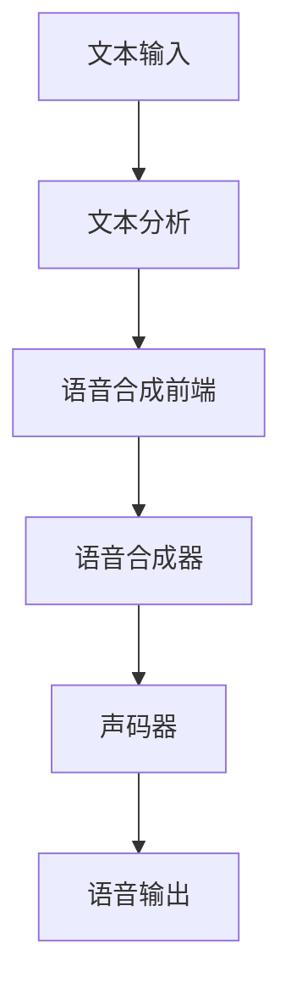

# Text-to-Speech (TTS)原理与代码实例讲解

## 1.背景介绍

### 1.1 什么是文本到语音(Text-to-Speech)

文本到语音(Text-to-Speech, TTS)是一种将文本转换为人类可以理解的语音的技术。它使计算机能够"阅读"任何文本内容,从而为视障人士、有阅读障碍的人群以及需要双手操作的场景提供了极大的便利。

TTS系统通过分析输入文本的内容和语义,然后将其转换为相应的语音波形信号,最终通过扬声器或其他音频设备输出。这种技术广泛应用于导航系统、电子书阅读器、虚拟助手、无人值守系统等多个领域。

### 1.2 文本到语音技术的发展历程

早期的TTS系统主要采用连接预录制语音片段的方式合成语音。这种方法虽然简单,但语音质量较差,缺乏自然语流。

20世纪80年代,基于规则的TTS系统开始出现,它们使用语音学和语音合成规则来产生语音。这种方法提高了语音质量,但仍然存在一些不自然的问题。

近年来,随着深度学习和神经网络技术的快速发展,基于深度学习的端到端TTS系统取得了长足进步,能够合成出更加自然流畅的语音。这些系统通过学习大量语音数据,直接从文本到语音波形进行建模,避免了中间的复杂规则。

## 2.核心概念与联系

### 2.1 文本到语音系统的核心组成部分

一个完整的文本到语音系统通常包含以下几个核心组件:

1. **文本分析(Text Analysis)**: 对输入文本进行预处理,包括标点符号处理、缩写扩展、数字转换等。
2. **语音合成前端(Front-end)**: 将文本转换为语音的中间表示,如语音素序列、语音特征等。
3. **语音合成器(Synthesizer)**: 根据中间表示生成相应的语音波形。
4. **声码器(Vocoder)**: 对生成的语音波形进行编码,以提高质量和压缩比。



### 2.2 语音合成前端的关键技术

语音合成前端是TTS系统的核心部分,主要包括以下几个关键技术:

1. **文本规范化(Text Normalization)**: 将非标准文本(如缩写、数字等)转换为规范形式。
2. **语音标注(Phonetic Annotation)**: 将文本转换为对应的语音素序列。
3. **语音建模(Acoustic Modeling)**: 根据语音素序列,预测相应的语音特征参数。

### 2.3 语音合成器的常见方法

语音合成器的主要任务是根据语音特征生成最终的语音波形。常见的合成方法包括:

1. **连接语音合成(Concatenative Synthesis)**: 将预录制的语音片段连接起来。
2. **参数语音合成(Parametric Synthesis)**: 根据语音特征参数,使用声码器(如STRAIGHT、WORLD等)生成语音波形。
3. **基于神经网络的端到端合成(End-to-End Neural TTS)**: 使用序列到序列模型(如Tacotron、Transformer等)直接从文本到语音波形进行建模。

## 3.核心算法原理具体操作步骤

### 3.1 文本规范化算法

文本规范化是将非标准文本转换为规范形式的过程,通常包括以下几个步骤:

1. **标点符号规范化**: 将标点符号转换为相应的词语,如"."转换为"句号"。
2. **缩写扩展**: 将缩写扩展为完整形式,如"U.S.A"扩展为"United States of America"。
3. **数字转换**: 将数字转换为相应的词语,如"123"转换为"一百二十三"。
4. **单位处理**: 对单位进行适当处理,如"3kg"转换为"三公斤"。
5. **大小写处理**: 对大小写进行适当处理,如将"NASA"转换为"N.A.S.A."。

### 3.2 语音标注算法

语音标注算法将文本转换为对应的语音素序列,通常包括以下步骤:

1. **分词(Tokenization)**: 将文本分割为单词序列。
2. **词性标注(Part-of-Speech Tagging)**: 为每个单词赋予相应的词性标记。
3. **语音素查找(Phoneme Lookup)**: 根据单词及其词性,查找对应的语音素序列。
4. **语音素序列构建(Phoneme Sequence Construction)**: 将所有单词的语音素序列连接起来,形成完整的语音素序列。

### 3.3 语音建模算法

语音建模算法根据语音素序列预测相应的语音特征参数,常见的算法包括:

1. **隐马尔可夫模型(Hidden Markov Model, HMM)**: 使用统计模型来建模语音特征序列。
2. **深度神经网络(Deep Neural Network, DNN)**: 使用深度学习模型(如LSTM、Transformer等)直接从语音素序列预测语音特征。

### 3.4 语音合成算法

语音合成算法根据语音特征生成最终的语音波形,常见的算法包括:

1. **波形连接合成(Waveform Concatenation Synthesis)**: 将预录制的语音片段连接起来。
2. **源滤波器模型(Source-Filter Model)**: 使用声码器(如STRAIGHT、WORLD等)根据语音特征参数生成语音波形。
3. **神经波形生成(Neural Waveform Generation)**: 使用生成对抗网络(GAN)或自回归模型(如WaveNet、SampleRNN等)直接从语音特征生成语音波形。

## 4.数学模型和公式详细讲解举例说明

### 4.1 隐马尔可夫模型(HMM)

隐马尔可夫模型是一种常用的语音建模方法,它将语音特征序列建模为一个隐藏的马尔可夫链。

设$\mathbf{X} = (x_1, x_2, \ldots, x_T)$为观测到的语音特征序列,其中$x_t$是第$t$个时间步的特征向量。$\mathbf{Q} = (q_1, q_2, \ldots, q_T)$为对应的隐藏状态序列,其中$q_t \in \{1, 2, \ldots, N\}$是第$t$个时间步的隐藏状态,共有$N$个可能的状态。

HMM模型由以下三个参数定义:

- $\pi = (\pi_1, \pi_2, \ldots, \pi_N)$: 初始状态概率分布
- $\mathbf{A} = \{a_{ij}\}$: 状态转移概率矩阵,其中$a_{ij} = P(q_{t+1} = j | q_t = i)$
- $\mathbf{B} = \{b_j(\mathbf{x})\}$: 观测概率密度函数,通常使用高斯混合模型(GMM)来建模

HMM的目标是找到最优的模型参数$\lambda = (\pi, \mathbf{A}, \mathbf{B})$,使得观测序列$\mathbf{X}$的生成概率$P(\mathbf{X} | \lambda)$最大化。

训练HMM模型通常使用期望最大化(EM)算法或者Viterbi算法等方法。在合成时,可以使用Viterbi算法找到最优的隐藏状态序列,并根据该序列生成对应的语音特征。

### 4.2 深度神经网络语音建模

深度神经网络(DNN)也被广泛用于语音建模,它能够直接从语音素序列预测语音特征。

设$\mathbf{P} = (p_1, p_2, \ldots, p_M)$为长度为$M$的语音素序列,其中$p_i$是第$i$个语音素的one-hot编码向量。$\mathbf{X} = (x_1, x_2, \ldots, x_T)$为目标语音特征序列,其中$x_t$是第$t$个时间步的特征向量。

DNN模型旨在学习一个映射函数$f_\theta$,使得$\mathbf{X} \approx f_\theta(\mathbf{P})$,其中$\theta$是模型参数。

常见的DNN模型包括:

- **前馈神经网络(Feed-Forward Neural Network, FFNN)**: 将语音素序列$\mathbf{P}$作为输入,通过多层全连接层预测语音特征$\mathbf{X}$。
- **循环神经网络(Recurrent Neural Network, RNN)**: 使用循环层(如LSTM、GRU等)捕获语音素序列的长期依赖关系。
- **卷积神经网络(Convolutional Neural Network, CNN)**: 使用卷积层提取语音素序列的局部特征。
- **自注意力网络(Self-Attention Network)**: 使用自注意力机制直接建模语音素与语音特征之间的关系。

DNN模型通常使用均方误差(MSE)或者多元对数似然(Multi-distribution Log-likelihood)等损失函数进行训练。在合成时,只需将语音素序列输入到训练好的模型中,即可得到对应的语音特征预测。

### 4.3 神经波形生成模型

神经波形生成模型直接从语音特征生成语音波形,避免了传统的源滤波器模型中的信号处理步骤。

设$\mathbf{C} = (c_1, c_2, \ldots, c_T)$为语音特征序列,其中$c_t$是第$t$个时间步的特征向量。$\mathbf{Y} = (y_1, y_2, \ldots, y_N)$为目标语音波形序列,其中$y_n$是第$n$个采样点的波形值。

神经波形生成模型旨在学习一个条件概率分布$P(\mathbf{Y} | \mathbf{C})$,使得给定语音特征$\mathbf{C}$时,生成的语音波形$\mathbf{Y}$与真实波形尽可能接近。

常见的神经波形生成模型包括:

- **WaveNet**: 使用一维卷积网络和门控激活单元(Gated Activation Units)建模波形序列的条件概率分布。
- **SampleRNN**: 使用多层递归神经网络(如LSTM)对波形序列进行建模和采样。
- **WaveGAN**: 使用生成对抗网络(GAN)框架,通过对抗训练生成高质量的语音波形。

这些模型通常使用均方误差(MSE)、多尺度谱损失(Multi-Scale Spectral Loss)或者感知评估语音质量(Perceptual Evaluation of Speech Quality, PESQ)等损失函数进行训练。在合成时,只需将语音特征输入到训练好的模型中,即可生成对应的语音波形。

## 5.项目实践:代码实例和详细解释说明

在这一部分,我们将介绍如何使用Python和相关库实现一个简单的文本到语音系统。我们将使用基于规则的方法进行文本规范化和语音标注,然后使用预训练的Tacotron 2模型进行语音合成。

### 5.1 环境配置

首先,我们需要安装所需的Python库:

```bash
pip install nltk inflect unidecode g2p_en espeak
```

其中:

- `nltk`用于文本处理
- `inflect`用于数字转换
- `unidecode`用于处理Unicode字符
- `g2p_en`用于英语语音标注
- `espeak`用于获取语音素序列

### 5.2 文本规范化

```python
import re
import inflect
import unidecode
from nltk.tokenize import word_tokenize

def normalize_text(text):
    # 移除非ASCII字符
    text = unidecode.unidecode(text)
    
    # 标点符号规范化
    text = re.sub(r"([?.!,])", r" \1 ", text)
    
    # 缩写扩展
    # 添加你的缩写扩展规则
    
    # 数字转换
    p = inflect.engine()
    words = word_tokenize(text)
    new_words = []
    for word in words:
        if word.isdigit():
            new_word = p.number_to_words(word)
            new_words.append(new_word)
        else:
            new_words.append(word)
    text = " ".join(new_words)
    
    return text
```

这个函数首先移除非ASCII字符,然后进行标点符号规范化和数字转换。你可以根据需要添加更多的规则,如缩写扩展