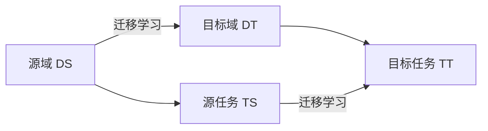

# Transfer Learning 原理与代码实战案例讲解

## 1. 背景介绍
### 1.1 什么是迁移学习
迁移学习(Transfer Learning)是机器学习中的一个重要分支,其目标是利用已有的知识来解决新的但相关的问题,从而减少在新任务上所需的训练数据,加速模型的学习过程。迁移学习的核心思想是,将在源领域学习到的知识迁移到目标领域,利用两个领域之间的相似性,使得模型能够在目标领域取得良好的性能。

### 1.2 迁移学习的应用场景
迁移学习在很多领域都有广泛的应用,如计算机视觉、自然语言处理、语音识别、推荐系统等。一些典型的应用场景包括:

1. 跨领域文本分类:利用新闻文本的分类器来对社交媒体文本进行分类。
2. 跨语言情感分析:利用英文情感分析模型来对中文文本进行情感分析。 
3. 图像识别:利用ImageNet预训练模型来识别医学影像。
4. 语音识别:利用英语语音识别模型来构建汉语语音识别系统。

### 1.3 迁移学习的优势
与传统的机器学习方法相比,迁移学习具有以下优势:

1. 减少目标领域所需的标注数据:通过利用源领域的知识,迁移学习可以大幅减少目标领域所需的训练数据。
2. 加速模型的学习过程:在目标领域训练模型时,使用迁移学习可以显著提高模型的收敛速度。
3. 提高模型的泛化能力:迁移学习使得模型能够学习到更加通用的特征表示,从而提高模型在新任务上的泛化能力。

## 2. 核心概念与联系
### 2.1 域(Domain)
在迁移学习中,域指的是一个数据集及其概率分布。通常包括两个部分:特征空间 $\mathcal{X}$ 和边缘概率分布 $P(X)$,其中 $X=\{x_1,\dots,x_n\} \in \mathcal{X}$。

### 2.2 任务(Task) 
给定一个域 $\mathcal{D}=\{\mathcal{X},P(X)\}$,任务 $\mathcal{T}$ 由两部分组成:标签空间 $\mathcal{Y}$ 和目标预测函数 $f(\cdot)$,即 $\mathcal{T}=\{\mathcal{Y},f(\cdot)\}$。目标预测函数 $f(\cdot)$ 可以从特征空间 $\mathcal{X}$ 映射到标签空间 $\mathcal{Y}$。

### 2.3 源域(Source Domain)和目标域(Target Domain)
迁移学习涉及两个域:源域 $\mathcal{D}_S$ 和目标域 $\mathcal{D}_T$。源域是已有标注数据的域,而目标域是我们希望迁移知识的目标领域。通常源域和目标域的特征空间是相同的,但是它们的数据分布可能不同,即 $\mathcal{X}_S=\mathcal{X}_T$, $P(X_S) \neq P(X_T)$。

### 2.4 源任务(Source Task)和目标任务(Target Task)  
与域类似,迁移学习也涉及两个任务:源任务 $\mathcal{T}_S$ 和目标任务 $\mathcal{T}_T$。源任务是在源域上已经学习过的任务,而目标任务是我们希望迁移学习的任务。通常源任务和目标任务的标签空间是相同的,但是它们的条件概率分布可能不同,即 $\mathcal{Y}_S=\mathcal{Y}_T$, $P(Y_S|X_S) \neq P(Y_T|X_T)$。

### 2.5 概念之间的关系
下图展示了迁移学习中这些核心概念之间的关系:



## 3. 核心算法原理具体操作步骤
迁移学习可以分为三个主要的类别:基于实例的迁移学习、基于特征的迁移学习和基于模型的迁移学习。下面我们详细介绍这三种方法的核心算法原理和具体操作步骤。

### 3.1 基于实例的迁移学习
基于实例的迁移学习的核心思想是通过加权重用源域的样本来辅助目标域的学习。其主要步骤如下:

1. 从源域选择一些样本添加到目标域的训练集中。
2. 为源域样本分配权重,权重的计算通常基于源域样本与目标域样本的相似度。
3. 在组合的带权重的数据集上训练目标任务的模型。
4. 在目标域的测试集上评估模型性能,并根据需要调整源域样本的权重,重复步骤2-4直到模型性能达到要求。

常见的基于实例的迁移学习算法包括TrAdaBoost和KMM(Kernel Mean Matching)等。

### 3.2 基于特征的迁移学习
基于特征的迁移学习旨在学习一个共享的特征表示,使得源域和目标域的数据在这个共享空间中具有相似的分布。其主要步骤如下:

1. 构建一个特征提取器(如深度神经网络),将源域和目标域的数据映射到共享的特征空间。
2. 在共享特征空间中,通过最小化源域和目标域数据分布之间的差异来优化特征提取器,常见的方法有MMD(Maximum Mean Discrepancy)和CORAL(CORrelation ALignment)等。
3. 使用优化后的特征提取器将源域和目标域数据映射到共享空间,然后在这个空间中训练目标任务的模型。
4. 在目标域的测试集上评估模型性能,并根据需要调整特征提取器,重复步骤2-4直到模型性能达到要求。

代表性的基于特征的迁移学习算法包括DDC(Deep Domain Confusion)、DAN(Deep Adaptation Network)和JAN(Joint Adaptation Network)等。

### 3.3 基于模型的迁移学习
基于模型的迁移学习的目标是将源任务上学习到的模型参数迁移到目标任务,从而加速目标任务的学习过程。其主要步骤如下:

1. 在源任务上训练一个基础模型。
2. 将预训练的模型参数作为目标任务模型的初始化参数。对于神经网络,通常使用预训练模型的前几层作为特征提取器,并随机初始化后面的几层。
3. 使用目标域的标注数据对整个模型进行微调(fine-tuning),即以较小的学习率训练整个网络。
4. 在目标域的测试集上评估模型性能,并根据需要调整迁移策略(如微调的层数),重复步骤3-4直到模型性能达到要求。

常见的基于模型的迁移学习包括fine-tuning预训练的CNN模型和continual learning等。

## 4. 数学模型和公式详细讲解举例说明
下面我们以MMD(Maximum Mean Discrepancy)为例,详细讲解迁移学习中的数学模型和公式。

### 4.1 MMD的定义
MMD 是一种度量两个分布之间差异的方法。给定源域数据 $\{x_i^s\}_{i=1}^{n_s} \sim P$ 和目标域数据 $\{x_i^t\}_{i=1}^{n_t} \sim Q$,MMD 的定义为:

$$
\text{MMD}(P,Q) = \left\| \frac{1}{n_s}\sum_{i=1}^{n_s}\phi(x_i^s) - \frac{1}{n_t}\sum_{i=1}^{n_t}\phi(x_i^t) \right\|_{\mathcal{H}}
$$

其中 $\phi(\cdot)$ 是将数据映射到再生核希尔伯特空间(RKHS) $\mathcal{H}$ 的特征映射函数。直观上,MMD 衡量了两个分布在 RKHS 中均值的差异。

### 4.2 MMD 的计算
在实践中,我们通常使用核函数 $k(\cdot,\cdot)$ 来隐式地定义特征映射 $\phi(\cdot)$,从而避免了显式计算 $\phi(\cdot)$。常见的核函数包括高斯核(RBF核)和拉普拉斯核等。使用核函数,MMD 可以表示为:

$$
\text{MMD}^2(P,Q) = \frac{1}{n_s^2}\sum_{i,j=1}^{n_s}k(x_i^s,x_j^s) + \frac{1}{n_t^2}\sum_{i,j=1}^{n_t}k(x_i^t,x_j^t) - \frac{2}{n_sn_t}\sum_{i=1}^{n_s}\sum_{j=1}^{n_t}k(x_i^s,x_j^t)
$$

### 4.3 基于 MMD 的迁移学习
在基于特征的迁移学习中,我们可以利用 MMD 来度量源域和目标域在共享特征空间中的分布差异,并通过最小化 MMD 来优化特征提取器。具体而言,我们可以定义如下的损失函数:

$$
\mathcal{L} = \mathcal{L}_t + \lambda \cdot \text{MMD}^2(P,Q)
$$

其中 $\mathcal{L}_t$ 是目标任务的损失函数(如交叉熵损失), $\lambda$ 是平衡两个损失项的超参数。通过最小化这个损失函数,我们可以同时优化目标任务的性能和减小源域与目标域之间的分布差异,从而实现迁移学习。

## 5. 项目实践：代码实例和详细解释说明
下面我们通过一个基于PyTorch的代码实例来说明如何实现基于MMD的迁移学习。

```python
import torch
import torch.nn as nn
import torch.optim as optim
from torch.utils.data import DataLoader
from torchvision import datasets, transforms

# 定义特征提取器
class FeatureExtractor(nn.Module):
    def __init__(self):
        super(FeatureExtractor, self).__init__()
        self.conv1 = nn.Conv2d(3, 64, kernel_size=5)
        self.conv2 = nn.Conv2d(64, 128, kernel_size=5)
        self.fc1 = nn.Linear(128 * 5 * 5, 1024)
        self.fc2 = nn.Linear(1024, 256)
        
    def forward(self, x):
        x = nn.functional.relu(self.conv1(x))
        x = nn.functional.max_pool2d(x, 2)
        x = nn.functional.relu(self.conv2(x))
        x = nn.functional.max_pool2d(x, 2)
        x = x.view(x.size(0), -1)
        x = nn.functional.relu(self.fc1(x))
        x = nn.functional.relu(self.fc2(x))
        return x

# 定义分类器
class Classifier(nn.Module):
    def __init__(self):
        super(Classifier, self).__init__()
        self.fc = nn.Linear(256, 10)
        
    def forward(self, x):
        return self.fc(x)

# 定义 MMD 损失
def mmd_loss(x_src, x_tgt, kernel_mul=2.0, kernel_num=5):
    x_src = x_src.view(x_src.size(0), -1)
    x_tgt = x_tgt.view(x_tgt.size(0), -1)
    
    n_src = x_src.size(0)
    n_tgt = x_tgt.size(0)
    
    kernels = []
    for i in range(kernel_num):
        alpha = kernel_mul ** i
        k_src = torch.exp(-alpha * torch.cdist(x_src, x_src, p=2.0) ** 2)
        k_tgt = torch.exp(-alpha * torch.cdist(x_tgt, x_tgt, p=2.0) ** 2)
        k_cross = torch.exp(-alpha * torch.cdist(x_src, x_tgt, p=2.0) ** 2)
        kernels.append(k_src.mean() + k_tgt.mean() - 2 * k_cross.mean())
        
    return sum(kernels)

# 加载数据
source_transform = transforms.Compose([
    transforms.RandomHorizontalFlip(),
    transforms.ToTensor(),
    transforms.Normalize((0.5, 0.5, 0.5), (0.5, 0.5, 0.5))
])

target_transform = transforms.Compose([
    transforms.ToTensor(),
    transforms.Normalize((0.5, 0.5, 0.5), (0.5, 0.5, 0.5))
])