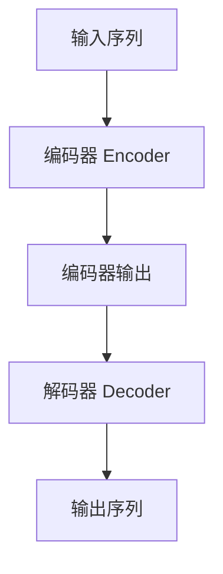
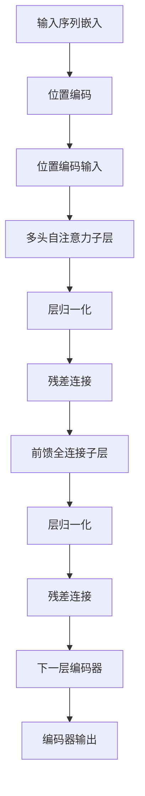
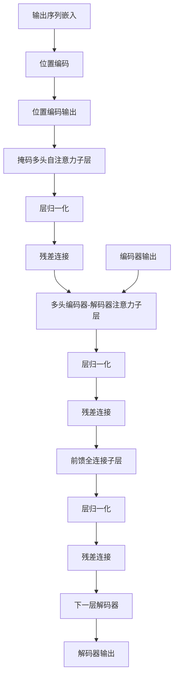

# Transformer原理与代码实战案例讲解

## 1.背景介绍

在自然语言处理(NLP)和序列数据建模领域,Transformer模型自2017年被提出以来,已经成为最受欢迎和广泛使用的架构之一。Transformer彻底改变了序列数据的处理方式,通过纯注意力机制取代了传统的循环神经网络(RNN)和卷积神经网络(CNN),克服了梯度消失、无法并行计算等问题,大幅提升了模型性能和计算效率。

Transformer最初被设计用于机器翻译任务,但由于其强大的建模能力,后来在自然语言理解、文本生成、语音识别等多个领域取得了卓越表现。谷歌推出的BERT、OpenAI的GPT等知名预训练语言模型都是基于Transformer架构。Transformer已经成为NLP领域的主流模型,并被广泛应用于工业界和学术界。

## 2.核心概念与联系

### 2.1 Transformer架构概览

Transformer由编码器(Encoder)和解码器(Decoder)两个主要部分组成,如下图所示:



编码器将输入序列编码为向量表示,解码器则根据编码器输出和输出序列的部分令牌生成最终输出序列。

### 2.2 自注意力机制(Self-Attention)

自注意力机制是Transformer的核心,用于捕获输入序列中各个位置之间的依赖关系。与RNN和CNN不同,自注意力机制不需要按顺序处理序列令牌,而是通过计算每个令牌与其他令牌的注意力权重,来建模序列内部的长程依赖关系。

### 2.3 多头注意力机制(Multi-Head Attention)

多头注意力机制将注意力分成多个"头部",每个头部都可以关注输入序列的不同位置,从而更好地捕获不同类型的依赖关系。多头注意力的输出是各个头部输出的加权和。

### 2.4 位置编码(Positional Encoding)

由于Transformer不再依赖序列的顺序,因此需要一种机制来注入位置信息。位置编码将序列中每个令牌的位置编码为向量,并将其与令牌嵌入相加,从而使模型能够捕获位置信息。

### 2.5 层归一化(Layer Normalization)

层归一化是一种常用的正则化技术,通过对每一层的输入进行归一化来加速模型收敛。在Transformer中,层归一化被应用于每个子层的输入。

### 2.6 残差连接(Residual Connection)

残差连接是一种常用的技术,可以帮助缓解深度神经网络中的梯度消失问题。在Transformer中,每个子层的输出都会与输入相加,形成残差连接。

## 3.核心算法原理具体操作步骤

### 3.1 编码器(Encoder)

编码器的主要任务是将输入序列映射为一系列连续的向量表示,这些向量表示将被送入解码器进行后续处理。编码器由多个相同的层组成,每一层都包含两个子层:

1. **多头自注意力子层(Multi-Head Self-Attention Sublayer)**
   - 计算输入序列中每个令牌与其他令牌的注意力权重
   - 生成注意力向量表示,捕获序列内部的依赖关系

2. **前馈全连接子层(Feed-Forward Fully-Connected Sublayer)**
   - 对注意力向量表示进行进一步的非线性变换
   - 生成最终的编码器输出向量表示

编码器的计算过程如下:



### 3.2 解码器(Decoder)

解码器的任务是根据编码器的输出向量表示和输出序列的部分令牌,生成最终的输出序列。解码器也由多个相同的层组成,每一层包含三个子层:

1. **掩码多头自注意力子层(Masked Multi-Head Self-Attention Sublayer)**
   - 计算输出序列中每个令牌与其他已生成令牌的注意力权重
   - 生成自注意力向量表示,捕获输出序列内部的依赖关系
   - 使用掩码机制确保每个令牌只能关注之前的令牌,避免偷看答案

2. **多头编码器-解码器注意力子层(Multi-Head Encoder-Decoder Attention Sublayer)**
   - 计算输出序列中每个令牌与编码器输出向量的注意力权重
   - 生成编码器-解码器注意力向量表示,捕获输入序列和输出序列之间的依赖关系

3. **前馈全连接子层(Feed-Forward Fully-Connected Sublayer)**
   - 对自注意力向量表示和编码器-解码器注意力向量表示进行进一步的非线性变换
   - 生成最终的解码器输出向量表示

解码器的计算过程如下:



### 3.3 模型训练

Transformer模型的训练过程与其他神经网络模型类似,使用监督学习的方式最小化损失函数。常用的损失函数包括交叉熵损失(Cross-Entropy Loss)和最大似然估计(Maximum Likelihood Estimation)。

在训练过程中,输入序列和目标输出序列被送入编码器和解码器,模型会生成预测的输出序列。然后,将预测输出与真实目标输出进行比较,计算损失函数值。使用优化算法(如Adam优化器)根据损失函数的梯度,更新模型参数。重复这一过程,直到模型收敛。

## 4.数学模型和公式详细讲解举例说明

### 4.1 注意力机制(Attention Mechanism)

注意力机制是Transformer的核心部分,用于捕获输入序列和输出序列之间的依赖关系。给定一个查询向量(Query) $\vec{q}$、一组键向量(Keys) $\vec{K}=\{\vec{k_1}, \vec{k_2}, \dots, \vec{k_n}\}$和一组值向量(Values) $\vec{V}=\{\vec{v_1}, \vec{v_2}, \dots, \vec{v_n}\}$,注意力机制的计算过程如下:

1. 计算查询向量与每个键向量的点积,得到未缩放的注意力分数(Unnormalized Attention Scores):

$$
e_i = \vec{q} \cdot \vec{k_i}
$$

2. 对注意力分数进行缩放,以避免较小的梯度导致的软约束问题:

$$
\alpha_i = \frac{e_i}{\sqrt{d_k}}
$$

其中 $d_k$ 是键向量的维度。

3. 对缩放后的注意力分数应用 Softmax 函数,得到注意力权重:

$$
\text{Attention}(\vec{Q}, \vec{K}, \vec{V}) = \text{softmax}(\alpha_1, \alpha_2, \dots, \alpha_n) \vec{V} = \sum_{i=1}^n \frac{e^{\alpha_i}}{\sum_{j=1}^n e^{\alpha_j}} \vec{v_i}
$$

4. 将注意力权重与值向量相乘,得到最终的注意力输出向量。

通过注意力机制,模型可以动态地为输入序列中的每个位置分配不同的权重,从而更好地捕获长程依赖关系。

### 4.2 多头注意力机制(Multi-Head Attention)

多头注意力机制是对单一注意力机制的扩展,它允许模型同时关注输入序列的不同位置子空间,从而更好地捕获不同类型的依赖关系。

具体来说,多头注意力机制将查询向量 $\vec{q}$、键向量 $\vec{K}$ 和值向量 $\vec{V}$ 线性投影到 $h$ 个子空间,对每个子空间分别计算注意力,然后将所有子空间的注意力输出向量连接起来,形成最终的多头注意力输出向量。

$$
\begin{aligned}
\text{MultiHead}(\vec{Q}, \vec{K}, \vec{V}) &= \text{Concat}(\text{head}_1, \text{head}_2, \dots, \text{head}_h) W^O \\
\text{where } \text{head}_i &= \text{Attention}(\vec{Q}W_i^Q, \vec{K}W_i^K, \vec{V}W_i^V)
\end{aligned}
$$

其中 $W_i^Q \in \mathbb{R}^{d_\text{model} \times d_k}$、$W_i^K \in \mathbb{R}^{d_\text{model} \times d_k}$、$W_i^V \in \mathbb{R}^{d_\text{model} \times d_v}$ 和 $W^O \in \mathbb{R}^{hd_v \times d_\text{model}}$ 是可学习的线性投影矩阵,用于将查询向量、键向量和值向量投影到不同的子空间。

通过多头注意力机制,Transformer可以同时捕获不同类型的依赖关系,从而提高模型的表现。

### 4.3 位置编码(Positional Encoding)

由于Transformer不再依赖序列的顺序,因此需要一种机制来注入位置信息。位置编码将序列中每个令牌的位置编码为向量,并将其与令牌嵌入相加,从而使模型能够捕获位置信息。

位置编码向量的计算公式如下:

$$
\begin{aligned}
PE_{(pos, 2i)} &= \sin\left(\frac{pos}{10000^{2i/d_\text{model}}}\right) \\
PE_{(pos, 2i+1)} &= \cos\left(\frac{pos}{10000^{2i/d_\text{model}}}\right)
\end{aligned}
$$

其中 $pos$ 是令牌的位置索引,从 0 开始计数;$i$ 是维度索引,取值范围为 $0 \leq i < d_\text{model}$;$d_\text{model}$ 是模型的嵌入维度。

通过使用不同的正弦和余弦函数,位置编码向量可以唯一地表示每个位置,并且具有一定的周期性,有助于模型捕获相对位置信息。

## 5.项目实践:代码实例和详细解释说明

在这一部分,我们将通过一个基于PyTorch实现的Transformer模型示例,来更好地理解Transformer的工作原理。完整的代码可以在[这里](https://github.com/soravits/transformer-pytorch)找到。

### 5.1 导入所需的库

```python
import math
import torch
import torch.nn as nn
from torch.autograd import Variable
```

### 5.2 定义模型超参数

```python
MAX_LENGTH = 100  # 输入序列的最大长度
D_MODEL = 512  # 模型的嵌入维度
D_FF = 2048  # 前馈全连接网络的隐藏层维度
N_HEADS = 8  # 多头注意力机制的头数
N_LAYERS = 6  # 编码器和解码器的层数
DROPOUT = 0.1  # Dropout率
```

### 5.3 实现位置编码

```python
class PositionalEncoding(nn.Module):
    def __init__(self, d_model, dropout=0.1, max_len=5000):
        super(PositionalEncoding, self).__init__()
        self.dropout = nn.Dropout(p=dropout)

        pe = torch.zeros(max_len, d_model)
        position = torch.arange(0, max_len, dtype=torch.float).unsqueeze(1)
        div_term = torch.exp(torch.arange(0, d_model, 2).float() * (-math.log(10000.0) / d_model))
        pe[:, 0::2] = torch.sin(position * div_term)
        pe[:, 1::2] = torch.