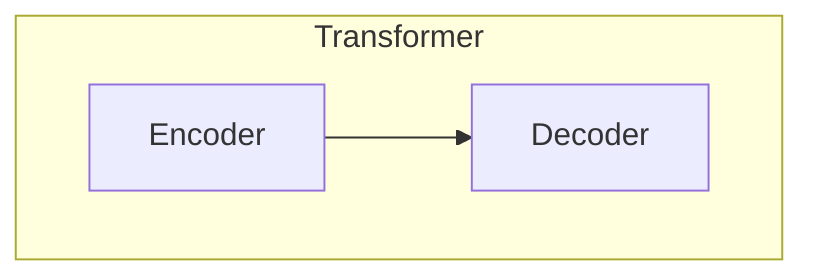
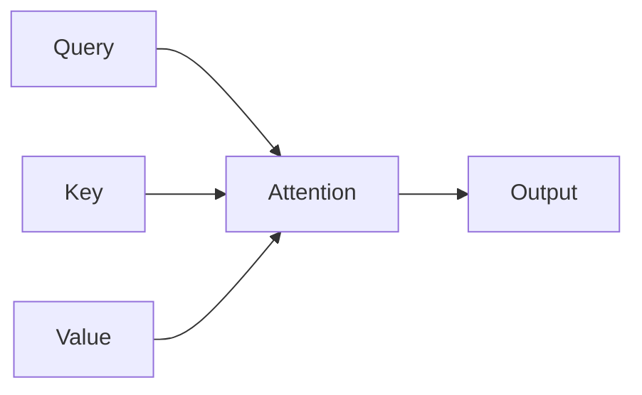
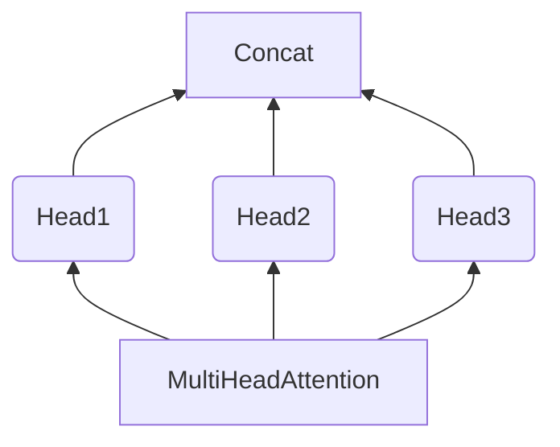

# Transformer原理与代码实战案例讲解

## 1.背景介绍

在自然语言处理(NLP)和序列数据建模领域,Transformer模型自2017年被提出以来,引发了一场深度学习革命。传统的序列模型如循环神经网络(RNN)和长短期记忆网络(LSTM)在处理长序列时存在梯度消失或爆炸的问题,而Transformer则通过全新的自注意力(Self-Attention)机制,有效地解决了这一痼疾,大幅提升了模型的性能表现。

Transformer最初被设计用于机器翻译任务,但由于其强大的建模能力,很快被推广应用于多种NLP任务,如文本生成、语义理解、问答系统等,取得了卓越的成绩。随着模型规模和训练数据的不断扩大,Transformer及其变体模型(如BERT、GPT、XLNet等)逐渐成为NLP领域的主导范式。

除了NLP领域,Transformer也被广泛应用于计算机视觉(CV)、语音识别、强化学习等多个领域,展现出了通用的序列建模能力。可以说,Transformer是继卷积神经网络(CNN)之后,人工智能领域最重要的技术突破之一。

## 2.核心概念与联系

### 2.1 Transformer架构

Transformer由编码器(Encoder)和解码器(Decoder)两个子模块组成。编码器的作用是处理输入序列,生成其语义表示;而解码器则根据编码器的输出,结合自身的状态,生成目标序列。

在机器翻译任务中,编码器处理源语言序列,解码器则生成目标语言序列。在其他任务如文本生成、序列标注等中,也可根据实际需求,只使用编码器或解码器的单独模块。

### 2.2 注意力机制(Attention)

注意力机制是Transformer的核心创新,它打破了RNN/LSTM严格按序处理序列的限制,使模型能够自主学习捕捉输入序列中不同位置元素之间的依赖关系。

在计算注意力时,模型会根据查询(Query)对键(Key)的重要性程度进行打分,并将值(Value)根据得分进行加权求和,生成注意力表示。这种机制使得模型能够灵活地关注序列中不同位置的信息,大大提高了模型的表现力。

### 2.3 多头注意力(Multi-Head Attention)

多头注意力机制将注意力分成多个"头"(Head)进行并行计算,然后将各头的结果拼接起来,这不仅提高了模型的表达能力,还能够同时关注输入序列中不同的位置和子空间。

### 2.4 位置编码(Positional Encoding)

由于Transformer没有循环或卷积结构,因此需要一种显式的方式来注入序列的位置信息。位置编码就是一种将元素在序列中的相对或绝对位置编码为向量的方法,它被加入到输入的嵌入向量中,使模型能够捕捉元素的位置依赖关系。

### 2.5 层归一化(Layer Normalization)

层归一化是一种常用的正则化技术,它对输入数据进行归一化处理,有助于加速模型收敛并提高训练稳定性。在Transformer中,层归一化被应用于每个子层的输入,使得梯度能够更好地反向传播。

### 2.6 残差连接(Residual Connection)

残差连接是一种常见的网络架构设计,它通过将输入直接传递给输出,使得梯度能够更好地流动,从而缓解了深度网络的梯度消失问题。在Transformer中,残差连接被广泛应用于各个子层,提高了信息流的效率。

## 3.核心算法原理具体操作步骤 

### 3.1 注意力计算过程

注意力机制的核心思想是根据查询(Query)对键(Key)的重要性程度进行打分,并将值(Value)根据得分进行加权求和,生成注意力表示。具体计算步骤如下:

1. 将查询(Query)、键(Key)和值(Value)通过线性变换映射到相同的维度空间:

$$
\begin{aligned}
Q &= XW^Q\\
K &= XW^K\\
V &= XW^V
\end{aligned}
$$

其中$X$为输入序列,$W^Q,W^K,W^V$分别为查询、键和值的线性变换矩阵。

2. 计算查询$Q$与所有键$K$的点积得分,并对得分进行缩放:

$$\text{Score}(Q, K) = \frac{QK^T}{\sqrt{d_k}}$$

其中$d_k$为键的维度,缩放操作有助于避免较大的点积值导致梯度饱和。

3. 对得分应用SoftMax函数,得到注意力权重:

$$\text{Attention}(Q, K, V) = \text{softmax}\left(\frac{QK^T}{\sqrt{d_k}}\right)V$$

4. 将注意力权重与值$V$相乘,得到加权求和的注意力表示。

### 3.2 多头注意力计算过程

多头注意力机制将注意力分成多个"头"进行并行计算,然后将各头的结果拼接起来。具体步骤如下:

1. 将查询、键和值通过线性变换分别映射到$h$个子空间,其中$h$为头的数量:

$$
\begin{aligned}
\text{head}_i &= \text{Attention}(QW_i^Q, KW_i^K, VW_i^V)\\
\text{MultiHead}(Q, K, V) &= \text{Concat}(\text{head}_1, \dots, \text{head}_h)W^O
\end{aligned}
$$

其中$W_i^Q, W_i^K, W_i^V$分别为第$i$个头的查询、键和值的线性变换矩阵,$W^O$为最终的线性变换矩阵。

2. 对于每个子空间,分别计算注意力表示$\text{head}_i$。
3. 将所有头的注意力表示拼接,并通过线性变换$W^O$映射回原始空间。

通过多头注意力机制,模型能够同时关注输入序列中不同的位置和子空间,从而提高了表达能力。

### 3.3 编码器(Encoder)

Transformer的编码器由多个相同的层组成,每一层包含两个子层:多头自注意力层和前馈全连接层。

1. **多头自注意力层**

该层对输入序列进行自注意力计算,生成注意力表示。具体计算过程如下:

$$\text{MultiHead}(Q, K, V) = \text{Attention}(QW^Q, KW^K, VW^V)$$

其中$Q=K=V$,即查询、键和值均为当前层的输入序列。

2. **前馈全连接层**

该层由两个线性变换组成,中间使用ReLU激活函数:

$$\text{FFN}(x) = \max(0, xW_1 + b_1)W_2 + b_2$$

前馈全连接层的作用是对每个位置的表示进行独立的非线性变换,提高模型的表达能力。

在每个子层的输出上,都会进行残差连接和层归一化操作,以保持梯度的流动和训练的稳定性。

### 3.4 解码器(Decoder)

Transformer的解码器与编码器类似,也由多个相同的层组成,每一层包含三个子层:

1. **屏蔽的多头自注意力层**

该层对当前位置之前的输出序列进行自注意力计算,屏蔽掉当前位置之后的信息,以保证模型的自回归性质。

2. **多头交互注意力层**

该层对输入序列(编码器的输出)和当前位置之前的输出序列进行注意力计算,捕捉输入和输出之间的依赖关系。

3. **前馈全连接层**

与编码器中的前馈层相同,对每个位置的表示进行独立的非线性变换。

同样地,在每个子层的输出上都会进行残差连接和层归一化操作。

## 4.数学模型和公式详细讲解举例说明

### 4.1 注意力计算

注意力机制的核心思想是根据查询(Query)对键(Key)的重要性程度进行打分,并将值(Value)根据得分进行加权求和,生成注意力表示。具体计算过程如下:

1. 将查询(Query)、键(Key)和值(Value)通过线性变换映射到相同的维度空间:

$$
\begin{aligned}
Q &= XW^Q\\
K &= XW^K\\
V &= XW^V
\end{aligned}
$$

其中$X$为输入序列,$W^Q,W^K,W^V$分别为查询、键和值的线性变换矩阵。

2. 计算查询$Q$与所有键$K$的点积得分,并对得分进行缩放:

$$\text{Score}(Q, K) = \frac{QK^T}{\sqrt{d_k}}$$

其中$d_k$为键的维度,缩放操作有助于避免较大的点积值导致梯度饱和。

3. 对得分应用SoftMax函数,得到注意力权重:

$$\text{Attention}(Q, K, V) = \text{softmax}\left(\frac{QK^T}{\sqrt{d_k}}\right)V$$

4. 将注意力权重与值$V$相乘,得到加权求和的注意力表示。

以一个简单的例子来说明注意力计算过程:

假设我们有一个长度为4的输入序列$X = [x_1, x_2, x_3, x_4]$,其中每个$x_i$是一个向量,维度为$d_x$。我们希望计算第二个位置$x_2$的注意力表示。

首先,我们将输入序列$X$通过线性变换矩阵$W^Q,W^K,W^V$映射到查询、键和值空间:

$$
\begin{aligned}
Q &= [x_1, x_2, x_3, x_4]W^Q\\
K &= [x_1, x_2, x_3, x_4]W^K\\
V &= [x_1, x_2, x_3, x_4]W^V
\end{aligned}
$$

其中$Q,K,V$的维度均为$4\times d_k$。

接下来,我们计算查询$q_2$(即$Q$的第二行)与所有键$K$的点积得分,并进行缩放:

$$\text{Score}(q_2, K) = \frac{q_2K^T}{\sqrt{d_k}} = \left[\frac{q_2k_1^T}{\sqrt{d_k}}, \frac{q_2k_2^T}{\sqrt{d_k}}, \frac{q_2k_3^T}{\sqrt{d_k}}, \frac{q_2k_4^T}{\sqrt{d_k}}\right]$$

对得分应用SoftMax函数,得到注意力权重:

$$\text{Attention}(q_2, K, V) = \text{softmax}\left(\frac{q_2K^T}{\sqrt{d_k}}\right)V$$

最后,将注意力权重与值$V$相乘,得到$x_2$的注意力表示:

$$\text{Attention}(q_2, K, V) = \left[\alpha_1v_1, \alpha_2v_2, \alpha_3v_3, \alpha_4v_4\right]$$

其中$\alpha_i$为注意力权重,$v_i$为值向量。注意力表示是输入序列中所有位置的值向量的加权和,权重由查询$q_2$与各个键的相关性决定。

通过上述计算过程,模型能够自动学习到输入序列中不同位置元素之间的依赖关系,并生成相应的注意力表示。

### 4.2 多头注意力

多头注意力机制将注意力分成多个"头"进行并行计算,然后将各头的结果拼接起来。具体步骤如下:

1. 将查询、键和值通过线性变换分别映射到$h$个子空间,其中$h$为头的数量:

$$
\begin{aligned}
\text{head}_i &= \text{Attention}(QW_i^Q, KW_i^K, VW_i^V)\\
\text{MultiHead}(Q, K, V) &= \text{Concat}(\text{head}_1, \dots, \text{head}_h)W^O
\end{aligned}
$$

其中$W_