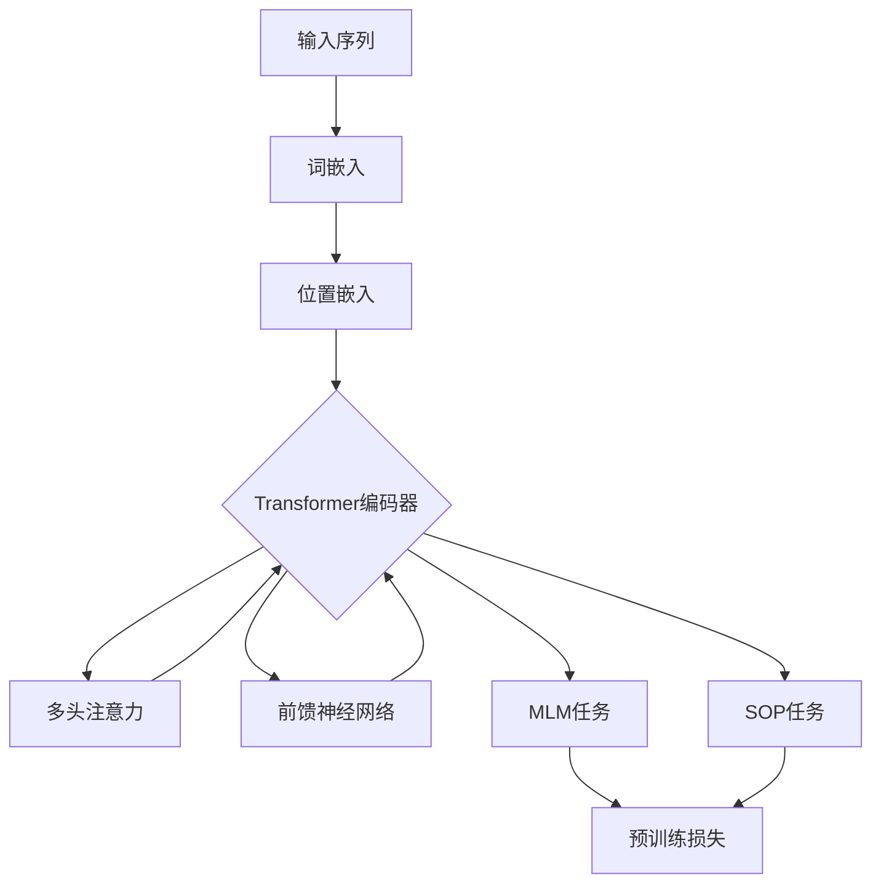

# Transformer大模型实战 BERT 的精简版ALBERT

## 1. 背景介绍
### 1.1 Transformer模型的发展历程
### 1.2 BERT模型的诞生与影响  
### 1.3 ALBERT模型的提出背景

## 2. 核心概念与联系
### 2.1 Transformer的核心概念
#### 2.1.1 自注意力机制(Self-Attention)
#### 2.1.2 多头注意力(Multi-Head Attention)
#### 2.1.3 前馈神经网络(Feed Forward Neural Network)
### 2.2 BERT的核心概念
#### 2.2.1 双向编码(Bidirectional Encoding)
#### 2.2.2 掩码语言模型(Masked Language Model, MLM)
#### 2.2.3 下一句预测(Next Sentence Prediction, NSP)
### 2.3 ALBERT的创新点
#### 2.3.1 参数共享(Parameter Sharing) 
#### 2.3.2 因式分解嵌入参数(Factorized Embedding Parameterization)
#### 2.3.3 句间连贯性损失(Inter-sentence Coherence Loss)

## 3. 核心算法原理具体操作步骤
### 3.1 ALBERT的整体架构
### 3.2 词嵌入层优化
#### 3.2.1 词嵌入参数因式分解
#### 3.2.2 位置嵌入
### 3.3 Transformer编码器层优化 
#### 3.3.1 跨层参数共享
#### 3.3.2 注意力机制
### 3.4 预训练任务优化
#### 3.4.1 MLM任务
#### 3.4.2 SOP任务

## 4. 数学模型和公式详细讲解举例说明
### 4.1 自注意力机制的数学表示
### 4.2 多头注意力的数学表示
### 4.3 前馈神经网络的数学表示
### 4.4 MLM和SOP任务的损失函数

## 5. 项目实践：代码实例和详细解释说明
### 5.1 ALBERT的TensorFlow实现
#### 5.1.1 模型构建
#### 5.1.2 预训练
#### 5.1.3 微调与下游任务
### 5.2 ALBERT的PyTorch实现
#### 5.2.1 模型构建
#### 5.2.2 预训练
#### 5.2.3 微调与下游任务

## 6. 实际应用场景
### 6.1 情感分析
### 6.2 命名实体识别  
### 6.3 问答系统
### 6.4 文本分类

## 7. 工具和资源推荐
### 7.1 ALBERT官方实现
### 7.2 ALBERT预训练模型
### 7.3 ALBERT可视化工具
### 7.4 相关论文与资源

## 8. 总结：未来发展趋势与挑战
### 8.1 模型压缩与加速
### 8.2 模型解释性与可靠性
### 8.3 多模态与跨语言

## 9. 附录：常见问题与解答 
### 9.1 ALBERT相比BERT的优势在哪里？
### 9.2 ALBERT在哪些任务上取得了SOTA？ 
### 9.3 如何利用ALBERT进行迁移学习？

ALBERT (A Lite BERT)是谷歌在2019年提出的一种基于BERT改进的轻量级预训练语言模型。它通过参数共享和嵌入因式分解等策略，在保持模型性能的同时大幅减少了参数量，使得模型更加小巧高效。

ALBERT的核心创新点包括：

1. 跨层参数共享：ALBERT在Transformer编码器的所有层之间共享参数，大幅减少了参数数量。

2. 嵌入因式分解：将词嵌入矩阵分解为两个小矩阵，降低了词嵌入的参数量。

3. 句间连贯性损失(SOP)：用SOP任务取代了BERT的NSP任务，以更好地建模句间连贯性。

在预训练阶段，ALBERT优化了BERT的MLM和NSP任务，引入了SOP任务来判断两个句子是否在原文中是连续的。同时，ALBERT还对词嵌入层和Transformer编码器层进行了参数共享和因式分解，大幅压缩了模型尺寸。

通过这些改进，ALBERT在多个自然语言理解任务上取得了与BERT相当甚至更优的性能，同时模型尺寸却大幅减小。以ALBERT-xxlarge为例，它的参数量只有BERT-large的18%，但在多个基准测试中却刷新了SOTA记录。

ALBERT强大的性能和简洁的结构使其在工业界得到了广泛应用，如情感分析、命名实体识别、问答系统、文本分类等。同时，ALBERT也为后续的模型压缩和加速研究提供了重要的思路。

未来，随着计算力的发展和数据的丰富，预训练语言模型还将向更大规模、多模态、跨语言等方向发展。而如何在提升性能的同时保证模型的解释性与可靠性，也是一个亟待解决的挑战。ALBERT作为BERT的优化版本，为Transformer大模型的发展做出了重要贡献，为NLP技术的民主化提供了有力的工具。

作者：禅与计算机程序设计艺术 / Zen and the Art of Computer Programming