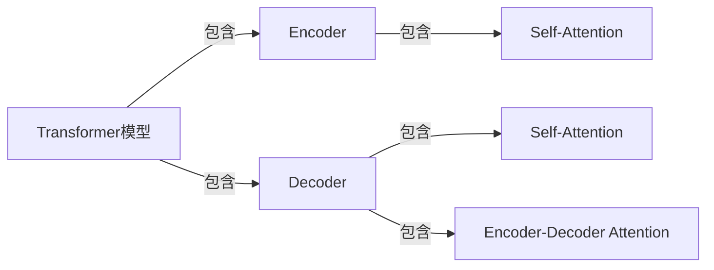

## 1.背景介绍

在过去的几年里，我们见证了深度学习在自然语言处理（NLP）领域的突飞猛进。特别是，Transformer模型的出现，为我们提供了一种全新的处理序列数据的方式。它的出现，不仅在机器翻译、文本生成、文本分类等任务上取得了显著的效果，而且更重要的是，它开启了一种全新的模型架构思路，为我们的研究和应用提供了无限的可能性。

## 2.核心概念与联系

Transformer模型是由Vaswani等人在2017年的论文《Attention is All You Need》中提出的。该模型的主要特性是其全新的注意力机制——自注意力（Self-Attention）机制，它允许模型在处理序列数据时，对序列中的每个元素进行自我关注，从而更好地捕捉序列中的依赖关系。



## 3.核心算法原理具体操作步骤

### 3.1 自注意力机制

自注意力机制的主要思想是计算序列中每个元素与其他元素的相关性，然后依据这个相关性对序列进行加权求和。具体来说，对于一个输入序列，我们首先将每个元素转换为三个向量：查询向量（Query）、键向量（Key）和值向量（Value）。然后，我们通过计算查询向量与键向量的点积，得到每个元素与其他元素的相关性分数。最后，我们通过softmax函数将这些分数转换为概率分布，然后用这个概率分布对值向量进行加权求和，得到最终的输出。

### 3.2 Transformer模型架构

Transformer模型由编码器（Encoder）和解码器（Decoder）两部分组成。编码器负责将输入序列转换为一系列连续的表示，解码器则根据这些表示生成输出序列。

编码器由多个相同的层组成，每一层都包含一个自注意力层和一个前馈神经网络层。解码器也由多个相同的层组成，但除了自注意力层和前馈神经网络层，还多了一个编码器-解码器注意力层。

## 4.数学模型和公式详细讲解举例说明

### 4.1 自注意力机制的数学表达

自注意力机制可以用以下的数学公式进行描述：

$$
\text{Attention}(Q, K, V) = \text{softmax}\left(\frac{QK^T}{\sqrt{d_k}}\right)V
$$

其中，$Q$、$K$、$V$分别是查询向量、键向量和值向量，$d_k$是键向量的维度。

### 4.2 Transformer模型的数学表达

Transformer模型的数学表达较为复杂，这里我们只给出其主要部分的数学表达：

$$
\text{EncoderLayer}(x) = \text{FFN}(\text{SelfAttention}(x) + x)
$$

$$
\text{DecoderLayer}(x, y) = \text{FFN}(\text{SelfAttention}(x) + \text{EncDecAttention}(x, y) + x)
$$

其中，$\text{FFN}$是前馈神经网络，$\text{SelfAttention}$是自注意力机制，$\text{EncDecAttention}$是编码器-解码器注意力机制。

## 5.项目实践：代码实例和详细解释说明

在这一部分，我们将通过一个简单的例子来演示如何使用PyTorch实现Transformer模型。首先，我们需要安装PyTorch库：

```bash
pip install torch
```

然后，我们可以定义Transformer模型的主要部分：

```python
import torch
import torch.nn as nn

class SelfAttention(nn.Module):
    def __init__(self, d_model, nhead):
        super(SelfAttention, self).__init__()
        self.d_model = d_model
        self.nhead = nhead
        self.query = nn.Linear(d_model, d_model)
        self.key = nn.Linear(d_model, d_model)
        self.value = nn.Linear(d_model, d_model)
        self.softmax = nn.Softmax(dim=-1)

    def forward(self, x):
        q = self.query(x)
        k = self.key(x)
        v = self.value(x)
        attn = self.softmax(torch.matmul(q, k.transpose(-2, -1)) / self.d_model**0.5)
        output = torch.matmul(attn, v)
        return output
```

在这个例子中，我们定义了一个`SelfAttention`类，它实现了自注意力机制。在`forward`方法中，我们首先通过查询、键和值的线性变换，得到查询向量、键向量和值向量。然后，我们计算这些向量的点积，得到注意力分数。最后，我们通过softmax函数将这些分数转换为概率分布，然后用这个概率分布对值向量进行加权求和，得到最终的输出。

## 6.实际应用场景

Transformer模型已经在许多自然语言处理任务中取得了显著的效果，例如机器翻译、文本生成、文本分类等。特别是，基于Transformer模型的预训练模型，如BERT、GPT-2、T5等，已经成为了自然语言处理的标准工具，广泛应用于各种NLP任务。

## 7.工具和资源推荐

如果你想进一步学习和使用Transformer模型，我推荐以下的工具和资源：

- PyTorch：一个强大的深度学习框架，它提供了许多预定义的模块和函数，可以方便地实现Transformer模型。
- Transformers：一个基于PyTorch和TensorFlow的预训练模型库，它提供了许多预训练的Transformer模型，如BERT、GPT-2、T5等。
- 《Attention is All You Need》：Transformer模型的原始论文，详细介绍了模型的设计和原理。

## 8.总结：未来发展趋势与挑战

尽管Transformer模型已经在许多任务中取得了显著的效果，但仍然存在许多挑战和未解决的问题。例如，如何有效地处理长序列数据，如何提高模型的解释性，如何降低模型的计算和存储需求等。这些问题的解决，将为我们的研究和应用提供更多的可能性。

## 9.附录：常见问题与解答

- Q: Transformer模型的主要优点是什么？
- A: Transformer模型的主要优点是其全新的自注意力机制，它允许模型在处理序列数据时，对序列中的每个元素进行自我关注，从而更好地捕捉序列中的依赖关系。

- Q: 如何理解自注意力机制？
- A: 自注意力机制的主要思想是计算序列中每个元素与其他元素的相关性，然后依据这个相关性对序列进行加权求和。

- Q: Transformer模型在哪些任务上表现出色？
- A: Transformer模型已经在许多自然语言处理任务中取得了显著的效果，例如机器翻译、文本生成、文本分类等。

作者：禅与计算机程序设计艺术 / Zen and the Art of Computer Programming