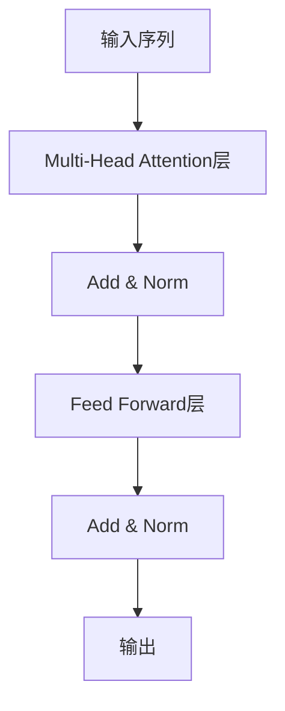
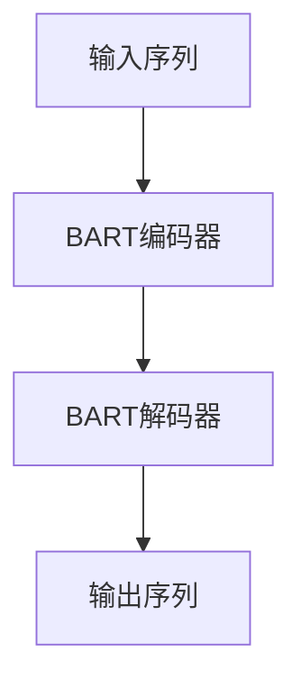

# Transformer大模型实战 了解BART模型

## 1.背景介绍

随着自然语言处理(NLP)技术的不断发展,Transformer模型在各种NLP任务中展现出了卓越的性能。作为Transformer模型的一种变体,BART(Bidirectional and Auto-Regressive Transformer)模型近年来受到了广泛关注。BART模型被设计用于序列到序列(sequence-to-sequence)的生成任务,例如机器翻译、文本摘要、对话系统等。它结合了BERT等自编码器(auto-encoding)模型和GPT等自回归(auto-regressive)模型的优点,展现出了强大的文本生成能力。

### 1.1 Transformer模型回顾

在深入探讨BART模型之前,我们先简要回顾一下Transformer模型的基本原理。Transformer是一种全新的基于注意力机制(Attention Mechanism)的序列模型,它完全抛弃了传统序列模型中的循环神经网络(RNN)和卷积神经网络(CNN)结构,使用多头自注意力(Multi-Head Attention)层和前馈神经网络(Feed-Forward Neural Network)层构建了一种全新的网络架构。

这种全新的架构设计使得Transformer模型在长序列建模任务中表现出色,并且由于其并行计算的特性,训练速度也大大加快。自从Transformer模型在2017年提出后,它迅速成为NLP领域的主流模型,并在机器翻译、文本摘要、问答系统等多个领域取得了最先进的成果。

### 1.2 BART模型的提出

尽管Transformer模型在编码器-解码器(encoder-decoder)架构下表现出色,但它仍然存在一些缺陷和局限性。例如,在序列生成任务中,模型需要从头开始生成文本,这使得生成的文本质量往往不尽如人意。为了解决这一问题,Facebook AI研究院于2019年提出了BART模型。

BART模型的核心思想是:先将输入序列经过噪声处理(例如token masking、token deletion、text infilling等),将其转化为一个受损的序列,然后训练模型从这个受损序列重构出原始序列。在训练过程中,模型需要学会理解输入序列的语义,并生成与原始序列语义相符的输出序列。这种预训练方式使得BART模型在下游的序列生成任务中表现出了更好的性能。

## 2.核心概念与联系

### 2.1 BART模型的编码器-解码器架构

BART模型采用了典型的Transformer编码器-解码器架构,如下图所示:

其中,编码器(Encoder)的作用是将输入序列编码为一系列向量表示,解码器(Decoder)则根据这些向量表示生成目标输出序列。

值得注意的是,BART模型的编码器和解码器都是基于Transformer的结构,它们都使用了多头自注意力层和前馈神经网络层。这使得BART模型在处理长序列时具有很好的并行计算能力。

### 2.2 BART预训练任务

BART模型的预训练任务是序列到序列的重构(sequence-to-sequence reconstruction)任务。具体来说,对于一个给定的输入序列,BART首先会对其进行噪声处理,生成一个受损的序列。然后,模型需要学会从这个受损序列重构出原始的输入序列。

噪声处理的方式有多种,包括:

1. **Token Masking**: 随机将输入序列中的一些token替换为特殊的[MASK]标记。
2. **Token Deletion**: 随机删除输入序列中的一些token。
3. **Text Infilling**: 从输入序列中随机移除一些连续的token块,模型需要根据上下文信息填充这些缺失的token。
4. **Sentence Permutation**: 如果输入是一个长文档,将其分割为多个句子,然后随机打乱句子顺序。

通过这种噪声处理和重构的过程,BART模型被迫学习理解输入序列的语义信息,并生成与原始序列语义相符的输出序列。这种预训练方式赋予了BART强大的语言理解和生成能力,使其在下游的序列生成任务中表现出色。

### 2.3 BART模型在下游任务中的应用

经过上述预训练后,BART模型可以被直接应用于各种序列生成任务,例如:

- **机器翻译**: 将一种语言的文本翻译成另一种语言。
- **文本摘要**: 根据输入文本生成其摘要。
- **对话系统**: 根据对话历史生成下一句对话内容。
- **文本生成**: 根据给定的提示生成连贯的文本。

在应用BART模型时,我们只需要对模型进行一些简单的微调(fine-tuning),使其适应特定的下游任务。由于BART模型已经在预训练阶段学习了强大的语言理解和生成能力,因此在下游任务上往往可以取得很好的效果。

## 3.核心算法原理具体操作步骤

### 3.1 BART模型训练流程

BART模型的训练过程分为两个阶段:预训练(pre-training)和微调(fine-tuning)。

1. **预训练阶段**:

在预训练阶段,BART模型需要在大量的文本数据上进行序列到序列的重构任务训练。具体步骤如下:

(1) 从训练语料库中随机抽取一个输入序列。
(2) 对输入序列进行噪声处理(token masking、token deletion、text infilling等),生成一个受损的序列。
(3) 将原始输入序列作为标签,受损序列作为输入,喂入BART模型进行训练。
(4) 模型的目标是从受损序列重构出与原始输入序列语义相符的输出序列。
(5) 计算模型输出与标签之间的损失函数(例如交叉熵损失),并通过梯度下降算法对模型参数进行更新。
(6) 重复上述过程,在大量数据上不断训练,直至模型收敛。

通过这种方式,BART模型被迫学习理解输入序列的语义信息,并生成与原始序列语义相符的输出序列。这种预训练方式赋予了BART强大的语言理解和生成能力。

2. **微调阶段**:

在完成预训练后,我们可以将BART模型应用于特定的下游任务,例如机器翻译、文本摘要等。这需要对BART模型进行一些微调(fine-tuning),使其适应特定任务的数据分布和目标。

微调的具体步骤如下:

(1) 准备下游任务的训练数据集,包括输入序列和对应的标签序列。
(2) 在下游任务的训练数据上,使用和预训练阶段类似的方式对BART模型进行训练,但这次不需要进行噪声处理,直接将输入序列喂入模型,目标是生成与标签序列相符的输出序列。
(3) 在每个训练步骤中,计算模型输出与标签之间的损失函数,并通过梯度下降算法对模型参数进行更新。
(4) 重复上述过程,直至模型在验证集上的性能不再提升为止。

通过这种微调过程,BART模型可以学习到特定任务的语言模式和规则,从而在该任务上取得更好的性能表现。

### 3.2 BART解码器生成过程

在完成训练后,我们可以使用BART模型进行序列生成任务。生成过程主要发生在BART的解码器(Decoder)部分。

解码器生成序列的具体步骤如下:

(1) 将输入序列喂入BART的编码器,得到其向量表示。
(2) 将一个特殊的起始标记(例如[BOS])作为解码器的初始输入。
(3) 在每一个时间步长:
    - 将当前时间步的输入token喂入解码器,解码器会输出一个概率分布,表示下一个token的预测概率。
    - 从该概率分布中采样(或选择概率最大的token)作为下一个输出token。
    - 将该token作为下一个时间步的输入,重复上述过程。
(4) 当生成了特殊的结束标记(例如[EOS])或达到最大长度时,停止生成,输出完整序列。

在生成过程中,解码器会综合考虑输入序列的语义信息以及当前已生成的部分序列,从而预测下一个最可能的token。BART模型在预训练阶段学习到的语言理解和生成能力,使其能够生成与输入序列语义相符、通顺自然的输出序列。

需要注意的是,在实际应用中,我们往往会引入一些策略来提高生成质量,例如:

- 设置生成长度的最大值和最小值,避免生成过长或过短的序列。
- 引入beam search或top-k/top-p采样等策略,提高生成序列的多样性。
- 添加反复机制(repetition penalty),避免生成重复的token序列。
- 引入其他辅助损失函数,例如覆盖率(coverage)损失,使生成的序列更加全面。

通过上述步骤和策略,BART模型可以被应用于各种序列生成任务,生成高质量的目标序列。

## 4.数学模型和公式详细讲解举例说明

### 4.1 BART模型的损失函数

在BART模型的训练过程中,我们需要定义一个损失函数(Loss Function)来衡量模型预测与真实标签之间的差异,并根据这个损失函数对模型参数进行优化。

BART模型通常采用的是标准的交叉熵损失函数(Cross-Entropy Loss),它可以衡量模型预测的概率分布与真实标签之间的差异。具体来说,对于一个长度为$T$的输出序列$Y=\{y_1, y_2, \dots, y_T\}$,其对应的模型预测概率分布为$P(Y|X)=\prod_{t=1}^{T}P(y_t|y_{<t}, X)$,其中$X$是输入序列。则交叉熵损失函数可以表示为:

$$\mathcal{L}_{CE}(X, Y) = -\sum_{t=1}^{T}\log P(y_t|y_{<t}, X)$$

在实际计算中,我们通常会对该损失函数取平均,得到:

$$\mathcal{L}_{CE}(X, Y) = -\frac{1}{T}\sum_{t=1}^{T}\log P(y_t|y_{<t}, X)$$

通过最小化这个损失函数,我们可以使模型预测的概率分布尽可能地接近真实标签的分布,从而提高模型的生成质量。

在BART模型的预训练阶段,我们将原始输入序列$X$作为标签,将经过噪声处理后的受损序列$\tilde{X}$作为输入,计算$\mathcal{L}_{CE}(\tilde{X}, X)$,并对模型参数进行优化。而在微调阶段,我们将下游任务的输入序列作为$X$,目标序列作为$Y$,计算$\mathcal{L}_{CE}(X, Y)$,并对模型参数进行进一步微调。

### 4.2 注意力机制(Attention Mechanism)

注意力机制是Transformer及其变体模型(如BART)的核心组件之一。它允许模型在生成每个输出token时,动态地关注输入序列中的不同部分,从而捕获长距离依赖关系。

在BART模型中,注意力机制的计算过程可以表示为:

$$\text{Attention}(Q, K, V) = \text{softmax}(\frac{QK^T}{\sqrt{d_k}})V$$

其中:

- $Q$是查询向量(Query),$K$是键向量(Key),$V$是值向量(Value)
- $d_k$是缩放因子,用于防止点积过大导致softmax函数的梯度较小
- $\text{softmax}(\frac{QK^T}{\sqrt{d_k}})$计算了$Q$与所有$K$的相关性得分,并通过softmax函数将其转换为概率分布
- 最终的注意力向量是$V$的加权和,其中权重由上述概率分布决定

在实际应用中,BART模型使用了多头注意力机制(Multi-Head Attention),它可以同时从不同的表示子空间捕获