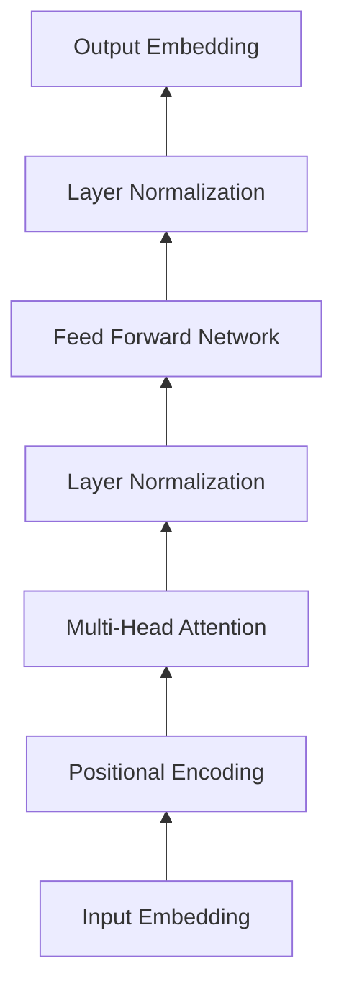

# Transformer大模型实战 加载自定义模型

## 1. 背景介绍

### 1.1 Transformer模型的发展历程

近年来,自然语言处理(NLP)领域取得了突飞猛进的发展,其中Transformer模型功不可没。自从2017年谷歌提出Transformer模型以来,基于Transformer的各种预训练语言模型如雨后春笋般涌现,如BERT、GPT、XLNet等,极大地推动了NLP技术的进步。

### 1.2 加载自定义模型的意义

随着Transformer模型的不断发展,越来越多的研究者和开发者开始尝试训练自己的模型。然而,训练一个高质量的Transformer模型需要海量的数据和计算资源,对于很多人来说是一个挑战。因此,如何加载和使用已有的自定义模型就显得尤为重要。通过加载预训练好的模型,我们可以在此基础上进行微调(fine-tuning),从而快速适应特定的任务,而无需从头开始训练。这不仅能节省大量的时间和计算资源,还能显著提升模型性能。

## 2. 核心概念与联系

### 2.1 Transformer的核心概念

- Self-Attention:自注意力机制,让模型能够关注输入序列中的任意位置,捕捉长距离依赖关系。
- Multi-Head Attention:多头注意力,通过多个Self-Attention并行计算,增强模型的表达能力。 
- Positional Encoding:位置编码,为模型引入序列中每个位置的先验知识。
- Feed Forward Network:前馈神经网络,对Self-Attention的输出进行非线性变换。
- Residual Connection:残差连接,使信息能够更顺畅地在网络中流动。
- Layer Normalization:层归一化,稳定训练过程。

### 2.2 预训练与微调

- 预训练(Pre-training):在大规模无标注语料上训练通用的语言表示模型。常见的预训练任务有语言模型、去噪自编码器等。
- 微调(Fine-tuning):在预训练模型的基础上,使用少量标注数据对模型进行针对性训练,使其适应特定任务。微调一般只需要较少的训练数据和迭代轮数就能取得不错的效果。

### 2.3 Transformer模型架构图



## 3. 核心算法原理具体操作步骤

### 3.1 加载预训练模型

- 选择合适的预训练模型。常见的选择有BERT、RoBERTa、GPT-2等。
- 下载预训练模型的参数文件,如PyTorch的`.bin`文件或TensorFlow的`.ckpt`文件。
- 使用对应的代码库加载预训练模型,如`transformers`库。

```python
from transformers import AutoModel, AutoTokenizer

model_name = "bert-base-uncased"
tokenizer = AutoTokenizer.from_pretrained(model_name)  
model = AutoModel.from_pretrained(model_name)
```

### 3.2 准备数据集

- 将原始文本数据转换为模型需要的输入格式,如`input_ids`、`attention_mask`等。
- 使用`Dataset`和`DataLoader`组织数据,方便批量处理。

```python
from torch.utils.data import Dataset, DataLoader

class MyDataset(Dataset):
    def __init__(self, data, tokenizer):
        self.data = data
        self.tokenizer = tokenizer
        
    def __len__(self):
        return len(self.data)

    def __getitem__(self, idx):
        text = self.data[idx]
        encoding = self.tokenizer(text, return_tensors='pt', padding='max_length', truncation=True)
        return encoding
        
dataset = MyDataset(data, tokenizer)        
dataloader = DataLoader(dataset, batch_size=32)
```

### 3.3 微调模型

- 根据任务需要,在预训练模型上添加新的层,如分类头、序列标注头等。
- 使用标注数据对模型进行训练,更新全部或部分参数。通常使用较小的学习率。
- 评估微调后的模型在验证集上的性能,根据需要调整超参数。

```python
from transformers import AdamW

# 添加分类头
model.classifier = nn.Linear(model.config.hidden_size, num_labels)

# 定义优化器
optimizer = AdamW(model.parameters(), lr=1e-5)

# 训练模型
model.train()
for batch in dataloader:
    optimizer.zero_grad()
    outputs = model(**batch)
    loss = outputs.loss
    loss.backward()
    optimizer.step()
    
# 评估模型    
model.eval()
```

### 3.4 保存和加载微调后的模型

- 使用`save_pretrained`方法保存微调后的模型参数。
- 使用`from_pretrained`方法加载微调后的模型。

```python
model_path = "finetuned_model"
model.save_pretrained(model_path)

loaded_model = AutoModel.from_pretrained(model_path)
```

## 4. 数学模型和公式详细讲解举例说明

### 4.1 Self-Attention

Self-Attention是Transformer的核心组件之一,它允许模型对输入序列中的任意两个位置计算注意力权重,捕捉长距离依赖关系。具体来说,对于输入序列$X \in \mathbb{R}^{n \times d}$,Self-Attention的计算过程如下:

$$
\begin{aligned}
Q &= XW_Q \\
K &= XW_K \\
V &= XW_V \\
\text{Attention}(Q, K, V) &= \text{softmax}(\frac{QK^T}{\sqrt{d_k}})V
\end{aligned}
$$

其中,$W_Q, W_K, W_V \in \mathbb{R}^{d \times d_k}$是可学习的参数矩阵,$d_k$是注意力头的维度。$Q, K, V$分别称为查询(Query)、键(Key)、值(Value)。

通过计算$Q$和$K$的点积并除以$\sqrt{d_k}$,我们得到了注意力权重矩阵。这个矩阵经过softmax归一化后,与$V$相乘,得到了Self-Attention的输出。直观地理解,Self-Attention就是让模型学习到输入序列中每个位置对其他位置的重要程度,并根据这种重要程度对值$V$进行加权求和。

### 4.2 Multi-Head Attention

Multi-Head Attention是在Self-Attention的基础上,并行计算多个"头"(head),然后将结果拼接起来。这样做的目的是让模型能够在不同的子空间里学习到不同的注意力模式,提高模型的表达能力。设$h$为注意力头的数量,Multi-Head Attention的计算过程为:

$$
\begin{aligned}
\text{MultiHead}(Q, K, V) &= \text{Concat}(\text{head}_1, \ldots, \text{head}_h)W_O \\
\text{head}_i &= \text{Attention}(QW_i^Q, KW_i^K, VW_i^V)
\end{aligned}
$$

其中,$W_i^Q, W_i^K, W_i^V \in \mathbb{R}^{d \times d_k}, W_O \in \mathbb{R}^{hd_k \times d}$都是可学习的参数矩阵。

## 5. 项目实践：代码实例和详细解释说明

下面我们通过一个简单的文本分类任务,演示如何使用`transformers`库加载预训练模型并进行微调。

### 5.1 加载预训练模型

```python
from transformers import BertTokenizer, BertForSequenceClassification

model_name = "bert-base-uncased"
tokenizer = BertTokenizer.from_pretrained(model_name)
model = BertForSequenceClassification.from_pretrained(model_name, num_labels=2)
```

这里我们选择了BERT模型,并使用`BertForSequenceClassification`类,它在原始的BERT模型上添加了一个线性分类头。`num_labels`参数指定了分类任务的类别数。

### 5.2 准备数据集

```python
from torch.utils.data import Dataset, DataLoader

class MyDataset(Dataset):
    def __init__(self, data, labels, tokenizer):
        self.data = data
        self.labels = labels
        self.tokenizer = tokenizer
        
    def __len__(self):
        return len(self.data)

    def __getitem__(self, idx):
        text = self.data[idx]
        label = self.labels[idx]
        encoding = self.tokenizer(text, return_tensors='pt', padding='max_length', truncation=True)
        encoding['labels'] = torch.tensor(label)
        return encoding
        
dataset = MyDataset(data, labels, tokenizer)        
dataloader = DataLoader(dataset, batch_size=32)
```

这里我们定义了一个自定义的`Dataset`类,它接受文本数据、标签以及分词器作为输入,并返回模型需要的输入格式。注意这里我们将标签也封装到了最终的字典里,以便在训练时直接获取。

### 5.3 微调模型

```python
from transformers import AdamW

optimizer = AdamW(model.parameters(), lr=1e-5)

num_epochs = 3
device = torch.device('cuda') if torch.cuda.is_available() else torch.device('cpu')
model.to(device)

for epoch in range(num_epochs):
    model.train()
    for batch in dataloader:
        optimizer.zero_grad()
        input_ids = batch['input_ids'].squeeze().to(device)  
        attention_mask = batch['attention_mask'].squeeze().to(device)
        labels = batch['labels'].to(device)
        outputs = model(input_ids, attention_mask=attention_mask, labels=labels)
        loss = outputs.loss
        loss.backward()
        optimizer.step()
        
    model.eval()    
    # 在验证集上评估模型性能
```

在微调阶段,我们定义了优化器`AdamW`,它是`transformers`库推荐的优化算法。然后我们遍历数据集,将数据传入模型进行前向计算,并根据损失函数反向传播更新参数。每个epoch结束后,我们在验证集上评估模型性能,以便调整超参数。

### 5.4 保存和加载微调后的模型

```python
model_path = "finetuned_model"
model.save_pretrained(model_path)

loaded_model = BertForSequenceClassification.from_pretrained(model_path)
```

微调完成后,我们可以使用`save_pretrained`方法将模型参数保存到指定路径,并使用`from_pretrained`方法重新加载。这样我们就得到了一个针对特定任务优化过的模型,可以用于后续的预测和应用。

## 6. 实际应用场景

Transformer模型在NLP领域有着广泛的应用,下面列举几个常见的场景:

- 文本分类:如情感分析、垃圾邮件检测、新闻分类等。
- 命名实体识别:识别文本中的人名、地名、机构名等。
- 问答系统:根据给定的问题和上下文,生成相应的答案。
- 机器翻译:将一种语言的文本翻译成另一种语言。
- 文本摘要:自动生成文本的摘要。
- 对话系统:实现人机对话,如客服聊天机器人等。

通过加载预训练的Transformer模型,并使用少量标注数据进行微调,我们可以快速构建适用于以上场景的高质量模型,大大降低了开发成本。

## 7. 工具和资源推荐

- [transformers](https://github.com/huggingface/transformers):🤗 Hugging Face推出的NLP库,提供了大量预训练模型和便捷的API。
- [PyTorch](https://pytorch.org/):基于动态计算图的深度学习框架,在研究界广泛使用。
- [TensorFlow](https://www.tensorflow.org/):由Google开发的端到端开源机器学习平台。
- [Hugging Face Model Hub](https://huggingface.co/models):Hugging Face提供的预训练模型仓库,包含了大量不同语言和任务的模型。
- [Google Research](https://github.com/google-research):Google Research的官方GitHub仓库,包含了多个前沿的NLP模型实现。
- [Stanford NLP](https://nlp.stanford.edu/):斯坦福大学自然语言处理组,提供了CoreNLP、GloVe等知名NLP工具和资源。

## 8. 总结：未来发展趋势与挑战

Transformer模型的出现标志着NLP领域的一个里程碑,它的成功激发了研究者的进一步探索。未来Transformer模型的发展趋势可能包括以下几个方面:

- 模型的进一步扩大:更大的模型、更多的参数,以提高模型的表达能力。
- 训练范式的改进:如ELECTRA引入了对抗训练,DeBERTa使用了相对位置编码。
- 知识的引入:如何将先验知识融入预训练模型是一个值得探索的方向。
- 多模态学习:将