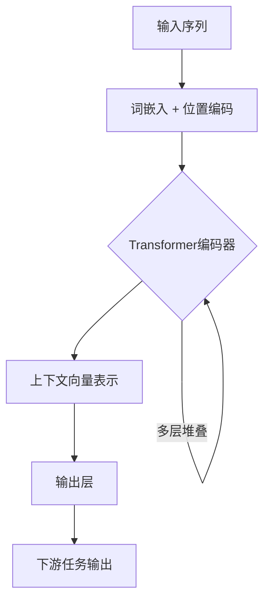

# Transformer大模型实战 汉语的BERT模型

## 1.背景介绍

在自然语言处理(NLP)领域,Transformer模型是一种革命性的技术,它彻底改变了序列数据(如文本)的处理方式。传统的序列模型如RNN(循环神经网络)和LSTM(长短期记忆网络)存在一些固有的缺陷,如梯度消失、无法并行计算等,这极大限制了它们在处理长序列时的性能。2017年,Transformer被提出,它完全基于注意力机制,摒弃了RNN的递归结构,可以高效地并行计算,大大提高了模型的处理效率。

BERT(Bidirectional Encoder Representations from Transformers)是一种基于Transformer的预训练语言模型,在2018年由Google提出。BERT在预训练阶段对大量无标注数据进行双向建模,捕获了单词的上下文语义信息,为下游NLP任务提供了强大的语义表示能力。BERT在多项NLP基准测试中取得了最佳成绩,成为NLP领域最重要的技术突破之一。

## 2.核心概念与联系

### 2.1 Transformer

Transformer由编码器(Encoder)和解码器(Decoder)两部分组成。编码器将输入序列映射为连续的表示,解码器则根据编码器的输出生成目标序列。两者都采用多头自注意力机制(Multi-Head Attention)和前馈神经网络(Feed-Forward Neural Network)构建。

#### 2.1.1 注意力机制(Attention Mechanism)

注意力机制是Transformer的核心,它可以捕捉输入序列中任意两个位置的依赖关系,从而更好地建模长距离依赖。

对于给定的查询(Query)序列和键(Key)、值(Value)序列,注意力机制通过计算查询与每个键的相关性得分,对值序列进行加权求和,得到查询的注意力表示。数学表示为:

$$\mathrm{Attention}(Q, K, V) = \mathrm{softmax}(\frac{QK^T}{\sqrt{d_k}})V$$

其中$Q$、$K$、$V$分别表示查询、键和值;$d_k$是缩放因子,用于防止内积过大导致softmax函数的梯度较小。

#### 2.1.2 多头注意力(Multi-Head Attention)

多头注意力机制可以从不同的子空间捕捉不同的相关性,从而提高模型的表达能力。具体做法是将查询、键和值先通过不同的线性投影分别得到多组$Q$、$K$、$V$,对每组进行注意力计算,最后将所有注意力输出拼接起来。

```math
\begin{aligned}
\mathrm{MultiHead}(Q, K, V) &= \mathrm{Concat}(\mathrm{head}_1, \ldots, \mathrm{head}_h)W^O\\
\mathrm{where\ head}_i &= \mathrm{Attention}(QW_i^Q, KW_i^K, VW_i^V)
\end{aligned}
```

这里$W_i^Q$、$W_i^K$、$W_i^V$和$W^O$是可学习的线性投影参数。

#### 2.1.3 位置编码(Positional Encoding)

由于Transformer没有捕捉序列顺序的递归或卷积结构,所以需要一些位置信息将顺序编码到序列的表示中。位置编码是一种将元素位置嵌入到向量空间的方法,对于不同位置的元素,其位置编码是不同的。

常用的位置编码方法是正弦编码:

$$
\begin{aligned}
\mathrm{PE}_{(pos, 2i)} &= \sin\left(\frac{pos}{10000^{2i/d_{\mathrm{model}}}}\right)\\
\mathrm{PE}_{(pos, 2i+1)} &= \cos\left(\frac{pos}{10000^{2i/d_{\mathrm{model}}}}\right)
\end{aligned}
$$

其中$pos$是元素的位置索引,$i$是维度索引。这种编码方式可以很好地捕捉序列中元素的相对位置信息。

### 2.2 BERT

BERT是一种基于Transformer的双向预训练语言模型。它的主要创新点在于预训练任务的设计。

#### 2.2.1 预训练任务

BERT采用了两种无监督预训练任务:

1. **掩蔽语言模型(Masked Language Model, MLM)**:在输入序列中随机掩蔽部分单词,目标是基于上下文预测被掩蔽单词的正确词形。

2. **下一句预测(Next Sentence Prediction, NSP)**:判断两个句子是否为连续关系,用于捕捉句子间的关系。

通过这两种任务,BERT可以从大规模无标注语料中学习通用的语义表示,为下游任务提供有力的语义支持。

#### 2.2.2 模型结构

BERT的模型结构由多层Transformer编码器堆叠而成。输入首先通过词嵌入(Word Embedding)和位置编码相加,再传入Transformer编码器进行编码,最终得到每个单词对应的上下文向量表示。

为了区分不同的输入序列,BERT还引入了一个特殊的 `[CLS]` 标记,它的输出向量可以用作句子或句对的表示,常用于下游的分类任务。

#### 2.2.3 微调(Fine-tuning)

BERT在大规模语料上进行了双向建模预训练,学习到了通用的语义表示。对于下游的NLP任务,只需要在BERT的基础上添加一个输出层,使用标注数据对整个模型进行微调(Fine-tuning),即可完成任务训练。

这种预训练+微调的范式大幅减少了下游任务所需的标注数据量,提高了模型的泛化能力。BERT的出现极大地推动了NLP领域的发展。



## 3.核心算法原理具体操作步骤

BERT的核心算法原理可以分为以下几个步骤:

1. **输入表示**:将输入文本序列转换为词元(token)序列,每个词元对应一个词嵌入向量。同时添加两个特殊标记`[CLS]`和`[SEP]`,前者用于句子级别或句对级别的表示,后者用于分隔两个句子。最后将位置编码向量与词嵌入向量相加,作为Transformer编码器的输入。

2. **Transformer编码器**:输入序列经过多层Transformer编码器,每一层由多头自注意力机制和前馈神经网络组成。自注意力机制捕捉序列中任意两个位置的依赖关系,前馈网络对每个位置的表示进行非线性变换。

3. **掩蔽语言模型(MLM)预训练**:在输入序列中随机选择15%的词元进行掩蔽,其中80%用`[MASK]`标记替换,10%用随机词元替换,剩余10%保持不变。模型的目标是基于上下文预测被掩蔽词元的正确词形。

4. **下一句预测(NSP)预训练**:对于成对输入序列,50%的时候两个序列为连续关系,50%为不连续关系。模型需要预测两个序列是否为连续关系。

5. **微调(Fine-tuning)**:在BERT的基础上添加一个输出层,针对特定的下游任务(如文本分类、序列标注等)使用标注数据对整个模型进行微调。`[CLS]`标记对应的输出向量常用作句子或句对的表示,输入下游任务的输出层。

6. **推理**:在推理阶段,将输入数据输入到微调后的BERT模型,得到相应的输出,即完成下游任务的预测。

## 4.数学模型和公式详细讲解举例说明

BERT的核心是Transformer编码器,我们重点介绍其中的自注意力机制(Self-Attention)。

### 4.1 Scaled Dot-Product Attention

给定一个查询(Query)向量$\boldsymbol{q} \in \mathbb{R}^{d_q}$、一组键(Key)向量$\boldsymbol{K} = [\boldsymbol{k}_1, \boldsymbol{k}_2, \ldots, \boldsymbol{k}_n]$和值(Value)向量$\boldsymbol{V} = [\boldsymbol{v}_1, \boldsymbol{v}_2, \ldots, \boldsymbol{v}_n]$,其中$\boldsymbol{k}_i, \boldsymbol{v}_i \in \mathbb{R}^{d_v}$,Scaled Dot-Product Attention的计算过程如下:

1. 计算查询向量与每个键向量的点积,得到一个长度为$n$的向量,表示查询与每个键的相关性分数:

$$
\boldsymbol{s} = [\boldsymbol{q} \cdot \boldsymbol{k}_1, \boldsymbol{q} \cdot \boldsymbol{k}_2, \ldots, \boldsymbol{q} \cdot \boldsymbol{k}_n]
$$

2. 对相关性分数进行缩放,防止较大的点积导致softmax函数的梯度较小:

$$
\boldsymbol{s}' = \frac{\boldsymbol{s}}{\sqrt{d_q}}
$$

3. 对缩放后的分数应用softmax函数,得到注意力权重向量:

$$
\boldsymbol{a} = \mathrm{softmax}(\boldsymbol{s}') = \left[\frac{e^{s'_1}}{\sum_j e^{s'_j}}, \frac{e^{s'_2}}{\sum_j e^{s'_j}}, \ldots, \frac{e^{s'_n}}{\sum_j e^{s'_j}}\right]
$$

4. 使用注意力权重对值向量进行加权求和,得到查询的注意力表示:

$$
\mathrm{Attention}(\boldsymbol{q}, \boldsymbol{K}, \boldsymbol{V}) = \sum_{i=1}^n a_i \boldsymbol{v}_i
$$

上述过程可以用矩阵形式紧凑地表示为:

$$
\mathrm{Attention}(\boldsymbol{Q}, \boldsymbol{K}, \boldsymbol{V}) = \mathrm{softmax}\left(\frac{\boldsymbol{Q}\boldsymbol{K}^\top}{\sqrt{d_q}}\right)\boldsymbol{V}
$$

其中$\boldsymbol{Q}$、$\boldsymbol{K}$、$\boldsymbol{V}$分别表示查询、键和值的矩阵形式。

### 4.2 Multi-Head Attention

单一的注意力机制只能从一个子空间捕捉相关性。为了提高模型的表达能力,BERT采用了Multi-Head Attention,将查询、键和值分别通过不同的线性投影得到多组$\boldsymbol{Q}$、$\boldsymbol{K}$、$\boldsymbol{V}$,对每组进行Scaled Dot-Product Attention计算,最后将所有注意力输出拼接起来:

$$
\begin{aligned}
\mathrm{MultiHead}(\boldsymbol{Q}, \boldsymbol{K}, \boldsymbol{V}) &= \mathrm{Concat}(\mathrm{head}_1, \ldots, \mathrm{head}_h)\boldsymbol{W}^O\\
\mathrm{where\ head}_i &= \mathrm{Attention}(\boldsymbol{Q}\boldsymbol{W}_i^Q, \boldsymbol{K}\boldsymbol{W}_i^K, \boldsymbol{V}\boldsymbol{W}_i^V)
\end{aligned}
$$

其中$\boldsymbol{W}_i^Q \in \mathbb{R}^{d_q \times d_q'}$、$\boldsymbol{W}_i^K \in \mathbb{R}^{d_k \times d_k'}$、$\boldsymbol{W}_i^V \in \mathbb{R}^{d_v \times d_v'}$和$\boldsymbol{W}^O \in \mathbb{R}^{hd_v' \times d_v}$是可学习的线性投影参数,$h$是头数。

Multi-Head Attention不仅提高了模型的表达能力,而且通过并行计算多个头,可以进一步提升计算效率。

### 4.3 位置编码

由于Transformer没有捕捉序列顺序的递归或卷积结构,因此需要一些位置信息将顺序编码到序列的表示中。BERT采用了正弦编码的方式对序列的位置进行编码:

$$
\begin{aligned}
\mathrm{PE}_{(pos, 2i)} &= \sin\left(\frac{pos}{10000^{2i/d_{\mathrm{model}}}}\right)\\
\mathrm{PE}_{