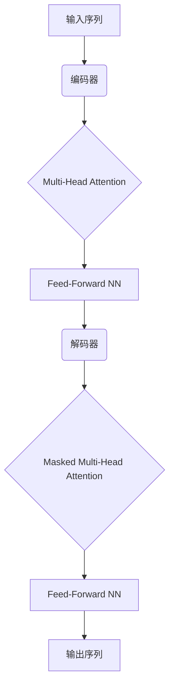

# Transformer大模型实战 法语的FlauBERT模型

## 1.背景介绍

随着自然语言处理(NLP)技术的不断发展,Transformer模型在各种NLP任务中展现出了卓越的性能。作为Transformer模型的一种变体,BERT(Bidirectional Encoder Representations from Transformers)模型通过预训练和微调的方式,在多项NLP任务中取得了state-of-the-art的效果。

然而,BERT模型最初是基于英语数据进行预训练的,对于其他语种的NLP任务来说,模型的性能可能会受到一定影响。为了解决这个问题,研究人员们开发了多种基于BERT的多语种模型,如XLM、XLM-RoBERTa等。而针对法语,一个名为FlauBERT的预训练模型应运而生。

### 1.1 FlauBERT模型简介

FlauBERT是一个基于Transformer的法语预训练语言模型,由AI研究机构FAIR(Facebook AI Research)和巴黎高师(École normale supérieure)的研究人员共同开发。它以BERT模型为基础,并在大规模的法语语料库上进行预训练,旨在为法语NLP任务提供更好的语言表示和理解能力。

FlauBERT模型不仅在下游的法语NLP任务中表现出色,而且还展现出了很强的跨语种迁移能力,能够在其他语种的NLP任务中发挥作用。这使得FlauBERT成为一个非常有价值的多语种NLP资源。

## 2.核心概念与联系  

### 2.1 Transformer模型

Transformer是一种全新的基于注意力机制(Attention Mechanism)的序列到序列(Seq2Seq)模型,最早被提出并应用于机器翻译任务。它完全摒弃了传统序列模型中的循环神经网络(RNN)和卷积神经网络(CNN)结构,而是完全依赖注意力机制来捕获输入序列和输出序列之间的长程依赖关系。

Transformer模型的核心组件包括编码器(Encoder)和解码器(Decoder)。编码器将输入序列映射为一系列连续的向量表示,解码器则根据编码器的输出和之前生成的输出序列,预测下一个token。编码器和解码器都由多个相同的层组成,每一层都包含了多头注意力机制(Multi-Head Attention)和前馈神经网络(Feed-Forward Neural Network)。

### 2.2 BERT模型

BERT(Bidirectional Encoder Representations from Transformers)是一种基于Transformer的预训练语言模型,由Google AI团队在2018年提出。它的核心创新在于采用了Masked Language Model(MLM)和Next Sentence Prediction(NSP)两种预训练任务,使得BERT能够同时捕获单词和句子级别的语义信息。

在BERT的预训练过程中,会随机将输入序列中的一些单词替换为特殊的[MASK]标记,然后让模型根据上下文预测被掩码的单词。这种Masked Language Model的预训练方式,使得BERT能够双向地学习到单词的上下文语义信息。

另一方面,Next Sentence Prediction任务则是判断两个句子是否相邻,从而让BERT学习到句子之间的关系和语义连贯性。

通过这两种预训练任务,BERT能够在大规模的语料库上学习到丰富的语言知识,并将其编码到模型参数中。之后,只需要在特定的下游NLP任务上进行少量的微调(Fine-tuning),就能获得非常出色的性能表现。

### 2.3 FlauBERT与BERT的关系

FlauBERT模型的核心思想与BERT非常相似,都是基于Transformer的预训练语言模型。不同之处在于,FlauBERT是专门为法语而设计和预训练的模型,而BERT最初是针对英语进行预训练的。

FlauBERT在模型架构和预训练任务方面与BERT保持一致,但是预训练语料库完全使用了法语数据。这使得FlauBERT能够更好地捕获法语的语法和语义特征,为法语NLP任务提供更准确的语言表示。

同时,FlauBERT也保留了BERT强大的跨语种迁移能力。通过在多语种数据集上进行微调,FlauBERT也能够在其他语种的NLP任务中发挥作用,展现出了不错的性能表现。

## 3.核心算法原理具体操作步骤

### 3.1 Transformer编码器

Transformer编码器的核心是Multi-Head Attention机制和前馈神经网络。我们先来看Multi-Head Attention的计算过程:

1) 将输入序列 $X = (x_1, x_2, ..., x_n)$ 映射为查询(Query)、键(Key)和值(Value)矩阵:

$$Q = XW^Q, K = XW^K, V = XW^V$$

其中 $W^Q, W^K, W^V$ 是可学习的权重矩阵。

2) 计算注意力分数:

$$\text{Attention}(Q, K, V) = \text{softmax}(\frac{QK^T}{\sqrt{d_k}})V$$

其中 $d_k$ 是缩放因子,用于防止内积值过大导致梯度消失。

3) Multi-Head注意力机制将多个注意力头的结果拼接:

$$\text{MultiHead}(Q, K, V) = \text{Concat}(head_1, ..., head_h)W^O$$

$$\text{where } head_i = \text{Attention}(QW_i^Q, KW_i^K, VW_i^V)$$

其中 $W_i^Q, W_i^K, W_i^V, W^O$ 是可学习的投影矩阵。

4) 残差连接和层归一化:

$$\tilde{X} = \text{LayerNorm}(X + \text{MultiHead}(Q, K, V))$$

5) 前馈神经网络:

$$\text{FFN}(x) = \max(0, xW_1 + b_1)W_2 + b_2$$

其中 $W_1, W_2, b_1, b_2$ 是可学习参数。

6) 残差连接和层归一化:

$$\hat{X} = \text{LayerNorm}(\tilde{X} + \text{FFN}(\tilde{X}))$$

上述过程在Transformer编码器的每一层中重复进行,最终输出 $\hat{X}$ 作为编码器的表示。

### 3.2 BERT预训练

BERT的预训练过程包括两个主要任务:Masked Language Model(MLM)和Next Sentence Prediction(NSP)。

1) Masked Language Model:

- 随机选择输入序列中的15%的token,将它们替换为特殊的[MASK]标记。
- 对于被掩码的token,模型需要根据上下文预测它的原始token。
- MLM的损失函数为交叉熵损失:

$$\mathcal{L}_\text{MLM} = -\sum_{i=1}^n \log P(x_i^\text{masked}|X)$$

其中 $n$ 是被掩码token的数量, $X$ 是输入序列。

2) Next Sentence Prediction:

- 对于每个输入样本,50%的概率是两个相邻的句子,50%的概率是两个无关的句子。
- 模型需要预测这两个句子是否相邻。
- NSP的损失函数为二元交叉熵损失:

$$\mathcal{L}_\text{NSP} = -\mathbb{E}_{X^\text{isNext}}\left[\log P(X^\text{isNext}|X_1, X_2)\right]$$

其中 $X_1, X_2$ 是两个输入句子, $X^\text{isNext}$ 是它们是否相邻的标签。

3) 总的预训练损失是MLM和NSP损失的加权和:

$$\mathcal{L} = \mathcal{L}_\text{MLM} + \lambda \mathcal{L}_\text{NSP}$$

其中 $\lambda$ 是一个超参数,用于平衡两个损失的重要性。

通过上述预训练过程,BERT能够在大规模语料库上学习到丰富的语言知识,为后续的下游任务打下坚实的基础。

### 3.3 FlauBERT预训练

FlauBERT的预训练过程与BERT基本相同,主要区别在于使用的语料库是法语数据。具体步骤如下:

1) 收集大规模的法语文本语料库,包括网页数据、书籍、新闻等。

2) 对语料库进行标记化(Tokenization)和数据清洗预处理。

3) 采用与BERT相同的Masked Language Model和Next Sentence Prediction两种预训练任务。

4) 在法语语料库上训练FlauBERT模型,优化MLM和NSP的联合损失函数。

5) 保存预训练好的FlauBERT模型权重,以备后续在下游任务上进行微调。

通过在大规模法语语料库上预训练,FlauBERT能够捕获法语的语法和语义特征,为法语NLP任务提供更好的语言表示能力。

## 4.数学模型和公式详细讲解举例说明

在上一节中,我们已经介绍了Transformer编码器和BERT预训练的核心数学模型和公式。现在,我们来通过一个具体的例子,进一步解释和说明这些公式的含义和计算过程。

假设我们有一个简单的法语输入序列 "Je suis étudiant"(我是一名学生)。我们将使用一个小规模的FlauBERT模型(词表大小为10,嵌入维度为4)来计算这个序列的表示。

### 4.1 输入嵌入

首先,我们需要将输入序列中的每个token映射为一个嵌入向量。假设FlauBERT模型的词嵌入矩阵如下:

$$\begin{bmatrix}
0.1 & 0.2 & 0.3 & 0.4\\
0.5 & 0.6 & 0.7 & 0.8\\
0.9 & 0.1 & 0.2 & 0.3\\
0.4 & 0.5 & 0.6 & 0.7\\
0.8 & 0.9 & 0.1 & 0.2\\
0.3 & 0.4 & 0.5 & 0.6\\
0.7 & 0.8 & 0.9 & 0.1\\
0.2 & 0.3 & 0.4 & 0.5\\
0.6 & 0.7 & 0.8 & 0.9\\
0.1 & 0.2 & 0.3 & 0.4
\end{bmatrix}$$

那么输入序列 "Je suis étudiant" 对应的嵌入向量为:

$$X = \begin{bmatrix}
0.1 & 0.2 & 0.3 & 0.4\\
0.5 & 0.6 & 0.7 & 0.8\\
0.4 & 0.5 & 0.6 & 0.7\\
0.9 & 0.1 & 0.2 & 0.3
\end{bmatrix}$$

### 4.2 Multi-Head Attention

接下来,我们计算Multi-Head Attention的结果。为了简单起见,假设我们只使用一个注意力头(Head)。

1) 计算Query、Key和Value矩阵:

$$Q = XW^Q = \begin{bmatrix}
0.1 & 0.2 & 0.3 & 0.4\\
0.5 & 0.6 & 0.7 & 0.8\\
0.4 & 0.5 & 0.6 & 0.7\\
0.9 & 0.1 & 0.2 & 0.3
\end{bmatrix} \begin{bmatrix}
0.1\\
0.2\\
0.3\\
0.4
\end{bmatrix} = \begin{bmatrix}
0.5\\
1.1\\
0.9\\
0.3
\end{bmatrix}$$

$$K = XW^K = \begin{bmatrix}
0.1 & 0.2 & 0.3 & 0.4\\
0.5 & 0.6 & 0.7 & 0.8\\
0.4 & 0.5 & 0.6 & 0.7\\
0.9 & 0.1 & 0.2 & 0.3
\end{bmatrix} \begin{bmatrix}
0.5\\
0.6\\
0.7\\
0.8
\end{bmatrix} = \begin{bmatrix}
1.3\\
2.9\\
2.3\\
0.7
\end{bmatrix}$$

$$V = XW^V = \begin{bmatrix}
0.1 & 0.2 & 0.3 & 0.4\\
0.5 & 0.6 & 0.7 & 0.8\\
0.4 & 0.5 & 0.6 