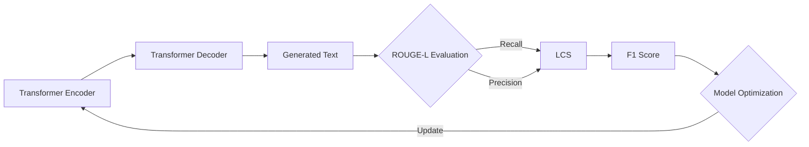

# Transformer大模型实战 理解ROUGE-L 指标

## 1. 背景介绍
### 1.1 Transformer大模型概述
### 1.2 自然语言生成任务中的评估指标
### 1.3 ROUGE-L指标的重要性

## 2. 核心概念与联系
### 2.1 ROUGE家族指标介绍
#### 2.1.1 ROUGE-N
#### 2.1.2 ROUGE-L
#### 2.1.3 ROUGE-W
### 2.2 ROUGE-L与其他指标的区别与联系
#### 2.2.1 与BLEU的比较
#### 2.2.2 与METEOR的比较
### 2.3 ROUGE-L在Transformer模型中的应用

## 3. 核心算法原理具体操作步骤
### 3.1 最长公共子序列(LCS)算法
#### 3.1.1 LCS的定义
#### 3.1.2 LCS的动态规划求解
### 3.2 ROUGE-L分数的计算
#### 3.2.1 召回率(Recall)的计算
#### 3.2.2 准确率(Precision)的计算
#### 3.2.3 F1值的计算
### 3.3 ROUGE-L在Transformer模型训练中的应用步骤

## 4. 数学模型和公式详细讲解举例说明
### 4.1 最长公共子序列(LCS)的数学模型
### 4.2 动态规划求解LCS的状态转移方程
### 4.3 ROUGE-L分数计算的数学公式推导
### 4.4 实例演示ROUGE-L分数的计算过程

## 5. 项目实践：代码实例和详细解释说明
### 5.1 使用Python实现ROUGE-L指标
#### 5.1.1 LCS算法的Python实现
#### 5.1.2 ROUGE-L分数计算的Python实现
### 5.2 在Transformer模型训练中应用ROUGE-L
#### 5.2.1 数据预处理和Tokenization
#### 5.2.2 模型训练和验证
#### 5.2.3 使用ROUGE-L评估生成结果
### 5.3 代码运行结果分析与讨论

## 6. 实际应用场景
### 6.1 文本摘要任务中的应用
### 6.2 机器翻译任务中的应用 
### 6.3 对话生成任务中的应用
### 6.4 其他自然语言生成任务中的应用

## 7. 工具和资源推荐
### 7.1 ROUGE评估工具包
### 7.2 相关论文和学习资源
### 7.3 开源的Transformer模型实现

## 8. 总结：未来发展趋势与挑战
### 8.1 ROUGE-L指标的局限性
### 8.2 结合人工评估的必要性
### 8.3 探索更advanced的评估指标
### 8.4 Transformer模型的优化与改进

## 9. 附录：常见问题与解答
### 9.1 ROUGE-L与人工评估结果的差异
### 9.2 如何权衡ROUGE-L与其他指标
### 9.3 提高ROUGE-L分数的一些技巧
### 9.4 ROUGE-L在长文本生成任务中的适用性

Transformer作为当前自然语言处理领域最为广泛使用的模型架构之一,在机器翻译、文本摘要、对话生成等任务中取得了state-of-the-art的效果。而评估生成文本质量的指标,是Transformer等生成式模型训练不可或缺的一环。其中,ROUGE-L作为一种基于最长公共子序列(Longest Common Subsequence, LCS)的评估指标,以其与人工判断相关性高、计算效率高等优势,在学术界和工业界得到了广泛应用。

本文将重点介绍ROUGE-L指标的原理、算法实现以及在Transformer模型训练中的应用。首先,我们会对ROUGE家族的几种主要指标进行概述,并重点分析ROUGE-L与其他指标的区别和联系。接着,我们会详细讲解ROUGE-L指标背后的最长公共子序列问题,给出其动态规划求解的核心思想和代码实现。在此基础上,我们进一步阐述ROUGE-L分数(包括召回率、准确率和F1值)的计算公式和步骤。

在实践篇章,本文将以Transformer模型为例,演示如何将ROUGE-L指标应用到具体的项目当中。我们会使用Python实现ROUGE-L分数的计算,并将其嵌入到Transformer模型的训练流程中,以指导模型参数的优化。此外,我们还会讨论ROUGE-L在文本摘要、机器翻译、对话生成等不同任务中的应用场景和效果。

在总结与展望部分,我们会分析ROUGE-L指标的局限性,并探讨未来评估指标发展的一些思路。我们认为,尽管ROUGE-L是一种行之有效的自动评估指标,但仍需要与人工评估相结合,以更全面地评判生成文本的质量。此外,探索更为先进的评估指标(如基于语义相似度的指标),也是未来研究的一个重要方向。

总的来说,深入理解ROUGE-L指标的原理和应用,对于掌握Transformer等生成式模型的训练和优化技术至关重要。通过本文的讲解,读者将系统地了解ROUGE-L的方方面面,并能够在实际项目中灵活运用该指标,以评估和改进模型生成的文本质量。

作者：禅与计算机程序设计艺术 / Zen and the Art of Computer Programming