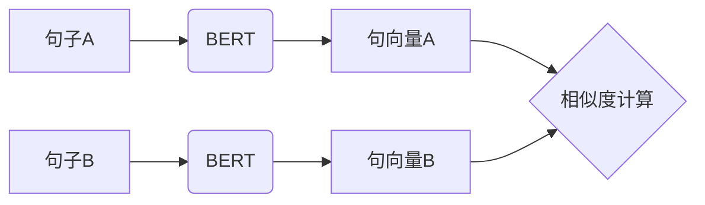

# Transformer大模型实战 用Sentence-BERT模型生成句子特征

## 1. 背景介绍
### 1.1 Transformer模型概述
#### 1.1.1 Transformer模型的提出与发展
Transformer模型是自然语言处理领域近年来的重大突破，由Google在2017年提出。它是一种基于注意力机制的神经网络模型，能够在并行计算的基础上高效地处理序列数据。Transformer模型的出现，极大地推动了自然语言处理技术的发展，为大规模预训练语言模型如BERT、GPT等奠定了基础。

#### 1.1.2 Transformer模型的优势
与传统的循环神经网络(RNN)和卷积神经网络(CNN)相比，Transformer模型具有以下优势：
1. 并行计算能力强，训练速度快；
2. 能够捕捉长距离依赖关系；
3. 不受序列长度限制，适合处理长文本；
4. 通过注意力机制实现了对输入序列的动态加权。

### 1.2 句向量表示的重要性
#### 1.2.1 句向量在NLP任务中的应用
句向量(Sentence Embedding)是指将一个句子映射到固定维度的实值向量空间的技术。通过句向量，我们可以用数学化的方式来表示句子的语义信息。句向量在很多自然语言处理任务中都有广泛应用，如：
- 文本分类与情感分析
- 文本相似度计算
- 信息检索与问答系统
- 机器翻译

#### 1.2.2 传统句向量表示方法的局限性
传统的句向量表示方法主要包括：
- 词袋模型(Bag-of-words)：忽略了词序信息，无法捕捉语义
- TF-IDF：虽然考虑了词频，但是无法表示词与词之间的关系
- Word2vec词向量平均：损失了词序信息，无法很好地表示整个句子的语义

传统方法生成的句向量往往难以准确表达句子的语义信息，尤其是对于长句子和复杂句式。因此，我们需要更加强大的句向量表示模型。

### 1.3 Sentence-BERT模型的提出
Sentence-BERT（简称SBERT）是一种基于BERT的句向量表示模型，由德国慕尼黑大学的Nils Reimers等人在2019年提出。该模型通过在BERT的基础上引入孪生网络结构，可以快速高效地生成高质量的句向量表示。

SBERT模型克服了原始BERT用于生成句向量的局限性，在保证精度的同时大大提高了句向量生成的效率。目前，SBERT已经成为学术界和工业界广泛使用的句向量表示模型之一。

## 2. 核心概念与联系
### 2.1 BERT模型
#### 2.1.1 BERT的网络结构
BERT（Bidirectional Encoder Representations from Transformers）是一种基于Transformer的双向语言表示模型。其网络结构主要由以下部分组成：
- Embedding层：将输入的token序列转换为词向量序列，包括token embedding、segment embedding和position embedding。
- Transformer Encoder层：通过多头自注意力机制和前馈神经网络，对词向量序列进行编码，捕捉词与词之间的关系和上下文信息。BERT采用了多层Transformer Encoder的堆叠结构。
- Pooling层：对Transformer Encoder的输出进行池化操作，常见的有CLS-token pooling和mean pooling。
- 输出层：根据下游任务的不同，输出层可以是分类器、序列标注器等。

#### 2.1.2 BERT的预训练任务
BERT采用了两种预训练任务来学习通用的语言表示：
1. Masked Language Model (MLM)：随机遮挡部分token，让模型根据上下文预测被遮挡的token。
2. Next Sentence Prediction (NSP)：给定两个句子，让模型预测它们是否前后相邻。

通过大规模的无监督预训练，BERT学习到了丰富的语言知识和上下文信息，可以在下游任务中进行微调来提高任务性能。

### 2.2 孪生BERT网络
#### 2.2.1 孪生网络简介
孪生网络（Siamese Network）是一种常用于学习两个输入之间关系的神经网络结构。它由两个或多个结构相同的子网络组成，这些子网络共享相同的权重参数。孪生网络在度量学习、相似度计算等任务中有广泛应用。

#### 2.2.2 Sentence-BERT中的孪生结构
Sentence-BERT采用了孪生网络的思想，将两个句子分别输入到共享参数的BERT网络中，得到它们各自的句向量表示。然后，通过余弦相似度等方式来度量两个句向量之间的相似性。

Sentence-BERT的孪生结构可以表示为：



通过孪生BERT网络，我们可以高效地计算句子之间的语义相似度，为各种句子匹配、语义搜索等任务提供支持。

### 2.3 余弦相似度
余弦相似度是一种常用的向量相似度度量方法。对于两个n维向量a和b，它们的余弦相似度定义为：

$$\cos(a,b) = \frac{a \cdot b}{||a|| \times ||b||}$$

其中，$a \cdot b$表示向量a和b的内积，$||a||$和$||b||$分别表示向量a和b的L2范数。

余弦相似度的取值范围为[-1, 1]，值越大表示两个向量方向越接近，即它们所表示的对象越相似。在Sentence-BERT中，我们用余弦相似度来度量两个句向量之间的相似性。

## 3. 核心算法原理与具体操作步骤
### 3.1 SBERT模型的训练流程
#### 3.1.1 数据准备
- 正样本对：语义相似的句子对
- 负样本对：语义不相关的句子对
- 数据增强：对句子进行随机截断、词汇替换等操作，生成更多的训练样本

#### 3.1.2 模型初始化
- 加载预训练的BERT模型作为基础模型
- 构建孪生BERT网络，共享BERT参数

#### 3.1.3 模型训练
1. 将句子对输入到孪生BERT网络中，得到句向量表示
2. 计算句向量之间的余弦相似度
3. 使用对比损失函数（如交叉熵损失）来优化模型参数，使得正样本对的相似度高于负样本对
4. 重复步骤1-3，直到模型收敛或达到预设的训练轮数

#### 3.1.4 模型评估与微调
- 在验证集上评估模型性能，如句子相似度计算任务
- 根据验证集结果调整超参数，进行模型微调
- 在测试集上评估模型的泛化能力

### 3.2 SBERT生成句向量的步骤
给定一个输入句子，SBERT生成其句向量表示的具体步骤如下：
1. 对句子进行预处理，如分词、小写转换等
2. 将句子输入到SBERT模型中
3. SBERT对句子进行编码，经过Embedding层、多层Transformer Encoder层和Pooling层
4. 从Pooling层输出提取句向量表示
5. 对句向量进行L2归一化，得到最终的单位句向量

通过上述步骤，我们可以将任意长度的句子映射到固定维度的向量空间中，方便进行后续的相似度计算、聚类、检索等操作。

## 4. 数学模型和公式详细讲解举例说明
### 4.1 BERT的Embedding层
BERT的Embedding层将输入的token序列转换为对应的词向量序列。设输入句子的token数为$n$，词向量维度为$d$，则Embedding层的输出为一个$n \times d$的矩阵$E$。

$$E = [e_1, e_2, ..., e_n]$$

其中，$e_i$表示第$i$个token的词向量，由token embedding、segment embedding和position embedding三部分相加得到。

$$e_i = token\_embedding_i + segment\_embedding_i + position\_embedding_i$$

举例说明：假设输入句子为"I love natural language processing"，经过BERT的Embedding层处理后，得到的词向量序列为：

$$E = \begin{bmatrix}
e_{[CLS]} \\
e_I \\
e_{love} \\
e_{natural} \\
e_{language} \\
e_{processing} \\
e_{[SEP]}
\end{bmatrix}$$

其中，$[CLS]$和$[SEP]$为特殊token，分别表示句子的开始和结束。

### 4.2 Transformer Encoder层的计算
Transformer Encoder层使用多头自注意力机制和前馈神经网络对词向量序列进行编码。设第$l$层Transformer Encoder的输入为$H^{(l-1)}$，输出为$H^{(l)}$。

$$H^{(l)} = TransformerEncoder(H^{(l-1)})$$

其中，$TransformerEncoder$函数包括以下计算步骤：

1. 多头自注意力（Multi-Head Self-Attention）：

$$Attention(Q, K, V) = softmax(\frac{QK^T}{\sqrt{d_k}})V$$

$$MultiHead(H) = Concat(head_1, head_2, ..., head_h)W^O$$

其中，$Q$、$K$、$V$分别为查询矩阵、键矩阵和值矩阵，$d_k$为每个注意力头的维度，$h$为注意力头的数量，$W^O$为输出线性变换矩阵。

2. 残差连接和Layer Normalization：

$$\tilde{H} = LayerNorm(H + MultiHead(H))$$

3. 前馈神经网络（Feed-Forward Network）：

$$FFN(x) = max(0, xW_1 + b_1)W_2 + b_2$$

$$H^{(l)} = LayerNorm(\tilde{H} + FFN(\tilde{H}))$$

其中，$W_1$、$W_2$、$b_1$、$b_2$为前馈神经网络的权重矩阵和偏置向量。

通过多层Transformer Encoder的堆叠，BERT可以学习到句子中词与词之间的依赖关系和上下文信息。

### 4.3 Pooling层的操作
Pooling层对Transformer Encoder的输出进行池化操作，提取句子的整体表示。常见的池化方式有：

1. CLS-token Pooling：提取输出序列中第一个token（即$[CLS]$）对应的向量作为句向量。

$$v = H^{(L)}[0]$$

其中，$H^{(L)}$为最后一层Transformer Encoder的输出，$[0]$表示取第一个token的向量。

2. Mean Pooling：对输出序列的所有token向量进行平均。

$$v = \frac{1}{n}\sum_{i=1}^n H^{(L)}[i]$$

得到的句向量$v$即为SBERT模型生成的句子表示。

### 4.4 余弦相似度的计算
对于两个句子$s_1$和$s_2$，SBERT分别生成它们的句向量$v_1$和$v_2$。然后，通过计算两个向量的余弦相似度来衡量句子之间的相似性。

$$sim(s_1, s_2) = \cos(v_1, v_2) = \frac{v_1 \cdot v_2}{||v_1|| \times ||v_2||}$$

举例说明：假设有以下两个句子：
- $s_1$: "I love natural language processing"
- $s_2$: "I enjoy studying NLP"

通过SBERT模型，我们得到它们的句向量$v_1$和$v_2$。计算余弦相似度：

$$sim(s_1, s_2) = \cos(v_1, v_2) = \frac{v_1 \cdot v_2}{||v_1|| \times ||v_2||} = 0.85$$

得到的相似度为0.85，说明这两个句子在语义上是比较相似的。

## 5. 项目实践：代码实例和详细解释说明
下面我们通过一个简单的Python代码实例，演示如何使用SBERT模型生成句向量并计算句子之间的相似度。

```python
from sentence_transformers import SentenceTransformer
from sklearn.metrics.pairwise import cosine_similarity

# 加载预训练的SBERT模型
model = SentenceTransformer('bert-base-nli-mean-tokens')

# 待编码的句子
sentences = [
    "I love natural language processing",
    "I enjoy studying NLP