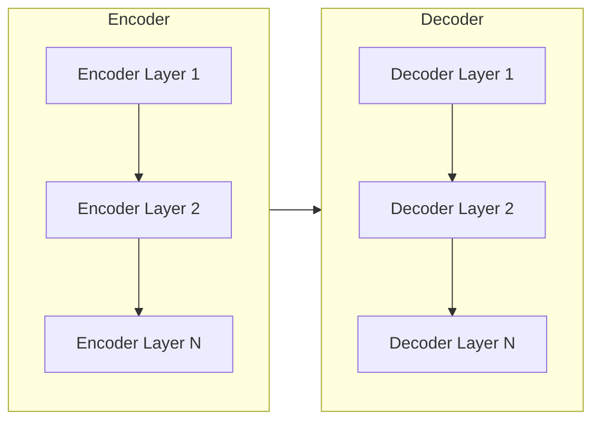
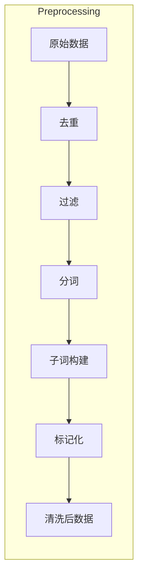
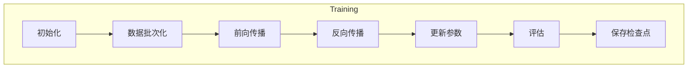

# Transformer大模型实战 用更多的数据集进行训练

## 1.背景介绍

### 1.1 大模型的兴起

近年来,自然语言处理(NLP)领域取得了长足的进步,很大程度上得益于Transformer模型及其变体的出现。Transformer是一种基于注意力机制的序列到序列(Seq2Seq)模型,最初被用于机器翻译任务。由于其卓越的性能和并行计算能力,Transformer很快被广泛应用于各种NLP任务,如文本生成、语义理解、问答系统等。

随着计算能力的不断提升,训练大规模语言模型成为可能。大模型通过在海量数据上预训练,能够学习到丰富的语义和世界知识,从而在下游任务上表现出色。以GPT-3为代表的大模型展现了惊人的泛化能力,可以通过少量微调就解决各种NLP任务。

### 1.2 大模型训练的挑战

尽管大模型取得了巨大成功,但训练过程中仍面临诸多挑战:

1. **数据质量**:大模型需要消化海量数据,但原始数据中存在噪音、偏差等问题,会影响模型性能。
2. **计算资源**:训练大模型需要巨大的计算资源,包括GPU/TPU等加速硬件和大量内存,成本很高。
3. **长序列建模**:Transformer模型对输入序列长度有限制,难以很好地捕获长距离依赖关系。
4. **可解释性**:大模型通常是黑盒模型,其内部机理并不透明,缺乏可解释性。

为了更好地发挥大模型的潜力,我们需要从数据、模型和训练策略等多个角度进行优化。本文将重点探讨如何利用更多的数据集对大模型进行训练,以提升其性能和泛化能力。

## 2.核心概念与联系

### 2.1 Transformer模型

Transformer是一种全新的基于注意力机制的Seq2Seq模型,由编码器(Encoder)和解码器(Decoder)两部分组成。它摒弃了传统的RNN和CNN结构,完全基于注意力机制来捕获序列中的长距离依赖关系。

Transformer的核心组件是多头注意力(Multi-Head Attention)和位置编码(Positional Encoding),前者用于计算序列元素之间的相关性,后者则为序列元素引入位置信息。通过堆叠多个编码器/解码器层,Transformer可以高效地对序列进行建模。



### 2.2 迁移学习与微调

大模型通常采用两阶段训练策略:预训练(Pre-training)和微调(Fine-tuning)。在预训练阶段,模型在大规模无监督数据上进行训练,学习通用的语言表示。在微调阶段,将预训练模型的参数作为初始化,在有监督的任务数据上进行进一步训练,使模型专门化于特定任务。

迁移学习能够充分利用预训练模型中蕴含的知识,大幅减少任务数据的需求量,提高模型的泛化能力。通过微调策略的优化,可以进一步提升模型在下游任务上的性能。

### 2.3 数据集

数据是训练大模型的基础。常用的预训练数据集包括:

- **书籍语料库**:如书库(BookCorpus)、Giga等,包含大量书籍和小说文本。
- **网页语料库**:如CommonCrawl、CC-News等,包含大量网页内容。
- **社交媒体语料库**:如Reddit、Twitter等,包含大量社交媒体对话。

除了规模外,数据集的质量、多样性和领域覆盖范围也很关键。通过组合多个数据源,可以获得更加丰富和多样化的语料,有助于提升模型的泛化能力。

## 3.核心算法原理具体操作步骤

### 3.1 数据预处理

在训练大模型之前,需要对原始数据进行预处理,包括去重、过滤、分词、子词构建等步骤。以下是一些常见的预处理操作:

1. **去重**:删除重复的句子或段落,减少冗余数据。
2. **过滤**:根据规则过滤掉质量较差的数据,如长度过短、包含特殊字符等。
3. **分词**:将文本切分为单词序列,对于像中文这样没有空格分隔单词的语言尤为重要。
4. **子词构建**:基于分词结果构建子词词表(SubwordVocab),将单词拆分为子词单元,有助于处理未见词。
5. **标记化**:将文本转换为对应的子词ID序列,作为模型的输入。



### 3.2 模型训练

经过预处理后,我们可以开始训练Transformer大模型。训练过程主要包括以下步骤:

1. **初始化**:根据模型配置初始化参数,包括embedding层、注意力层、前馈层等。
2. **数据批次化**:将数据划分为小批次,以加快训练速度。
3. **前向传播**:输入数据,计算模型输出和损失函数。
4. **反向传播**:计算梯度,通过优化器(如AdamW)更新模型参数。
5. **评估**:在验证集上评估模型性能,根据指标调整超参数。
6. **保存检查点**:定期保存模型参数,以备将来使用。



为了加速训练,通常会采用分布式训练、梯度累积、混合精度等策略,充分利用GPU/TPU等硬件资源。

### 3.3 迁移学习与微调

在完成预训练后,我们可以将大模型应用于各种下游NLP任务。常见的迁移学习方法有:

1. **特征提取**:使用预训练模型的编码器提取输入的语义表示,将其作为特征输入到任务模型中。
2. **微调**:在预训练模型的基础上,对部分层(通常是最后几层)进行微调,使其适应特定任务。
3. **prompt学习**:通过设计任务相关的提示词(Prompt),将任务转化为掩码预测问题,利用大模型的生成能力直接解决。

在微调阶段,我们需要根据任务特点调整训练超参数,如学习率、批次大小、训练轮数等,以获得最佳性能。

## 4.数学模型和公式详细讲解举例说明

### 4.1 注意力机制

注意力机制是Transformer模型的核心,用于计算序列元素之间的相关性分数。给定查询(Query)序列$\boldsymbol{q}$和键(Key)序列$\boldsymbol{k}$,注意力分数$\alpha_{i,j}$表示第$j$个键对第$i$个查询的重要性:

$$\alpha_{i,j} = \text{softmax}\left(\frac{\boldsymbol{q}_i^\top \boldsymbol{k}_j}{\sqrt{d_k}}\right)$$

其中$d_k$是缩放因子,用于防止点积过大导致梯度饱和。

注意力输出$\boldsymbol{o}_i$是值(Value)序列$\boldsymbol{v}$的加权和:

$$\boldsymbol{o}_i = \sum_{j=1}^n \alpha_{i,j} \boldsymbol{v}_j$$

多头注意力机制将注意力过程独立运行$h$次,每次使用不同的线性投影,然后将结果拼接:

$$\text{MultiHead}(\boldsymbol{Q}, \boldsymbol{K}, \boldsymbol{V}) = \text{Concat}(\text{head}_1, \dots, \text{head}_h)\boldsymbol{W}^O$$

其中$\text{head}_i = \text{Attention}(\boldsymbol{Q}\boldsymbol{W}_i^Q, \boldsymbol{K}\boldsymbol{W}_i^K, \boldsymbol{V}\boldsymbol{W}_i^V)$。

### 4.2 位置编码

由于Transformer没有递归或卷积结构,因此需要一种方法为序列元素引入位置信息。位置编码是一种将元素位置嵌入到向量中的方法:

$$\begin{aligned}
\text{PE}_{(pos, 2i)} &= \sin\left(\frac{pos}{10000^{2i/d_\text{model}}}\right) \\
\text{PE}_{(pos, 2i+1)} &= \cos\left(\frac{pos}{10000^{2i/d_\text{model}}}\right)
\end{aligned}$$

其中$pos$是位置索引,而$i$是维度索引。位置编码与输入embedding相加,从而为模型提供位置信息。

### 4.3 掩码语言模型

掩码语言模型(Masked Language Model, MLM)是一种自监督学习目标,被广泛用于预训练。它的思想是在输入序列中随机掩码部分词元(如15%),然后让模型基于上下文预测被掩码的词元。

具体来说,给定掩码后的序列$\boldsymbol{x}$,模型需要最大化掩码位置的条件概率:

$$\mathcal{L}_\text{MLM} = -\mathbb{E}_{\boldsymbol{x}} \left[ \sum_{i \in \text{mask}} \log P(x_i | \boldsymbol{x}_{\backslash i}) \right]$$

其中$\boldsymbol{x}_{\backslash i}$表示序列$\boldsymbol{x}$中除第$i$个位置外的其他位置。通过最小化MLM损失函数,模型可以学习到有用的语义和上下文表示。

## 5.项目实践:代码实例和详细解释说明

为了更好地理解Transformer大模型的训练过程,我们将使用PyTorch实现一个简化版本的Transformer模型,并在WMT'14英德翻译数据集上进行训练。完整代码可在GitHub上获取。

### 5.1 数据预处理

我们首先导入所需的库,并定义一些辅助函数:

```python
import torch
import torch.nn as nn
import torch.optim as optim
from torchtext.datasets import Multi30k
from torchtext.data import Field, BucketIterator

# 定义字段
SRC = Field(tokenize='spacy', init_token='<sos>', eos_token='<eos>')
TRG = Field(tokenize='spacy', init_token='<sos>', eos_token='<eos>')

# 加载数据集
train_data, valid_data, test_data = Multi30k.splits(exts=('.de', '.en'), fields=(SRC, TRG))

# 构建词表
SRC.build_vocab(train_data, min_freq=2)
TRG.build_vocab(train_data, min_freq=2)

# 创建迭代器
train_iter, valid_iter, test_iter = BucketIterator.splits(
    (train_data, valid_data, test_data), batch_size=32, device=device)
```

我们使用torchtext库加载Multi30k数据集,并基于spaCy分词器构建源语言(德语)和目标语言(英语)的词表。然后,我们创建数据迭代器,用于在训练时获取小批量数据。

### 5.2 模型实现

接下来,我们实现Transformer模型的编码器和解码器部分:

```python
class TransformerEncoder(nn.Module):
    def __init__(self, input_dim, hid_dim, n_layers, n_heads, pf_dim, dropout, device):
        super().__init__()
        self.device = device
        self.tok_embedding = nn.Embedding(input_dim, hid_dim)
        self.pos_embedding = nn.Embedding(1000, hid_dim)
        self.layers = nn.ModuleList([EncoderLayer(hid_dim, n_heads, pf_dim, dropout, device) 
                                     for _ in range(n_layers)])
        
        self.dropout = nn.Dropout(dropout)
        
    def forward(self, src):
        # src = [batch_size, src_len]
        batch_size = src.shape[0]
        src_len =