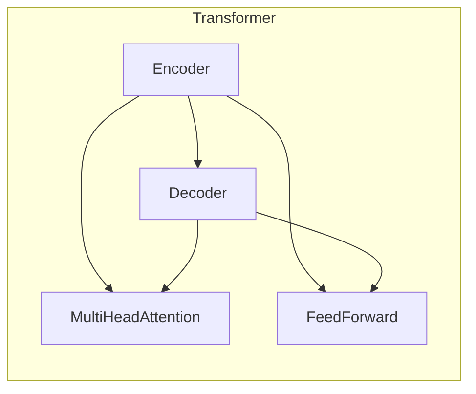
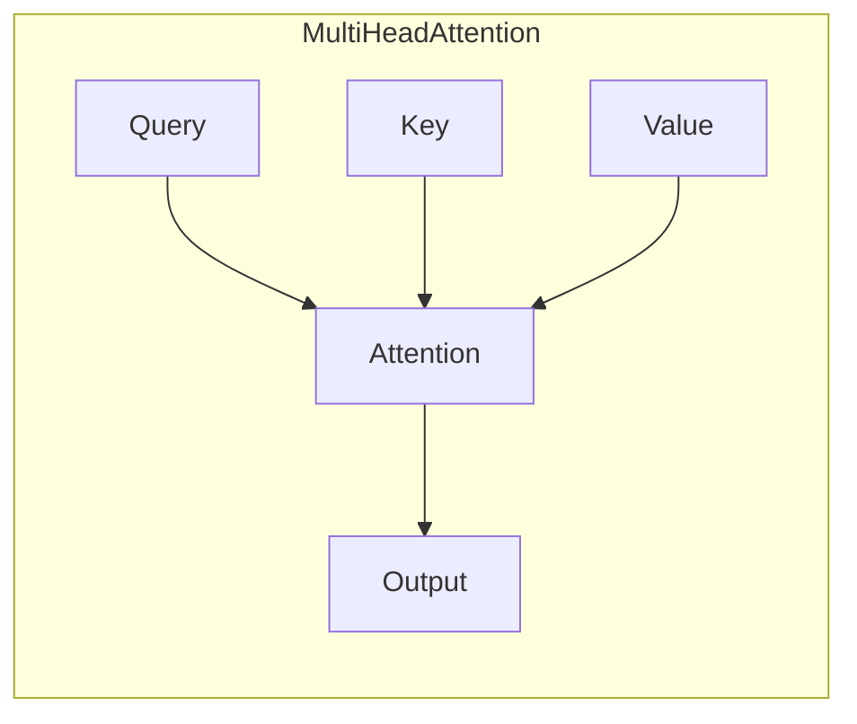
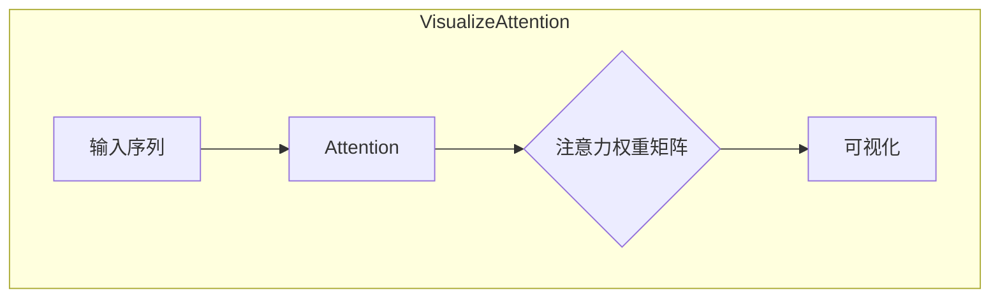

# Transformer大模型实战 自然语言推理任务

## 1.背景介绍

### 1.1 自然语言处理的重要性

在当今信息时代,自然语言处理(Natural Language Processing,NLP)已成为人工智能领域中最为关键和具有挑战性的任务之一。人类与机器之间的自然交互是实现真正智能系统的关键,而自然语言处理则是实现这一目标的核心技术。

自然语言处理广泛应用于机器翻译、智能问答、信息检索、情感分析、自动摘要等诸多领域,对提升人机交互体验、挖掘海量文本数据价值、推动智能系统发展具有重要意义。

### 1.2 自然语言推理任务介绍  

自然语言推理(Natural Language Inference,NLI)是自然语言处理中一项基础且具有挑战性的任务。它要求机器能够理解给定的一个前提(premise)和一个假设(hypothesis),并判断这两者之间的逻辑关系是蕴含(entailment)、矛盾(contradiction)还是中立(neutral)。

自然语言推理任务不仅需要机器具备深层次的语义理解能力,还需要对上下文语义和常识推理进行建模。这对于构建真正的"通用人工智能"至关重要,是衡量自然语言处理系统理解能力的重要指标之一。

### 1.3 Transformer大模型在NLP中的应用

传统的自然语言处理模型大多基于循环神经网络(RNN)或卷积神经网络(CNN),但存在计算复杂度高、难以并行化等缺陷。2017年,Transformer模型凭借全新的自注意力机制在机器翻译任务上取得了突破性进展,极大推动了NLP领域的发展。

Transformer模型抛弃了RNN/CNN的序列结构,完全基于注意力机制对输入序列进行并行计算,大幅提升了训练效率。通过预训练和迁移学习,Transformer大模型(如BERT、GPT等)在多项NLP任务上取得了卓越表现,成为解决自然语言推理等复杂任务的利器。

## 2.核心概念与联系

### 2.1 Transformer模型架构

Transformer模型主要由编码器(Encoder)和解码器(Decoder)两部分组成。编码器将输入序列映射为高维向量表示,解码器则基于编码器的输出生成目标序列。



编码器和解码器的核心组件是多头注意力(Multi-Head Attention)和前馈神经网络(Feed-Forward Neural Network),通过残差连接(Residual Connection)和层归一化(Layer Normalization)增强模型性能。

### 2.2 自注意力机制

自注意力机制是Transformer模型的核心创新,它允许模型在计算目标单词的表示时,直接关注整个输入序列中的所有单词,而不再受序列顺序的限制。



自注意力机制通过查询(Query)、键(Key)和值(Value)之间的相似性计算来确定注意力分数,进而对输入序列中的所有单词进行加权求和,生成目标单词的表示。

### 2.3 BERT模型

BERT(Bidirectional Encoder Representations from Transformers)是一种基于Transformer的预训练语言模型,通过自监督学习方式在大规模语料上预训练,学习到丰富的语义和上下文信息。

BERT采用了全新的"masked language model"和"next sentence prediction"两种预训练任务,实现了双向编码,显著提升了语义表示能力。通过在下游任务上进行微调,BERT在自然语言推理、文本分类、问答系统等多项任务上取得了极佳表现。

### 2.4 GPT模型

GPT(Generative Pre-trained Transformer)是另一种基于Transformer的预训练语言模型。与BERT不同,GPT采用单向语言模型的预训练方式,预测下一个单词的概率分布。

GPT在大规模语料上进行预训练后,可生成高质量、连贯的自然语言文本,被广泛应用于文本生成、机器翻译、问答系统等领域。GPT-3更是凭借惊人的175亿参数,在多项自然语言任务上展现出接近人类的能力。

## 3.核心算法原理具体操作步骤

### 3.1 输入表示

在进行自然语言推理任务之前,需要将文本序列转化为模型可识别的数值表示。常用的方法是将单词映射为预训练的词向量(Word Embedding),或使用子词(Subword)嵌入来表示词元。

对于BERT等预训练语言模型,通常会在输入序列的开头添加特殊的[CLS]标记,用其最终的向量表示作为整个序列的综合语义表示,用于下游分类任务。

### 3.2 模型微调

虽然预训练语言模型在大规模语料上学习到了丰富的语义知识,但要将其应用于特定的下游任务(如自然语言推理),通常需要进行进一步的微调(Fine-tuning)。

微调过程中,模型会在特定任务的训练数据上继续训练,对参数进行调整和优化,使模型能够更好地适应该任务。对于BERT等模型,通常会在最后添加一个分类头(Classification Head),将[CLS]向量输入分类器,预测输出标签。

### 3.3 注意力可视化

自注意力机制是Transformer模型的核心创新,它赋予了模型直观理解输入序列内部结构的能力。通过可视化注意力权重矩阵,我们可以洞察模型在做出预测时,关注了输入序列中的哪些单词或短语。



注意力可视化不仅有助于理解模型的内部工作机制,还可用于诊断模型的错误预测,并优化模型性能。

### 3.4 模型优化

为了进一步提升Transformer大模型在自然语言推理等任务上的性能,研究人员提出了多种优化策略:

1. **数据增强**:通过生成更多的训练样本(如反转前提和假设、引入噪声等)来增强模型的泛化能力。

2. **知识增强**:将外部知识库(如WordNet、ConceptNet等)引入模型,增强常识推理能力。

3. **对抗训练**:在训练过程中引入对抗样本,提高模型的鲁棒性。

4. **模型集成**:将多个模型的预测结果进行集成,提升整体性能。

5. **迁移学习**:在源任务上预训练的模型可迁移到目标任务,加速收敛并提高性能。

通过上述优化手段,Transformer大模型在自然语言推理等任务上的性能不断被刷新,展现出巨大的潜力。

## 4.数学模型和公式详细讲解举例说明

### 4.1 自注意力计算

自注意力机制是Transformer模型的核心,它通过计算查询(Query)、键(Key)和值(Value)之间的相似性,对输入序列中的所有单词进行加权求和,生成目标单词的表示。具体计算过程如下:

1. 将输入序列 $X = (x_1, x_2, \dots, x_n)$ 分别映射为查询序列 $Q = (q_1, q_2, \dots, q_n)$、键序列 $K = (k_1, k_2, \dots, k_n)$ 和值序列 $V = (v_1, v_2, \dots, v_n)$。

2. 计算查询 $q_i$ 与所有键 $k_j$ 的相似性得分(注意力分数):

$$
\text{Attention}(q_i, k_j) = \frac{q_i^T k_j}{\sqrt{d_k}}
$$

其中 $d_k$ 为键向量的维度,用于缩放点积值,避免过大的值导致梯度消失或爆炸。

3. 对注意力分数进行 softmax 归一化,得到注意力权重:

$$
\alpha_{ij} = \frac{\exp(\text{Attention}(q_i, k_j))}{\sum_{l=1}^n \exp(\text{Attention}(q_i, k_l))}
$$

4. 将注意力权重与值向量 $v_j$ 相乘并求和,得到目标单词 $y_i$ 的表示:

$$
y_i = \sum_{j=1}^n \alpha_{ij} v_j
$$

通过上述计算,模型可以自适应地为每个目标单词分配注意力权重,关注输入序列中与之最相关的部分,从而生成更准确的表示。

### 4.2 多头注意力

为了捕获不同子空间的相关性,Transformer引入了多头注意力(Multi-Head Attention)机制。具体来说,将查询、键和值分别映射为 $h$ 个子空间,对每个子空间分别计算注意力,最后将所有子空间的注意力结果拼接起来:

$$
\text{MultiHead}(Q, K, V) = \text{Concat}(\text{head}_1, \dots, \text{head}_h) W^O
$$

其中 $\text{head}_i = \text{Attention}(QW_i^Q, KW_i^K, VW_i^V)$,  $W_i^Q \in \mathbb{R}^{d_\text{model} \times d_k}$、$W_i^K \in \mathbb{R}^{d_\text{model} \times d_k}$、$W_i^V \in \mathbb{R}^{d_\text{model} \times d_v}$ 为可学习的线性映射,  $W^O \in \mathbb{R}^{hd_v \times d_\text{model}}$ 为输出权重矩阵。

多头注意力机制赋予了模型关注输入序列不同位置和不同子空间的能力,提高了模型的表达能力。

### 4.3 掩码自注意力

在自回归语言模型(如GPT)中,为了保证每个位置的单词只能关注之前的单词(保证自回归性),需要在自注意力计算中引入掩码机制。具体来说,在计算注意力分数时,将当前位置之后的注意力分数设置为一个很小的值(如 $-\infty$),从而在 softmax 归一化后,这些位置的注意力权重接近于 0。

$$
\text{Attention}(q_i, k_j) = 
\begin{cases}
\frac{q_i^T k_j}{\sqrt{d_k}}, & \text{if } j \leq i \\
-\infty, & \text{if } j > i
\end{cases}
$$

通过掩码自注意力,模型可以只关注当前位置之前的上下文信息,从而实现自回归生成。

## 5.项目实践:代码实例和详细解释说明

以下是使用PyTorch实现Transformer模型进行自然语言推理任务的代码示例,包括数据预处理、模型定义、训练和评估等步骤。

### 5.1 数据预处理

```python
import torch
from torchtext.legacy import data

# 定义文本字段
TEXT = data.Field(tokenize='spacy',
                  tokenizer_language='en_core_web_sm',
                  init_token='<sos>',
                  eos_token='<eos>',
                  lower=True)

# 定义标签字段
LABEL = data.LabelField(dtype=torch.float)

# 加载数据集
train_data, valid_data, test_data = data.TabularDataset.splits(
    path='data/', train='train.csv', validation='valid.csv', test='test.csv', format='csv',
    fields={'premise': ('premise', TEXT), 'hypothesis': ('hypothesis', TEXT), 'label': ('label', LABEL)},
    skip_header=True)

# 构建词表
TEXT.build_vocab(train_data, max_size=25000, vectors="glove.6B.100d", unk_init=torch.Tensor.normal_)
LABEL.build_vocab(train_data)

# 构建迭代器
BATCH_SIZE = 64

train_iterator, valid_iterator, test_iterator = data.BucketIterator.splits(
    (train_data, valid_data, test_data),
    batch_size=BATCH_SIZE,
    sort_within_batch=True,
    device=device)
```

上述代码使用PyTorch的torchtext库加载和预处理自然语言推理数据集,包括tokenization、词表构建和数据迭代器创建等步骤。