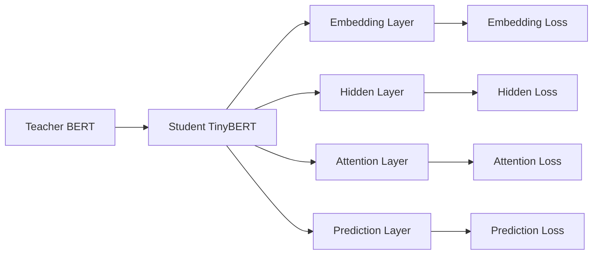

# Transformer大模型实战 训练学生BERT模型（TinyBERT 模型）

## 1. 背景介绍

近年来，Transformer架构的大型语言模型如BERT、GPT等在自然语言处理领域取得了巨大成功。这些模型通过在大规模语料库上进行预训练，能够学习到丰富的语言知识，并可以应用到下游的各种NLP任务中，大幅提升了任务性能。

然而，这些大模型通常包含数亿甚至上千亿的参数，模型体积庞大，推理速度慢，难以部署到资源受限的场景中，如移动设备和IoT设备等。为了解决这一问题，研究者们提出了模型压缩技术，旨在在保持模型性能的同时，大幅缩小模型体积，加快推理速度。

其中一种有效的模型压缩方法是知识蒸馏（Knowledge Distillation），即使用大模型（Teacher Model）的知识来指导训练一个小模型（Student Model）。本文将介绍如何使用知识蒸馏技术，训练一个小型化的BERT模型 - TinyBERT，在大幅缩减模型体积的同时，仍然保持与原始BERT相当的性能表现。

## 2. 核心概念与联系

### 2.1 Transformer 架构

Transformer是一种基于自注意力机制（Self-Attention）的神经网络架构，最早由Google于2017年提出，用于机器翻译任务。它摒弃了传统的RNN/CNN等结构，完全依赖于注意力机制来学习文本的内部依赖关系。

一个标准的Transformer包含编码器（Encoder）和解码器（Decoder）两部分，每一部分都是由若干个相同的Layer堆叠而成。每个Layer主要由多头自注意力（Multi-head Self-attention）和前馈神经网络（Feed-forward Network）组成。

### 2.2 BERT 模型

BERT（Bidirectional Encoder Representations from Transformers）是Google于2018年提出的一个基于Transformer编码器的语言模型。它的核心创新是双向训练（Bidirectional Training），即从左到右和从右到左同时对文本进行编码，使得模型能够更好地理解每个token的上下文语义。

BERT采用两阶段训练方式：
1. 预训练阶段：在大规模无标注语料上进行自监督学习，通过Masked Language Model和Next Sentence Prediction两个任务，让模型学习通用的语言表示。
2. 微调阶段：在下游任务的标注数据上对预训练模型进行微调，使其适应具体的任务。

得益于强大的语言理解能力，BERT在各种NLP任务上都取得了SOTA的效果，成为了当前NLP领域最主流的预训练模型之一。

### 2.3 知识蒸馏

知识蒸馏（Knowledge Distillation, KD）最早由Hinton等人于2015年提出，是一种将复杂模型的知识迁移到简单模型的技术。其基本思想是，用教师模型（Teacher Model）产生的软目标（Soft Target）来指导学生模型（Student Model）的训练，使得小模型能够模仿大模型的行为。

具体来说，KD的损失函数一般由两部分组成：
1. 学生模型与教师模型输出的KL散度，即软目标损失，用于传递教师模型学到的知识；
2. 学生模型在标注数据上的交叉熵损失，即硬目标损失，用于学习ground truth的信息。

通过这种方式，学生模型可以在教师模型的"指点"下，用更少的参数达到与大模型相近的性能。

### 2.4 TinyBERT

TinyBERT是华为诺亚方舟实验室在2019年提出的一个基于BERT的小模型，通过多层次知识蒸馏，将BERT Base（110M参数）压缩到4M参数量级，速度提升9.4倍，同时保持了97%的性能。

TinyBERT的关键创新是将知识蒸馏应用到了Transformer的每一个内部层面：
1. 在Embedding层、隐藏层、注意力层和预测层分别设置蒸馏损失，全面地学习教师BERT的层级知识；
2. 在预训练和微调两个阶段都使用蒸馏，进一步提升了模型性能。

下图展示了TinyBERT的总体架构：

## 3. 核心算法原理与具体操作步骤

TinyBERT的训练分为两个阶段：通用语料上的预训练蒸馏和下游任务的微调蒸馏。下面我们详细介绍每个阶段的核心算法和操作步骤。

### 3.1 预训练蒸馏

#### 3.1.1 准备预训练语料

首先需要准备大规模的无标注文本语料，如Wikipedia、BookCorpus等。对语料进行清洗、分词，并转换为BERT的输入格式。

#### 3.1.2 初始化学生模型

根据设定的层数和隐藏单元数，随机初始化TinyBERT的参数。一般来说，层数和隐藏单元数都是教师BERT的1/4左右。

#### 3.1.3 计算教师模型的输出

用教师BERT对预训练语料进行前向计算，得到以下输出：
- Embedding层的词向量和位置向量
- 每一个Transformer Block的隐藏层状态、注意力分数
- MLM和NSP任务的预测概率

#### 3.1.4 计算蒸馏损失

用学生TinyBERT对同样的输入进行前向计算，并在每一个对应的层上，计算与教师BERT输出的蒸馏损失：
- Embedding层：最小化词向量和位置向量的MSE损失
- 隐藏层：最小化隐藏状态的MSE损失
- 注意力层：最小化注意力分数的MSE损失
- 预测层：最小化MLM和NSP的交叉熵损失

将各层的损失加权求和，得到总的蒸馏损失。

#### 3.1.5 更新学生模型

计算蒸馏损失对学生模型参数的梯度，用Adam优化器更新参数，优化目标是最小化总的蒸馏损失。

#### 3.1.6 迭代训练

重复步骤3-5，直到学生模型收敛或达到预设的训练步数。

### 3.2 微调蒸馏

#### 3.2.1 准备下游任务数据

对于给定的下游任务，准备标注的训练集和验证集数据。

#### 3.2.2 微调教师模型

在下游任务的训练集上微调教师BERT，得到任务特定的教师模型。

#### 3.2.3 计算教师模型的输出

用微调后的教师模型对训练集数据进行前向计算，得到每一层的输出表示，同预训练蒸馏。

#### 3.2.4 计算蒸馏损失

用预训练好的TinyBERT对训练集数据进行前向计算，在每一层上计算与教师模型输出的蒸馏损失，同预训练蒸馏。同时，在输出层增加一项任务损失，即学生模型在训练集上的交叉熵/平方误差损失。

#### 3.2.5 更新学生模型

计算总的蒸馏损失和任务损失对学生模型参数的梯度，用Adam优化器更新参数，优化目标是最小化两项损失的加权和。

#### 3.2.6 迭代训练

重复步骤3-5，直到学生模型在验证集上的性能达到最优。

## 4. 数学模型与公式详解

### 4.1 Transformer的数学描述

Transformer的核心是自注意力机制和前馈神经网络，对应的数学公式如下：

1. 自注意力机制
给定一个长度为$n$的输入序列$\mathbf{X} \in \mathbb{R}^{n \times d}$，自注意力的计算过程为：

$$
\begin{aligned}
\mathbf{Q} &= \mathbf{X} \mathbf{W}^Q \\
\mathbf{K} &= \mathbf{X} \mathbf{W}^K \\ 
\mathbf{V} &= \mathbf{X} \mathbf{W}^V \\
\mathbf{A} &= \text{softmax}(\frac{\mathbf{Q}\mathbf{K}^T}{\sqrt{d_k}}) \\
\text{Attention}(\mathbf{Q}, \mathbf{K}, \mathbf{V}) &= \mathbf{A} \mathbf{V}
\end{aligned}
$$

其中$\mathbf{W}^Q, \mathbf{W}^K, \mathbf{W}^V \in \mathbb{R}^{d \times d_k}$是可学习的投影矩阵，$\mathbf{A} \in \mathbb{R}^{n \times n}$是注意力分数矩阵。

2. 前馈神经网络
$$
\text{FFN}(\mathbf{x}) = \text{ReLU}(\mathbf{x} \mathbf{W}_1 + \mathbf{b}_1) \mathbf{W}_2 + \mathbf{b}_2
$$

其中$\mathbf{W}_1 \in \mathbb{R}^{d \times d_f}, \mathbf{W}_2 \in \mathbb{R}^{d_f \times d}$是权重矩阵，$\mathbf{b}_1 \in \mathbb{R}^{d_f}, \mathbf{b}_2 \in \mathbb{R}^d$是偏置向量。

### 4.2 BERT的预训练目标

BERT采用两个预训练任务来学习语言表示：

1. Masked Language Model（MLM）

随机地Mask掉输入序列中15%的Token，然后让模型根据上下文去预测这些Token。其损失函数为：

$$
\mathcal{L}_{\text{MLM}} = - \sum_{i \in \mathcal{M}} \log P(x_i | \mathbf{x}_{\backslash \mathcal{M}})
$$

其中$\mathcal{M}$是被Mask的Token的下标集合，$\mathbf{x}_{\backslash \mathcal{M}}$表示其余未被Mask的Token。

2. Next Sentence Prediction（NSP）

对于一对句子<$\mathbf{x}_A, \mathbf{x}_B$>，用一个二分类器来预测$\mathbf{x}_B$是否是$\mathbf{x}_A$的下一句。其损失函数为：

$$
\mathcal{L}_{\text{NSP}} = - \mathbb{I}(y=1) \log P(y=1) - \mathbb{I}(y=0) \log P(y=0)
$$

其中$y \in \{0, 1\}$表示$\mathbf{x}_B$是否为$\mathbf{x}_A$的下一句，$\mathbb{I}(\cdot)$为指示函数。

BERT的总的预训练损失为两个任务损失的和：

$$
\mathcal{L}_{\text{pre}} = \mathcal{L}_{\text{MLM}} + \mathcal{L}_{\text{NSP}}
$$

### 4.3 知识蒸馏的数学描述

设教师模型为$f_T$，学生模型为$f_S$，蒸馏的目标是最小化两个模型在给定数据集$\mathcal{D}$上的输出差异。一般采用KL散度来度量这种差异：

$$
\mathcal{L}_{\text{KD}} = \sum_{(\mathbf{x}, y) \in \mathcal{D}} \text{KL}(f_T(\mathbf{x}; \tau) || f_S(\mathbf{x}; \tau))
$$

其中$\tau$是温度参数，用于放缩softmax的输出概率。较高的温度会产生更加"软"的概率分布。

在硬标签数据上，学生模型还需要最小化与真实标签的交叉熵损失：

$$
\mathcal{L}_{\text{CE}} = - \sum_{(\mathbf{x}, y) \in \mathcal{D}} \log f_S(\mathbf{x})[y] 
$$

其中$f_S(\mathbf{x})[y]$表示学生模型在类别$y$上的输出概率。

最终，学生模型的优化目标是最小化蒸馏损失和交叉熵损失的加权和：

$$
\mathcal{L} = \alpha \mathcal{L}_{\text{KD}} + (1 - \alpha) \mathcal{L}_{\text{CE}}
$$

其中$\alpha \in [0, 1]$是平衡两个损失的权重系数。

### 4.4 TinyBERT的多层蒸馏