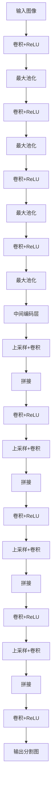

# UNet原理与代码实例讲解

## 1. 背景介绍

在计算机视觉和图像分割领域,UNet模型是一种广泛使用的卷积神经网络架构,主要用于图像分割任务。它由Olaf Ronneberger等人在2015年提出,最初设计用于生物医学图像分割,例如分割细胞和神经元等。UNet模型的出现解决了传统图像分割方法在处理复杂背景和不规则形状对象时存在的困难。

图像分割是指将图像像素划分为若干个具有相似特征的区域或对象的过程。它在医学图像分析、无人驾驶、遥感图像处理等领域有着广泛的应用。准确的图像分割对于目标检测、实例分割、语义分割等高层视觉任务至关重要。

### 1.1 传统图像分割方法缺陷

传统的图像分割方法主要包括基于阈值、边缘、区域和模型的方法。这些方法通常依赖于手工设计的特征,并使用经典的机器学习算法(如SVM、随机森林等)进行分类。然而,这些方法在处理复杂背景、不规则形状对象以及存在噪声和遮挡的图像时,往往效果不佳。

### 1.2 卷积神经网络在图像分割中的优势

随着深度学习的发展,卷积神经网络(CNN)在图像分割任务中展现出了优异的性能。CNN能够自动学习图像的特征表示,从而避免了手工设计特征的限制。然而,早期的CNN架构(如VGGNet、ResNet等)主要设计用于图像分类任务,直接将其应用于图像分割会导致分割结果粗糙,无法很好地保留目标边界和细节信息。

## 2. 核心概念与联系

### 2.1 UNet架构概述

UNet是一种编码器-解码器(encoder-decoder)型卷积神经网络,它的核心思想是通过对称的编码器和解码器结构,实现图像的特征提取和像素级预测。

UNet的编码器部分类似于传统的卷积神经网络,由一系列卷积层和池化层组成,用于提取图像的特征表示。解码器部分则通过上采样操作逐步恢复特征图的分辨率,同时将编码器相应层的特征图与解码器的特征图进行拼接,以保留更多的空间信息。最后,一个卷积层将特征图映射到所需的输出维度(通常为每个像素的类别数)。

上图展示了UNet的基本架构,其中:

- 编码器部分由一系列卷积层和最大池化层组成,用于提取图像特征。
- 解码器部分通过上采样操作逐步恢复特征图的分辨率。
- 编码器和解码器的对应层之间使用"拼接"操作,将编码器的特征图拼接到解码器的特征图中,以保留更多的空间信息。
- 最后一层卷积用于将特征图映射到所需的输出维度。

### 2.2 UNet的创新点

UNet架构的主要创新点包括:

1. **对称的编码器-解码器结构**:通过对称的编码器和解码器结构,UNet能够有效地融合不同尺度的特征信息,捕获目标的细节和上下文信息。

2. **特征图拼接(Skip Connection)**:在解码器阶段,UNet将编码器相应层的特征图与解码器的特征图进行拼接,这种特征融合机制有助于保留更多的空间信息,从而获得更精细的分割结果。

3. **无需完全卷积**:与其他一些分割网络不同,UNet不需要使用完全卷积层,而是直接在最后一层使用普通卷积层进行像素级预测,简化了网络结构。

### 2.3 UNet与其他分割网络的关系

UNet是一种广泛使用的图像分割网络架构,它与其他一些分割网络有一定的关联,例如:

- **FCN(Fully Convolutional Networks)**:FCN是最早应用于图像分割任务的卷积神经网络之一。它通过将分类网络(如VGGNet)的全连接层替换为卷积层,实现了端到端的像素级预测。UNet借鉴了FCN的思想,但进一步改进了网络结构,提高了分割精度。

- **SegNet**:SegNet也是一种编码器-解码器型网络,它使用了最大池化索引(max-pooling indices)来进行上采样操作,从而避免了像素值的不连续性。UNet则采用了更简单的上采样方式。

- **U-Net++**:U-Net++是UNet的改进版本,它通过密集的跳跃连接(dense skip connections)和更深的编码器-解码器结构,进一步提高了分割性能。

- **Attention U-Net**:Attention U-Net在UNet的基础上引入了注意力机制,使网络能够自适应地关注图像中更重要的区域,从而提高分割精度。

总的来说,UNet架构简单高效,在保留空间信息的同时实现了端到端的像素级预测,因此被广泛应用于各种图像分割任务中。

## 3. 核心算法原理具体操作步骤

### 3.1 UNet网络结构详解

UNet网络的核心结构由编码器(encoder)和解码器(decoder)两部分组成。

#### 3.1.1 编码器(Encoder)

编码器部分的作用是提取输入图像的特征信息,它由一系列的卷积层和最大池化层组成。每个卷积层都包括卷积操作、批归一化(Batch Normalization)和ReLU激活函数。最大池化层用于下采样特征图,减小特征图的空间分辨率,同时增加感受野(receptive field)。

编码器的具体操作步骤如下:

1. 输入图像经过两次卷积操作,提取低级特征。
2. 对特征图进行最大池化操作,将特征图的空间分辨率减半。
3. 重复步骤1和2,提取更高级的特征,并进一步减小特征图的空间分辨率。
4. 重复上述步骤,直到达到预设的编码器深度。

在编码器的最深层,特征图的空间分辨率已经大幅降低,但包含了丰富的语义信息。

#### 3.1.2 解码器(Decoder)

解码器部分的作用是根据编码器提取的特征信息,逐步恢复特征图的空间分辨率,最终生成与输入图像相同大小的分割掩码(segmentation mask)。

解码器的具体操作步骤如下:

1. 对编码器最深层的特征图进行上采样操作,将特征图的空间分辨率扩大一倍。
2. 将上采样后的特征图与编码器对应层的特征图进行拼接(concatenation),融合不同尺度的特征信息。
3. 对拼接后的特征图进行两次卷积操作,提取新的特征表示。
4. 重复步骤1到3,逐步恢复特征图的空间分辨率,直到达到与输入图像相同的大小。
5. 在最后一层,使用一个卷积层将特征图映射到所需的输出维度(通常为每个像素的类别数)。

在解码器的每一层,通过与编码器对应层的特征图进行拼接,能够有效地融合不同尺度的特征信息,从而获得更精细的分割结果。

### 3.2 损失函数

UNet通常使用交叉熵损失函数(Cross Entropy Loss)来优化网络参数。对于二分类问题(如前景和背景分割),交叉熵损失函数可以表示为:

$$
\mathcal{L}(y, \hat{y}) = -\sum_{i=1}^{N} y_i \log(\hat{y}_i) + (1 - y_i) \log(1 - \hat{y}_i)
$$

其中,N是输出图像中像素的总数,$y_i$是第i个像素的真实标签(0或1),而$\hat{y}_i$是网络预测的第i个像素属于前景的概率。

对于多类别分割问题,交叉熵损失函数可以扩展为:

$$
\mathcal{L}(y, \hat{y}) = -\sum_{i=1}^{N} \sum_{c=1}^{C} y_{i,c} \log(\hat{y}_{i,c})
$$

其中,C是类别数,$y_{i,c}$是第i个像素属于第c类的真实标签(0或1),而$\hat{y}_{i,c}$是网络预测的第i个像素属于第c类的概率。

在训练过程中,通过最小化损失函数,可以不断优化网络参数,使得网络预测结果逐步接近真实标签。

### 3.3 数据增强

为了提高UNet模型的泛化能力,并防止过拟合,通常需要对训练数据进行数据增强(Data Augmentation)。常见的数据增强方法包括:

- **翻转(Flipping)**:水平或垂直翻转图像。
- **旋转(Rotation)**:按一定角度旋转图像。
- **缩放(Scaling)**:放大或缩小图像的大小。
- **平移(Translation)**:沿水平或垂直方向平移图像。
- **噪声(Noise)**:在图像中添加高斯噪声或盐噪声等。
- **弹性变形(Elastic Deformation)**:对图像进行局部弹性变形。
- **颜色变换(Color Transformation)**:调整图像的亮度、对比度和饱和度等。

通过合理的数据增强策略,可以有效地扩充训练数据集,提高模型的泛化能力,从而获得更好的分割性能。

## 4. 数学模型和公式详细讲解举例说明

### 4.1 卷积操作

卷积操作是UNet网络中的基本运算单元,它通过滤波器(也称为卷积核)在输入特征图上进行滑动,提取局部特征信息。

对于一个二维卷积操作,输入特征图$X$和卷积核$K$的卷积运算可以表示为:

$$
Y_{i,j} = \sum_{m=1}^{M} \sum_{n=1}^{N} X_{i+m-1,j+n-1} \cdot K_{m,n}
$$

其中,$Y_{i,j}$是输出特征图在位置$(i,j)$处的值,$X_{i+m-1,j+n-1}$是输入特征图在位置$(i+m-1,j+n-1)$处的值,$K_{m,n}$是卷积核在位置$(m,n)$处的权重值,而$M$和$N$分别表示卷积核的高度和宽度。

通过在输入特征图上滑动卷积核,并对每个局部区域进行加权求和,可以获得输出特征图。卷积操作能够有效地捕获输入特征图的局部模式和空间关系。

在UNet中,卷积操作广泛应用于编码器和解码器的各个层次,用于提取和融合不同尺度的特征信息。

### 4.2 最大池化操作

最大池化(Max Pooling)是一种下采样操作,它通过在输入特征图上滑动一个固定大小的窗口,并选取窗口内的最大值作为输出特征图的对应位置的值。

对于一个二维最大池化操作,输入特征图$X$和池化窗口大小$W \times H$的最大池化运算可以表示为:

$$
Y_{i