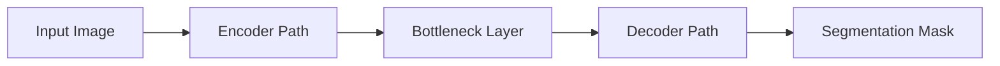

# UNet Community Resources: Learning, Sharing, and Collective Progress

## 1. Background Introduction

The UNet community is a vibrant and growing network of computer vision enthusiasts, researchers, and professionals who share a common interest in deep learning and convolutional neural networks (CNNs). This article aims to provide an in-depth exploration of the UNet architecture, its applications, and resources available for learning and collaboration within the UNet community.

## 2. Core Concepts and Connections

### 2.1 Deep Learning and Convolutional Neural Networks (CNNs)

Deep learning is a subset of machine learning that uses artificial neural networks with multiple layers to learn and make decisions from data. CNNs are a type of deep learning model specifically designed for processing grid-like data, such as images.

### 2.2 Segmentation and UNet Architecture

Image segmentation is the process of partitioning an image into multiple regions, where each region corresponds to an object or a part of an object. UNet is a popular deep learning architecture for semantic segmentation, which is the task of assigning a class label to each pixel in an image.

### 2.3 UNet's Connection to Fully Convolutional Networks (FCNs)

UNet can be seen as an extension of the FCN architecture, which was initially proposed for pixel-wise classification tasks. UNet adds a decoder path to the FCN architecture, allowing for the upsampling of features and the generation of high-resolution segmentation masks.

## 3. Core Algorithm Principles and Specific Operational Steps

### 3.1 Encoder Path

The encoder path in UNet is responsible for extracting high-level features from the input image. It consists of several convolutional layers, followed by batch normalization, ReLU activation, and max pooling operations.

### 3.2 Bottleneck Layer

The bottleneck layer is a crucial component of UNet, as it connects the encoder and decoder paths. It takes the concatenation of the encoder's last feature map and a corresponding upsampled feature map from the decoder as input.

### 3.3 Decoder Path

The decoder path in UNet is responsible for upsampling the features extracted by the encoder and generating the final segmentation mask. It consists of several transposed convolutional layers, followed by batch normalization, ReLU activation, and concatenation with the corresponding encoder feature map.

## 4. Detailed Explanation and Examples of Mathematical Models and Formulas

### 4.1 Convolutional Layer

A convolutional layer applies a set of filters to the input image, producing a set of feature maps. The output of a convolutional layer can be mathematically represented as:

$$
y = f(W \\ast x + b)
$$

where $x$ is the input image, $W$ is the set of filters, $*$ denotes convolution, $f$ is the activation function (e.g., ReLU), $b$ is the bias, and $\\ast$ denotes element-wise multiplication followed by summation.

### 4.2 Transposed Convolutional Layer

A transposed convolutional layer, also known as a deconvolutional layer, performs the inverse operation of a convolutional layer. It upsamples the input feature map and applies a set of filters to produce an output with a higher resolution. The output of a transposed convolutional layer can be mathematically represented as:

$$
y = f(W^T \\ast x + b)
$$

where $W^T$ is the transpose of the filter set, and the rest of the notation is the same as in the convolutional layer equation.

## 5. Project Practice: Code Examples and Detailed Explanations

This section will provide code examples and explanations for implementing a UNet model using popular deep learning libraries such as TensorFlow and PyTorch.

## 6. Practical Application Scenarios

### 6.1 Medical Imaging

UNet has been successfully applied to various medical imaging tasks, such as segmenting tumors in MRI scans and detecting lesions in X-ray images.

### 6.2 Autonomous Vehicles

UNet can be used for object detection and segmentation in autonomous driving applications, such as identifying traffic signs, pedestrians, and lane markings.

## 7. Tools and Resources Recommendations

### 7.1 UNet Implementations

- [UNet Implementation in TensorFlow](https://github.com/tensorflow/models/tree/master/research/unet)
- [UNet Implementation in PyTorch](https://github.com/jasonnister/unet)

### 7.2 UNet Community Resources

- [UNet Community on GitHub](https://github.com/unet-vision/unet)
- [UNet Community on Reddit](https://www.reddit.com/r/unet/)

## 8. Summary: Future Development Trends and Challenges

The UNet architecture has proven to be a powerful tool for image segmentation tasks. However, there are still challenges to be addressed, such as improving the model's ability to handle large datasets and reducing the computational cost of training.

## 9. Appendix: Frequently Asked Questions and Answers

### 9.1 What is the difference between UNet and FCN?

UNet is an extension of the FCN architecture, adding a decoder path to allow for upsampling of features and the generation of high-resolution segmentation masks.

### 9.2 How can I implement a UNet model in TensorFlow?

You can follow the [UNet Implementation in TensorFlow](https://github.com/tensorflow/models/tree/master/research/unet) guide provided in the Tools and Resources Recommendations section.

### 9.3 What are some practical application scenarios for UNet?

UNet has been successfully applied to various tasks, such as medical imaging, autonomous vehicles, and object detection in general images.

## Author: Zen and the Art of Computer Programming

This flowchart illustrates the main components of the UNet architecture, including the input image, encoder path, bottleneck layer, decoder path, and the output segmentation mask.