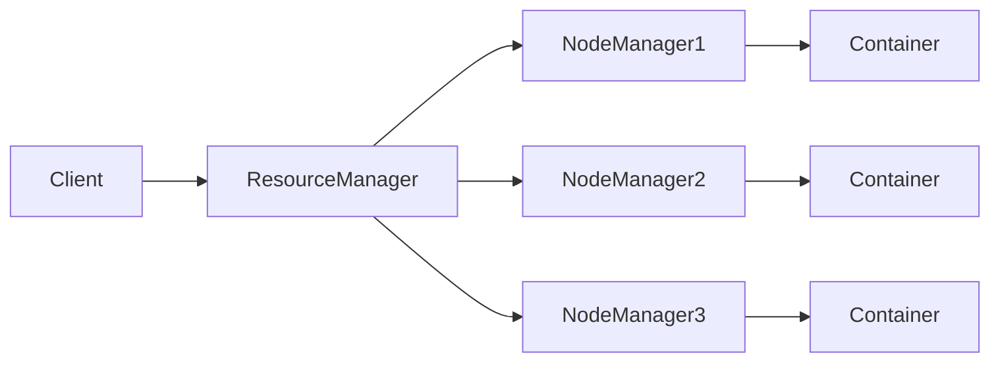

# YARN Node Manager原理与代码实例讲解

## 1. 背景介绍

### 1.1 大数据处理面临的挑战
随着大数据时代的到来,海量数据的存储和处理成为了企业和组织面临的重大挑战。传统的单机处理模式已经无法满足日益增长的数据处理需求。为了应对这一挑战,分布式计算框架应运而生。

### 1.2 Hadoop生态系统
Hadoop作为一个开源的分布式计算平台,为大规模数据处理提供了可靠的解决方案。它主要由HDFS(Hadoop Distributed File System)和MapReduce两大核心组件构成。HDFS提供了高可靠、高吞吐的分布式存储,而MapReduce则实现了并行计算。

### 1.3 资源管理的重要性
随着Hadoop的广泛应用,仅仅依靠MapReduce已经无法满足日益复杂的计算需求。一个通用的资源管理和任务调度系统变得尤为重要。这就是YARN (Yet Another Resource Negotiator)诞生的背景。

### 1.4 YARN的引入
YARN作为Hadoop生态系统的核心组件,将资源管理和任务调度从MapReduce中剥离出来,成为一个独立的子系统。它为上层应用提供了统一的资源管理和调度服务,极大地增强了Hadoop的通用性和灵活性。

## 2. 核心概念与联系

### 2.1 YARN架构概述
YARN采用主从(Master/Slave)架构,主要由ResourceManager、NodeManager和ApplicationMaster三大组件构成。



### 2.2 ResourceManager
ResourceManager是YARN的核心,负责整个集群的资源管理和调度。它接收来自客户端的应用程序提交请求,并根据集群资源状况和应用需求进行资源分配。

### 2.3 ApplicationMaster
每个应用程序都有一个ApplicationMaster,负责与ResourceManager协商资源,并管理应用的生命周期。它可以根据应用的进度动态申请和释放资源。

### 2.4 NodeManager
NodeManager运行在每个节点上,负责管理节点上的资源,并监控容器的运行状态。它定期向ResourceManager汇报节点的资源使用情况。

### 2.5 Container
Container是YARN中资源分配的基本单位,它封装了一定数量的CPU、内存等资源。ApplicationMaster可以在Container中启动任务进程,执行具体的计算工作。

## 3. 核心算法原理具体操作步骤

### 3.1 资源请求与分配
1. Client提交应用程序到ResourceManager
2. ResourceManager为应用分配第一个Container,用于启动ApplicationMaster
3. ApplicationMaster向ResourceManager注册,并请求所需的资源
4. ResourceManager根据集群资源状况和调度策略,为ApplicationMaster分配Container
5. ApplicationMaster在获得的Container中启动任务进程
6. 任务进程执行计算任务,并向ApplicationMaster汇报进度
7. ApplicationMaster根据任务进度和资源需求,动态向ResourceManager申请或释放Container
8. 应用程序执行完毕,ApplicationMaster向ResourceManager注销并清理资源

### 3.2 资源调度策略
ResourceManager支持可插拔的资源调度器,常见的调度策略有:

- FIFO Scheduler: 按照应用提交的先后顺序分配资源
- Capacity Scheduler: 支持多队列,每个队列可配置一定的资源量,在队列内部采用FIFO策略
- Fair Scheduler: 在不同应用之间平均分配资源,避免某个应用长期占用资源

### 3.3 NodeManager资源管理
NodeManager负责管理节点上的资源,主要职责包括:

1. 定期向ResourceManager汇报节点的资源使用情况
2. 接收ResourceManager的Container启动请求,在本地启动Container
3. 监控Container的运行状态,如果Container异常退出,及时向ResourceManager汇报
4. 管理节点上的物理资源,如CPU、内存、磁盘等,保证Container在规定的资源限制内运行

## 4. 数学模型和公式详细讲解举例说明

### 4.1 资源需求模型
假设一个应用程序需要的资源向量为: 

$R = (r_1, r_2, ..., r_n)$

其中,$r_i$表示第$i$种资源的需求量,如CPU核数、内存大小等。

### 4.2 资源分配模型
假设集群中有$m$个节点,每个节点的可用资源向量为:

$A_j = (a_{j1}, a_{j2}, ..., a_{jn}), j=1,2,...,m$

其中,$a_{ji}$表示第$j$个节点上第$i$种资源的可用量。

ResourceManager的目标是找到一个最优的资源分配方案$X$,使得:

$$\max \sum_{j=1}^m \sum_{i=1}^n x_{ji} \cdot r_i$$

$$s.t. \sum_{i=1}^n x_{ji} \cdot r_i \leq a_{ji}, \forall j=1,2,...,m$$

$$x_{ji} \in \{0, 1\}, \forall i=1,2,...,n, \forall j=1,2,...,m$$

其中,$x_{ji}$是一个二元变量,表示是否将第$i$种资源分配到第$j$个节点上。

这实际上是一个多维背包问题,可以使用启发式算法如贪心法、动态规划等来求解。

## 5. 项目实践：代码实例和详细解释说明

下面是一个简单的YARN应用程序示例,演示了如何使用YARN API提交应用和申请资源。

```java
public class YarnDemo {
  public static void main(String[] args) throws Exception {
    Configuration conf = new Configuration();
    String appName = "YarnDemo";
    
    // 创建YarnClient
    YarnClient yarnClient = YarnClient.createYarnClient();
    yarnClient.init(conf);
    yarnClient.start();
    
    // 创建应用程序对象
    YarnClientApplication app = yarnClient.createApplication();
    GetNewApplicationResponse appResponse = app.getNewApplicationResponse();
    
    // 设置ApplicationSubmissionContext
    ApplicationSubmissionContext appContext = app.getApplicationSubmissionContext();
    appContext.setApplicationName(appName);
    
    // 设置ContainerLaunchContext
    ContainerLaunchContext amContainer = ContainerLaunchContext.newInstance(
      null, null, null, null, null, null);
    appContext.setAMContainerSpec(amContainer);
    appContext.setResource(Resource.newInstance(1024, 1));
    appContext.setQueue("default");
    
    // 提交应用程序
    ApplicationId appId = appContext.getApplicationId();
    System.out.println("Submitting application " + appId);
    yarnClient.submitApplication(appContext);
    
    // 监控应用程序状态
    ApplicationReport appReport = yarnClient.getApplicationReport(appId);
    YarnApplicationState appState = appReport.getYarnApplicationState();
    while (appState != YarnApplicationState.FINISHED && 
           appState != YarnApplicationState.KILLED && 
           appState != YarnApplicationState.FAILED) {
      Thread.sleep(1000);
      appReport = yarnClient.getApplicationReport(appId);
      appState = appReport.getYarnApplicationState();
    }
    
    System.out.println("Application " + appId + " finished with state " + appState);
    yarnClient.close();
  }
}
```

代码解释:

1. 创建YarnClient对象,用于与ResourceManager通信
2. 创建应用程序对象,获取ApplicationSubmissionContext
3. 设置ApplicationSubmissionContext的各项属性,如应用名称、队列、所需资源等
4. 设置ContainerLaunchContext,指定ApplicationMaster的启动参数
5. 提交应用程序到YARN集群
6. 轮询应用程序状态,直到应用执行完毕
7. 关闭YarnClient

这个例子只是一个简单的框架,实际的应用程序还需要编写ApplicationMaster和具体的任务逻辑。

## 6. 实际应用场景

YARN广泛应用于各种大数据处理场景,如:

- MapReduce: 经典的大数据批处理框架,基于YARN实现资源管理和任务调度
- Spark: 内存计算框架,支持基于YARN的资源管理和任务调度
- Flink: 流式计算框架,可以将YARN作为资源管理器
- Hive: 数据仓库工具,底层执行引擎可以运行在YARN上
- HBase: 分布式NoSQL数据库,可以利用YARN管理RegionServer进程

总之,YARN为各种大数据应用提供了统一的资源管理和调度服务,极大地简化了应用开发和部署。

## 7. 工具和资源推荐

- Hadoop官方文档: https://hadoop.apache.org/docs/stable/
- Hadoop权威指南: Hadoop权威指南(第4版)
- YARN官方文档: https://hadoop.apache.org/docs/stable/hadoop-yarn/hadoop-yarn-site/
- YARN源码: https://github.com/apache/hadoop/tree/trunk/hadoop-yarn-project
- Cloudera Blog: http://blog.cloudera.com/

## 8. 总结：未来发展趋势与挑战

YARN作为新一代资源管理和任务调度系统,极大地增强了Hadoop生态系统的通用性和灵活性。未来YARN将向以下方向发展:

- 多租户支持: 进一步增强多用户、多队列的资源隔离和共享能力
- 异构资源管理: 支持管理GPU、FPGA等异构计算资源
- 云原生调度: 与Kubernetes等云原生调度系统深度集成,实现混合云场景下的统一调度
- 服务化: 将YARN核心功能以服务的形式提供给上层应用,简化应用开发

同时,YARN也面临着一些挑战:

- 调度策略优化: 如何根据不同的应用特征和SLA要求设计更加智能的调度算法
- 可扩展性: 如何支持更大规模的集群和更多的并发应用
- 容错与高可用: 如何提供端到端的容错和高可用能力,确保关键服务的稳定性

相信通过社区的不断努力,YARN将会变得更加强大和易用,为大数据应用提供坚实的支撑。

## 9. 附录：常见问题与解答

### 9.1 什么是YARN?
YARN (Yet Another Resource Negotiator)是Hadoop生态系统中的资源管理和任务调度系统,负责管理集群中的计算资源,并为上层应用提供统一的资源分配和任务调度服务。

### 9.2 YARN的主要组件有哪些?
YARN主要由ResourceManager、NodeManager和ApplicationMaster三大组件构成。ResourceManager负责全局的资源管理和调度,NodeManager负责单个节点的资源管理,ApplicationMaster负责单个应用的资源申请和任务调度。

### 9.3 YARN支持哪些调度策略?
YARN支持可插拔的调度器,常见的调度策略有FIFO Scheduler、Capacity Scheduler和Fair Scheduler。用户可以根据实际需求选择合适的调度策略,或者开发自定义调度器。

### 9.4 如何基于YARN开发应用程序?
基于YARN开发应用程序主要分为两部分:ApplicationMaster和具体的任务逻辑。首先需要编写ApplicationMaster,负责与ResourceManager通信,申请和管理资源。然后在ApplicationMaster中启动具体的任务进程,执行实际的计算工作。YARN提供了一套编程API,简化了应用开发。

### 9.5 YARN如何实现容错和高可用?
YARN通过多种机制实现容错和高可用,主要包括:

- ResourceManager HA: 支持Active/Standby两种ResourceManager,通过ZooKeeper等协调服务实现故障切换
- ApplicationMaster重试: 如果ApplicationMaster异常失败,YARN会自动重新启动ApplicationMaster,重试之前失败的任务
- Container重启: 如果任务进程异常退出,ApplicationMaster会重新申请Container,重新启动任务进程

总之,YARN提供了一套完整的容错和高可用方案,保证了应用程序的稳定运行。

作者：禅与计算机程序设计艺术 / Zen and the Art of Computer Programming