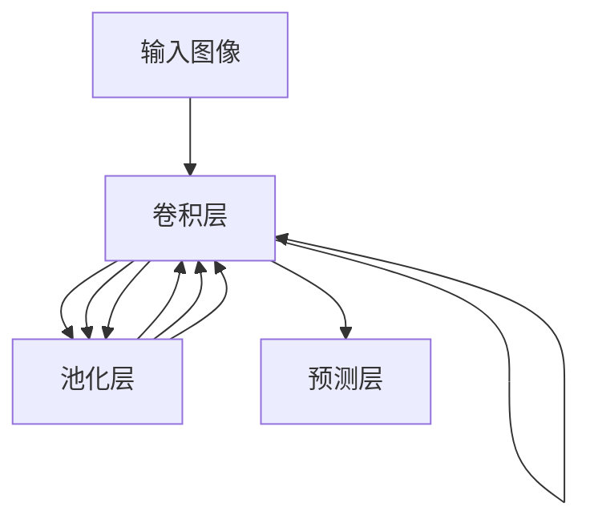

# YOLOv2原理与代码实例讲解

## 1.背景介绍

在计算机视觉领域中,目标检测是一项非常重要和具有挑战性的任务。它旨在从图像或视频中定位并识别感兴趣的目标。传统的目标检测方法主要基于滑动窗口和手工设计的特征,这种方法存在计算效率低下、检测精度有限等缺陷。

2015年,Joseph Redmon等人在YOLO(You Only Look Once)算法的基础上,提出了YOLOv2算法,显著提高了目标检测的精度和速度。YOLOv2在保持实时性能的同时,大幅度提升了平均精度(mAP),成为当时最先进的实时目标检测系统之一。本文将深入探讨YOLOv2的核心原理、算法细节以及代码实现,帮助读者全面理解这一里程碑式的目标检测算法。

## 2.核心概念与联系

### 2.1 YOLO算法概述

YOLO是一种端到端(end-to-end)的目标检测算法,它将目标检测任务视为一个回归问题。与传统的基于滑动窗口和分类器的目标检测方法不同,YOLO将整个图像作为神经网络的输入,直接预测出目标的边界框位置和类别概率。

YOLO算法的核心思想是将输入图像划分为S×S个网格,每个网格负责预测其所覆盖区域内的目标。如果一个目标的中心落在某个网格内,则该网格就负责预测该目标的边界框和置信度。置信度由两部分组成:包含目标的置信度和预测的边界框与真实边界框的置信度。

### 2.2 YOLOv2的改进

YOLOv2在原始YOLO算法的基础上做出了多项改进,主要包括:

1. **批量归一化(Batch Normalization)**:引入批量归一化层,加速收敛并提高模型的稳定性。
2. **高分辨率分类器(High Resolution Classifier)**:采用高分辨率的输入图像,提高小目标的检测精度。
3. **锚框(Anchor Boxes)**:使用先验锚框,预测目标相对于锚框的偏移量,提高检测精度。
4. **维度聚集(Dimension Clusters)**:使用K-means聚类算法自动生成合适的锚框尺寸。
5. **直通检测器(Passthrough Detector)**:融合多尺度特征,提高小目标和大目标的检测能力。
6. **细粒度特征(Fine-Grained Features)**:使用浅层特征,提高检测精度。

这些改进措施使得YOLOv2在保持实时性能的同时,大幅提升了目标检测精度。

## 3.核心算法原理具体操作步骤

YOLOv2算法的核心步骤如下:

1. **图像预处理**:将输入图像缩放到固定尺寸,如416×416像素。
2. **网络前向传播**:将预处理后的图像输入到YOLOv2网络中进行前向传播计算。
3. **特征提取**:网络的卷积层提取图像的特征,最后一个卷积层输出的特征图将用于预测。
4. **边界框预测**:对于特征图中的每个单元格,预测B个边界框及其置信度和类别概率。
5. **非极大值抑制(NMS)**:对预测的边界框进行非极大值抑制,去除重叠的冗余边界框。
6. **输出处理**:根据置信度阈值和非极大值抑制后的结果,输出最终的目标检测结果。

下面将详细介绍YOLOv2网络的结构和各个关键步骤的实现细节。

### 3.1 网络结构

YOLOv2采用Darknet-19作为骨干网络,它是一种19层的卷积神经网络。网络结构如下所示:

网络的输入是一张416×416像素的RGB图像,经过19层卷积层和5层最大池化层的处理,最终输出一个13×13×(B×(5+C))的特征图,其中B是预测的边界框数量,C是类别数量。每个单元格预测B个边界框,每个边界框由(x,y,w,h,置信度,C个类别概率)组成。

### 3.2 锚框和维度聚集

YOLOv2引入了锚框(Anchor Boxes)的概念,使用先验锚框来预测目标相对于锚框的偏移量,从而提高检测精度。锚框的尺寸和长宽比是通过K-means聚类算法在训练集上自动生成的,这个过程称为维度聚集(Dimension Clusters)。

具体来说,YOLOv2使用5个不同尺寸和长宽比的锚框,分别为:

1. (10×13)
2. (16×30)
3. (33×23)
4. (30×61)
5. (62×45)

这些锚框尺寸和长宽比是根据训练集中目标的实际尺寸和长宽比,使用K-means聚类算法得到的。在预测时,每个单元格需要预测这5个锚框相对于该单元格的偏移量和置信度。

### 3.3 边界框预测

对于特征图中的每个单元格,YOLOv2需要预测B个边界框及其置信度和类别概率。每个边界框的预测向量包含以下内容:

$$
\begin{bmatrix}
t_x & t_y & t_w & t_h & t_o & p_1 & p_2 & \cdots & p_C
\end{bmatrix}
$$

其中:

- $(t_x, t_y)$是边界框中心相对于单元格左上角的偏移量,范围在[0,1]。
- $(t_w, t_h)$是边界框的宽度和高度,是相对于整个图像的比例,范围在[0,1]。
- $t_o$是该边界框包含目标的置信度,范围在[0,1]。
- $(p_1, p_2, \cdots, p_C)$是该边界框属于每个类别的概率,总和为1。

在训练过程中,网络会学习预测这些值,使其与ground truth尽可能接近。

### 3.4 损失函数

YOLOv2的损失函数由三部分组成:边界框坐标损失、目标置信度损失和类别概率损失。

$$
\begin{aligned}
\text{loss} = & \lambda_{\text{coord}}\sum_{i=0}^{S^2}\sum_{j=0}^B\mathbb{1}_{ij}^{\text{obj}}\left[(x_i-\hat{x}_i)^2+(y_i-\hat{y}_i)^2\right] \\
& + \lambda_{\text{coord}}\sum_{i=0}^{S^2}\sum_{j=0}^B\mathbb{1}_{ij}^{\text{obj}}\left[(\sqrt{w_i}-\sqrt{\hat{w}_i})^2+(\sqrt{h_i}-\sqrt{\hat{h}_i})^2\right] \\
& + \sum_{i=0}^{S^2}\sum_{j=0}^B\mathbb{1}_{ij}^{\text{obj}}(C_i-\hat{C}_i)^2 \\
& + \lambda_{\text{noobj}}\sum_{i=0}^{S^2}\sum_{j=0}^B\mathbb{1}_{ij}^{\text{noobj}}(C_i-\hat{C}_i)^2 \\
& + \sum_{i=0}^{S^2}\mathbb{1}_{i}^{\text{obj}}\sum_{c\in\text{classes}}(p_i(c)-\hat{p}_i(c))^2
\end{aligned}
$$

其中:

- $\lambda_{\text{coord}}$和$\lambda_{\text{noobj}}$是权重参数,用于平衡不同损失项的重要性。
- $\mathbb{1}_{ij}^{\text{obj}}$是一个指示器,如果第i个单元格的第j个边界框负责预测一个目标,则为1,否则为0。
- $\mathbb{1}_{ij}^{\text{noobj}}$是一个指示器,如果第i个单元格的第j个边界框不负责预测任何目标,则为1,否则为0。
- $(x_i, y_i, w_i, h_i)$是ground truth边界框的中心坐标、宽度和高度。
- $(\hat{x}_i, \hat{y}_i, \hat{w}_i, \hat{h}_i)$是网络预测的边界框的中心坐标、宽度和高度。
- $C_i$是ground truth置信度,如果该单元格包含目标,则为1,否则为0。
- $\hat{C}_i$是网络预测的置信度。
- $p_i(c)$是ground truth类别概率,如果该单元格包含第c类目标,则为1,否则为0。
- $\hat{p}_i(c)$是网络预测的第c类概率。

通过最小化这个损失函数,网络可以学习准确预测目标的边界框、置信度和类别概率。

## 4.数学模型和公式详细讲解举例说明

在YOLOv2算法中,有几个关键的数学模型和公式需要详细讲解。

### 4.1 锚框生成

YOLOv2使用K-means聚类算法自动生成合适的锚框尺寸和长宽比。具体来说,对于训练集中的每个ground truth边界框$(w, h)$,我们计算其长宽比$r=w/h$,然后使用K-means聚类算法将所有的$(w, h)$聚类为K个簇。每个簇的中心$(w_k, h_k)$就是一个锚框的尺寸,其长宽比$r_k=w_k/h_k$就是该锚框的长宽比。

K-means聚类算法的目标是最小化以下目标函数:

$$
\arg\min_{c_1,\cdots,c_K}\sum_{i=1}^N\min_{k=1,\cdots,K}\left\|x_i-c_k\right\|^2
$$

其中$N$是数据点的个数,$(x_1, x_2, \cdots, x_N)$是所有数据点,$(c_1, c_2, \cdots, c_K)$是K个簇的中心。算法通过迭代优化簇中心,使得每个数据点到其所属簇中心的距离之和最小。

对于YOLOv2,我们将$(w, h)$作为数据点,使用K-means聚类算法得到K个簇中心$(w_k, h_k)$,就是K个锚框的尺寸。

### 4.2 边界框编码和解码

在YOLOv2中,网络直接预测边界框相对于锚框的偏移量,而不是直接预测边界框的绝对坐标和尺寸。这种编码方式可以提高预测的精度和稳定性。

具体来说,对于一个ground truth边界框$(x, y, w, h)$和一个锚框$(x_a, y_a, w_a, h_a)$,我们将边界框编码为:

$$
\begin{aligned}
t_x &= (x - x_a) / w_a \\
t_y &= (y - y_a) / h_a \\
t_w &= \log(w / w_a) \\
t_h &= \log(h / h_a)
\end{aligned}
$$

其中$(t_x, t_y)$是边界框中心相对于锚框中心的偏移量,$(t_w, t_h)$是边界框的宽度和高度相对于锚框的对数空间缩放因子。

在预测时,网络输出$(t_x, t_y, t_w, t_h)$,我们可以使用以下公式解码出边界框的绝对坐标和尺寸:

$$
\begin{aligned}
x &= t_x \cdot w_a + x_a \\
y &= t_y \cdot h_a + y_a \\
w &= \exp(t_w) \cdot w_a \\
h &= \exp(t_h) \cdot h_a
\end{aligned}
$$

这种编码和解码方式可以有效处理不同尺度的目标,提高预测的精度