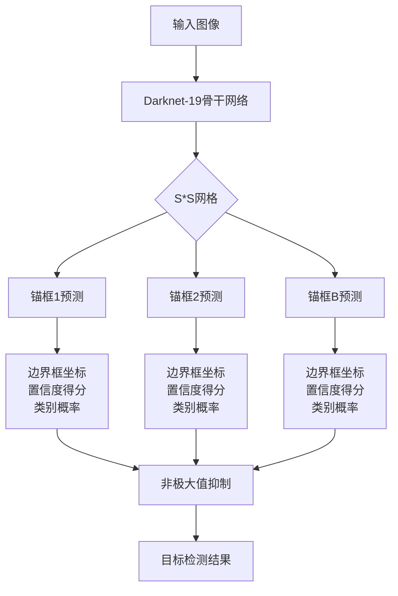

# YOLOv2的多GPU并行训练与加速

## 1.背景介绍

在当今的计算机视觉领域,对象检测任务一直是研究的热点和难点。传统的基于深度学习的目标检测算法如Faster R-CNN虽然精度较高,但由于复杂的网络结构和多阶段的处理过程,导致它们的运行速度较慢,无法满足实时应用的需求。

2016年,Joseph Redmon等人提出了YOLO(You Only Look Once)目标检测系统,通过将目标检测任务转化为回归问题,YOLO算法实现了端到端的目标检测,大大提高了检测速度。随后,YOLO的改进版本YOLOv2被提出,在保持高速的同时,进一步提升了检测精度。YOLOv2在多个公开数据集上的表现优于其他实时目标检测系统,并且可以实时处理视频流。

然而,训练YOLOv2模型通常需要消耗大量的计算资源和时间。为了加快训练过程,利用多GPU并行训练是一种行之有效的方法。本文将详细介绍YOLOv2的核心原理,并重点探讨如何实现其多GPU并行训练,以加速模型的训练过程。

## 2.核心概念与联系

### 2.1 YOLO系列算法概述

YOLO(You Only Look Once)是一种端到端的目标检测系统,与传统的基于候选区域的目标检测算法不同,YOLO将整个图像直接输入到卷积神经网络中,网络会预测出图像中存在的目标的边界框和类别概率。

YOLO的优点是速度极快,能够实时处理视频流。但其缺点是对于小目标的检测精度较低,定位也不够准确。为了解决这些问题,YOLOv2作了以下改进:

1. 采用更好的骨干网络:从GoogLeNet Inception模型借鉴了残差模块,构建了Darknet-19网络作为骨干网络。
2. 采用锚框(Anchor Boxes)预测技术:预先手动设置一组先验边界框,使网络可以学习预测不同尺度的目标。
3. 引入新的损失函数:综合考虑分类损失、置信度损失和边界框回归损失。
4. 采用多尺度训练:通过改变输入图像的分辨率,增强模型对不同尺度目标的检测能力。
5. 使用预训练权重:在ImageNet数据集上预训练的权重可以加速收敛。

### 2.2 多GPU并行训练

在深度学习模型训练过程中,利用多GPU并行计算可以显著提高训练速度。常见的多GPU并行训练方式有数据并行和模型并行两种。

**数据并行**指的是将训练数据均匀分配到多个GPU上,每个GPU计算一部分小批量数据的前向传播和反向传播,然后汇总梯度并更新模型参数。这种方式简单高效,但需要足够大的批量大小,否则会由于GPU负载不均衡而降低加速效果。

**模型并行**指的是将模型按层或块划分到不同的GPU上,每个GPU计算一部分层或块。这种方式对小批量也有不错的加速效果,但实现较为复杂,需要合理划分计算任务。

对于YOLOv2这种端到端的目标检测模型,数据并行是最合适的多GPU加速方式。下面将详细介绍如何实现YOLOv2的多GPU并行训练。

## 3.核心算法原理具体操作步骤

YOLOv2的核心算法原理可以概括为以下几个步骤:

1. **网格划分与锚框设置**:将输入图像划分为S×S个网格,每个网格负责预测B个锚框(Anchor Boxes)。锚框是一组预先设置的不同形状和尺度的先验边界框,用于匹配不同大小的目标。

2. **特征提取**:使用Darknet-19骨干网络从输入图像中提取特征。

3. **边界框预测**:对于每个锚框,网络会预测出一个边界框,其中包括4个坐标值(bx,by,bw,bh)表示边界框的位置和大小,以及一个置信度得分(Confidence Score)表示该锚框含有目标的置信程度。

4. **类别预测**:同时,网络还会为每个锚框预测C个条件类别概率,表示该锚框所含目标属于每个类别的概率。

5. **非极大值抑制**:对于同一个目标可能会有多个锚框的预测结果,通过非极大值抑制(Non-Maximum Suppression)算法来消除冗余的边界框。

6. **损失函数计算**:YOLOv2的损失函数包括三部分:边界框坐标的回归损失、置信度损失和分类损失。通过最小化损失函数来优化网络参数。

上述算法步骤可以通过端到端的卷积神经网络实现,网络结构如下所示:



上述网络结构中,每个网格都会预测B个锚框,对于每个锚框,网络会输出以下内容:

- 边界框坐标(bx,by,bw,bh):表示预测边界框的位置和大小
- 置信度得分(Confidence Score):表示该锚框含有目标的置信程度
- 类别概率(Class Probabilities):表示该锚框所含目标属于每个类别的概率

最后,通过非极大值抑制算法消除冗余的边界框,即可得到最终的目标检测结果。

## 4.数学模型和公式详细讲解举例说明

### 4.1 损失函数

YOLOv2的损失函数包括三部分:边界框坐标的回归损失、置信度损失和分类损失。具体如下:

**边界框坐标回归损失**:

$$
\begin{aligned}
\lambda_{coord}\sum_{i=0}^{S^2}\sum_{j=0}^B\mathbb{1}_{ij}^{obj}[(x_i-\hat{x}_i)^2+(y_i-\hat{y}_i)^2] \\
+\lambda_{coord}\sum_{i=0}^{S^2}\sum_{j=0}^B\mathbb{1}_{ij}^{obj}[(\sqrt{w_i}-\sqrt{\hat{w}_i})^2+(\sqrt{h_i}-\sqrt{\hat{h}_i})^2]
\end{aligned}
$$

其中:
- $(x_i, y_i, w_i, h_i)$表示真实边界框的坐标和宽高
- $(\hat{x}_i, \hat{y}_i, \hat{w}_i, \hat{h}_i)$表示预测的边界框坐标和宽高
- $\mathbb{1}_{ij}^{obj}$是一个指示器,如果第i个网格的第j个锚框是正样本(含有目标),则为1,否则为0
- $\lambda_{coord}$是一个超参数,用于平衡不同损失项的权重

**置信度损失**:

$$
\begin{aligned}
\lambda_{noobj}\sum_{i=0}^{S^2}\sum_{j=0}^B\mathbb{1}_{ij}^{noobj}(\hat{C}_i)^2 \\
+\lambda_{obj}\sum_{i=0}^{S^2}\sum_{j=0}^B\mathbb{1}_{ij}^{obj}(\hat{C}_i-1)^2
\end{aligned}
$$

其中:
- $\hat{C}_i$表示第i个网格的第j个锚框的置信度预测值
- $\mathbb{1}_{ij}^{noobj}$是一个指示器,如果第i个网格的第j个锚框是负样本(不含目标),则为1,否则为0
- $\mathbb{1}_{ij}^{obj}$同上
- $\lambda_{noobj}$和$\lambda_{obj}$是超参数,用于平衡不同损失项的权重

**分类损失**:

$$
\lambda_{class}\sum_{i=0}^{S^2}\sum_{j=0}^B\mathbb{1}_{ij}^{obj}\sum_{c\in classes}(p_i(c)-\hat{p}_i(c))^2
$$

其中:
- $p_i(c)$表示第i个网格的第j个锚框所含目标属于第c类的真实概率(0或1)
- $\hat{p}_i(c)$表示网络预测的第c类概率
- $\lambda_{class}$是超参数,用于平衡分类损失与其他损失项的权重

通过最小化上述损失函数,可以优化网络参数,提高目标检测的精度。

### 4.2 非极大值抑制算法

由于对于同一个目标可能会有多个锚框的预测结果,因此需要使用非极大值抑制(Non-Maximum Suppression,NMS)算法来消除冗余的边界框。NMS算法的步骤如下:

1. 对所有预测边界框按照置信度得分从高到低排序
2. 选取置信度最高的边界框作为基准框
3. 计算其他边界框与基准框的IoU(交并比)
4. 删除所有与基准框的IoU大于阈值的边界框
5. 从剩余边界框中重新选取置信度最高的作为新的基准框,重复步骤3和4
6. 重复上述过程,直到所有边界框都被处理

对于任意两个边界框$B_1$和$B_2$,它们的IoU可以计算如下:

$$
\text{IoU}(B_1, B_2) = \frac{\text{Area}(B_1 \cap B_2)}{\text{Area}(B_1 \cup B_2)}
$$

其中$\cap$表示两个边界框的交集区域,$\cup$表示并集区域。

通过NMS算法,我们可以保留置信度最高的、且相互之间没有太多重叠的边界框,从而得到最终的目标检测结果。

## 5.项目实践:代码实例和详细解释说明

在本节中,我们将使用PyTorch框架,结合之前介绍的理论知识,实现YOLOv2模型的多GPU并行训练。完整的代码可以在GitHub上获取: [https://github.com/pjreddie/darknet](https://github.com/pjreddie/darknet)

### 5.1 数据准备

首先,我们需要准备好训练数据集。这里以COCO数据集为例,它包含80个物体类别,被广泛用于目标检测任务。我们可以使用`torchvision.datasets.CocoDetection`模块加载COCO数据集。

```python
from torchvision.datasets import CocoDetection
import torchvision.transforms as transforms

# 定义数据增强变换
data_transform = transforms.Compose([
    transforms.ToTensor()
])

# 加载COCO数据集
train_dataset = CocoDetection(root='path/to/coco', 
                              annFile='path/to/annotations/train.json',
                              transform=data_transform)
```

### 5.2 模型定义

接下来,我们定义YOLOv2模型。这里使用PyTorch的`nn.Module`创建一个自定义模型类。

```python
import torch
import torch.nn as nn

class YOLOv2(nn.Module):
    def __init__(self, num_classes=80):
        super(YOLOv2, self).__init__()
        
        # 定义Darknet-19骨干网络
        self.backbone = Darknet19()
        
        # 定义检测头部
        self.head = YOLOv2Head(num_classes=num_classes)
        
    def forward(self, x):
        # 提取特征
        features = self.backbone(x)
        
        # 进行目标检测
        detections = self.head(features)
        
        return detections
```

其中,`Darknet19`和`YOLOv2Head`分别定义了骨干网络和检测头部的具体结构。这里省略了具体实现细节,读者可以查阅相关代码。

### 5.3 多GPU并行训练

PyTorch提供了`nn.DataParallel`模块,可以方便地实现数据并行的多GPU训练。我们只需要将模型包装一下即可:

```python
import torch.nn as nn

# 假设我们有4个GPU可用
device_ids = [0, 1, 2, 3]

# 将模型移动到GPU上
model = YOLOv2().cuda(device_ids[0])

# 使用DataParallel包装模型
model =