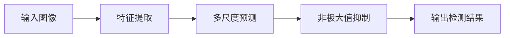

## 1.背景介绍

YOLO，全称You Only Look Once，是一种流行的实时物体检测算法，自2015年首次提出以来，已经发展到第七代版本YOLOv7。与传统的物体检测方法如R-CNN系列相比，YOLO的主要优势在于其速度和效率，能够在保证较高精度的同时实现实时检测。

## 2.核心概念与联系

YOLOv7的核心概念包括锚框、特征图、多尺度预测等。YOLOv7将输入图像划分为SxS个网格，每个网格预测B个锚框和对应的置信度，以及C个类别的概率。在预测过程中，YOLOv7会在不同的特征图尺度上进行预测，以便检测不同大小的物体。



## 3.核心算法原理具体操作步骤

YOLOv7的核心算法原理包括以下几个步骤：

1. **特征提取**：使用深度卷积网络对输入图像进行特征提取，得到特征图。

2. **多尺度预测**：在特征图的不同尺度上进行预测，每个网格预测B个锚框和对应的置信度，以及C个类别的概率。

3. **非极大值抑制**：对预测结果进行非极大值抑制，消除冗余的检测框，得到最终的检测结果。

## 4.数学模型和公式详细讲解举例说明

YOLOv7的损失函数包括坐标损失、置信度损失和类别损失三部分。坐标损失和置信度损失用于优化锚框的预测，类别损失用于优化类别的预测。

假设预测的锚框坐标为$\hat{b}=(\hat{x}, \hat{y}, \hat{w}, \hat{h})$，真实的锚框坐标为$b=(x, y, w, h)$，预测的置信度为$\hat{c}$，真实的置信度为$c$，预测的类别概率为$\hat{p}$，真实的类别概率为$p$，则损失函数$L$可以表示为：

$$
L = \lambda_{coord} \sum_{i=0}^{S^2} \sum_{j=0}^{B} 1_{ij}^{obj} [(x_i - \hat{x}_i)^2 + (y_i - \hat{y}_i)^2] + \lambda_{coord} \sum_{i=0}^{S^2} \sum_{j=0}^{B} 1_{ij}^{obj} [(w_i - \hat{w}_i)^2 + (h_i - \hat{h}_i)^2] + \sum_{i=0}^{S^2} \sum_{j=0}^{B} 1_{ij}^{obj} (c_i - \hat{c}_i)^2 + \sum_{i=0}^{S^2} 1_{i}^{obj} \sum_{c \in classes} (p_i(c) - \hat{p}_i(c))^2
$$

其中，$1_{ij}^{obj}$表示第$i$个网格中第$j$个锚框是否包含物体，$\lambda_{coord}$是坐标损失的权重。

## 5.项目实践：代码实例和详细解释说明

以下是使用PyTorch实现YOLOv7的一个简单示例：

```python
import torch
import torch.nn as nn

class YOLOv7(nn.Module):
    def __init__(self, num_classes):
        super(YOLOv7, self).__init__()
        self.num_classes = num_classes
        # 省略网络结构定义...

    def forward(self, x):
        # 省略前向传播过程...
        return x
```

在这个示例中，我们首先定义了一个YOLOv7的网络结构，然后实现了前向传播的过程。具体的网络结构和前向传播过程因篇幅限制省略。

## 6.实际应用场景

YOLOv7由于其实时性和高精度，被广泛应用于各种实时物体检测的场景，如无人驾驶、视频监控、人脸识别等。

## 7.工具和资源推荐

推荐使用以下工具和资源进行YOLOv7的学习和实践：

- **开源代码**：GitHub上有许多开源的YOLOv7实现，如[AlexeyAB/darknet](https://github.com/AlexeyAB/darknet)。

- **在线教程**：网上有许多关于YOLOv7的教程，如[YOLOv7官方网站](https://pjreddie.com/darknet/yolo/)。

- **数据集**：常用的物体检测数据集如COCO、Pascal VOC等。

## 8.总结：未来发展趋势与挑战

YOLOv7在实时物体检测方面已经取得了显著的成果，但仍然存在一些挑战，如对小物体的检测、对密集物体的检测等。未来的发展趋势可能会更加注重解决这些问题，同时也可能会引入更多的先进技术，如注意力机制、卷积神经网络等，以进一步提高检测的精度和速度。

## 9.附录：常见问题与解答

**Q: YOLOv7与YOLOv3有什么区别？**

A: YOLOv7在YOLOv3的基础上进行了许多改进，如引入了新的网络结构、新的损失函数等，以提高检测的精度和速度。

**Q: YOLOv7适用于所有的物体检测任务吗？**

A: YOLOv7虽然在许多物体检测任务上都表现出色，但并不适用于所有的任务。例如，对于小物体的检测、密集物体的检测等任务，YOLOv7可能并不是最好的选择。

**Q: 如何训练自己的YOLOv7模型？**

A: 训练YOLOv7模型需要一个标注好的数据集，然后使用梯度下降等优化算法优化YOLOv7的损失函数。具体的训练过程可以参考YOLOv7的官方文档或相关教程。

作者：禅与计算机程序设计艺术 / Zen and the Art of Computer Programming